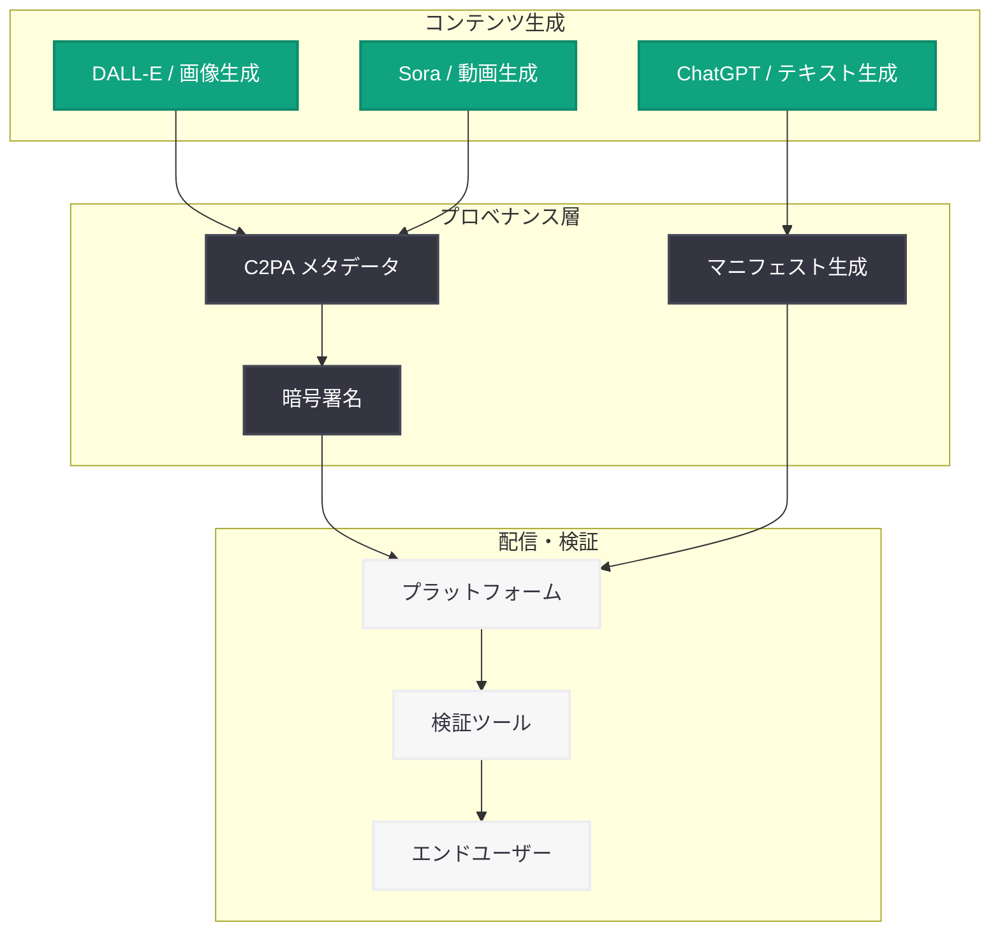

# OpenAI、欧州の信頼できる AI エコシステム構築を支援

## メタデータ

| 項目 | 内容 |
|------|------|
| 発表日 | 2026-06-11 |
| ソース | OpenAI News |
| カテゴリ | グローバルアフェアーズ / AI 政策 |
| 公式リンク | [Supporting Europe's work in ensuring a trustworthy AI ecosystem](https://openai.com/index/supporting-eu-trustworthy-ai-ecosystem) |

> **注記:** 本レポートは公式ページが Cloudflare の保護により直接アクセスできなかったため、公開されているサマリー情報および関連する公開情報に基づいて作成している。正確な詳細については公式ページを参照されたい。

## 概要

OpenAI は 2026 年 6 月 11 日、EU の AI コンテンツ透明性に関する実践規範 (Code of Practice) への支持を表明する記事を公開した。本記事は、AI が生成したコンテンツの来歴 (プロベナンス) 基準とツールの推進を通じて、人々が AI 生成コンテンツを識別・理解できるよう支援する OpenAI の取り組みを説明するものである。

欧州連合は AI 生成コンテンツのラベリングと透明性に関する規制および自主的な規範の策定を進めており、OpenAI はこの取り組みに積極的に参加する姿勢を示している。本発表は、OpenAI が技術的なソリューション (C2PA メタデータ標準など) とポリシーの両面から、信頼できる AI エコシステムの構築に貢献する意思を明確にしたものである。

## 主な内容

### EU の AI コンテンツ透明性に関する実践規範

EU は AI 生成コンテンツの透明性を確保するための実践規範 (Code of Practice) を策定している。この規範は、AI システムが生成したコンテンツを利用者が識別できるようにすることを目的としており、以下のような要素が含まれると考えられる。

| 要素 | 内容 |
|------|------|
| コンテンツラベリング | AI が生成・編集したコンテンツへの明示的な表示 |
| メタデータ埋め込み | 技術的手段によるコンテンツ来歴情報の記録 |
| 検出ツール | AI 生成コンテンツを識別するための技術的ツールの整備 |
| 透明性報告 | AI システム提供者による透明性に関する定期報告 |

この実践規範は、EU AI Act (AI 規制法) の枠組みの中で位置づけられるものであり、法的義務と自主的取り組みの橋渡しとなる重要な政策ツールである。

### OpenAI のコンテンツプロベナンス (来歴) 技術

OpenAI は、AI 生成コンテンツの透明性を技術的に実現するため、コンテンツプロベナンス標準の推進に取り組んでいる。その中核となるのが C2PA (Coalition for Content Provenance and Authenticity) メタデータ標準である。

#### C2PA 標準の概要

C2PA は、デジタルコンテンツの来歴と真正性を証明するための技術標準であり、以下の機能を提供する。

- **作成者情報の記録:** コンテンツがどのツール・システムによって作成されたかを記録
- **改変履歴の追跡:** コンテンツが作成後にどのような編集を受けたかを追跡
- **暗号学的署名:** メタデータの改ざんを防止するための暗号学的保証
- **相互運用性:** 異なるプラットフォーム間でのメタデータの読み取り・検証

#### OpenAI の取り組み経緯

OpenAI は 2026 年 5 月に「Advancing content provenance」(コンテンツプロベナンスの推進) と題する記事を公開しており、本発表はその延長線上に位置づけられる。

| 時期 | 取り組み |
|------|---------|
| 2024 年以降 | C2PA メタデータの DALL-E 生成画像への埋め込み開始 |
| 2026 年 5 月 | 「Advancing content provenance」公開、プロベナンス技術の拡大を発表 |
| 2026 年 6 月 | EU 実践規範への支持表明、欧州における取り組み強化 |

### 信頼できる AI エコシステムに向けた OpenAI の貢献

OpenAI の EU 実践規範支持は、単なる規制対応ではなく、信頼できる AI エコシステム構築への積極的な貢献として位置づけられる。その具体的な方向性は以下の通りである。

1. **技術標準の推進:** C2PA などのオープンスタンダードを採用・推進し、業界全体での相互運用性を確保
2. **ツールの提供:** AI 生成コンテンツを識別するためのツールやメカニズムの開発・提供
3. **マルチステークホルダー協力:** Coalition for Content Provenance and Authenticity (C2PA) を通じた業界横断的な協力
4. **規制への建設的関与:** EU の規制枠組みに対する積極的な協力と技術的フィードバックの提供

## 技術的な詳細

### コンテンツプロベナンスの技術スタック

AI 生成コンテンツの透明性を実現する技術スタックは、以下の層から構成される。

### C2PA メタデータの構造

C2PA メタデータは、コンテンツに埋め込まれるマニフェストとして機能し、以下の情報を含む。

- **クレーム (Claim):** コンテンツの作成者、作成日時、使用ツールに関するアサーション
- **アサーション (Assertion):** コンテンツの特性に関する具体的な宣言 (例: 「このコンテンツは AI によって生成された」)
- **署名 (Signature):** クレームの真正性を保証する暗号学的署名
- **成分 (Ingredient):** コンテンツの作成に使用された入力素材の参照

## 開発者への影響

### API 開発者

- **メタデータ対応の拡大:** OpenAI API を通じて生成されるコンテンツにおいて、C2PA メタデータの埋め込みがより広範に適用される可能性がある
- **透明性要件への対応:** EU 市場向けのアプリケーションを開発する際、AI 生成コンテンツの表示・ラベリングに関する要件への対応が必要になる
- **コンプライアンスの簡素化:** OpenAI がプラットフォームレベルでプロベナンス機能を提供することで、開発者個別の対応負担が軽減される

### プラットフォーム運営者

- **コンテンツ検証機能の統合:** C2PA メタデータを読み取り・表示する機能をプラットフォームに統合する検討が必要
- **EU 規制への準備:** EU AI Act および関連する実践規範に基づくコンテンツ透明性要件への対応準備

### グローバル展開を行う企業

- **地域別規制対応:** EU のコンテンツ透明性要件が他地域にも波及する可能性があり、グローバルな対応戦略の検討が重要
- **業界標準への準拠:** C2PA をはじめとするオープンスタンダードへの準拠が、今後の規制対応において有利に働く可能性がある

## 関連リンク

- [Supporting Europe's work in ensuring a trustworthy AI ecosystem](https://openai.com/index/supporting-eu-trustworthy-ai-ecosystem) - 本記事 (OpenAI)
- [Advancing content provenance](https://openai.com/index/advancing-content-provenance) - コンテンツプロベナンスの推進 (2026-05-19)
- [C2PA (Coalition for Content Provenance and Authenticity)](https://c2pa.org/) - C2PA 公式サイト
- [OpenAI News](https://openai.com/news)

## まとめ

OpenAI の EU AI コンテンツ透明性実践規範への支持表明は、信頼できる AI エコシステムの構築に向けた重要なマイルストーンである。主要なポイントは以下の通りである。

1. **EU 規制への積極的関与:** OpenAI は EU の AI コンテンツ透明性に関する実践規範を支持し、規制プロセスに建設的に参加する姿勢を明確にした

2. **プロベナンス技術の拡充:** C2PA メタデータ標準を中核とするコンテンツ来歴技術の推進を通じて、AI 生成コンテンツの識別可能性を技術的に実現する取り組みを強化している

3. **グローバルスタンダードの形成:** EU の実践規範への参加は、AI コンテンツ透明性に関するグローバルな標準形成に OpenAI が積極的に関与することを意味する

4. **マルチステークホルダーアプローチ:** Coalition for Content Provenance and Authenticity を通じた業界横断的な協力により、単一企業では実現困難な包括的な透明性ソリューションの構築を目指している

5. **技術とポリシーの統合:** 技術的なソリューション (C2PA メタデータ、検出ツール) と政策的な取り組み (実践規範への参加) を統合することで、実効性のある AI コンテンツ透明性を実現する方向性が示されている

本発表は、OpenAI が 2026 年 5 月の「Advancing content provenance」に続き、コンテンツプロベナンスと AI 透明性の分野で積極的な展開を続けていることを示すものであり、AI 生成コンテンツの信頼性確保が業界全体の重要課題として認識されている現状を反映している。
