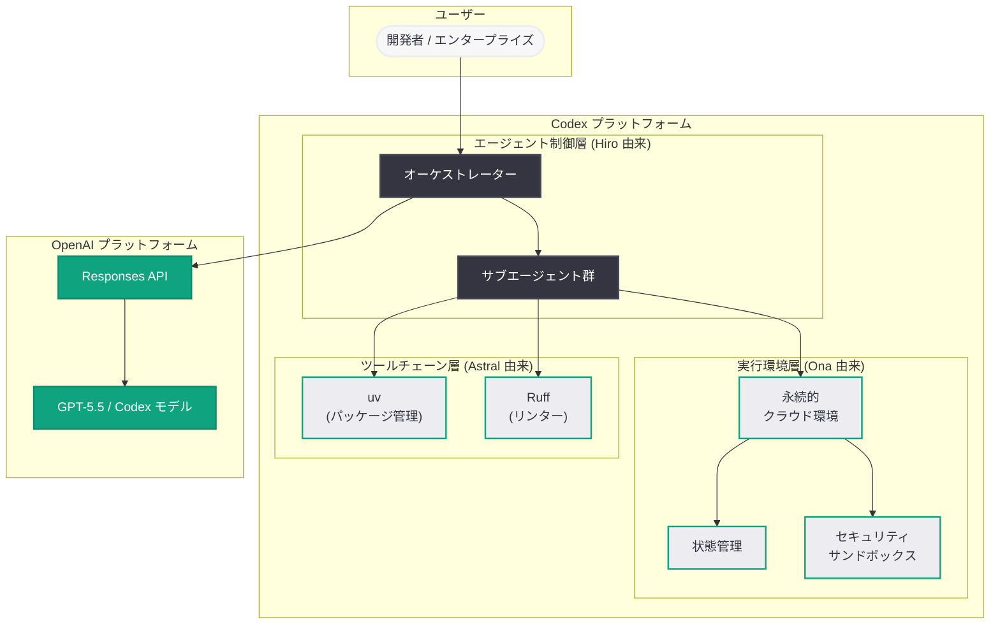

# OpenAI が Ona を買収: Codex にセキュアで永続的なクラウド環境を統合し、長時間稼働 AI エージェントを実現へ

## メタデータ

| 項目 | 内容 |
|------|------|
| 発表日 | 2026-06-11 |
| ソース | OpenAI News/Blog |
| カテゴリ | Company / M&A |
| 公式リンク | [openai.com](https://openai.com/index/openai-to-acquire-ona) |

> **注記:** 本記事の公式ページは Cloudflare による保護が有効であり、全文の取得ができなかったため、本レポートは公開されているタイトル、概要説明、および関連する公開情報に基づいて作成している。

## 概要

OpenAI は 2026 年 6 月 11 日、クラウド環境技術を提供する Ona の買収を発表した。本買収により、OpenAI の AI コーディング/ナレッジワーク エージェント「Codex」に、セキュアで永続的なクラウド環境が統合され、長時間稼働する AI エージェントがエンタープライズワークフロー全体で動作可能になる。

本買収は、OpenAI が 2026 年に進めてきた Codex インフラストラクチャ強化のための一連の買収戦略における最新の動きである。3 月の Astral (Python ツーリング)、4 月の TBPN、4 月の Hiro (エージェントオーケストレーション) に続く形で、Ona の買収は Codex の技術基盤をさらに拡充し、現行の「セッション時間制限」という制約を克服するための戦略的な一手として位置づけられる。

## 主な内容

### Ona の概要と技術的価値

Ona は、セキュアで永続的なクラウド環境を提供する技術企業である。その技術は、AI エージェントが長時間にわたって安全に稼働し続けるために不可欠な以下の要素を提供するものと考えられる。

- **永続的な実行環境:** エージェントのセッションが時間制限なく継続可能な、ステートフルなクラウド環境
- **セキュリティ:** エンタープライズ要件を満たす隔離された安全なサンドボックス環境
- **状態管理:** 長時間にわたるタスク実行中のコンテキストと状態の永続化
- **スケーラビリティ:** 複数のエージェントが同時に稼働するエンタープライズ規模のワークロードへの対応

### 現行 Codex の制約と買収による解決

現行の Codex は、クラウド上でソフトウェアエンジニアリングタスクやナレッジワークを自律的に実行する AI エージェントであるが、セッションの稼働時間に制限がある。この制約により、以下のようなユースケースの実現が困難であった。

| 現行の制約 | Ona 統合後の展望 |
|-----------|---------------|
| セッション時間に制限がある | 永続的なクラウド環境で長時間稼働が可能に |
| 短期的なコーディングタスクに限定 | エンタープライズ規模のワークフロー全体をカバー |
| 状態がセッション終了で失われる | 永続的な状態管理による継続的なタスク実行 |
| 単発のタスク完了型 | 長期的な監視、反復、最適化が可能に |

### OpenAI の Codex インフラストラクチャ買収戦略

2026 年に入り、OpenAI は Codex の技術基盤を強化するための戦略的買収を加速させている。各買収は Codex エコシステムの異なるレイヤーを補完する形で進められている。

| 日付 | 対象 | 領域 | Codex への貢献 |
|------|------|------|--------------|
| 2026-03-09 | Promptfoo | セキュリティテスト | AI セキュリティ検証 |
| 2026-03-19 | Astral | Python ツーリング (uv, Ruff) | 高速な開発環境構築 |
| 2026-04-02 | TBPN | AI メディア | コンテンツ生成基盤 |
| 2026-04-14 | Hiro | エージェントオーケストレーション | マルチエージェント制御 |
| 2026-04-18 | Chalkie AI | EdTech | 教育ドメイン拡張 |
| 2026-06-11 | Ona | クラウド環境 | 永続的実行基盤 (本件) |

特に Codex のインフラストラクチャに直接関連する買収として、Astral (開発ツールチェーン)、Hiro (エージェントオーケストレーション)、そして Ona (永続的クラウド環境) は三位一体の関係にある。

### エンタープライズワークフローへの拡張

Ona の技術統合により、Codex は以下のようなエンタープライズワークフローに対応可能になると考えられる。

- **長期的なコードリファクタリング:** 大規模なコードベースの段階的な改善を数時間から数日にわたって実行
- **継続的インテグレーション/デプロイメント:** CI/CD パイプライン全体の監視と自動修正
- **データパイプライン管理:** データの取得、変換、分析を含む複雑なワークフローの自律的実行
- **セキュリティ監査:** コードベース全体のセキュリティスキャンと脆弱性修正の継続的実行
- **ドキュメント生成と保守:** コード変更に連動した技術ドキュメントの継続的更新

## 技術的な詳細

### アーキテクチャの展望

Ona の技術が Codex に統合されることで、以下のようなアーキテクチャが実現されると推察される。

### Codex の実行モデルの進化

Ona の統合により、Codex の実行モデルは以下のように進化すると考えられる。

**現行モデル (セッション型):**
- ユーザーがタスクを投入
- 短時間のセッションで実行
- セッション終了時に結果を返却
- 状態は破棄される

**将来モデル (永続型):**
- ユーザーがタスクまたはワークフローを投入
- 永続的なクラウド環境で長時間稼働
- 中間結果の逐次報告と確認
- 状態が永続化され、中断・再開が可能
- 複数タスクの並行実行と連携

### コンテナセッション課金との関連

OpenAI は 2026 年 6 月 2 日に「Container Session Billing Update」を発表しており、Codex のコンテナセッションの課金体系を更新している。Ona の買収は、この課金モデルの背後にある技術基盤を強化し、より柔軟で長時間のセッションを提供するための布石と見ることができる。

## 開発者への影響

### Codex ユーザーへの直接的影響

- **長時間タスクの実行可能化:** 現行では時間制限によりセッション分割が必要だった大規模タスクが、単一の長時間セッションで完了可能になる見込み
- **エンタープライズ対応の強化:** セキュアな永続環境により、機密性の高いエンタープライズコードベースでの Codex 利用がより安全になる
- **ワークフロー自動化の拡張:** 単発のコーディングタスクを超えて、継続的なプロセス自動化が Codex で実現可能に

### API / プラットフォーム開発者への影響

- **新しいセッション管理 API:** 永続的なセッションの作成、状態の保存・復元、中断・再開を制御する API が将来的に追加される可能性がある
- **課金モデルの変化:** 長時間セッションの導入に伴い、時間ベースまたはリソースベースの新しい課金体系が導入される可能性がある
- **エージェント開発パターンの変化:** 短時間で完了する設計から、長時間稼働を前提としたエージェント設計パターンへの移行が促される

### 競合環境への影響

- **GitHub Copilot / Microsoft との差別化:** 永続的なクラウド環境での長時間エージェント稼働は、Codex の重要な差別化要因となる
- **Devin / Cursor などとの競争:** 他の AI コーディングエージェントに対して、インフラストラクチャレベルでの優位性を確立
- **クラウド IDE との統合:** 永続環境の提供により、クラウド IDE (GitHub Codespaces、Gitpod など) との連携がより深化する可能性

## 関連リンク

- [OpenAI to acquire Ona (公式発表)](https://openai.com/index/openai-to-acquire-ona)
- [OpenAI が Astral を買収 (関連レポート)](2026-03-19-openai-to-acquire-astral.md)
- [OpenAI が TBPN を買収 (関連レポート)](2026-04-02-openai-acquires-tbpn.md)
- [OpenAI が Hiro を買収 (関連レポート)](2026-04-14-openai-acquires-hiro.md)
- [OpenAI が Chalkie AI を買収 (関連レポート)](2026-04-18-openai-acquires-chalkie-ai.md)
- [Container Session Billing Update](2026-06-02-container-session-billing-update.md)
- [Codex for Knowledge Work](2026-06-02-codex-for-knowledge-work.md)
- [OpenAI News](https://openai.com/news)

## まとめ

OpenAI による Ona の買収は、AI コーディング/ナレッジワーク エージェント Codex の技術基盤を根本的に強化する戦略的な動きである。Ona のセキュアで永続的なクラウド環境技術が統合されることで、Codex はこれまでの「短時間セッションでの単発タスク実行」という制約を超え、長時間にわたるエンタープライズワークフロー全体を自律的に処理可能な AI エージェントへと進化する。本買収は、Astral (Python ツールチェーン)、Hiro (エージェントオーケストレーション) と合わせて、Codex の実行基盤を「ツール」「制御」「環境」の三層で完成させるものであり、OpenAI が Codex を企業向け AI エージェントプラットフォームの中核として位置づける戦略が明確に示されている。エンタープライズ AI エージェント市場における競争優位の確立に向けた、重要なマイルストーンとなる買収である。
