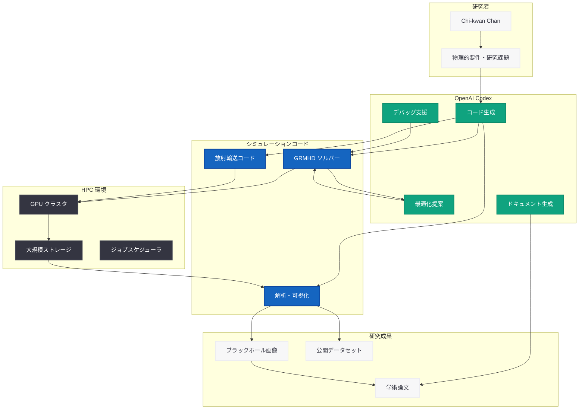

# 天体物理学者が Codex を活用してブラックホールシミュレーションを実現

## メタデータ

| 項目 | 内容 |
|------|------|
| 発表日 | 2026-06-11 |
| ソース | OpenAI News |
| カテゴリ | ケーススタディ |
| 公式リンク | [How an astrophysicist uses Codex to help simulate black holes](https://openai.com/index/using-codex-to-simulate-black-holes) |

> **注記:** 本レポートは公式ページが Cloudflare の保護により直接アクセスできなかったため、RSS/サマリー情報および公開されている関連情報に基づいて作成している。正確な詳細については公式ページを参照されたい。

## 概要

OpenAI は 2026 年 6 月 11 日、天体物理学者 Chi-kwan Chan 氏が Codex を活用してブラックホールシミュレーションを行っている事例を紹介する記事を公開した。本記事は、Codex が従来のソフトウェア開発領域を超え、科学研究の最前線で活用されていることを示すケーススタディである。

Chi-kwan Chan 氏は、ブラックホール周辺の極限物理現象のシミュレーションや一般相対性理論の検証に Codex を活用している。この事例は、AI コーディングエージェントが高度な科学計算やシミュレーションタスクにおいても有効であることを実証するものであり、Codex の適用範囲が学術研究・科学計算領域にまで拡大していることを示している。

## 主な内容

### Chi-kwan Chan 氏の研究背景

Chi-kwan Chan 氏は、ブラックホールの挙動をシミュレーションし、極限物理現象を研究する天体物理学者である。ブラックホール研究は、一般相対性理論の予測を検証し、宇宙の最も根本的な物理法則を理解するための重要な分野である。

ブラックホールシミュレーションには、以下のような計算科学上の課題が伴う。

| 課題 | 詳細 |
|------|------|
| 計算の複雑性 | 一般相対性理論の方程式を数値的に解くには、高度な数値計算アルゴリズムが必要 |
| コード量の膨大さ | シミュレーションコードは数万行に及び、開発・保守が困難 |
| 物理モデルの多様性 | 磁気流体力学、放射輸送、重力理論など複数の物理モデルを統合する必要がある |
| パフォーマンス最適化 | HPC (High Performance Computing) 環境での並列化・最適化が不可欠 |
| 検証の困難さ | シミュレーション結果の物理的妥当性の検証に高度な専門知識が必要 |

### Codex によるシミュレーション支援

Chi-kwan Chan 氏は、Codex を科学計算コードの開発・改善に活用している。ブラックホールシミュレーションにおける Codex の役割は、以下のような領域に及ぶと考えられる。

#### 数値計算コードの開発支援

- **アルゴリズム実装:** 一般相対性理論の数値解法 (GRMHD: General Relativistic Magnetohydrodynamics) の実装において、複雑な数学的表現をコードに変換
- **コード生成と最適化:** 計算カーネルの高速化、メモリ効率の改善、並列化パターンの適用
- **テストコード作成:** 既知の解析解との比較による数値コードの検証テストの自動生成

#### データ解析と可視化

- **シミュレーション結果の後処理:** 大量の出力データから物理的に意味のある量を抽出するスクリプトの作成
- **可視化パイプライン:** ブラックホール降着円盤の画像レンダリングや時系列データの可視化コードの生成
- **統計解析:** 観測データとシミュレーション結果の比較分析のためのコード開発

#### 研究ワークフローの効率化

- **文献コードの理解と移植:** 他の研究グループが公開した計算コードの理解と自身のフレームワークへの統合
- **プロトタイピング:** 新しい物理モデルの迅速な実装とテスト
- **ドキュメンテーション:** 複雑な計算コードの解説文書や論文用の疑似コードの生成

### AI と天体物理学の融合

本事例は、AI が天体物理学研究において果たし得る役割の拡大を示すものである。従来、AI の天体物理学への応用は主にデータ解析 (画像分類、信号検出) に限られていたが、Codex の活用はシミュレーションコード開発という研究プロセスの根幹に AI が関与する新たなパラダイムを示している。

**従来の AI 活用 (データ駆動):**
- 望遠鏡データの自動分類
- 重力波信号の検出
- 系外惑星の候補天体同定

**Codex による新たな AI 活用 (コード駆動):**
- シミュレーションコードの開発・改善
- 数値計算アルゴリズムの実装
- 理論モデルのコード化
- 計算パフォーマンスの最適化

## 技術的な詳細

### ブラックホールシミュレーションの技術スタック

ブラックホールシミュレーションで一般的に使用される技術スタックと、Codex が支援し得る領域は以下の通りである。

| レイヤー | 技術 | Codex の支援領域 |
|----------|------|-----------------|
| 物理モデル | GRMHD、放射輸送、一般相対性理論 | 方程式のコード化、新モデルの実装 |
| 数値手法 | 有限体積法、適応格子細分化 | アルゴリズム実装、精度検証 |
| プログラミング言語 | C/C++、Fortran、Python、Julia | コード生成、リファクタリング |
| 並列計算 | MPI、OpenMP、CUDA/GPU | 並列化パターンの適用、最適化 |
| 可視化 | Matplotlib、ParaView、yt | 可視化スクリプトの生成 |
| ワークフロー | Jupyter、Snakemake | パイプライン構築 |

### Codex が科学計算を支援するパターン

```python
# 例: Codex を活用した GRMHD シミュレーションコードの開発支援イメージ
# (一般的なブラックホールシミュレーションの数値計算パターン)

import numpy as np


def kerr_metric(r, theta, a):
    """
    Kerr ブラックホールの計量テンソルを計算する。

    Parameters:
        r: 動径座標
        theta: 極角座標
        a: スピンパラメータ (0 <= a <= 1)

    Returns:
        計量テンソルの成分 (g_tt, g_rr, g_thth, g_phph, g_tph)
    """
    sigma = r**2 + a**2 * np.cos(theta)**2
    delta = r**2 - 2 * r + a**2

    g_tt = -(1 - 2 * r / sigma)
    g_rr = sigma / delta
    g_thth = sigma
    g_phph = (
        (r**2 + a**2 + 2 * r * a**2 * np.sin(theta)**2 / sigma)
        * np.sin(theta)**2
    )
    g_tph = -2 * a * r * np.sin(theta)**2 / sigma

    return g_tt, g_rr, g_thth, g_phph, g_tph


def compute_isco(a):
    """
    Kerr ブラックホールの最内安定円軌道 (ISCO) 半径を計算する。
    Codex はこのような解析的公式のコード化を支援する。

    Parameters:
        a: スピンパラメータ (-1 <= a <= 1、順行軌道で正)

    Returns:
        ISCO 半径 (重力半径単位)
    """
    z1 = 1 + (1 - a**2)**(1/3) * (
        (1 + a)**(1/3) + (1 - a)**(1/3)
    )
    z2 = np.sqrt(3 * a**2 + z1**2)

    if a >= 0:
        return 3 + z2 - np.sqrt((3 - z1) * (3 + z1 + 2 * z2))
    else:
        return 3 + z2 + np.sqrt((3 - z1) * (3 + z1 + 2 * z2))
```

### シミュレーションワークフローにおける Codex の位置づけ

```python
# Codex を活用した研究ワークフローの概念的な例

# 1. 物理モデルの実装
# 研究者が物理的な要件を自然言語で記述し、
# Codex がコードを生成するパターン

codex_prompt = """
Kerr ブラックホール周辺の降着流に対する
一般相対論的磁気流体力学 (GRMHD) の基本方程式を
保存形式で実装してください。
座標系は Boyer-Lindquist 座標を使用し、
有限体積法で離散化してください。
"""

# 2. 生成されたコードの検証
# 既知のテストケース (Bondi 降着など) との比較

# 3. パフォーマンスチューニング
# Codex による GPU カーネルの最適化提案

# 4. 結果の可視化と解析
# シミュレーション出力からの物理量抽出
```

## アーキテクチャ



## 開発者への影響

### 科学計算分野の開発者

- **研究コード開発の加速:** 複雑な物理モデルのコード化に要する時間が大幅に短縮され、研究者はアルゴリズム設計や物理的解釈に集中できるようになる
- **コード品質の向上:** Codex によるコードレビューやテスト生成により、科学計算コードの信頼性が向上する
- **学際的な協力の促進:** AI が異なる専門分野間のコード翻訳を支援することで、共同研究がより容易になる

### Codex のユースケース拡大

- **ソフトウェア開発を超えた適用:** 本事例は、Codex が従来のソフトウェア開発だけでなく、科学研究のコード生成ツールとしても有効であることを実証
- **ドメイン特化型の活用:** 天体物理学という高度に専門化された分野でも、Codex が有意義な支援を提供できることが示された
- **研究の民主化:** 高度な数値計算の専門知識がなくても、Codex の支援により複雑なシミュレーションコードの開発が可能になる可能性がある

### HPC 開発者

- **GPU 最適化の支援:** Codex が CUDA カーネルの最適化やメモリアクセスパターンの改善を提案することで、HPC コードのパフォーマンスチューニングが効率化される
- **レガシーコードの移植:** Fortran で書かれた古い科学計算コードを現代的な言語やフレームワークに移植する際の支援

## 関連リンク

- [How an astrophysicist uses Codex to help simulate black holes](https://openai.com/index/using-codex-to-simulate-black-holes) - 本記事 (OpenAI)
- [Codex for Every Role, Tool, and Workflow](https://openai.com/index/codex-for-every-role-tool-workflow/) - Codex のユニバーサルプラットフォーム化 (2026-06-03)
- [Codex for (almost) everything](https://openai.com/index/codex-for-almost-everything) - Codex スーパーアプリ化 (2026-04-16)
- [OpenAI Codex](https://openai.com/codex) - Codex 製品ページ
- [OpenAI News](https://openai.com/news)

## まとめ

天体物理学者 Chi-kwan Chan 氏による Codex 活用事例は、AI コーディングエージェントの適用範囲が従来のソフトウェア開発を超え、最先端の科学研究にまで拡大していることを示す重要なケーススタディである。主要なポイントは以下の通りである。

1. **科学計算への適用実証:** ブラックホールシミュレーションという高度に専門的な計算科学分野において、Codex が研究者の生産性向上に寄与していることが確認された

2. **研究プロセスの変革:** AI がデータ解析だけでなく、シミュレーションコードの開発・最適化という研究の根幹プロセスに関与する新しいパラダイムが示された

3. **Codex の汎用性の証明:** 開発者向けツールとして出発した Codex が、天体物理学のような専門分野でも有効に機能することは、プラットフォームの汎用性と適応力の高さを証明している

4. **科学研究の民主化への貢献:** 高度な数値計算スキルへのアクセス障壁を下げることで、より多くの研究者がシミュレーション科学に参入できる可能性がある

5. **AI と基礎科学の共進化:** AI ツールが基礎科学の進展を加速し、その成果がさらに AI 技術の発展にフィードバックされるという好循環の一例として位置づけられる

本事例は、OpenAI が Codex を単なる開発者ツールではなく、あらゆる知的労働を支援するユニバーサルプラットフォームとして展開する戦略の一環であり、科学研究コミュニティにおける Codex の存在感が今後さらに高まることが予想される。
