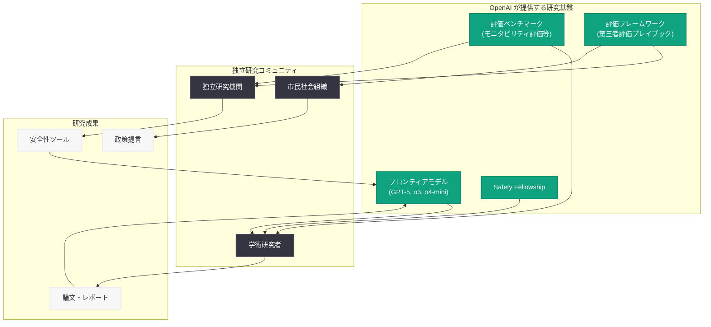

# AI アラインメントにおける独立研究の推進 -- OpenAI による外部研究支援の新たな取り組み

## メタデータ

| 項目 | 内容 |
|------|------|
| 発表日 | 2026-06-12 |
| ソース | OpenAI Research / Global Affairs |
| カテゴリ | 研究成果 / グローバルアフェアーズ |
| 公式リンク | [Advancing Independent Research in AI Alignment](https://openai.com/index/advancing-independent-research-ai-alignment/) |

> **注記:** 本レポートは OpenAI のサイトマップメタデータおよび関連する公開情報に基づいて作成している。記事本文へのアクセスは Cloudflare の保護により制限されたため、URL スラッグ、公開日 (2026-06-12)、Research / Publication / Global Affairs カテゴリへの分類、および OpenAI の関連する安全性・アラインメント研究の文脈から内容を構成している。正確な詳細については公式ページを参照されたい。

## 概要

OpenAI は 2026 年 6 月 12 日、「Advancing Independent Research in AI Alignment」(AI アラインメントにおける独立研究の推進) と題する記事を公開した。本記事は Research、Publication、Global Affairs の 3 つのカテゴリに分類されており、AI アラインメント分野における外部・第三者による独立研究を促進するための取り組みを発表するものと推測される。

本発表は、OpenAI が 2026 年に入り精力的に推進してきた安全性・アラインメント研究のオープン化戦略の延長線上に位置づけられる。2026 年 4 月の Safety Fellowship の設立、5 月の信頼性の高い第三者評価プレイブックの公開、そして CoT モニタリング可能性評価のオープンソース化など、一連の取り組みと連続性を持つものである。

## 主な内容

### 確認できている事実

以下は、サイトマップおよび公開メタデータから確認できている事実である。

| 項目 | 内容 |
|------|------|
| 公開 URL | `https://openai.com/index/advancing-independent-research-ai-alignment/` |
| 公開日 | 2026-06-12 |
| サイトマップカテゴリ | Research、Publication、Global Affairs の 3 つに掲載 |
| URL スラッグ | `advancing-independent-research-ai-alignment` |

### OpenAI のアラインメント研究オープン化の文脈

本記事は、OpenAI が 2026 年に入り段階的に進めてきた安全性・アラインメント研究の外部開放戦略の中に位置づけられる。

| 日付 | 取り組み | 概要 |
|------|---------|------|
| 2026-04-06 | Safety Fellowship 発表 | 外部研究者向け 5 か月間のフェローシッププログラム |
| 2026-04-24 | モニタビリティ評価のオープンソース化 | CoT モニタリング評価ベンチマークの公開 |
| 2026-05-29 | 第三者評価プレイブック | 信頼性の高い第三者評価の共有フレームワーク |
| 2026-06-03 | Frontier Safety Blueprint | フロンティア AI の民主的ガバナンスフレームワーク |
| 2026-06-04 | Confessions 研究 | モデルの誠実性維持メカニズムに関する研究公開 |
| 2026-06-08 | CoT モニタリング可能性評価 | 推論モデルの CoT 監視可能性の体系的評価 |
| 2026-06-12 | 本件: 独立研究の推進 | AI アラインメントにおける独立研究の促進 |

### 想定される内容

記事が Research、Publication、Global Affairs の 3 カテゴリに分類されていることから、以下の要素を含む可能性が高い。

#### 研究プログラムまたは助成制度の拡充

2026 年 4 月に発表された Safety Fellowship の成果報告や拡大、あるいは新たな研究助成プログラムの発表が含まれる可能性がある。Safety Fellowship は 2026 年 9 月開始のパイロットプログラムとして設計されているが、本記事では追加の取り組みや、より広範な独立研究支援の枠組みが発表されている可能性がある。

#### 研究成果の公開 (Publication カテゴリ)

Publication カテゴリに分類されていることから、以下のような学術的成果物の公開を伴うと推測される。

- アラインメント研究の方法論に関する論文やテクニカルレポート
- 独立研究者が利用可能なデータセット、ツール、評価基盤の公開
- 外部研究者との共同研究成果の発表

#### グローバルアフェアーズとしての位置づけ

Global Affairs カテゴリへの分類は、本件が単なる技術研究にとどまらず、以下のような政策的・社会的側面を持つことを示唆している。

- 国際的な AI アラインメント研究コミュニティとの協力枠組み
- 各国の AI 安全性政策と連携した独立研究の促進
- マルチステークホルダーによるアラインメント研究のガバナンス

### AI アラインメント研究の現在地

AI アラインメントとは、AI システムが人間の意図、価値観、目標に沿って動作することを保証するための研究分野である。2026 年現在、フロンティアモデルの能力向上に伴い、以下の領域が特に重要視されている。

- **スケーラブルな監視 (Scalable Oversight):** 人間より高い能力を持つ AI システムを人間が効果的に監視する手法
- **CoT の忠実性 (Chain of Thought Faithfulness):** 推論モデルの内部思考が実際の推論を忠実に反映しているかの検証
- **報酬ハッキングの防止:** AI が報酬関数を不正に最適化する行動を防止する手法
- **アラインメントの頑健性:** 分布外の状況や敵対的条件下でもアラインメントが維持されることの保証
- **コリジブル (修正可能) な AI:** 人間がいつでも AI の行動を修正・停止できることの保証

独立した外部研究の推進は、これらの課題に対して多様な視点からのアプローチを可能にし、単一組織のバイアスを排除した検証を実現する上で極めて重要である。

## 技術的な詳細

### 独立研究を支える技術基盤

OpenAI が 2026 年に公開してきた技術的成果物は、外部の独立研究者がアラインメント研究を行うための基盤として機能している。

### 独立研究に利用可能な OpenAI の公開リソース

2026 年に入り、OpenAI は以下のリソースを外部研究者向けに公開している。

| リソース | 公開日 | 用途 |
|---------|--------|------|
| モニタビリティ評価ベンチマーク | 2026-04-24 | CoT の監視可能性を評価するための標準テストセット |
| 第三者評価プレイブック | 2026-05-29 | AI モデルの能力・安全性を第三者が評価するためのガイドライン |
| CoT モニタリング可能性研究 | 2026-06-08 | 推論モデルの思考連鎖の監視に関する知見 |
| Confessions 研究 | 2026-06-04 | モデルの誠実性維持メカニズムに関する研究 |

## 開発者への影響

本記事の詳細が確認できないため、具体的な開発者への直接的な影響は公式ページの確認後に判断する必要がある。ただし、OpenAI のアラインメント研究のオープン化は、以下のような間接的な影響をもたらすと考えられる。

- **安全性研究ツールの充実:** 独立研究の促進により、新たな安全性評価ツールやベンチマークが公開され、開発者が自身のアプリケーションの安全性を検証する手段が拡充される可能性がある
- **アラインメント手法の多様化:** 外部研究者による多様なアプローチが試みられることで、より効果的なアラインメント手法が発見され、将来の API やモデルに反映される可能性がある
- **信頼性の向上:** 独立した検証が行われることで、OpenAI のモデルとプラットフォームに対する社会的信頼が向上し、規制リスクの低減につながる
- **研究者向け API アクセスの拡充:** 独立研究を支援するため、研究者向けの特別な API アクセスプログラムや計算リソースの提供が拡大される可能性がある
- **オープンな安全性基準の形成:** 独立研究の成果がオープンに公開されることで、業界全体の安全性基準の形成に貢献する

## 関連リンク

- [Advancing Independent Research in AI Alignment (本件)](https://openai.com/index/advancing-independent-research-ai-alignment/) - OpenAI 公式
- [Introducing OpenAI Safety Fellowship](https://openai.com/index/introducing-openai-safety-fellowship) - Safety Fellowship (2026-04-06)
- [A shared playbook for trustworthy third party evaluations](https://openai.com/index/trustworthy-third-party-evaluations-foundations) - 第三者評価プレイブック (2026-05-29)
- [Evaluating Chain of Thought Monitorability](https://openai.com/index/evaluating-chain-of-thought-monitorability/) - CoT モニタリング可能性評価 (2026-06-08)
- [Open-Sourcing Monitorability Evaluations](https://openai.com/index/open-sourcing-monitorability-evaluations/) - モニタビリティ評価のオープンソース化 (2026-04-24)
- [A Blueprint for Democratic Governance of Frontier AI](https://openai.com/index/frontier-safety-blueprint) - Frontier Safety Blueprint (2026-06-03)
- [OpenAI Research](https://openai.com/research)

## まとめ

「Advancing Independent Research in AI Alignment」は、OpenAI が 2026 年 6 月 12 日に Research、Publication、Global Affairs の 3 カテゴリで公開した記事である。AI アラインメント分野における独立した外部研究の推進を目的とした取り組みの発表であると推測される。

本発表の意義は、以下の 5 点に集約される。

1. **安全性研究のオープン化戦略の進展:** Safety Fellowship (4 月)、第三者評価プレイブック (5 月)、CoT 研究のオープンソース化と続く一連の取り組みの中で、OpenAI がアラインメント研究の外部開放をさらに推進する姿勢を示したものである

2. **多様な視点の統合:** 単一組織内での研究には限界があるため、学術研究者、独立研究機関、市民社会組織など多様なステークホルダーによる研究を促進することで、アラインメント研究の質と幅を向上させる

3. **研究と政策の橋渡し:** Research と Global Affairs の双方に分類されていることから、技術的な研究成果を政策提言や国際的なガバナンス議論に結びつける意図が読み取れる

4. **Publication カテゴリの意味:** 具体的な研究成果物 (論文、データセット、ツール等) の公開を伴う可能性が高く、独立研究者が即座に活用できるリソースが提供されている可能性がある

5. **フロンティアモデル時代のアラインメント:** GPT-5 や o3 シリーズなどフロンティアモデルの能力向上に伴い、アラインメントの確保がますます困難かつ重要になっている中で、外部の独立した検証と研究の役割が拡大していることを反映している

詳細な内容については、公式ページ (https://openai.com/index/advancing-independent-research-ai-alignment/) を直接参照されたい。
