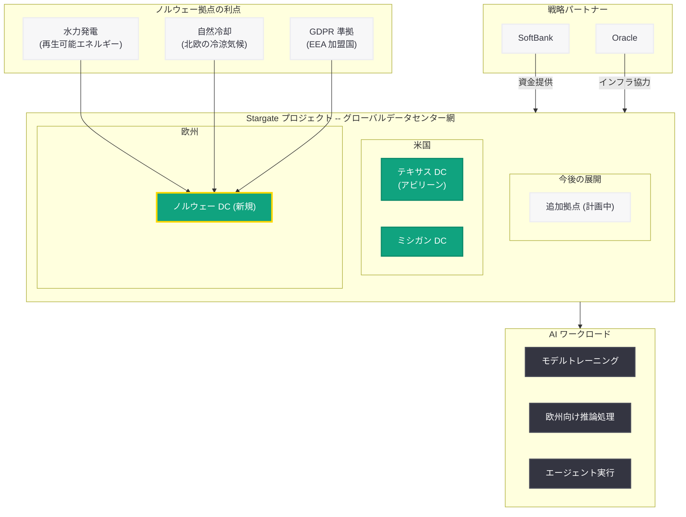
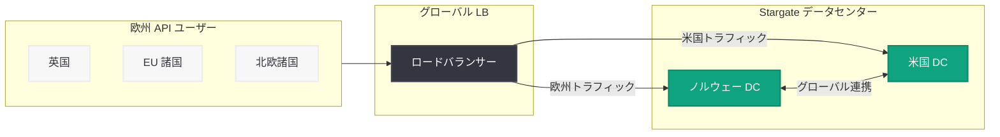

# OpenAI、Stargate プロジェクト初の海外拠点としてノルウェーにデータセンターを設立 -- 再生可能エネルギーと欧州接続性を活用

## メタデータ

| 項目 | 内容 |
|------|------|
| 発表日 | 2026-06-12 |
| ソース | OpenAI News (Global Affairs) |
| カテゴリ | インフラストラクチャ / グローバル展開 |
| 公式リンク | [Introducing Stargate Norway](https://openai.com/index/introducing-stargate-norway/) |

> **注:** 本レポートは OpenAI 公式サイトのサイトマップ情報 (URL、公開日)、および Stargate プロジェクトに関する公開情報に基づいて作成しています。記事本文へのアクセスは Cloudflare の保護により制限されたため、公式発表の詳細については公式リンクを参照してください。

## 概要

2026 年 6 月 12 日、OpenAI は Stargate プロジェクトの新たな拠点として、ノルウェーにおけるデータセンターの設立を発表した。これは Stargate プロジェクトにとって初の米国外拠点となり、OpenAI のグローバルインフラ戦略における重大なマイルストーンである。

ノルウェーは豊富な水力発電による再生可能エネルギー、冷涼な気候による自然冷却の効率性、EU/EEA 圏への法的・ネットワーク的接続性、そして政治的安定性を兼ね備えており、大規模 AI データセンターの立地として極めて高い適性を持つ。本発表は、テキサス州アビリーン、ミシガン州に続く Stargate 拠点の拡大であり、OpenAI が米国内にとどまらずグローバルに AI コンピュートインフラを展開する方針を明確に示したものである。

## 主な内容

### Stargate プロジェクトの国際展開

Stargate プロジェクトは、OpenAI と SoftBank が 2025 年に発表した大規模 AI データセンター構想であり、総投資額は最大 5,000 億ドル (約 75 兆円) に達する計画である。これまでの拠点は全て米国内 (テキサス州、ミシガン州) に限られていたが、ノルウェーの追加により Stargate は初めて国際的な展開に踏み出した。

OpenAI Global Affairs 部門からの発表であることから、ノルウェー政府との協力関係、地域経済への貢献、エネルギー政策との整合性といった公共政策的な側面が重視されていると推測される。

### ノルウェーが選定された背景

ノルウェーがデータセンターの立地として選定された背景には、複数の戦略的要因が存在する。

| 要素 | ノルウェーの優位性 |
|------|-------------------|
| エネルギー | 電力の 90% 以上が水力発電による再生可能エネルギー。カーボンニュートラルな運用が可能 |
| 冷却効率 | 北欧の冷涼な気候により、自然冷却 (フリークーリング) を年間を通じて活用可能。冷却コストを大幅に削減 |
| EU/EEA 接続性 | EEA 加盟国として EU データ保護規則 (GDPR) への準拠が容易。欧州市場へのゲートウェイ |
| 政治的安定性 | NATO 加盟国、高い法の支配指数、安定した政治体制 |
| 通信インフラ | 海底ケーブルのハブとして欧州各国への低遅延接続が可能 |
| 電力コスト | 水力発電の豊富さにより、欧州内で最も低い電力コスト水準 |

### サステナビリティへの取り組み

Stargate Norway は、OpenAI のサステナビリティ戦略における象徴的な拠点となると考えられる。AI データセンターは膨大な電力を消費するため、再生可能エネルギーによる電力供給は環境負荷の低減において極めて重要である。

ノルウェーの水力発電は以下の特徴を持つ。

- **安定性:** 氷河や降水による水資源が豊富で、年間を通じて安定した発電が可能
- **規模:** 国内電力需要を大幅に上回る発電能力を保有し、余剰電力を輸出
- **カーボンフリー:** CO2 排出量がほぼゼロの電源構成
- **拡張性:** 新規水力発電所の開発余地が存在

### 欧州 AI インフラ戦略

本発表は、OpenAI が 2026 年に加速させている欧州展開の一環として位置付けられる。

| 時期 | 欧州関連の展開 |
|------|---------------|
| 2026 年 4 月 | ロンドンオフィスの開設 |
| 2026 年 6 月 11 日 | EU における信頼できる AI エコシステムの構築発表 |
| 2026 年 6 月 12 日 | Stargate Norway の発表 (本件) |

ノルウェーへの Stargate 拠点設置は、OpenAI が欧州市場に対して長期的なコミットメントを示す戦略的決定であり、EU の AI 規制 (AI Act) への対応、データ主権要件の充足、欧州顧客へのレイテンシ改善を同時に実現するものと考えられる。

### Stargate データセンター拠点の全体像

現在判明している Stargate プロジェクトの拠点展開は以下の通りである。

| 拠点 | 地域 | 発表日 | 特記事項 |
|------|------|--------|----------|
| アビリーン | テキサス州 (米国) | 2025 年 | 最初に発表された主要拠点 |
| コンピュートインフラ拡張 | 米国内 | 2026-04-29 | 大規模容量追加 |
| ミシガン | ミシガン州 (米国) | 2026-06-02 | 米国中西部の新拠点 |
| ノルウェー | ノルウェー (欧州) | 2026-06-12 | 初の海外拠点 (本件) |

## 技術的な詳細

### データセンターの想定仕様

Stargate Norway は、他の Stargate 拠点と同様に AI ワークロードに完全特化した設計が採用されると推測される。

#### ハードウェア構成 (推定)

| コンポーネント | 詳細 |
|---------------|------|
| GPU | Nvidia H100 / B200、次世代アクセラレータ |
| カスタムチップ | OpenAI Titan (Samsung HBM4 搭載) |
| ネットワーク | NVLink / InfiniBand による超高速ノード間通信 |
| ストレージ | 大規模分散ファイルシステム |
| 電力 | GW 級の水力発電による電力供給 |

#### 冷却システム

ノルウェーの年間平均気温は地域により 2-8 度C であり、AI ワークロードの高い電力密度に対して、自然冷却 (フリークーリング) を最大限活用できる。これにより以下の利点が得られる。

- **PUE (Power Usage Effectiveness) の最適化:** 冷却に要する電力が最小化され、PUE 1.1 以下の達成が可能
- **運用コスト削減:** 機械式冷却設備の大幅な縮小により、設備投資・運用コストを削減
- **環境負荷低減:** 冷却に伴う追加の電力消費とその CO2 排出を回避

### データ主権とコンプライアンス

ノルウェー (EEA 加盟国) におけるデータセンター設置は、欧州のデータ保護要件への対応において重要な意味を持つ。

| 規制 | 対応状況 |
|------|----------|
| GDPR | EEA 加盟国として完全準拠。EU 域内でのデータ処理が可能 |
| EU AI Act | 欧州拠点での AI モデル運用により、規制対応を容易に |
| データローカライゼーション | 欧州顧客のデータを欧州内で処理・保管 |
| Schrems II | EU-米国間データ移転の課題を回避可能 |

## アーキテクチャ

### Stargate グローバルデータセンター網

### 欧州ユーザーへの低遅延接続

## 開発者への影響

Stargate プロジェクトのノルウェー展開は、特に欧州の開発者および欧州市場にサービスを提供する開発者に以下の恩恵をもたらすと考えられる。

- **レイテンシの大幅改善:** 欧州のユーザーに対して、地理的に近いデータセンターから API レスポンスが提供され、レイテンシが大幅に改善される見込み。従来は大西洋を越えて米国のデータセンターにアクセスする必要があったが、欧州内での処理が可能になる
- **GDPR コンプライアンスの簡素化:** EU/EEA 圏内でのデータ処理が可能になることで、EU-米国間のデータ移転に関する法的リスクが軽減される。欧州企業が OpenAI API を導入する際の法務上のハードルが低下する
- **可用性の向上:** 米国とノルウェーの地理的に分散した拠点によるフェイルオーバー構成が確立され、グローバルなサービス継続性が向上する
- **キャパシティの拡大:** 追加のコンピュートリソースにより、全ユーザーに対する API のレート制限緩和やピーク時の応答速度改善が期待される
- **データローカライゼーション対応:** 欧州のデータ主権要件を持つ組織 (金融、医療、公共機関等) にとって、欧州内でのデータ処理を保証できるオプションが提供される可能性がある
- **サステナビリティ要件への対応:** ESG / サステナビリティ基準を重視する企業にとって、100% 再生可能エネルギーで稼働する AI インフラの利用が可能になる

### 想定される活用シナリオ

| シナリオ | 詳細 |
|----------|------|
| 欧州金融機関 | GDPR 準拠環境でのリアルタイム AI 処理 (リスク分析、不正検知) |
| 欧州ヘルスケア | 患者データの EU 域内処理を保証した AI 診断支援 |
| 北欧スタートアップ | 低レイテンシ・低コストでの AI モデル活用による高速開発 |
| グローバル企業 | 欧州拠点のワークロードを最寄りデータセンターで処理 |

## 関連リンク

- [Introducing Stargate Norway](https://openai.com/index/introducing-stargate-norway/) - 本記事の公式ページ
- [Stargate Michigan Data Center](https://openai.com/index/stargate-michigan-data-center/) - ミシガン州データセンター発表
- [Building the compute infrastructure for the Intelligence Age](https://openai.com/index/building-the-compute-infrastructure-for-the-intelligence-age) - Stargate インフラ拡張発表
- [OpenAI EU: Trustworthy AI Ecosystem](https://openai.com/index/openai-eu-trustworthy-ai-ecosystem/) - OpenAI の EU 戦略
- [OpenAI News](https://openai.com/news) - OpenAI 公式ニュース
- [OpenAI API ドキュメント](https://platform.openai.com/docs) - API ドキュメント

### 関連レポート

- [OpenAI、Stargate プロジェクトにミシガン州データセンターを追加](2026-06-02-stargate-michigan-data-center.md)
- [OpenAI、Stargate プロジェクトを拡大し「知性の時代」を支えるコンピュートインフラを構築](2026-04-29-stargate-compute-infrastructure.md)
- [OpenAI、EU における信頼できる AI エコシステムの構築を発表](2026-06-11-openai-eu-trustworthy-ai-ecosystem.md)

## まとめ

OpenAI が発表した Stargate Norway は、同プロジェクト初の米国外拠点であり、OpenAI のグローバル AI インフラ戦略における画期的な進展である。本発表の要点は以下の 3 点に集約される。

1. **Stargate の国際展開開始:** ノルウェーの追加により、Stargate プロジェクトは米国内に限定されたインフラ構想から、グローバルな AI コンピュートネットワークへと進化した。欧州を皮切りに、今後更なる国際展開が見込まれる
2. **サステナビリティと AI の両立:** ノルウェーの豊富な水力発電を活用することで、大規模 AI コンピュートの環境負荷を最小限に抑える運用が可能となる。AI 産業全体が直面するエネルギー課題に対する先進的な回答を示している
3. **欧州市場への本格的コミットメント:** ロンドンオフィス開設、EU AI エコシステム構築発表に続くノルウェーデータセンターの設立は、OpenAI が欧州市場を最重要地域の一つとして位置付けていることを明確に示す。GDPR 準拠のインフラ提供により、欧州企業の AI 導入障壁が大幅に低下する

AGI の実現に向けて膨大な計算資源を必要とする OpenAI にとって、グローバルなデータセンター網の構築は不可避の戦略である。ノルウェーという選択は、再生可能エネルギー、冷却効率、規制対応、地理的位置の全てにおいて合理的であり、今後の Stargate 国際展開のモデルケースとなるだろう。
