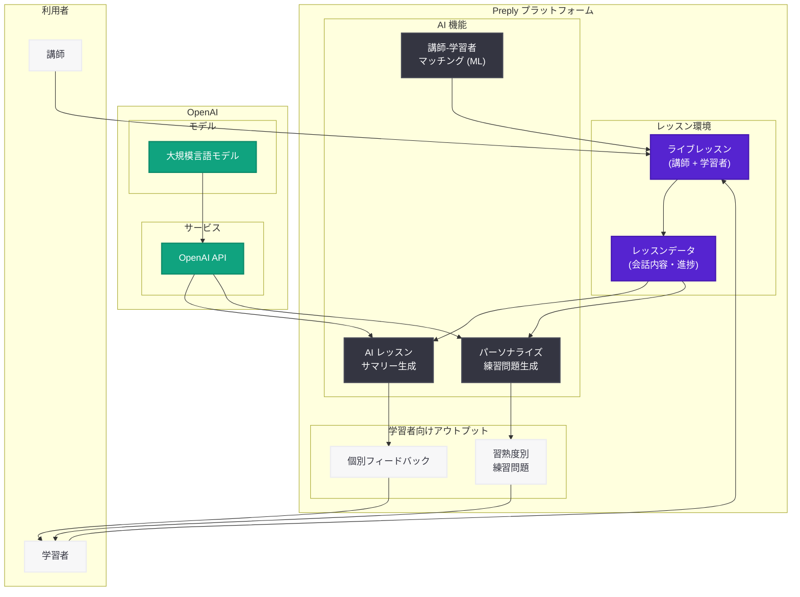

# Preply が OpenAI を活用し AI と人間の講師を組み合わせた個別学習を実現

## メタデータ

| 項目 | 内容 |
|------|------|
| 発表日 | 2026-06-12 |
| ソース | OpenAI News |
| カテゴリ | Applied AI / パートナーシップ |
| 公式リンク | [How Preply combines AI and human tutors to personalize learning](https://openai.com/index/preply) |

> **注:** 本レポートは OpenAI 公式ブログの RSS フィード情報および関連する検索結果に基づいて作成している。記事本文へのアクセスは Cloudflare の保護により制限されたため、公開されている情報と業界文脈に基づく内容となっている。正確な詳細については公式ページを参照されたい。

## 概要

2026 年 6 月 12 日、OpenAI は公式ブログにおいて、大手オンライン語学学習プラットフォーム Preply が OpenAI の技術を活用して AI 生成のレッスンサマリー機能を展開し、パーソナライズされたフィードバックと語学学習エクササイズを提供している事例を公開した。

Preply は「AI が人間の教育者を置き換えるのではなく、その能力を拡張する」というビジョンのもと、OpenAI のモデルを統合することで、学習者一人ひとりの習熟度に合わせた個別化された学習体験を実現している。これは AI と人間の講師が協調する教育テクノロジーの先進的なケーススタディである。

## 主な内容

### Preply について -- オンライン語学学習のリーディングプラットフォーム

Preply は世界規模で展開するオンライン語学学習プラットフォームであり、学習者と講師をマッチングしてライブのオンラインレッスンを提供するサービスを運営している。

| 項目 | 内容 |
|------|------|
| サービス概要 | オンライン語学学習プラットフォーム |
| 主要機能 | 講師とのライブレッスン、AI 学習支援 |
| 技術特徴 | 創業時から機械学習をプラットフォームに統合 |
| AI 活用歴 | 講師-学習者マッチング、教室機能に ML を早期導入 |

Preply は創業当初から機械学習技術をプラットフォームに組み込んでおり、講師と学習者の最適なマッチングやクラスルーム機能の強化に活用してきた実績がある。

### AI 生成レッスンサマリーの導入

Preply が OpenAI を活用して実現した中核機能は、AI 生成のレッスンサマリーである。

#### 機能の概要

- **即時フィードバック生成:** 学習者がオンラインレッスンを完了した直後に、パーソナライズされた学習サマリーを自動生成
- **個別化された練習問題:** 各学習者の習熟度レベルに合わせた語学練習問題を提供
- **パーソナライズされたフィードバック:** レッスン内容に基づいた具体的かつ個別的なフィードバックを生成

#### 学習者にとっての価値

| 価値 | 説明 |
|------|------|
| レッスン内容の定着 | サマリーにより学習内容を効果的に振り返り可能 |
| 自律学習の促進 | レッスン外でも習熟度に応じた練習が可能 |
| 即時性 | レッスン終了直後にフィードバックを取得 |
| 個別最適化 | 一人ひとりの弱点や進捗に基づく内容 |

### AI と人間の講師の協調モデル

Preply の共同創業者兼 CTO である Dmytro Voloshyn 氏は、「目標は人間の教育者を置き換えることではない」と明確に述べており、AI は講師の能力を拡張するツールとして位置づけられている。

#### 講師への恩恵

- **教育に集中する時間の確保:** AI がサマリーやフィードバック生成を担うことで、講師は教育そのものにより多くの時間を割ける
- **学習者の進捗把握:** AI が生成するデータにより、学習者の理解度や弱点を効率的に把握
- **反復作業の削減:** レッスン後のフォローアップ作業を自動化

### 技術統合のアプローチ

Preply は創業以来、機械学習をプラットフォームの中核に据えてきた。今回の OpenAI 統合は、その技術基盤の上に構築された発展形であると位置づけられる。

- **講師-学習者マッチング:** ML によるベストマッチの推薦 (既存機能)
- **クラスルーム機能:** AI を活用した学習環境の最適化 (既存機能)
- **レッスンサマリー生成:** OpenAI のモデルによる新機能
- **練習問題の自動生成:** 習熟度に応じたコンテンツ生成 (新機能)

## アーキテクチャ

## ユーザーへの影響

- **学習者の体験向上:** レッスン後すぐにパーソナライズされたサマリーと練習問題が提供されることで、学習の連続性と定着率が向上する
- **講師の負担軽減:** フィードバック作成や練習問題生成の自動化により、講師は対面での教育活動に集中できるようになる
- **EdTech 業界への示唆:** AI と人間の講師が協調するハイブリッドモデルは、語学教育に限らず広く教育テクノロジー分野における設計パターンの参考となる
- **個別最適化学習の民主化:** AI によるパーソナライズにより、学習者の習熟度に応じた最適な学習体験が、追加コストなく全ユーザーに提供される可能性がある
- **開発者への参考事例:** オンライン教育プラットフォームにおける OpenAI API の活用方法として、レッスンコンテンツからの構造化されたサマリー生成や適応型問題生成のパターンが示されている

## 関連リンク

- [How Preply combines AI and human tutors to personalize learning (公式)](https://openai.com/index/preply)
- [Preply 公式サイト](https://preply.com)
- [OpenAI News](https://openai.com/news)
- [OpenAI エンタープライズ](https://openai.com/enterprise)

## まとめ

Preply と OpenAI の協業事例は、教育テクノロジーにおける AI 活用の方向性を示すものであり、以下の点で重要な意義を持つ。

1. **AI と人間の講師の協調モデル:** 「AI が教育者を置き換えるのではなく拡張する」という明確なビジョンのもと、両者の強みを活かしたハイブリッドアプローチを実現している
2. **即時パーソナライズの実現:** レッスン終了直後に学習者一人ひとりの習熟度に合わせたサマリーと練習問題を生成することで、学習体験の質を大幅に向上させている
3. **既存 ML 基盤上への段階的統合:** 創業時から機械学習を活用してきた Preply のアーキテクチャ上に、OpenAI のモデルを自然に統合する段階的なアプローチは、他の EdTech 企業にとっても参考となる
4. **講師の価値の再定義:** AI がルーチン作業を担うことで、人間の講師がより付加価値の高い教育活動に集中できる環境を構築し、教育者の役割を進化させている
