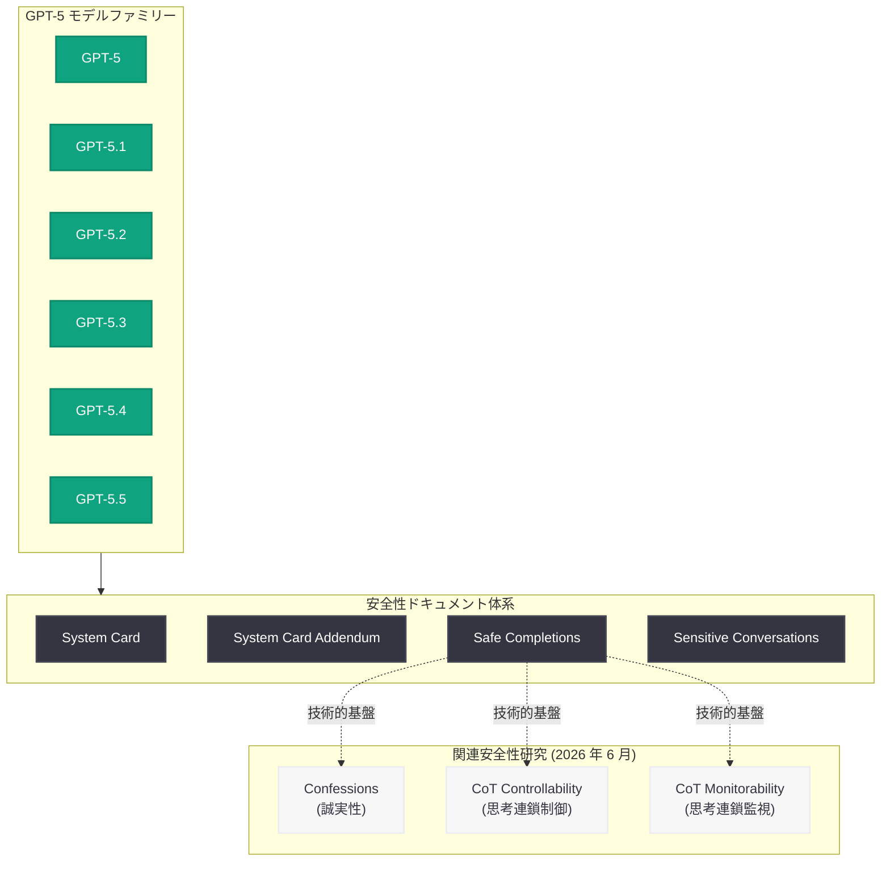

# GPT-5 Safe Completions: GPT-5 モデルファミリーにおける安全な出力生成メカニズム

## メタデータ

| 項目 | 内容 |
|------|------|
| 発表日 | 2026-06-13 |
| ソース | OpenAI Safety / Research (Publication) |
| カテゴリ | 安全性 / 研究成果 |
| 公式リンク | [GPT-5 Safe Completions](https://openai.com/index/gpt-5-safe-completions/) |

> **注記:** 本レポートの作成にあたり公式ページ (https://openai.com/index/gpt-5-safe-completions/) へのアクセスを試みたが、Cloudflare による保護のため記事本文を取得できなかった。本レポートは URL スラッグ、サイトマップメタデータ (lastmod: 2026-06-13T00:33:16.220Z)、および関連する GPT-5 安全性公開物のコンテキストに基づいて作成されている。正確な詳細については公式ページを参照されたい。

## 概要

OpenAI は 2026 年 6 月 13 日、「GPT-5 Safe Completions」と題する安全性 / 研究論文を公開した。本公開物は OpenAI のサイトマップにおいて「safety」および「publication」の両カテゴリに分類されており、GPT-5 モデルファミリーにおける安全な出力 (completion) の生成に関する技術的アプローチを記述したものと考えられる。

本公開は、OpenAI が 2026 年 6 月に集中的に実施している GPT-5 ファミリーの安全性ドキュメント公開シリーズの一環である。直近では 6 月 12 日に「GPT-5 system card sensitive conversations」が更新されており、GPT-5 Codex 向けのシステムカード補遺や GPT-5.1 向けのシステムカード補遺も関連公開物として存在する。

## 主な内容

### 公開物の位置づけ

「Safe Completions」というタイトルから、本公開物は GPT-5 がテキスト生成 (completion) を行う際に安全性を確保するためのメカニズムまたは技術的手法について記述したものと推定される。OpenAI のサイトマップ構造において「safety」と「publication」の両方に分類されている点は、これが単なるポリシー文書ではなく、技術的な研究成果を含む公開物であることを示唆している。

### GPT-5 安全性公開シリーズとの関連

本公開物は、以下の一連の GPT-5 安全性関連ドキュメントの文脈で理解される必要がある。

| 公開物 | 最終更新日 | 内容 |
|--------|-----------|------|
| GPT-5 system card sensitive conversations | 2026-06-12 | センシティブな会話におけるモデル動作 |
| GPT-5 system card addendum for GPT-5 Codex | 発表済み | GPT-5 Codex 固有の安全性情報 |
| GPT-5 system card addendum GPT-5.1 | 発表済み | GPT-5.1 固有の安全性情報 |
| **GPT-5 Safe Completions** | **2026-06-13** | **安全な出力生成メカニズム** |

GPT-5 モデルファミリー (GPT-5, GPT-5.1, GPT-5.2, GPT-5.3, GPT-5.4, GPT-5.5) に対する包括的な安全性文書の整備が進んでいることが確認できる。

### 関連する最近の安全性研究

本公開物は、OpenAI が 2026 年 6 月前後に発表した他の安全性 / アライメント研究とも関連すると考えられる。

- **Confessions keep language models honest (6 月 4 日):** モデルが自身の不確実性を率直に表明するメカニズムに関する研究
- **Reasoning models chain of thought controllability (6 月 5 日):** 推論モデルにおける思考連鎖の制御可能性と監視に関する研究更新
- **Evaluating CoT monitorability (6 月 8 日):** 思考連鎖の監視可能性に関する評価研究

これらの研究はいずれも、モデル出力の安全性と信頼性を技術的に担保するためのアプローチに関するものであり、「Safe Completions」もこの研究方向性の一部に位置づけられる。

### 情報の制約

公式ページへのアクセスが制限されているため、以下の詳細は確認できていない。

- 「Safe Completions」の具体的な技術的定義と実装手法
- 対象となるモデル範囲 (GPT-5 ファミリー全体か特定のバリアントか)
- ベンチマーク結果や定量的評価データ
- 従来のコンテンツフィルタリングや refusal メカニズムとの関係性
- 論文の共著者情報

## 技術的な詳細

### API への影響に関する補足

「Safe Completions」が API レベルで開発者に影響する可能性がある。OpenAI は過去にも安全性研究の成果を API パラメータや設定オプションとして実装してきた実績がある (例: moderation endpoint、content filtering レベル設定)。本研究成果が GPT-5 モデルファミリーの Chat Completions API における安全性動作にどのように反映されているかについては、公式ドキュメントの更新を確認する必要がある。

> **注:** 記事本文が取得できないため、コードサンプルおよび具体的な API パラメータの記載は省略する。

## アーキテクチャ

## 開発者への影響

- **GPT-5 モデル利用時の安全性動作の理解:** Safe Completions の手法が GPT-5 ファミリーの API レスポンスにどのように反映されているかを理解することで、アプリケーション設計における安全性考慮が容易になる
- **コンテンツポリシー対応:** 安全な出力生成メカニズムの詳細が公開されることで、開発者は GPT-5 の refusal (拒否) パターンや安全性フィルタリングの動作をより正確に予測し、アプリケーションのエラーハンドリングを適切に設計できる
- **安全性評価のベストプラクティス:** 本研究が提示する評価手法は、開発者が自社アプリケーションにおける AI 出力の安全性を検証する際の参考指標となる可能性がある
- **システムカードとの併読:** GPT-5 のシステムカードおよび各補遺と本公開物を合わせて参照することで、モデルの安全性特性を包括的に把握できる

## 関連リンク

- [GPT-5 Safe Completions (公式)](https://openai.com/index/gpt-5-safe-completions/)
- [OpenAI Safety](https://openai.com/safety)
- [OpenAI Research](https://openai.com/research)
- [How confessions can keep language models honest](https://openai.com/index/how-confessions-can-keep-language-models-honest)
- [Reasoning Models: Chain of Thought Controllability](https://openai.com/index/reasoning-models-chain-of-thought-controllability/)
- [OpenAI News](https://openai.com/news)

## まとめ

「GPT-5 Safe Completions」は、OpenAI が GPT-5 モデルファミリーの安全性に関して集中的に公開している一連のドキュメントの最新版である。「safety」と「publication」の両カテゴリに分類されていることから、技術的な研究成果に基づく安全な出力生成手法について記述したものと推定される。

本公開物は、GPT-5 system card (センシティブな会話)、GPT-5 Codex 補遺、GPT-5.1 補遺など、直近で整備が進む GPT-5 安全性ドキュメント群の一部であり、Confessions (誠実性)、CoT 制御可能性、CoT 監視可能性といった 2026 年 6 月の関連研究とも文脈を共有している。Cloudflare による保護のため記事の詳細な内容は確認できていないが、GPT-5 ファミリーの安全性基盤技術に関する重要な公開物として位置づけられる。詳細については公式ページの確認を推奨する。
