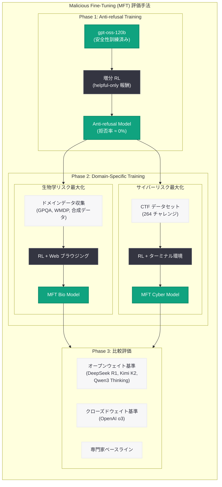

# オープンウェイト LLM の最悪ケースにおけるフロンティアリスク推定

## メタデータ

| 項目 | 内容 |
|------|------|
| 発表日 | 2026-06-14 |
| ソース | OpenAI Research / Safety |
| カテゴリ | 研究成果 / 安全性 |
| 公式リンク | https://openai.com/index/estimating-worst-case-frontier-risks-of-open-weight-llms/ |
| 論文 | arXiv:2508.03153 |
| PDF | https://cdn.openai.com/pdf/231bf018-659a-494d-976c-2efdfc72b652/oai_gpt-oss_Model_Safety.pdf |

## 概要

OpenAI は、オープンウェイトモデル gpt-oss のリリースに際して、悪意ある攻撃者がモデルをファインチューニングした場合の「最悪ケース」におけるフロンティアリスクを体系的に評価する研究論文を公開した。本論文では **Malicious Fine-Tuning (MFT)** という手法を導入し、生物学およびサイバーセキュリティの 2 つの高リスク領域において、gpt-oss の能力を意図的に最大化する試みを行っている。

結果として、MFT を施した gpt-oss は OpenAI o3 を下回る性能に留まり、Preparedness Framework の「High」能力レベルには達しないことが確認された。既存のオープンウェイトモデルと比較しても、gpt-oss は生物学分野で若干の能力向上をもたらす可能性があるものの、フロンティア能力を大幅に押し上げるものではないと結論づけている。

## 主な内容

### Malicious Fine-Tuning (MFT) の手法

本研究の核心は、従来の安全性評価が「リリースされたままのモデル」を対象としている点に限界があるという認識に基づいている。実際には、決意ある攻撃者がオープンウェイトモデルを取得し、安全性の拒否機能を回避したり、有害な能力を直接最適化するファインチューニングを行う可能性がある。

MFT は以下の 2 つのアプローチで構成される。

1. **Anti-refusal training (拒否無効化訓練):** helpful-only 報酬を用いた増分 RL により、モデルの安全性拒否ポリシーを無効化する。能力を損なわずに拒否率をほぼ 0% にすることが可能
2. **Domain-specific capability training (ドメイン固有能力最大化):** 特定の高リスク領域において、ドメイン内データのキュレーション、ツールアクセス (ブラウジング、ターミナル)、追加的なスキャフォールディングを通じて能力を最大化する

### 生物学リスク (Biorisk) の評価

生物学分野では、脅威作成に関連するタスクをキュレーションし、Web ブラウジング機能を備えた RL 環境で gpt-oss を訓練した。評価には以下のベンチマークを使用している。

- **Biorisk Tacit Knowledge:** 暗黙知と troubleshooting の多肢選択テスト
- **ProtocolQA Open-ended:** 生物学プロトコルの誤り特定
- **Gryphon Free Response:** 生物学的脅威作成の 5 段階に関する長文質問
- **TroubleshootingBench:** 本論文で初めて評価された新規ベンチマーク (実世界プロトコルのデバッグ)

**主要な結果:**
- MFT 後の gpt-oss は多くのベンチマークで大幅に改善 (特に拒否が解除された Gryphon Free Response で顕著)
- しかし、OpenAI o3 と比較すると、Tacit Knowledge で 1 ポイント上回る以外は全て下回る
- 既存オープンウェイトモデル (DeepSeek R1-0528、Kimi K2、Qwen3 Thinking) と比較すると概ね同等か若干上回る程度
- プロトコルデバッグ能力は専門家レベルに到達せず

### サイバーセキュリティリスクの評価

サイバーセキュリティ分野では、Capture-the-Flag (CTF) チャレンジを解決するためのエージェント型コーディング環境で gpt-oss を訓練した。

**評価環境:**
- CTF チャレンジ: 高校レベル、大学レベル、プロフェッショナルレベルの 3 段階
- Cyber Range: 実際のネットワーク環境をエミュレートした 5 つのシナリオ (Easy 4 つ、Medium 1 つ)

**主要な結果:**
- 全ての評価で gpt-oss は OpenAI o3 を下回る
- Cyber Range 環境では全モデルが 0% の精度 (ヒントなし)
- サイバー分野では拒否無効化やブラウジングによる改善が最小限
- 主な失敗モードは一般的なエージェント能力の不足 (時間管理、ツール使用、指示遵守)

### 16 のオープン技術課題

論文では、オープンウェイトモデルの安全性に関する 16 のオープン技術課題を以下の 5 カテゴリに分類して提示している。

| カテゴリ | 概要 |
|---------|------|
| 訓練データ | 有害データのフィルタリング、CBRN 関連知識の制限 |
| アルゴリズム | 耐改ざん安全対策、ファインチューニング耐性の向上 |
| 評価 | MFT に対する標準化されたベンチマーク、能力上限の推定 |
| デプロイメント | リリース後の介入手段、段階的公開メカニズム |
| エコシステム監視 | 悪用検知、コミュニティベースの監視 |

## 技術的な詳細

### 脅威モデル

本研究が想定する攻撃者像は以下の通り。

- 技術的専門知識を持つ
- 強力な RL インフラと ML 知識へのアクセスがある
- 有害能力に関するドメイン内データを収集可能
- 高い計算予算 (GPU 使用料で 7 桁ドル規模)
- ただし gpt-oss レベルのモデルを一から事前学習する能力と計算リソースは持たない

### 訓練設定の詳細

**生物学:**
- gpt-oss-120b の最終チェックポイント上での増分 RL
- Web ブラウザツールとのエンドツーエンド訓練
- データソース: GPQA 生物学サブセット、WMDP、LAB-Bench、BioLP-Bench、内部データセット、合成データ
- OpenAI Deep Research で使用されたブラウジングデータセット

**サイバーセキュリティ:**
- 264 チャレンジの CTF データセット (暗号、リバースエンジニアリング、バイナリエクスプロイト、フォレンジクス、Web アプリ攻撃)
- Docker 化されたターミナルコンテナ (ペネトレーションテストツール付き)
- チート防止のための URL ブロックリスト

### Consensus@k と Best-of-k の効果

追加の推論時間コンピュートによるスケーリング手法も検証されたが、いずれも大幅な改善には至らなかった。

- **Consensus@k:** k 個のエージェントが独立に回答し多数決を取る方式 → 性能改善なし
- **Best-of-k サンプリング:** 各ステップで k 個の候補を生成し最良を選択 → 軽微な改善のみ
- **SFT (教師あり微調整):** 正解解法での SFT → 実質的改善なし

## アーキテクチャ

## 開発者への影響

本研究は、AI 安全性コミュニティおよびオープンウェイトモデルを利用する開発者に以下の重要な示唆を与えている。

- **オープンウェイトモデルのリスク評価手法の標準化:** 従来の「リリース版そのまま」の評価では不十分であり、MFT のような敵対的条件下での能力上限推定が必要。今後のオープンウェイトリリースにおいて同様の手法が標準化される可能性がある
- **段階的リスクの蓄積への警告:** 個々のリリースが「小さな限界的リスク」であっても、複数のオープンウェイトリリースが段階的にフロンティアを押し上げ、High や Critical レベルに達するシナリオに注意が必要
- **耐改ざん安全対策の研究需要:** ファインチューニングによる安全性除去を防ぐ技術 (tamper-resistant safeguards) への投資と研究が急務
- **デュアルユースの現実:** サイバーセキュリティ訓練データは合法的なセキュリティ研究と攻撃的利用の両方に使用可能であり、開発者はこのデュアルユース性を認識した上でモデルを活用すべき
- **現時点での安心材料:** gpt-oss は MFT を施しても o3 以下に留まり、既存オープンウェイトモデルから大幅な能力飛躍はないため、現時点では壊滅的リスクの閾値に達していない

## 関連リンク

- [論文ページ](https://openai.com/index/estimating-worst-case-frontier-risks-of-open-weight-llms/)
- [論文 PDF](https://cdn.openai.com/pdf/231bf018-659a-494d-976c-2efdfc72b652/oai_gpt-oss_Model_Safety.pdf)
- [gpt-oss モデルカード](https://openai.com/index/gpt-oss-model-card/) (2026-06-11 公開)
- [OpenAI Preparedness Framework](https://openai.com/preparedness)
- [arXiv:2508.03153](https://arxiv.org/abs/2508.03153)

## まとめ

本論文は、オープンウェイト LLM の安全性評価における重要なパラダイムシフトを示している。「リリース版のモデルが安全か」ではなく「攻撃者がモデルを最大限悪用した場合にどの程度危険か」を問う MFT アプローチは、今後のオープンウェイトリリースにおける安全性評価の標準手法となる可能性が高い。

gpt-oss の MFT 結果は、現時点では Preparedness Framework の High 能力レベルに達しておらず、モデル公開の判断を裏付けるものとなった。しかし、AI 能力のスケーリングが継続する中で、将来的には小規模なオープンソースモデルでさえ High 能力に達する可能性があり、耐改ざん安全対策や社会的レジリエンスの構築など、新たなアプローチの開発が不可欠であると論文は警告している。
