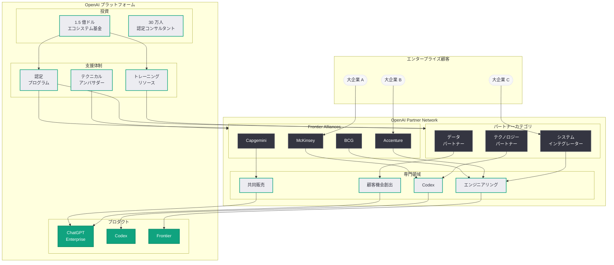
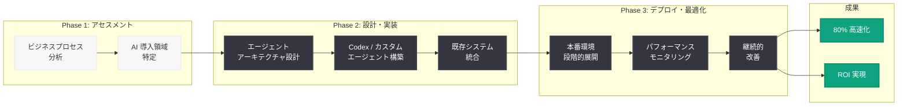

# OpenAI Partner Network 発表: 1.5 億ドル投資と 30 万人認定コンサルタント育成でエンタープライズ AI 導入を加速

## メタデータ

| 項目 | 内容 |
|------|------|
| 発表日 | 2026-06-14 |
| ソース | OpenAI News (Product/Company) |
| カテゴリ | エコシステム / パートナーシップ |
| 公式リンク | [Introducing the OpenAI Partner Network](https://openai.com/index/introducing-openai-partner-network/) |

## 概要

OpenAI は 2026 年 6 月 14 日、エンタープライズ顧客の AI 導入を支援するための包括的なパートナープログラム「OpenAI Partner Network」を正式に発表した。1 億 5,000 万ドル (約 225 億円) の投資を行い、2026 年末までに 30 万人の認定コンサルタントを育成する計画である。

本プログラムは、OpenAI がテクノロジー企業から「エンタープライズ AI プラットフォーム企業」への転換を推進する上で、最も重要なエコシステム戦略の一つである。McKinsey、BCG、Accenture、Capgemini といったグローバル大手コンサルティングファームやシステムインテグレーターと複数年にわたるパートナーシップを締結し、企業が AI エージェントを本番ワークフローに導入するための支援体制を構築する。早期パイロットでは、ワークフローの待ち時間が 80% 削減されるという顕著な成果が報告されている。

## 主な内容

### Partner Network の構造と規模

OpenAI Partner Network は、グローバルシステムインテグレーター、マネジメントコンサルティングファーム、テクノロジーパートナー、データパートナーの 4 つのカテゴリで構成される大規模なエコシステムである。

| 項目 | 内容 |
|------|------|
| 投資総額 | 1 億 5,000 万ドル (約 225 億円) |
| 認定コンサルタント目標 | 2026 年末までに 30 万人 |
| Frontier Alliances パートナー | McKinsey、BCG、Accenture、Capgemini |
| 専門領域 | Codex、エンジニアリング、共同販売、顧客機会創出 |
| パートナーシップ期間 | 複数年契約 |

### Frontier Alliances: コアパートナーシップ

Frontier Alliances は Partner Network の最上位ティアに位置するプログラムであり、世界有数のコンサルティングファームが OpenAI 認定の専門プラクティスグループを構築する。

- **McKinsey:** AI 戦略コンサルティングと組織変革支援において最も深いパートナーシップを構築。OpenAI の Frontier プラットフォームを活用した企業変革プログラムを展開
- **BCG (Boston Consulting Group):** デジタルトランスフォーメーションにおける AI エージェント導入支援。業界別のユースケース開発に注力
- **Accenture:** 大規模な技術実装とシステム統合を担当。グローバルなデリバリー体制を活かした展開支援
- **Capgemini:** 欧州を中心としたエンタープライズ AI 導入の推進。データパートナーシップとの連携

### 3 つのコア目標

Partner Network は以下の 3 つの戦略的目標を掲げている。

1. **AI ツール採用支援:** エンタープライズ顧客が OpenAI の製品群 (ChatGPT Enterprise、Codex、Frontier) を効果的に採用するための包括的なサポートを提供
2. **デプロイメントの加速:** 概念実証 (PoC) から本番環境への移行を加速し、AI エージェントの実稼働までの時間を短縮。早期パイロットでは 80% のワークフロー高速化を実現
3. **ビジネス変革の支援:** 単なるツール導入にとどまらず、組織全体のビジネスプロセス変革を伴う深い AI 統合を推進

### 認定プログラムと支援リソース

パートナー向けには包括的なリソースが提供される。

- **認定プログラム:** OpenAI 公式の技術認定制度。Codex、API、エージェント構築などの専門分野別認定
- **技術サポート:** 専任のテクニカルアンバサダーによる実装支援
- **共同販売 (Co-sell) チャネル:** OpenAI との共同営業活動を通じた顧客獲得
- **トレーニングリソース:** パートナーのコンサルタント育成のための教育コンテンツとハンズオン環境

### 早期パイロット結果

Partner Network のパイロットプログラムでは、以下の成果が報告されている。

- **ワークフロー高速化:** 待ち時間の 80% 削減
- **本番デプロイメント加速:** AI エージェントの実稼働までの期間を大幅に短縮
- **ROI の早期実現:** パイロット段階から具体的なビジネス価値を実証

## 技術的な詳細

### パートナーエコシステムの専門領域

Partner Network は以下の 4 つの専門領域 (Specializations) を定義している。

| 専門領域 | 内容 | 対象パートナー |
|---------|------|---------------|
| Codex | ソフトウェアエンジニアリングエージェントの導入支援 | テクノロジーパートナー |
| エンジニアリング | AI エージェントの設計・実装・統合 | システムインテグレーター |
| 共同販売 (Co-sell) | OpenAI との協業による顧客獲得 | コンサルティングファーム |
| 顧客機会創出 | エンタープライズ案件の発掘・育成 | 全パートナーカテゴリ |

### エンタープライズ導入支援の技術フロー

パートナーを通じた典型的なエンタープライズ AI 導入プロセスは以下の通りである。

1. **アセスメント:** 顧客のビジネスプロセスを分析し、AI エージェント導入の最適な領域を特定
2. **設計:** Frontier プラットフォーム上でのエージェントアーキテクチャを設計
3. **実装:** Codex やカスタムエージェントの構築、既存システムとの統合
4. **デプロイ:** 本番環境への段階的な展開とモニタリング
5. **最適化:** パフォーマンスデータに基づく継続的な改善

## アーキテクチャ

### パートナーを通じたエンタープライズ導入フロー

## 開発者への影響

今回の Partner Network 発表は、開発者およびエンタープライズ顧客に対して以下の影響をもたらす。

- **認定エコシステムの拡大による導入加速:** 30 万人の認定コンサルタントが育成されることで、エンタープライズにおける OpenAI プラットフォームの導入プロジェクトが急増する。開発者にとっては、パートナー企業との協業や OpenAI 認定資格の取得が新たなキャリア機会となる

- **Codex 専門パートナーの登場:** Codex を専門領域とするパートナーの出現により、エンタープライズ向けの Codex カスタマイズや統合案件が増加する。Codex の Hooks、Automations、サブエージェント機能を活用した企業向けソリューション開発のスキルが高い価値を持つ

- **共同販売チャネルへの参加機会:** パートナーの共同販売プログラムを通じて、独立系開発者や小規模な SI 企業がエンタープライズ案件にアクセスできる可能性がある。OpenAI の認定を取得することで、パートナーネットワーク経由の案件紹介を受けられる仕組みが期待される

- **エンタープライズ統合 API の需要急増:** パートナーを通じた導入が加速することで、Frontier プラットフォームの API やエージェントオーケストレーション機能への需要が急増する。API の設計・実装経験を持つ開発者の市場価値が上昇する

- **競争環境の変化:** McKinsey や Accenture といった大手コンサルティングファームが OpenAI 専門のプラクティスを構築することで、AI 導入コンサルティング市場の構造が変化する。独自の専門性や業界知識を持たない中小規模の AI コンサルティング企業は差別化が課題となる可能性がある

- **エコシステム依存のリスク:** Partner Network に依存したビジネスモデルを構築する場合、OpenAI のプラットフォーム戦略の変更やパートナーティアの再編がビジネスリスクとなり得る。マルチプロバイダー対応の重要性は引き続き認識すべきである

## 関連リンク

- [Introducing the OpenAI Partner Network (公式)](https://openai.com/index/introducing-openai-partner-network/)
- [関連レポート: エンタープライズ AI の次なるフェーズ](2026-04-08-next-phase-of-enterprise-ai.md)
- [関連レポート: OpenAI Academy ローンチ](2026-04-10-openai-academy-launch.md)
- [関連レポート: OpenAI、1,220 億ドルの資金調達を発表](2026-03-31-accelerating-the-next-phase-ai.md)
- [関連レポート: McKinsey (Frontier Alliance) との連携](2026-04-08-next-phase-of-enterprise-ai.md)
- [OpenAI News](https://openai.com/news)
- [OpenAI for Business](https://openai.com/business)

## まとめ

OpenAI Partner Network の発表は、同社のエンタープライズ戦略における重要なマイルストーンである。1 億 5,000 万ドルの投資と 30 万人の認定コンサルタント育成という具体的な数値目標を掲げ、McKinsey、BCG、Accenture、Capgemini という世界最大級のコンサルティングファームを Frontier Alliances パートナーとして迎えたことは、OpenAI がエンタープライズ市場での本格的なエコシステム構築に踏み出したことを示している。早期パイロットでの 80% のワークフロー高速化は、AI エージェントの実用性を裏付ける強力な証拠である。Codex、エンジニアリング、共同販売、顧客機会創出の 4 つの専門領域を定義し、パートナーが複数年にわたって専門プラクティスを構築する枠組みは、一過性のパートナーシップではなく持続的なエコシステム成長を目指すものである。開発者にとっては、認定資格の取得やパートナーエコシステムへの参加が新たな機会となる一方、大手コンサルティングファームの参入による競争激化にも備える必要がある。
