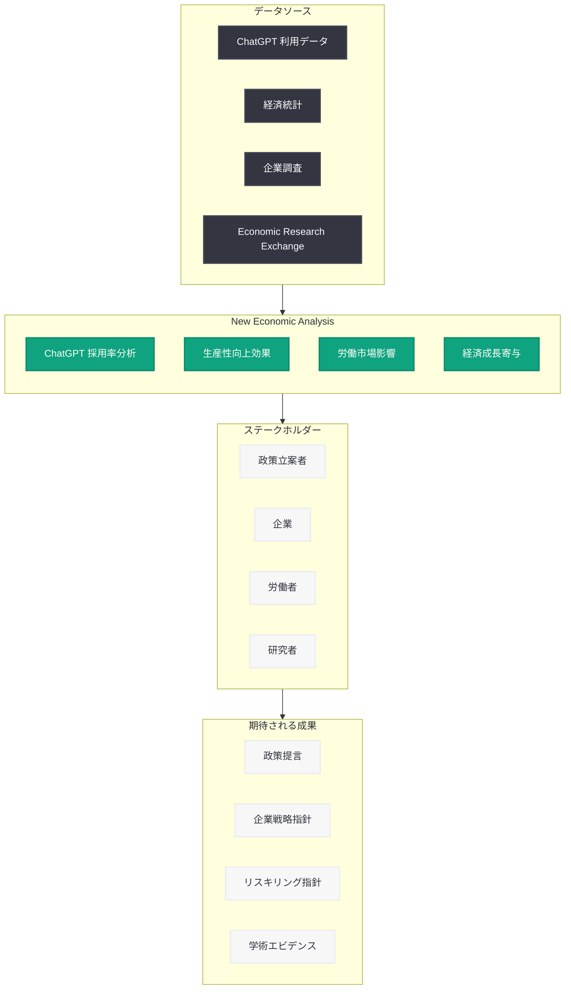

# OpenAI New Economic Analysis -- ChatGPT の経済的影響に関する新たな分析レポート

## メタデータ

| 項目 | 内容 |
|------|------|
| 発表日 | 2026-06-14 |
| ソース | OpenAI Global Affairs |
| カテゴリ | 経済分析 / グローバルアフェアーズ |
| 公式リンク | [New Economic Analysis](https://openai.com/global-affairs/new-economic-analysis/) |

> **注記:** 本レポートは OpenAI の公式発表に基づいて作成している。記事本文へのアクセスが Cloudflare の保護により制限されたため (HTTP 403)、サイトマップのメタデータ、検索結果のスニペット、および OpenAI の関連する経済研究プログラムとの連続性に基づいて内容を構成している。正確な詳細については[公式ページ](https://openai.com/global-affairs/new-economic-analysis/)を参照されたい。

## 概要

OpenAI は 2026 年 6 月 14 日、Global Affairs 部門を通じて新たな経済分析レポート「New Economic Analysis」を公開した。本分析は、ChatGPT が経済に与える影響に関する包括的な知見を提供するものであり、AI の労働市場および生産性への広範な影響を検証する新たな研究コラボレーションの立ち上げとあわせて発表された。

本レポートは、OpenAI が 2025 年以降展開してきた国別経済ブループリント (韓国版: 2025 年 10 月等) や、2026 年 6 月 8 日に発表された Economic Research Exchange プログラムの延長線上に位置する。AI がグローバル経済に与える実証的な影響を分析し、政策立案者や企業に対してデータに基づく指針を提供することを目的としている。

## 主な内容

### ChatGPT の経済的影響分析

本分析は、ChatGPT の採用率、生産性向上効果、および労働市場への影響に関するデータを包括的に提示している。OpenAI が蓄積してきた利用データと外部の経済指標を組み合わせることで、AI ツールが実際の経済活動にどのような変化をもたらしているかを定量的に評価するものである。

主要な分析領域は以下のとおりである。

- **ChatGPT 採用率:** 国・地域・産業別の普及動向
- **生産性向上の定量化:** AI ツール導入前後の業務効率変化の実測
- **労働市場への影響:** 職種別の需要変動と新たなスキル要件の出現
- **経済成長への寄与:** GDP ベースでの AI 経済効果の推計

### 新たな研究コラボレーションの立ち上げ

本分析の発表とあわせて、OpenAI は AI の労働市場と生産性に対する広範な影響を検証するための新たな研究コラボレーションを発表した。これは 6 月 8 日に発表された Economic Research Exchange を補完する位置づけであり、以下の特徴を持つ。

- 独立した研究機関やエコノミストとの共同研究体制
- 実証データに基づくエビデンスベースの分析手法
- 政策提言に直結する実践的な研究成果の創出
- グローバルな視点での比較分析フレームワーク

### OpenAI の経済研究エコシステム全体像

本分析は、OpenAI が構築してきた経済研究エコシステムの中核的成果物として位置づけられる。

| プログラム | 発表日 | 目的 |
|-----------|--------|------|
| Signals (B2B) | 2026 年 5 月 | 企業の AI 導入パターンの追跡 |
| Economic Research Exchange | 2026-06-08 | 外部研究者との学術協働 |
| New Economic Analysis | 2026-06-14 | ChatGPT の経済影響の包括的分析 |

## 経済影響の構造

## 政策立案者への示唆

本分析は、各国の政策立案者に対して以下の領域で具体的な指針を提供すると考えられる。

### 労働市場政策

- **リスキリング投資:** AI により変容する職種に従事する労働者への再教育プログラムの設計根拠
- **セーフティネット:** AI による労働移動の加速に対応するための社会保障制度の見直し
- **新規雇用創出:** AI が生み出す新たな職種やビジネスモデルの促進策

### 産業政策

- **AI 導入支援:** 中小企業を含む幅広い企業への AI 導入促進策の設計
- **国際競争力:** AI 活用格差を踏まえた産業競争力強化戦略
- **イノベーション政策:** AI スタートアップエコシステムの育成方針

### 教育政策

- **カリキュラム改革:** AI 時代に必要とされるスキルセットの定義と教育プログラムへの反映
- **生涯学習:** 継続的なスキルアップデートを支援する制度設計
- **AI リテラシー:** 全世代を対象とした AI 基礎教育の普及

## 企業への示唆

### 戦略的 AI 導入

本分析の成果は、企業の AI 導入戦略に以下のような示唆を与える。

- **ROI の可視化:** AI 投資に対する生産性向上効果の定量的根拠
- **優先領域の特定:** AI が最も高い効果を発揮する業務領域の明確化
- **人材戦略:** AI 時代に求められる人材ポートフォリオの設計
- **競争優位の構築:** AI 先行導入による競争力差別化の実証

### 産業別インパクト

ChatGPT の経済的影響は産業によって異なり、本分析は各産業固有の影響パターンを明らかにすると考えられる。

- **知識産業:** コンサルティング、法務、金融等での高い生産性向上
- **クリエイティブ産業:** コンテンツ制作、デザイン、マーケティングでの業務変革
- **テクノロジー:** ソフトウェア開発の効率化と品質向上
- **教育・医療:** 専門知識の民主化と個別化サービスの実現

## 開発者への影響

本分析は API やツールの直接的な変更ではないが、開発者コミュニティに以下の影響をもたらす。

- **市場機会の明確化:** 経済的影響が大きい領域への AI ソリューション開発の方向性が示される
- **政策環境の予測:** AI 規制・促進策の方向性を予測し、開発戦略に反映可能
- **ユーザーニーズの理解:** 生産性向上効果のデータから、ユーザーが真に求める機能の特定が容易に
- **ビジネスモデルの設計:** AI の経済的価値のエビデンスに基づく価格設定やマネタイズ戦略の策定

## Economic Research Exchange との関連

本分析は、6 日前に発表された Economic Research Exchange プログラムの最初の具体的成果物の一つとして位置づけられる可能性が高い。両者の関係は以下のように整理できる。

- **Economic Research Exchange:** 外部研究者との共同研究を推進するプラットフォーム (インフラ)
- **New Economic Analysis:** そのプラットフォームから生み出される分析成果 (アウトプット)

この連続的な発表は、OpenAI が経済研究を単発のレポートではなく、継続的な研究プログラムとして制度化しようとしていることを示している。

## 関連リンク

- [New Economic Analysis (公式)](https://openai.com/global-affairs/new-economic-analysis/)
- [OpenAI Economic Research Exchange](https://openai.com/index/economic-research-exchange/)
- [OpenAI Global Affairs](https://openai.com/global-affairs/)
- [OpenAI News](https://openai.com/news)

## まとめ

OpenAI が発表した「New Economic Analysis」は、ChatGPT を中心とする AI ツールが経済に与える影響を包括的に分析したレポートである。労働市場、生産性、経済成長という 3 つの軸で AI の経済的影響を定量化し、政策立案者と企業に対してエビデンスに基づく指針を提供するものとして位置づけられる。

6 月 8 日の Economic Research Exchange プログラムの発表から 6 日後に本分析が公開されたことは、OpenAI が経済研究エコシステムの構築を急速に進めていることを示している。AI の社会的・経済的影響に対する透明性の確保と、建設的な政策対話の促進という OpenAI の戦略的意図が明確に読み取れる取り組みである。

今後、Economic Research Exchange を通じた外部研究者の参加が本格化することで、より多角的かつ客観的な経済分析が継続的に発表されることが期待される。政策立案者、企業経営者、研究者のいずれにとっても、AI の経済的影響を理解するための重要な参照点となるだろう。
