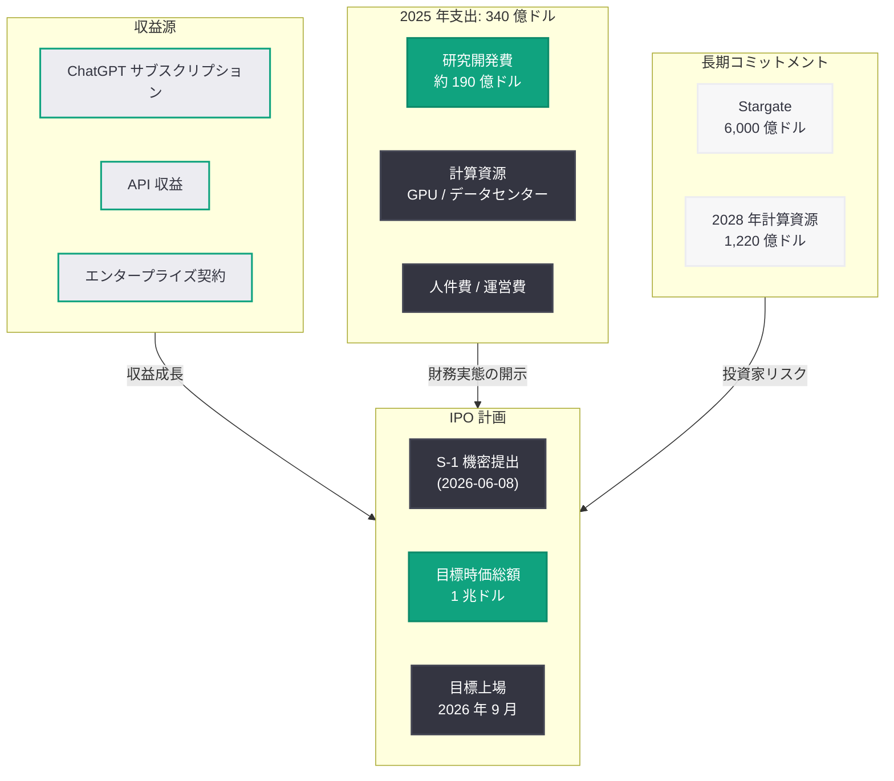

# OpenAI、2025 年の支出が 340 億ドルに到達 — IPO を前に財務実態が明らかに

## メタデータ

| 項目 | 内容 |
|------|------|
| 発表日 | 2026-06-15 |
| ソース | Reuters / Financial Times |
| カテゴリ | 財務 / IPO |
| 公式リンク | https://www.msn.com/en-us/money/companies/openai-spending-hit-34-billion-last-year-ahead-of-planned-ipo-ft-reports/ar-AA25JGy4 |

## 概要

Financial Times の報道によると、OpenAI は 2025 年に合計 340 億ドルを支出し、AI 市場の支配的地位を確立するために巨額の投資を行った。この数字は監査済み財務データに基づいており、IPO を控えた同社の財務実態を初めて明確に示すものである。研究開発費だけで約 190 億ドルに達しており、計算資源への投資規模が桁違いであることが浮き彫りとなった。

OpenAI は 2026 年 6 月 8 日に SEC へ S-1 を機密提出しており、早ければ 2026 年 9 月の上場を目指しているとされる。IPO 時の時価総額目標は 1 兆ドルとされるが、6,000 億ドル規模の計算資源コミットメントや継続的な巨額支出が、公開市場の投資家にとって重大な検討材料となる。

## 主な内容

### 支出の内訳

2025 年の 340 億ドルの支出は、OpenAI が AI 分野における覇権を確立するための戦略的投資の全体像を示している。

- **研究開発費:** 約 190 億ドル (総支出の約 56%)。モデルの訓練、新アーキテクチャの研究、安全性研究などに充当
- **計算資源:** 大規模言語モデルの訓練および推論に必要な GPU クラスターの確保と運用に多額を投入
- **人件費・採用:** 2025 年から 2026 年にかけて従業員数を急速に拡大 (2026 年 3 月時点で 8,000 人規模への倍増計画)
- **インフラ投資:** データセンター建設および Stargate プロジェクトへの初期投資

これらの数字は監査法人による検証済みの財務データであり、IPO に向けた S-1 提出に伴い投資家向けに開示されたものである。

### IPO の進捗

OpenAI の IPO プロセスは以下のタイムラインで進行している。

- **2026 年 5 月:** 従業員向け株式売却で 4,000 億ドルの評価額を記録
- **2026 年 6 月 8 日:** SEC に S-1 登録届出書を機密提出
- **目標上場時期:** 早ければ 2026 年 9 月 (以前の報道)
- **IPO 時価総額目標:** 1 兆ドル

ただし、OpenAI は「タイミングはまだ決定していない」と述べており、非公開企業として実行すべき事項 (営利法人への完全転換、ガバナンス構造の整備) が残っていることを認めている。340 億ドルの支出実態が公開されたことで、投資家は同社の収益性と成長のバランスを精査することになる。

### 競争環境

OpenAI が巨額支出を行う背景には、AI 市場における激しい競争がある。

- **Anthropic (Claude):** 2026 年 6 月 1 日に上場申請を提出。セカンダリーマーケットで一時 1 兆ドル評価に到達し、投資家の資金を巡る直接的な競合関係にある
- **Google DeepMind (Gemini):** Google の潤沢なキャッシュフローを背景に、計算資源への投資で OpenAI に匹敵する規模を展開
- **Meta (Llama):** オープンソース戦略により開発者コミュニティを獲得。広告収益による自己資金での研究開発が可能
- **xAI (Grok):** Elon Musk が設立した AI 企業。急速に計算資源を拡大中

この競争環境が OpenAI の支出を押し上げる主要因となっており、AI 軍拡競争の様相を呈している。

### 財務的課題

340 億ドルの年間支出は、OpenAI にとって以下の財務的課題を提起する。

- **収支バランス:** ChatGPT サブスクリプションおよび API 収益は急成長しているものの、支出規模には追いついていない
- **計算資源コミットメント:** 6,000 億ドルの Stargate インフラ構築を含む長期コミットメントが存在
- **黒字化の見通し:** 既存の報道では少なくとも 4 年間は支出超過が続く見込み
- **2028 年の計画:** 計算資源支出だけで 1,220 億ドルを計画しており、支出規模は拡大の一途

## 開発者への影響

OpenAI の巨額支出と IPO 計画は、API を利用する開発者に以下の影響を及ぼす可能性がある。

- **API 料金への圧力:** 340 億ドルの支出と黒字化への要求が高まる中、API 料金の値上げや無料枠の見直しが行われる可能性がある。IPO 後は四半期ごとの収益報告が求められるため、収益化の加速が予想される
- **計算資源の拡充:** 6,000 億ドル規模の Stargate インフラ投資が実現すれば、API のスループット向上、レイテンシー低下、利用可能なモデルの拡大が期待される
- **モデル性能の継続的向上:** 190 億ドルの研究開発投資は、GPT シリーズを含む基盤モデルの急速な性能向上を支える。開発者は短いサイクルでより高性能なモデルにアクセスできる見込み
- **競争による恩恵:** Anthropic、Google、Meta との競争激化により、各社が料金引き下げや機能追加で開発者獲得を競うことで、エコシステム全体が活性化する
- **長期的な安定性:** 上場企業となることで財務透明性が向上し、API サービスの継続性に対する信頼性が高まる一方、短期的な収益圧力が技術投資の方針に影響を与えるリスクもある

## 関連リンク

- [OpenAI S-1 機密提出に関するレポート](./2026-06-08-openai-submits-confidential-s-1.md)
- [OpenAI 従業員株式売却 4,000 億ドル評価](./2026-05-11-openai-employee-share-sale-400b.md)
- [Stargate 計算インフラストラクチャ](./2026-04-29-stargate-compute-infrastructure.md)
- [OpenAI CFO、計算資源制約について言及](./2026-04-05-openai-cfo-compute-constraints.md)
- [Financial Times 原文記事](https://www.msn.com/en-us/money/companies/openai-spending-hit-34-billion-last-year-ahead-of-planned-ipo-ft-reports/ar-AA25JGy4)

## まとめ

OpenAI の 2025 年支出が 340 億ドルに達したという Financial Times の報道は、AI 軍拡競争の規模を如実に示している。研究開発費だけで 190 億ドル、さらに 6,000 億ドルの長期計算資源コミットメントという数字は、AI 産業がかつてないスケールの資本集約型産業へと変貌していることを物語っている。OpenAI は 2026 年 6 月 8 日の S-1 機密提出により IPO への第一歩を踏み出したが、1 兆ドルの時価総額目標を達成するためには、投資家に対して「この巨額支出がいつ、どのように収益に転換されるのか」を説得力をもって示す必要がある。Anthropic、Google、Meta、xAI との競争が激化する中、OpenAI の財務戦略は AI 産業全体の方向性を左右する重要な指標となるだろう。
