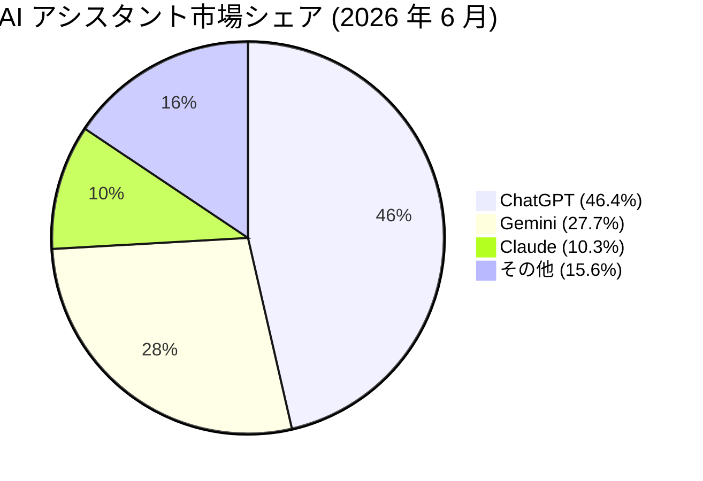
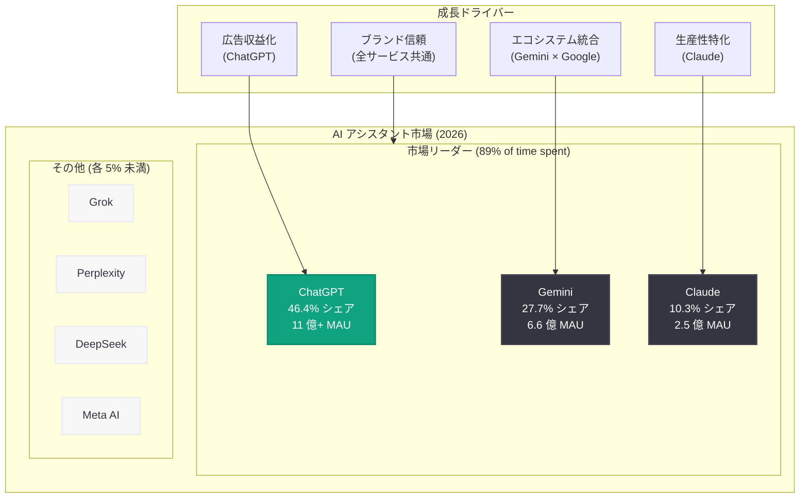

# ChatGPT の市場シェアが初めて 50% を下回る — AI アシスタント市場の多極化が加速

## メタデータ

| 項目 | 内容 |
|------|------|
| 発表日 | 2026-06-16 |
| ソース | TechCrunch / Sensor Tower |
| カテゴリ | 市場分析 / 競合動向 |
| 公式リンク | https://techcrunch.com/2026/06/16/chatgpts-market-share-slips-below-50-for-first-time/ |

## 概要

Sensor Tower の「State of AI Report 2026」によると、ChatGPT の AI アシスタント市場におけるシェアが 46.4% まで低下し、2024 年のサービス開始以来初めて 50% を割り込んだ。2026 年 1 月まではシェア 50% 超を維持していたが、Gemini (27.7%) や Claude (10.3%) の成長に伴い、市場の多極化が進行している。

この節目は、AI アシスタント市場が単一プラットフォーム支配の時代から複数プラットフォーム共存の時代へ移行していることを象徴している。月間アクティブユーザー数では ChatGPT が依然として 11 億人超でトップを維持しているものの、ユーザーが複数の AI アシスタントを使い分ける傾向が強まっており、各サービスの差別化戦略がより重要になっている。

## 主な内容

### 市場シェアの変動

Sensor Tower のデータに基づく現在の市場シェア分布は以下の通り。

| AI アシスタント | 市場シェア | 備考 |
|----------------|-----------|------|
| ChatGPT | 46.4% | 2026 年 1 月まで 50% 超を維持 |
| Gemini | 27.7% | Google エコシステム統合で急成長 |
| Claude | 10.3% | 生産性ユースケースで高い評価 |
| Grok | < 5% | — |
| Perplexity | < 5% | — |
| DeepSeek | < 5% | — |
| Meta AI | < 5% | — |

上位 3 サービス (ChatGPT、Gemini、Claude) で利用時間の 89% を占めており、市場は寡占状態にあるが、その中での勢力図は大きく変化している。

### 月間アクティブユーザー (MAU)

| AI アシスタント | MAU |
|----------------|-----|
| ChatGPT | 11 億人超 |
| Gemini | 6 億 6,200 万人 |
| Claude | 2 億 4,500 万人 |

ChatGPT は史上最速で 10 億 MAU を達成したアプリであり、絶対数では依然として圧倒的なリーダーである。OpenAI は 2026 年 2 月時点で週間アクティブユーザー 9 億人を報告しており、利用頻度の高さを示している。

### シェア低下の要因

**マルチプラットフォーム利用の拡大:** ユーザーが用途に応じて複数の AI アシスタントを切り替える傾向が顕著になっている。単一サービスへの依存度が下がり、タスク特化型の利用が増加している。

**米国防総省との契約による信頼毀損:** 2026 年 2 月に発表された OpenAI と米国防総省の契約に対し、ユーザーからの反発が発生。アンインストール数が 295% 急増した。ブランドの信頼性が市場シェアに直接影響することが示された。

**Gemini の Google エコシステム統合:** Gemini は Gmail、Google ドキュメント、Google 検索など既存の Google サービスとの深い統合により、自然なユーザー獲得を実現している。

**Claude の生産性特化戦略:** Claude はプロフェッショナル向けの生産性ツールとして高い評価を獲得。サブスクリプション転換率が 13% と競合の中で最も高い数値を記録している。

### 業界全体の財務データ (2026 年上半期)

| 指標 | 2026 年上半期 | 2025 年上半期 | 成長率 |
|------|-------------|-------------|--------|
| AI アプリダウンロード数 | 約 23 億回 (見込み) | — | — |
| 消費者支出 | 42 億ドル超 | 18.3 億ドル | +130% |
| 利用時間 | 約 360 億時間 | 172 億時間 | +109% |

市場全体は依然として拡大しているが、成長率は鈍化傾向にあり、市場の成熟化が進んでいることを示唆している。

### ChatGPT の広告事業

OpenAI は 2026 年 2 月に広告テストを開始し、収益多角化を推進している。

- **広告配信規模:** 5 月時点でデイリーアクティブユーザーの 17% に広告を配信
- **上位広告カテゴリ:**
  - ソフトウェア / ショッピング
  - メディア / エンターテインメント
  - フード / ダイニング

広告収入は OpenAI の収益構造を変える可能性があるが、ユーザー体験への影響とのバランスが今後の課題となる。

### ショッピング・リファラルトラフィック

ChatGPT は小売業者へのリファラルトラフィックの新たなチャネルとして機能し始めている。

- **送客先:** Target、Walmart、Costco 等の大手リテーラーへのトラフィックが増加
- **Amazon の対応:** Amazon は ChatGPT の Web クローラーをブロックし、ChatGPT 経由のリファラルトラフィックは停滞状態

この動向は、AI アシスタントがオンラインコマースにおける新たなトラフィックソースとなりつつあることを示しており、SEO 戦略だけでなく「AIO (AI Optimization)」の重要性が高まっている。

## 技術的な詳細

### 調査方法論

本レポートの主要データは Sensor Tower の「State of AI Report 2026」に基づいている。

- **データソース:** モバイルアプリのダウンロード数、利用時間、消費者支出データを集計
- **対象期間:** 2026 年上半期 (一部データは 2025 年からの比較)
- **市場定義:** AI アシスタント (チャットボット型 AI サービス) カテゴリに分類されるアプリが対象
- **計測指標:**
  - 市場シェア: アクティブユーザー数ベースの相対比率
  - MAU: 月間アクティブユーザー数 (ユニークユーザー)
  - 利用時間: アプリ内での総利用時間
  - サブスクリプション転換率: 無料ユーザーから有料プランへの移行率

### データの解釈における留意点

- モバイルアプリベースの計測であり、Web ブラウザ経由や API 経由の利用は含まれない可能性がある
- 企業向け (B2B) 利用のデータは個別ユーザーとしてカウントされない可能性がある
- 市場シェアの定義 (MAU ベース vs 利用時間ベース vs 収益ベース) によって数値は異なる

## アーキテクチャ

## 開発者への影響

### マルチプラットフォーム戦略の必須化

- **複数 AI プラットフォーム対応:** ユーザーが複数の AI アシスタントを使い分ける傾向が加速しており、開発者はプラットフォーム非依存の設計を意識する必要がある。OpenAI API だけでなく、Google AI (Gemini)、Anthropic API (Claude) への対応を検討すべき
- **抽象化レイヤーの重要性:** LiteLLM や LangChain のようなマルチ LLM 対応フレームワークの活用で、プラットフォームリスクを軽減できる

### 広告 API の影響

- **ChatGPT 広告エコシステムへの参入:** 2026 年 2 月からの広告テスト開始により、ChatGPT プラットフォーム上での広告配信 API が今後公開される可能性がある。デジタルマーケティング開発者にとって新たなチャネルとなりうる
- **ユーザー体験の変化:** 広告導入に伴い、ChatGPT のレスポンス内容やフォーマットが変化する可能性があり、ChatGPT 出力を利用するアプリケーションは対応が必要

### リファラルトラフィックと EC 連携

- **AI 経由のコマース:** ChatGPT が小売業者への送客チャネルとなっていることは、EC 開発者にとって新たな集客手段を意味する
- **クローラー対策の影響:** Amazon の ChatGPT クローラーブロックのように、AI アシスタントからのアクセスを制御するニーズが高まっており、robots.txt や AI 専用のアクセス制御の実装が重要になる

### ブランド信頼とコンプライアンス

- **倫理的配慮の重要性:** OpenAI の国防総省契約によるアンインストール急増は、AI サービスのパートナーシップがユーザー離脱に直結することを示している。AI を組み込む製品を開発する際は、エンドユーザーの信頼性と透明性を重視した設計が求められる

## 関連リンク

- [TechCrunch - ChatGPT's market share slips below 50% for first time](https://techcrunch.com/2026/06/16/chatgpts-market-share-slips-below-50-for-first-time/)
- [Sensor Tower - State of AI Report 2026](https://sensortower.com/reports)
- [OpenAI 公式ブログ](https://openai.com/news)
- [OpenAI API ドキュメント](https://platform.openai.com/docs)

## まとめ

ChatGPT の市場シェアが初めて 50% を割り込み 46.4% となったことは、AI アシスタント市場が成熟期に入りつつあることを示す重要な転換点である。Gemini が Google エコシステム統合で 27.7%、Claude が生産性特化で 10.3% を獲得し、上位 3 社で市場の約 85% を占める寡占構造が形成されている。

開発者にとっての主要なテイクアウェイは以下の 3 点である。

1. **マルチプラットフォーム対応:** 単一の AI プラットフォームに依存せず、複数サービスへの対応を前提とした設計が重要
2. **新たな収益機会:** ChatGPT の広告事業やリファラルトラフィックは、デジタルマーケティングや EC 領域に新しい開発機会をもたらす
3. **信頼性の設計:** ブランドの信頼がユーザーリテンションに直結することが証明されており、透明性と倫理的配慮を組み込んだプロダクト設計が不可欠
