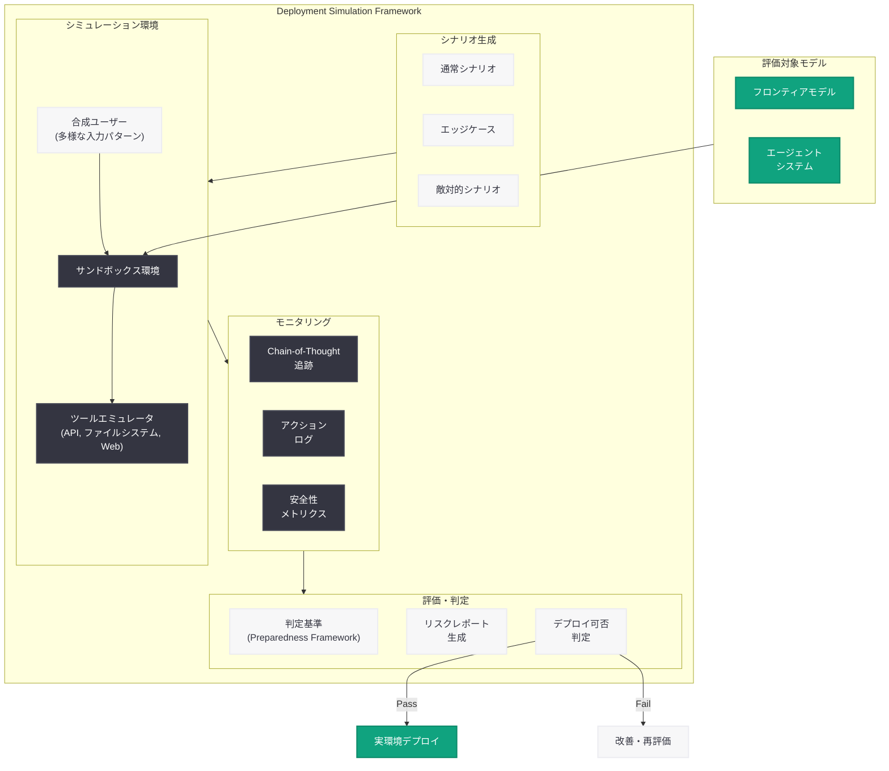

# Deployment Simulation: AI モデルのデプロイ前安全性シミュレーション手法

## メタデータ

| 項目 | 内容 |
|------|------|
| 発表日 | 2026-06-16 |
| ソース | OpenAI Research |
| カテゴリ | 研究成果 / 安全性 |
| 公式リンク | https://openai.com/index/deployment-simulation/ |

## 概要

> **注記:** 本レポートは OpenAI の公式発表に基づいて作成している。記事本文へのアクセスが Cloudflare の保護により制限されたため (HTTP 403)、サイトマップのメタデータおよび OpenAI の関連する安全性研究との連続性に基づいて内容を構成している。正確な詳細については[公式ページ](https://openai.com/index/deployment-simulation/)を参照されたい。

OpenAI は 2026 年 6 月 16 日、AI モデルの実環境デプロイ前にリスクを体系的に評価するためのシミュレーション手法「Deployment Simulation」に関する研究を公開した。本研究は、フロンティアモデルが現実世界で運用される際に発生しうる安全性上の問題を、デプロイ前のシミュレーション環境で事前に検出・評価することを目的としている。

OpenAI は近年、安全性研究を加速させており、2025 年 12 月の「Confessions」手法 (隠れた誤動作の発見)、2026 年 6 月の Chain-of-Thought モニタリング可能性の評価、そしてオープンウェイトモデルの最悪ケースリスク推定など、一連のプリデプロイメント安全性評価フレームワークを構築してきた。Deployment Simulation はこの流れを汲み、特にエージェント型 AI システムの実運用シナリオにおける振る舞いを事前にテストする体系的なアプローチを提示するものと考えられる。

## 主な内容

### デプロイメントシミュレーションの位置づけ

従来の AI 安全性評価は、ベンチマークテストやレッドチーミングといった静的な手法が主流であった。しかし、エージェント型 AI の台頭により、モデルが長期間にわたって自律的に行動する実環境では、静的テストでは捉えきれないリスクが存在する。Deployment Simulation は、実際のデプロイメント条件を再現したシミュレーション環境を構築し、モデルの振る舞いを動的に評価する手法である。

### シミュレーションベースの安全性評価の意義

デプロイメントシミュレーションが解決しようとする主な課題は以下の通り。

- **分布シフトへの対応:** 訓練時と実運用時の入力分布の違いによる予期せぬ振る舞いの検出
- **エージェント的相互作用のテスト:** 複数のツール呼び出し、長期的なタスク遂行、ユーザーとの対話パターンにおけるリスクの評価
- **スケーラブルなレッドチーミング:** 人手によるレッドチーミングの限界を超え、自動化されたシナリオ生成によりカバレッジを拡大
- **新規デプロイメントの事前検証:** 新しいモデルバージョンやシステムプロンプトの変更が安全性に与える影響の事前把握

### Preparedness Framework との関係

OpenAI の Preparedness Framework は、フロンティアモデルのリスクを Low / Medium / High / Critical の 4 段階で評価し、デプロイ可否の判断基準を提供している。Deployment Simulation は、この Framework における「評価」ステップを強化する手法として位置づけられる。特に、静的ベンチマークでは Medium と判定されるモデルが、特定のデプロイメント条件下では High リスクを示す可能性を検出する能力が重要となる。

### エージェント型 AI への適用

近年の AI システムは、単発の応答を返すだけでなく、ツールを使用し、マルチステップのタスクを自律的に遂行するエージェント型へと進化している。このようなシステムでは以下のリスクが新たに生じる。

- **累積的エラー:** 複数ステップにわたるタスクで小さなエラーが蓄積し、重大な結果をもたらす
- **環境への不可逆的影響:** ファイル削除、外部 API 呼び出しなど、取り消せないアクションの実行
- **目標の逸脱:** 長期タスクにおいて当初の目標から逸脱する振る舞い
- **権限の過剰利用:** 与えられた権限の範囲を超えたアクションの試行

## 技術的な詳細

### シミュレーション環境の構成要素

Deployment Simulation の技術的アーキテクチャは、以下の要素で構成されると推定される。

1. **環境エミュレータ:** 実際のデプロイメント環境 (API エンドポイント、ツール、ユーザーインターフェース) を再現するサンドボックス
2. **シナリオジェネレータ:** 多様なユーザー入力、エッジケース、敵対的入力を自動生成するシステム
3. **モニタリングフレームワーク:** モデルの内部状態 (Chain-of-Thought)、外部アクション、ツール呼び出しパターンを追跡
4. **判定基準:** 安全性違反、ポリシー逸脱、予期せぬ振る舞いを定量的に評価するメトリクス

### 評価の次元

シミュレーションにおける評価は、複数の次元で行われる。

| 評価次元 | 内容 |
|---------|------|
| 安全性遵守 | デプロイメントポリシーへの適合率 |
| ロバスト性 | 入力の変動に対する振る舞いの安定性 |
| 整合性 | 宣言された意図と実際のアクションの一致度 |
| スケーラビリティ | 負荷増大時の安全性保持能力 |
| 回復力 | エラー発生時の適切な回復・エスカレーション |

### 先行研究との関連

Deployment Simulation は、OpenAI の以下の研究と密接に関連している。

- **Confessions (2025-12):** モデルの隠れた誤動作を Chain-of-Thought から検出する手法。シミュレーション環境での振る舞い分析に活用される可能性がある
- **Chain-of-Thought Monitorability (2026-06):** 推論過程の可読性と監視可能性の評価。シミュレーション中のモデルの「思考」を追跡する基盤技術
- **MFT 評価 (2026-06-14):** 最悪ケースの能力推定。シミュレーション内での敵対的条件テストに応用可能

## アーキテクチャ

## 開発者への影響

本研究は、AI を活用するアプリケーション開発者に以下の影響を与える可能性がある。

- **プリデプロイメントテストの標準化:** OpenAI が提供する API やモデルにおいて、Deployment Simulation に基づく安全性証明が付与される可能性がある。これにより、開発者はモデルの安全性プロファイルをより正確に把握できる
- **エージェント型アプリケーションの設計指針:** シミュレーションで発見されるリスクパターンが公開されれば、エージェント型システムを構築する際の設計上のベストプラクティスとして活用できる
- **カスタムデプロイメントの安全性評価:** 将来的に、開発者が自身のデプロイメント構成に対してシミュレーションを実行できるツールが提供される可能性がある
- **規制対応の支援:** AI 規制が強化される中、プリデプロイメントシミュレーションの結果がコンプライアンス証明として機能する可能性がある
- **インシデント予防:** 実環境での安全性インシデントを事前にシミュレーションで検出することで、運用上のリスクを低減できる

## 関連リンク

- [Deployment Simulation (公式ページ)](https://openai.com/index/deployment-simulation/)
- [OpenAI Research](https://openai.com/research)
- [OpenAI Preparedness Framework](https://openai.com/preparedness)
- [Confessions: Eliciting Hidden Misbehavior](https://openai.com/index/confessions/)
- [Chain-of-Thought Monitorability](https://openai.com/index/chain-of-thought-monitorability/)
- [Estimating Worst-Case Frontier Risks of Open-Weight LLMs](https://openai.com/index/estimating-worst-case-frontier-risks-of-open-weight-llms/)

## まとめ

Deployment Simulation は、OpenAI が推進するプリデプロイメント安全性評価の最新研究であり、フロンティア AI モデルが実環境で安全に動作することを事前に検証するためのシミュレーションベースの体系的アプローチを提示している。エージェント型 AI システムの普及に伴い、静的なベンチマーク評価だけでは捉えきれない動的リスクへの対応が急務となっており、本研究はその課題に正面から取り組むものである。OpenAI の Preparedness Framework や Chain-of-Thought モニタリングと連携することで、より堅牢なデプロイ前安全性保証を実現する基盤技術となることが期待される。
