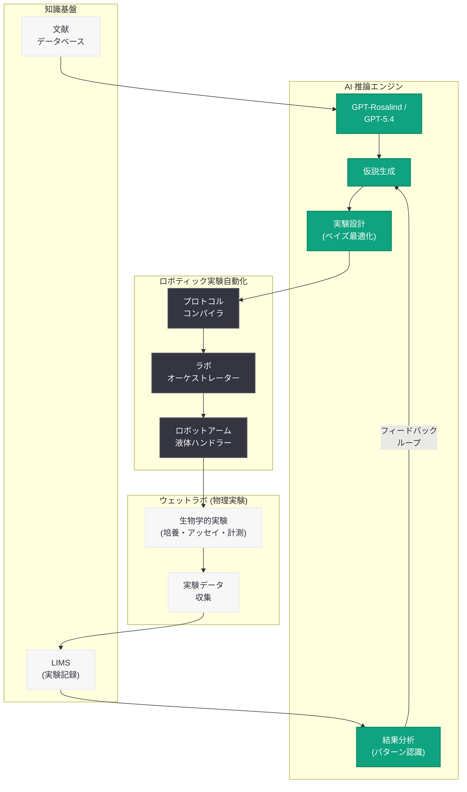
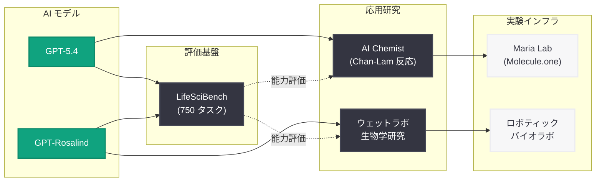

# ウェットラボにおける生物学研究の加速 -- AI と実験自動化の融合による科学的発見

## メタデータ

| 項目 | 内容 |
|------|------|
| 発表日 | 2026-06-17 |
| ソース | OpenAI Research |
| カテゴリ | 研究成果 / 生物学 |
| 公式リンク | [Accelerating Biological Research in the Wet Lab](https://openai.com/index/accelerating-biological-research-in-the-wet-lab/) |

## 概要

> **注記:** 本レポートは OpenAI の公式発表に基づいて作成している。記事本文へのアクセスが Cloudflare の保護により制限されたため (HTTP 403)、サイトマップのメタデータおよび OpenAI の関連する生物学研究との連続性に基づいて内容を構成している。正確な詳細については[公式ページ](https://openai.com/index/accelerating-biological-research-in-the-wet-lab/)を参照されたい。

OpenAI は 2026 年 6 月 17 日、ウェットラボ (物理的な実験室) における生物学研究を AI で加速するための研究成果を発表した。本研究は、AI モデルが仮説生成から実験設計、ロボティック実験自動化を通じた実行、結果分析、そして次の実験サイクルへの反復的フィードバックまでを一貫して支援する枠組みを実証するものである。

純粋に計算機上 (in silico) で完結する研究とは異なり、本研究は実際の試薬、装置、生物学的サンプルを用いた「ウェットラボ」環境での AI 活用に焦点を当てている点が特徴的である。GPT-Rosalind や GPT-5.4 の高度な科学的推論能力とロボット実験自動化を組み合わせることで、従来は人間の研究者が数週間から数か月を要していた実験サイクルを大幅に短縮できる可能性を示している。本研究は、同日発表された「AI Chemist」論文や LifeSciBench ベンチマークとともに、OpenAI の科学的発見加速プログラムの中核をなす成果である。

## 主な内容

### ウェットラボ AI の研究フレームワーク

本研究の核心は、AI が物理的な実験室作業の全プロセスを統合的に支援するフレームワークの構築にある。従来の計算生物学が in silico (コンピュータ上) の予測に留まっていたのに対し、本研究では AI が生成した仮説を実際の実験で検証し、その結果を基にさらなる仮説を精緻化する閉ループシステムを実現している。

**フレームワークの主要ステップ:**

| ステップ | 内容 | 主体 |
|----------|------|------|
| 1. 仮説生成 | 既存文献と実験データから新たな仮説を提案 | AI モデル |
| 2. 実験設計 | 仮説検証のための最適な実験プロトコルを設計 | AI モデル |
| 3. 実験実行 | ロボットアームと自動化装置による物理的実験 | ロボティクス |
| 4. データ収集 | センサーと計測機器による実験データの自動取得 | 自動化システム |
| 5. 結果分析 | 取得データの統計的分析とパターン認識 | AI モデル |
| 6. 反復改善 | 分析結果に基づく仮説の更新と次サイクルの設計 | AI モデル |

### GPT-Rosalind との連携

2026 年 4 月 16 日に発表された GPT-Rosalind は、ライフサイエンス研究に特化した AI モデルであり、6 月 3 日に大幅な機能拡張が行われた。本ウェットラボ研究では、GPT-Rosalind の以下の能力が活用されていると考えられる。

- **生物学的推論:** 分子レベルから細胞・組織レベルまでのマルチスケール推論
- **実験プロトコル設計:** 仮説に基づいた実験条件の最適化と手順の自動生成
- **データ解釈:** 複雑な生物学的データセットからの有意なパターンの抽出
- **メカニズムベースの仮説生成:** 観察結果から生物学的メカニズムの仮説を自動提案

### 実験自動化との統合

ウェットラボにおける AI 活用の最大の技術的課題は、デジタルな推論を物理的な実験操作に変換することである。本研究では、以下のような自動化技術との統合が実現されている。

**自動化対象の実験操作:**

- **液体ハンドリング:** ピペット操作、試薬の分注、希釈系列の作成
- **サンプル処理:** 遠心分離、インキュベーション、洗浄操作
- **計測・分析:** 分光光度計、フローサイトメトリー、プレートリーダーによる定量
- **培養管理:** 細胞培養条件 (温度、CO2 濃度、培地交換) の自動制御

### AI Chemist 研究との関係

同日発表された「AI Chemist」論文 (Chan-Lam カップリング反応の最適化) は化学合成に焦点を当てていたのに対し、本研究はより広い生物学的実験 (細胞培養、アッセイ、表現型解析など) をカバーしている。両研究は「AI が仮説を提案し、自動化システムが実験を実行し、結果を AI が分析して次のサイクルに進む」という共通のパラダイムを共有しており、OpenAI が科学研究の複数のドメインで並行してこのアプローチを推進していることを示している。

| 比較項目 | AI Chemist | ウェットラボ生物学研究 |
|----------|-----------|---------------------|
| 対象分野 | 有機化学 (創薬化学) | 生物学 (ライフサイエンス全般) |
| 実験タイプ | 化学反応の最適化 | 生物学的アッセイ・培養実験 |
| 共同パートナー | Molecule.one (Maria Lab) | (未確認) |
| AI モデル | GPT-5.4 | GPT-Rosalind / GPT-5.4 |
| 成果指標 | 反応収率の向上 | 実験サイクルの加速 |

### LifeSciBench との接続

同日発表された LifeSciBench は、AI システムが実際のライフサイエンス研究タスクをどの程度支援できるかを評価するベンチマークである。750 のエキスパート作成タスクと 7 つのワークフロー (Evidence Handling、Analysis、Design/Optimization/Prediction など) で構成されており、本ウェットラボ研究の AI 能力評価基盤として機能する。LifeSciBench のタスクの 79% が複数の推論ステップを必要とする設計は、ウェットラボでの反復的な実験サイクルの複雑さを反映している。

## 技術的な詳細

### AI 推論コンポーネント

本研究で活用される AI の推論能力は、以下の技術的基盤に支えられている。

**仮説生成メカニズム:**

1. **文献マイニング:** 既存の研究論文データベースから関連知見を抽出
2. **知識グラフ推論:** 生物学的エンティティ (遺伝子、タンパク質、パスウェイ) 間の関係性を推論
3. **反事実的推論:** 「もし条件 X を変更した場合、結果 Y はどう変化するか」の予測
4. **実験的裏付けの評価:** 提案された仮説の検証可能性と期待される情報利得の定量化

**実験設計の最適化:**

- **ベイズ最適化:** 限られた実験回数で最大の情報を得るための実験条件の選択
- **能動学習 (Active Learning):** 不確実性が最も高い領域を優先的に探索
- **実験計画法 (DOE):** 多因子実験の効率的な設計 (フルファクトリアル、フラクショナルファクトリアル)
- **制約条件の考慮:** 試薬の入手可能性、コスト、装置のスループット制限

### ロボティック実験プラットフォーム

ウェットラボ自動化の技術スタックは以下の層で構成される。

| 層 | コンポーネント | 機能 |
|----|-------------|------|
| 指令層 | AI モデル (GPT-Rosalind/GPT-5.4) | 実験プロトコルの生成と最適化 |
| 翻訳層 | プロトコルコンパイラ | 自然言語プロトコルを機械命令に変換 |
| 制御層 | ラボオーケストレーター | ロボットアームと装置の協調制御 |
| 実行層 | ロボティクスハードウェア | 液体ハンドリング、搬送、計測 |
| データ層 | LIMS (実験室情報管理システム) | 実験データの記録・管理・検索 |

### フィードバックループの実装

反復的な実験サイクルを効率的に回すための技術的仕組みとして、以下が実装されていると推定される。

```
[サイクル N の実験結果]
    ↓
[データ前処理・品質管理]
    ↓
[統計解析・パターン認識]
    ↓
[現在の仮説との整合性評価]
    ↓
[仮説の更新 / 新仮説の生成]
    ↓
[次サイクルの実験設計 (最適化)]
    ↓
[サイクル N+1 の実験実行]
```

各サイクルでは、前サイクルの結果に基づいて探索空間が動的に更新され、実験効率が逐次的に向上する設計となっている。

## アーキテクチャ

### ウェットラボ AI 研究サイクル



### 研究エコシステム全体像 (2026 年 6 月)



## 開発者への影響

### AI for Science パラダイムの拡大

本研究は、OpenAI が科学的発見のための AI 活用を化学分野から生物学全般に拡大していることを示す重要なマイルストーンである。

- **マルチモーダル AI エージェントの進化:** テキストベースの推論を超え、実験プロトコルの生成、センサーデータの解釈、画像認識 (顕微鏡画像、ゲル電気泳動パターンなど) を統合したマルチモーダルエージェントの実現が近づいている
- **API を通じた科学ワークフロー統合:** GPT-Rosalind の API が将来的に一般提供された場合、バイオテック企業やアカデミアの研究者が自社のラボ自動化システムと直接統合できるようになる可能性がある
- **ドメイン特化モデルの価値実証:** 汎用モデル (GPT-5.4) とドメイン特化モデル (GPT-Rosalind) の使い分けにより、より高い精度と効率性が達成できることが示された

### ラボオートメーション業界への波及

- **プロトコル標準化の需要:** AI が実験プロトコルを生成するためには、実験操作の標準化された記述形式が必要となり、SiLA (Standardization in Lab Automation) などの規格への関心が高まる
- **データ構造化の重要性:** AI がフィードバックループを効果的に回すためには、実験データが構造化された形式で記録される必要がある。LIMS (Laboratory Information Management System) の高度化が求められる
- **クラウドラボサービスの成長:** 物理的なラボインフラを持たない研究者でも、クラウドラボサービスと AI を組み合わせることで高度な実験研究が可能になる将来像が見える

### バイオテック・製薬分野への示唆

- **創薬プロセスの加速:** 標的探索から候補化合物の最適化まで、従来 10-15 年を要した創薬プロセスの大幅な短縮が視野に入る
- **研究コストの削減:** AI による実験設計の最適化により、無駄な実験を減らし、限られたリソースで最大の情報を得ることが可能になる
- **再現性問題への対応:** ロボティック実験自動化による高い再現性は、生物学研究における再現性危機 (Reproducibility Crisis) の一つの解決策となりうる

## 関連リンク

- [Accelerating Biological Research in the Wet Lab (本件)](https://openai.com/index/accelerating-biological-research-in-the-wet-lab/)
- [A near-autonomous AI chemist improves a challenging reaction in medicinal chemistry](https://openai.com/index/ai-chemist-improves-reaction/)
- [Introducing LifeSciBench](https://openai.com/index/introducing-life-sci-bench/)
- [Introducing new capabilities to GPT-Rosalind](https://openai.com/index/introducing-new-capabilities-to-gpt-rosalind)
- [Introducing GPT-Rosalind](https://openai.com/index/introducing-gpt-rosalind/)
- [OpenAI Research](https://openai.com/research)

## まとめ

2026 年 6 月 17 日に発表された本研究は、AI がウェットラボ (物理的な実験室) における生物学研究を加速するための統合的なフレームワークを実証するものである。GPT-Rosalind や GPT-5.4 の高度な科学的推論能力をロボティック実験自動化と組み合わせることで、仮説生成、実験設計、実験実行、結果分析、反復改善という研究サイクル全体を AI が支援する閉ループシステムを構築している。

本研究の最大の意義は、AI の科学研究への貢献が純粋な計算・予測 (in silico) の枠を超え、実際の物理的実験にまで及んでいることを示した点にある。同日発表された AI Chemist (化学合成の最適化) と LifeSciBench (ライフサイエンス AI の評価基盤) とともに、OpenAI が科学的発見の加速を多面的に推進していることを裏付ける成果である。

2026 年 6 月の一連の発表 (GPT-Rosalind 新機能、AI Chemist、LifeSciBench、本ウェットラボ研究) は、OpenAI が「AI が科学者の強力なパートナーとなる未来」の実現に向けて体系的に取り組んでいることを示しており、バイオテクノロジー、製薬、学術研究の各分野に広範な影響を与える可能性を持っている。
