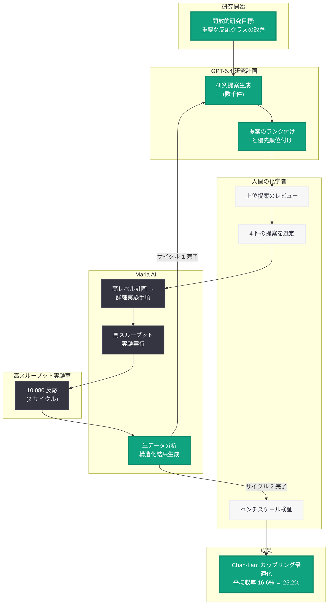
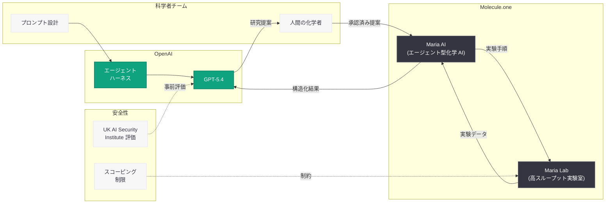

# ほぼ自律的な AI 化学者が創薬化学の難反応を改善 -- GPT-5.4 と Maria Lab による Chan-Lam カップリングの最適化

## メタデータ

| 項目 | 内容 |
|------|------|
| 発表日 | 2026-06-17 |
| ソース | OpenAI Research |
| カテゴリ | 研究成果 / 創薬化学 |
| 公式リンク | [A near-autonomous AI chemist improves a challenging reaction in medicinal chemistry](https://openai.com/index/ai-chemist-improves-reaction/) |

## 概要

OpenAI は 2026 年 6 月 17 日、Molecule.one との共同研究として、ほぼ自律的な AI 化学者が創薬化学における難反応を改善した成果を発表した。GPT-5.4 を Molecule.one の「Maria」(自律化学研究のためのエージェント型 AI システムと高スループット実験室を統合したプラットフォーム) に接続し、重要な反応クラスの改善という開放的な目標を与えた結果、AI システムは Chan-Lam カップリング反応 (炭素-窒素結合形成反応) における一次スルホンアミドの収率を大幅に向上させることに成功した。

本研究は、高度な AI が科学者にとって強力なパートナーとなりうるという OpenAI の信念を実証するものである。仮説が実験室で実際の分子、装置、実験ノイズの中で機能することを検証し、平均収率を 16.6% から 25.2% に向上させるという具体的な成果を達成した。3 か月間で 10,080 回の反応を実施し、人間のベンチスケール検証でも 14 組の基質ペアのうち 11 組で高い収率を確認した。

## 主な内容

### Chan-Lam カップリング反応と課題の特定

Chan-Lam カップリングは、銅触媒を用いて炭素-窒素 (C-N) 結合を形成する反応であり、医薬品合成において広く使用される重要な反応の一つである。GPT-5.4 は複数の反応クラスの中から自律的に Chan-Lam カップリングを選択し、さらに一次スルホンアミドを「困難かつ高価値」な基質クラスとして特定した。

**AI が特定した課題:**

| 項目 | 内容 |
|------|------|
| 対象反応 | Chan-Lam カップリング (C-N 結合形成) |
| 標的基質 | 一次スルホンアミド |
| 課題 | 従来条件での低収率 (平均 16.6%) |
| 提案した解決策 | TEMPO を含む温和な酸化剤の使用 |

### 実験結果

GPT-5.4 が提案した最適化条件の下で、以下の顕著な改善が達成された。

**収率改善の統計:**

| 指標 | 最適化前 | 最適化後 | 改善率 |
|------|----------|----------|--------|
| 平均収率 | 16.6% | 25.2% | +52% (相対) |
| 30% 超え収率の割合 | 15.6% | 37.5% | +140% (相対) |
| ボロン酸で改善した割合 | - | 88% | - |
| スルホンアミドで改善した割合 | - | 83% | - |

**実験規模:**

- Maria Lab で合計 10,080 回の反応を 2 サイクルにわたり実施
- 人間によるベンチスケール検証: 14 組の基質ペアのうち 11 組で高収率を確認 (多くが 2 倍以上の増加)
- コスト効率: より安価な類似体 (4-hydroxy-TEMPO) が TEMPO をほぼ同等の性能で代替可能であることを発見

### ワークフローと自律性

本研究は「ほぼ自律的」(near-autonomous) と表現されている。これは、AI が研究の大部分を主導しながらも、人間の化学者が重要な判断を下す場面が残されていたためである。

**研究プロセスの時系列:**

| 段階 | 期間 | 実施内容 |
|------|------|----------|
| 研究提案生成 | 第 1 フェーズ | GPT-5.4 が数千件の研究提案を生成・ランク付け |
| 人間レビュー | 第 2 フェーズ | 化学者が上位提案をレビューし 4 件を選定 |
| 実験実施 (サイクル 1) | 第 3 フェーズ | Maria AI が詳細な実験手順に変換し実行 |
| データ分析・追加実験 | 第 4 フェーズ | 構造化された結果を GPT-5.4 に返却し次の実験設計 |
| 実験実施 (サイクル 2) | 第 5 フェーズ | フォローアップ実験の実行 |
| 検証 | 第 6 フェーズ | 人間によるベンチスケール検証 |

全プロセスの期間: 2026 年 3 月 4 日から 6 月 4 日 (約 3 か月間)

### 他の研究提案の結果

GPT-5.4 が選定した 4 件の提案のうち:

| 提案 ID | 結果 |
|---------|------|
| OAI-M1-01 | 実験的に否定 (disproven) |
| OAI-M1-02 | 実験的に証明 (proven) |
| OAI-M1-03 | 実験的に証明 -- 主要成果 (Chan-Lam 最適化) |
| OAI-M1-04 | 実験的に証明 (proven) |

### 安全性と準備態勢 (Preparedness)

本研究は、安全性に十分配慮した設計のもとで実施された。

- **意図的なスコーピング:** 正当な創薬化学の課題に限定
- **有害物質の排除:** 毒素、化学兵器、有害化合物を対象としない
- **外部評価:** UK AI Security Institute によるモデル評価を実施
- **安全機構:** システムは有害なリクエストを拒否するよう設計
- **人間の管理:** どの提案が実験室に入るかは人間の化学者が制御

## 技術的な詳細

### GPT-5.4 の科学的推論能力

本研究では、GPT-5.4 が以下の科学的推論タスクを自律的に遂行した。

1. **問題の特定:** 複数の反応クラスの中から Chan-Lam カップリングを高価値な改善対象として選択
2. **基質クラスの特定:** 一次スルホンアミドを困難かつ重要な基質として特定
3. **メカニズムベースの仮説生成:** 温和な酸化剤 (TEMPO) が反応を改善しうるという化学的に合理的な仮説を提案
4. **実験設計:** Maria AI と連携して高スループット実験の設計を最適化
5. **データ解釈:** 10,080 回の反応データを分析し、次のサイクルの実験を計画

### Maria AI と高スループット実験室の統合

Molecule.one が開発した Maria は、エージェント型 AI と自動化された高スループット実験室を統合したプラットフォームである。

**Maria の役割:**

- GPT-5.4 の高レベルな研究計画を詳細な実験手順に変換
- 数千件の高スループット実験を自動実行
- 生データを分析し、構造化された結果を GPT-5.4 に返却
- 実験条件の微調整と反復的な最適化

### TEMPO 酸化剤の化学的意義

TEMPO (2,2,6,6-テトラメチルピペリジン-1-オキシル) は安定なニトロキシルラジカルであり、有機合成において温和な酸化剤として広く知られている。

**TEMPO の優位性:**

- 温和な反応条件で機能し、感受性の高い官能基と共存可能
- Chan-Lam カップリングにおける銅触媒の酸化状態の制御に寄与
- 4-hydroxy-TEMPO という安価な代替物が同等の性能を示すことで、実用性が向上

### 専門家の評価

> "The merger of high throughput experimentation and modern AI represents a new frontier of scientific discovery. This new reaction is a powerful demonstration, where exceptionally mild conditions and a practical oxidant enable a nicely general substrate scope for one of the more popular reactions in drug synthesis."
> -- Tim Cernak, Associate Professor of Medicinal Chemistry, University of Michigan

ミシガン大学の Tim Cernak 准教授 (創薬化学) は、高スループット実験と現代の AI の融合が科学的発見の新しいフロンティアを表すと評価し、特に温和な条件と実用的な酸化剤により、医薬品合成で最も広く使われる反応の一つに対して優れた基質許容性を実現した点を高く評価している。

### 研究の限界

本研究の著者らは以下の限界を明示的に認めている。

- AI が化学研究プログラム全体をエンドツーエンドで独立して実行できることを示すものではない
- 人間の判断が引き続き不可欠である
- ワークフローは専門的な高スループットインフラに依存している
- 本手法が他のカップリング反応に一般化されるかは未確認
- 反応機構、基質範囲、製造条件に関するさらなる研究が必要

## アーキテクチャ

### AI 化学者ワークフロー

### システムコンポーネントの相互関係

## 開発者への影響

### AI for Science の新たなマイルストーン

本研究は、AI が実験科学において仮説生成から実験設計・実行・検証までの一連のプロセスを主導できることを示した最初の大規模な実証例の一つである。

- **エージェント型 AI の実用性:** GPT-5.4 を外部ツール (Maria AI、高スループット実験室) と接続するエージェント型アーキテクチャが、実世界の科学的成果を生み出せることを実証。AI エージェントの設計パターンとして、「高レベル推論 + 専門実行システム」の有効性が確認された
- **反復的研究サイクルの自動化:** AI が実験結果を受けて次の実験を計画するフィードバックループにより、研究サイクルの大幅な加速が可能であることを示した。API 開発者にとっては、長期的なマルチステップ推論タスクにおける GPT-5.4 の信頼性が実証された意味を持つ
- **ドメイン固有知識の活用:** GPT-5.4 が有機化学の専門知識を活用して合理的な仮説を生成できることは、他の科学分野への応用可能性を示唆する

### 安全性設計のベストプラクティス

- **スコーピングの重要性:** 高い自律性を持つ AI システムを実世界で運用する際の安全性設計として、意図的に研究範囲を限定し、有害な応用を排除する設計パターンが示された
- **Human-in-the-Loop の維持:** 完全な自律化ではなく、重要な判断ポイントに人間を配置する設計が、安全性と有効性のバランスを取る上で有効であることが確認された
- **外部評価の組み込み:** UK AI Security Institute による事前評価を組み込むプロセスは、高リスクなアプリケーションにおける AI デプロイメントのモデルケースとなる

### 高スループット実験との統合

- AI と自動化実験システムの統合は、創薬、材料科学、化学工学など広範な分野への応用が期待される
- 10,080 回の反応を 3 か月で実行するスケールは、従来の手動実験と比較して桁違いの効率性を示す

## 関連リンク

- [A near-autonomous AI chemist improves a challenging reaction in medicinal chemistry (本件)](https://openai.com/index/ai-chemist-improves-reaction/)
- [Molecule.one](https://molecule.one/)
- [OpenAI Research](https://openai.com/research)
- [OpenAI Safety](https://openai.com/safety)
- [UK AI Security Institute](https://www.aisi.gov.uk/)

## まとめ

2026 年 6 月 17 日に発表された本研究は、OpenAI の GPT-5.4 と Molecule.one の Maria AI を統合した「ほぼ自律的な AI 化学者」が、創薬化学における難反応 (Chan-Lam カップリングによる一次スルホンアミドの C-N 結合形成) を実験的に改善したことを報告するものである。

本研究の最大の意義は、AI が単なる推論や予測にとどまらず、実験室で実際の分子と装置を用いた実験科学において具体的な成果を生み出せることを実証した点にある。GPT-5.4 は自律的に反応クラスと基質を選択し、温和な酸化剤 (TEMPO) による改善を提案し、10,080 回の高スループット実験を通じて平均収率を 16.6% から 25.2% に向上させた。ボロン酸の 88%、スルホンアミドの 83% で収率が改善し、人間によるベンチスケール検証でも 14 組中 11 組で高い再現性が確認された。

一方で、本研究は AI が化学研究を完全に独立して遂行できることを主張するものではなく、人間の判断が依然として不可欠であること、専門的なインフラに依存していること、他の反応への一般化は未検証であることを明示している。「ほぼ自律的」という慎重な表現は、AI 科学研究の現在地を正確に反映している。本研究は、AI と実験科学の融合がもたらす可能性と、その責任ある展開のための安全性設計の両方を示す重要な成果である。
