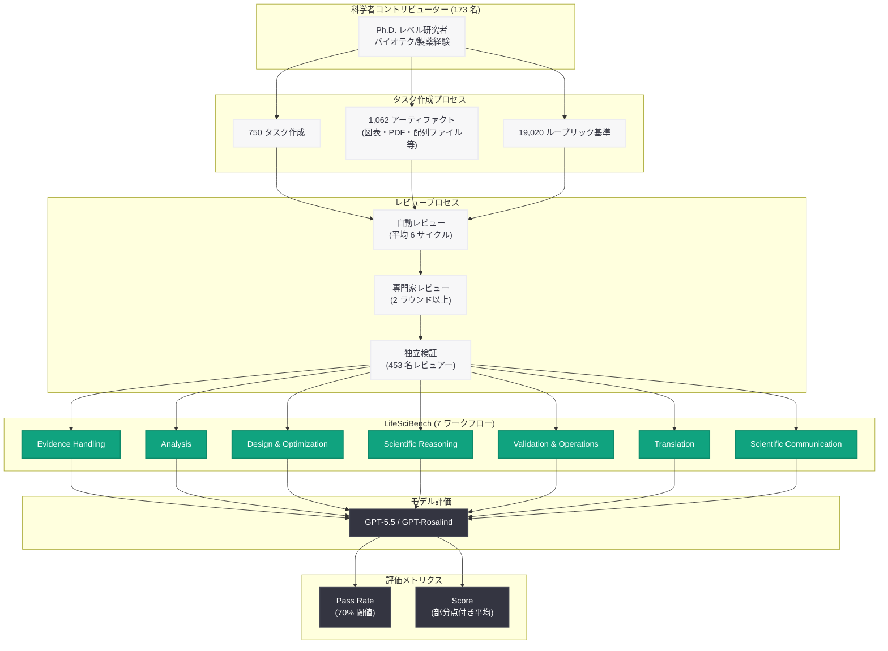

# LifeSciBench: ライフサイエンス研究タスク向け AI 評価ベンチマークの導入

## メタデータ

| 項目 | 内容 |
|------|------|
| 発表日 | 2026-06-17 |
| ソース | OpenAI Research (Publication) |
| カテゴリ | 研究成果 / ベンチマーク / ライフサイエンス |
| 公式リンク | https://openai.com/index/introducing-life-sci-bench/ |

## 概要

OpenAI は、AI システムが現実のライフサイエンス研究タスクをどの程度支援できるかを評価するための新しいベンチマーク「LifeSciBench」を発表した。従来の生物学に関する質問応答能力ではなく、実際の研究現場で求められる複雑な判断・分析・設計タスクへの対応力を測定することを目的としている。

LifeSciBench は 173 名の Ph.D. レベルの科学者が作成した 750 のタスクで構成され、7 つのワークフローと 7 つの生物学ドメインを網羅する。453 名の独立した専門家レビュアーによる検証を経ており、科学的妥当性と実用性の両面で高い品質基準を満たしている。

## 主な内容

### ベンチマークの規模と構成

LifeSciBench は以下の規模で構築されている.

- **750 のエキスパート作成タスク:** 7 つのワークフローと 7 つの生物学ドメインにわたる
- **1,062 のタスクアーティファクト:** 図表、PDF、テーブル、配列ファイル、構造/化学ファイル、Web 参照を含む
- **173 名の科学者コントリビューター:** 全員が Ph.D. レベルでバイオテクノロジー/製薬業界の経験を持つ
- **19,020 のルーブリック基準:** タスクあたり平均 25 の評価基準
- **453 名のエキスパートレビュアー:** 97% が Ph.D. 以上、平均 12 年の経験、14 本の査読付き論文

### 7 つのワークフロー

LifeSciBench は以下の 7 つのワークフローで AI の能力を評価する.

1. **Evidence Handling (証拠処理):** 論文、図表、テーブル、実験記録から科学的証拠を抽出・照合・監査する能力
2. **Analysis (分析):** 定量的・定性的データ分析の実行能力
3. **Design, Optimization, & Prediction (設計・最適化・予測):** 実験デザインと最適化
4. **Scientific Reasoning (科学的推論):** ドメインに根ざした判断と推論
5. **Validation & Operations (検証・運用):** 実験検証タスク
6. **Translation (トランスレーション):** ベンチからベッドサイドへの創薬プロセス
7. **Scientific Communication (科学的コミュニケーション):** 証拠の整理と専門家向け説明の作成

### タスクの特性

LifeSciBench のタスクは、現実の研究業務の複雑さを反映するよう設計されている.

- 79% が複数の推論/意思決定ステップを必要とする (タスクあたり平均 4 ステップ)
- 53% が少なくとも 1 つのアーティファクトからの解釈・統合を必要とする
- 広範なレビュープロセス: 平均 6 回の自動レビューサイクル + 少なくとも 2 ラウンドの専門家レビュー
- レビュアー間で少なくとも 90% の合意が必要

### モデル評価結果

GPT-Rosalind と GPT-5.5 の比較結果.

| 指標 | GPT-5.5 | GPT-Rosalind | 改善幅 |
|------|---------|--------------|--------|
| 全体パス率 | 25.7% | 36.1% | +10.4pp |
| Scientific Communication パス率 | 56.3% | 71.1% | +14.8pp |
| Translation パス率 | 36.8% | 57.7% | +20.9pp |
| 専門家に有用/実行可能な出力 | 29.1% | 44.7% | +15.6pp |
| 不確実性/注意事項の処理 | 29.3% | 44.8% | +15.5pp |

### AI が苦手とする領域

GPT-Rosalind でも依然として困難なタスクが存在する.

- **Design, Optimization & Prediction:** パス率 30.7%
- **Analysis:** パス率 30.3%
- **アーティファクトを伴うタスク:** テキストのみ (45.1%) に対し、アーティファクト付き (28.1%) ではパス率が大幅低下
- **数値タスク:** パス率 14.8%
- **配列/構造出力:** パス率 24.0%
- **コンストラクト生成:** パス率 27.3%

## 技術的な詳細

### 評価手法

LifeSciBench では 2 つのメトリクスを使用して AI モデルを評価する.

- **Pass Rate (パス率):** 70% の成功閾値を満たすタスクの割合
- **Score (スコア):** 部分点を含む平均ルーブリック報酬

19,020 の評価基準は、科学的正確性と実用性の両方を評価するよう設計されている。最終的な回答の正確さだけでなく、科学的に妥当かつ運用上有用な方法で回答に到達しているかどうかも評価対象となる。

### 検証プロセス

453 名の独立レビュアー (タスク作成に関与していない) による検証結果.

| カテゴリ | 合意率 | 強い合意率 |
|----------|--------|-----------|
| 現実世界の関連性 | 98.3% | 90.4% |
| 科学的推論/ドメインスキル | 98.1% | 86.4% |
| 科学的根拠 | 96.5% | 77.1% |
| 全体的有用性 | 96.6% | 79.1% |

すべてのカテゴリで 96% を超える合意が得られている。

### 制限事項

- 実際の研究環境でのモデル研究の代替にはならない
- 自己完結型タスクに焦点を当てており、実際の研究は反復的である
- 高いパフォーマンスはタスクレベルの能力として解釈すべきで、研究インパクトの直接的な指標ではない
- 次のステップ: ベンチマークの性能を実際のワークフローにおけるデプロイメント研究と接続する

## アーキテクチャ

## 開発者への影響

- **ライフサイエンス AI アプリケーション開発者:** LifeSciBench の結果は、AI がどのタスクで実用レベルに達しているかを明確に示している。Scientific Communication や Translation 領域では GPT-Rosalind が比較的高いパフォーマンスを発揮する一方、数値計算や構造出力を伴うタスクには依然として人間の監督が必要
- **創薬・バイオテクノロジー企業:** ベンチからベッドサイドへの Translation タスクで GPT-Rosalind が 57.7% のパス率を達成しており、創薬プロセスの一部を AI が支援できる可能性を示唆している
- **研究者向けツール開発:** アーティファクトを伴うタスクでのパフォーマンス低下 (45.1% から 28.1% への低下) は、マルチモーダル入力処理の改善が今後の重要な開発課題であることを示している
- **評価基盤の活用:** 19,020 のルーブリック基準を持つ LifeSciBench は、ライフサイエンス領域での AI 能力を継続的に追跡するための業界標準ベンチマークとなる可能性がある

## 関連リンク

- [LifeSciBench 公式ページ](https://openai.com/index/introducing-life-sci-bench/)
- [GPT-Rosalind の紹介](https://openai.com/index/introducing-gpt-rosalind/)
- [OpenAI Research](https://openai.com/research)
- [OpenAI Safety Research](https://openai.com/safety)

## まとめ

LifeSciBench は、AI のライフサイエンス研究支援能力を現実的なタスクで評価する初の大規模ベンチマークである。173 名の科学者が作成し、453 名のレビュアーが検証した 750 タスクにより、AI が得意とする領域 (科学的コミュニケーション、トランスレーション) と苦手とする領域 (数値計算、構造出力、アーティファクト処理) が明確に示された。GPT-Rosalind は GPT-5.5 に対して全体パス率で 10.4 ポイントの改善を達成したが、最も困難なタスクでは依然として 30% 前後のパス率にとどまっており、ライフサイエンス研究における AI 活用にはまだ大きな伸びしろがあることを示している。
