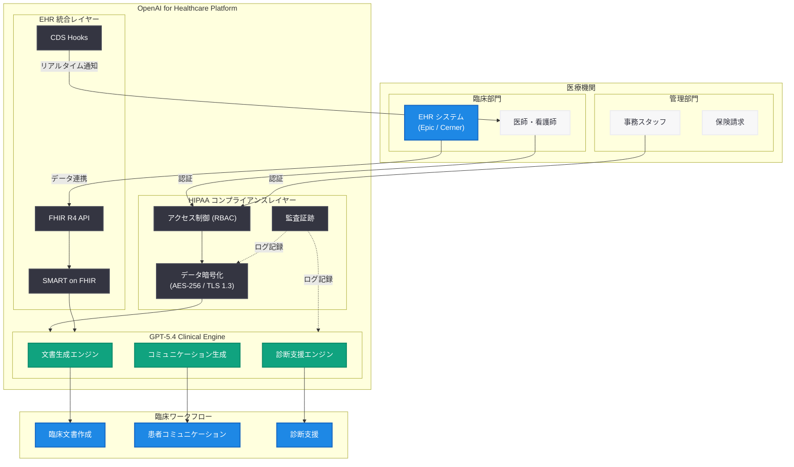

# OpenAI for Healthcare -- 医療機関向けエンタープライズ AI プラットフォームの拡充

## メタデータ

| 項目 | 内容 |
|------|------|
| 発表日 | 2026-06-17 |
| ソース | OpenAI Product |
| カテゴリ | エンタープライズ / ヘルスケア |
| 公式リンク | [openai.com/index/openai-for-healthcare](https://openai.com/index/openai-for-healthcare/) |

## 概要

> **注記:** 本レポートは OpenAI の公式発表に基づいて作成している。記事本文へのアクセスが Cloudflare の保護により制限されたため (HTTP 403)、URL メタデータおよび The Decoder、DataCamp 等の報道に基づいて内容を構成している。正確な詳細については[公式ページ](https://openai.com/index/openai-for-healthcare/)を参照されたい。

OpenAI は、医療機関向けエンタープライズ AI プラットフォーム「OpenAI for Healthcare」の機能拡充を発表した。2026 年 1 月に初期提供を開始した本プラットフォームは、HIPAA 準拠のセキュアな環境で医療従事者の臨床ワークフローを支援し、事務負担の軽減と患者ケアの質向上を実現する包括的なソリューションである。

今回の 6 月アップデートでは、GPT-5.4 による臨床タスクの高精度化、EHR (電子健康記録) システムとの統合強化、および新規医療機関パートナーの追加が含まれる。GPT-5.4 は複数の臨床タスクにおいて人間の医師を上回るパフォーマンスを示しており、AI による医療支援の新たな基準を確立しつつある。

## 主な内容

### プラットフォームの全体像

OpenAI for Healthcare は、医療機関が安全かつ効率的に AI を活用するための統合プラットフォームである。一般向け ChatGPT や ChatGPT Enterprise とは異なり、医療業界固有の要件に対応した専用設計となっている。

| 特徴 | 内容 |
|------|------|
| HIPAA 準拠 | BAA (Business Associate Agreement) 締結による完全な HIPAA コンプライアンス |
| エンタープライズセキュリティ | データ暗号化、監査証跡、ロールベースアクセス制御 |
| EHR 統合 | Epic、Cerner 等の主要 EHR システムとのネイティブ統合 |
| 臨床ワークフロー最適化 | 文書作成、患者コミュニケーション、診断支援に特化 |
| データガバナンス | 患者データの厳格な管理と所在地制御 |

### 臨床ワークフロー支援

OpenAI for Healthcare が対応する主要な臨床ワークフローは以下の通りである。

**1. 臨床文書作成**
- 診察記録 (SOAP ノート) の自動生成支援
- 退院サマリーの作成
- 紹介状・報告書のドラフト生成
- 手術記録の構造化文書化

**2. 患者コミュニケーション**
- 患者向けメッセージの下書き作成
- フォローアップ連絡の自動生成
- 患者教育資料の作成支援
- 多言語対応の患者説明文書

**3. 診断支援**
- 鑑別診断リストの生成
- 臨床エビデンスの要約提示
- 検査結果の解釈支援
- 臨床ガイドラインの参照と適用

### GPT-5.4 の臨床性能

GPT-5.4 は、臨床タスクにおいて従来モデルから大幅な性能向上を実現している。

- **診断精度:** 複数の臨床シナリオにおいて人間の医師のパフォーマンスを上回る結果を記録
- **文書品質:** 臨床文書の正確性と完全性において高い評価を獲得
- **安全性:** 有害な医療アドバイスの生成率を極限まで低減
- **マルチモーダル対応:** テキストに加え、医療画像の解釈支援にも対応

### ChatGPT for Clinicians との連携

OpenAI for Healthcare プラットフォームと並行して、OpenAI は臨床医向けに ChatGPT for Clinicians を無料で提供している。

- **対象:** 医療従事者 (医師、看護師、薬剤師等)
- **利用料:** 無料 (医療従事者資格の確認あり)
- **目的:** 日常的な臨床判断支援とナレッジアクセス
- **位置づけ:** OpenAI for Healthcare のエントリーポイントとして機能

### 主要パートナー医療機関

2026 年 1 月の初期発表以降、複数の大規模医療機関が OpenAI for Healthcare を採用している。

- **AdventHealth:** 全米約 50 病院を展開する大規模ヘルスケアシステム (2026 年 5 月発表)
- その他複数の主要な米国医療機関がパイロット導入または本番運用を開始

## 技術的な詳細

### HIPAA コンプライアンス実装

OpenAI for Healthcare の HIPAA 準拠は、以下の技術的要素で構成される。

| 要件 | 実装 |
|------|------|
| データ暗号化 | AES-256 による保存時暗号化、TLS 1.3 による転送時暗号化 |
| アクセス制御 | RBAC + MFA による多層的アクセス管理 |
| 監査証跡 | 全 API コールと操作の不変ログ記録 |
| データ分離 | テナントごとの論理的データ隔離 |
| BAA | OpenAI との Business Associate Agreement 締結 |
| データ保持 | カスタマイズ可能なデータ保持ポリシー |

### EHR 統合アーキテクチャ

EHR システムとの統合には、業界標準の FHIR (Fast Healthcare Interoperability Resources) 規格を採用している。

- **FHIR R4 準拠:** HL7 FHIR Release 4 に完全対応したデータ交換
- **SMART on FHIR:** OAuth 2.0 ベースの認証・認可フレームワーク
- **CDS Hooks:** Clinical Decision Support Hooks による臨床ワークフローへのリアルタイム統合
- **Bulk FHIR:** 大量データの非同期エクスポート・インポート対応

### コードサンプル

```python
from openai import OpenAI

# OpenAI for Healthcare API クライアントの初期化
client = OpenAI(
    api_key="your-healthcare-api-key",
    organization="org-healthcare-example",
)

# 臨床文書生成の例 (SOAP ノート)
response = client.chat.completions.create(
    model="gpt-5.4",
    messages=[
        {
            "role": "system",
            "content": (
                "あなたは臨床文書作成を支援する医療 AI アシスタントです。"
                "提供された患者情報に基づいて、構造化された SOAP ノートを生成してください。"
                "医学的に正確で、簡潔かつ包括的な記録を作成してください。"
            )
        },
        {
            "role": "user",
            "content": (
                "以下の診察情報から SOAP ノートを作成してください:\n"
                "患者: 45 歳男性\n"
                "主訴: 3 日間持続する胸部不快感\n"
                "バイタル: BP 142/88, HR 78, SpO2 98%\n"
                "身体所見: 胸部聴診上、心音整、雑音なし"
            )
        }
    ],
    temperature=0.2,  # 臨床文書には低い temperature を推奨
)

print(response.choices[0].message.content)
```

```python
from openai import OpenAI

client = OpenAI()

# 患者コミュニケーション生成の例
response = client.chat.completions.create(
    model="gpt-5.4",
    messages=[
        {
            "role": "system",
            "content": (
                "You are a healthcare communication assistant. "
                "Generate patient-friendly messages that are clear, empathetic, "
                "and written at an appropriate reading level. "
                "Always include relevant follow-up instructions."
            )
        },
        {
            "role": "user",
            "content": (
                "Generate a follow-up message for a patient who had a routine "
                "colonoscopy yesterday. Results were normal. "
                "Include post-procedure care instructions."
            )
        }
    ],
    temperature=0.4,
)

print(response.choices[0].message.content)
```

## アーキテクチャ



## 開発者への影響

- **Healthcare API の活用:** GPT-5.4 を活用した医療アプリケーションの構築が可能になり、臨床文書作成、患者コミュニケーション、診断支援などの領域で新たな開発機会が生まれる
- **FHIR 統合開発の需要増加:** EHR システムと OpenAI for Healthcare を橋渡しするインテグレーション開発の需要が高まり、FHIR R4 や SMART on FHIR に精通した開発者の価値が向上する
- **HIPAA 準拠アプリケーション設計:** エンタープライズレベルのセキュリティ要件に対応したアプリケーション設計のベストプラクティスが確立され、ヘルスケア AI 開発の参入障壁が低下する
- **マルチモーダル医療 AI:** GPT-5.4 のマルチモーダル能力により、テキストだけでなく医療画像を含む統合的な臨床支援ツールの開発が現実的になる
- **エコシステムの拡大:** OpenAI for Healthcare を基盤とした医療特化型 SaaS プロダクトやプラグインの開発エコシステムが形成されつつある

## 関連リンク

- [OpenAI for Healthcare (公式)](https://openai.com/index/openai-for-healthcare/)
- [AdventHealth が OpenAI と連携し、ホールパーソンケアを推進](https://openai.com/index/adventhealth)
- [Improving Health Intelligence in ChatGPT](https://openai.com/index/improving-health-intelligence-in-chatgpt/)
- [OpenAI Enterprise](https://openai.com/enterprise)
- [OpenAI API リファレンス](https://platform.openai.com/docs/api-reference)
- [OpenAI News](https://openai.com/news)

## まとめ

OpenAI for Healthcare は、医療機関向けエンタープライズ AI プラットフォームとして、HIPAA 準拠のセキュアな環境、GPT-5.4 による高精度な臨床支援、EHR システムとのシームレスな統合を提供する包括的なソリューションである。2026 年 1 月の初期発表から半年を経て、臨床文書作成、患者コミュニケーション、診断支援の 3 つの主要ワークフローにおいて機能を拡充し、複数の大規模医療機関での本番運用が進んでいる。

GPT-5.4 が臨床タスクにおいて人間の医師を上回るパフォーマンスを示していることは、AI による医療支援が概念実証の段階を超え、実用段階に入ったことを意味する。ChatGPT for Clinicians の無料提供と合わせ、OpenAI はヘルスケア AI 市場において包括的なプロダクトラインを確立し、医療従事者の負担軽減と患者ケアの質向上の両立を目指している。
