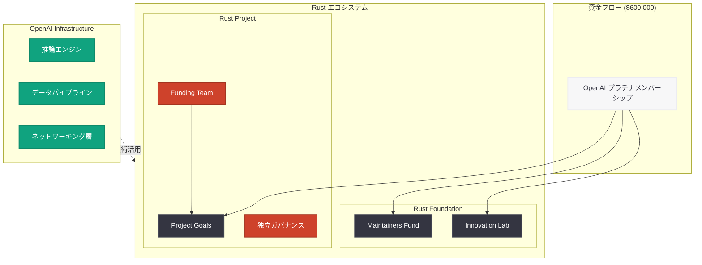

# OpenAI が Rust Foundation にプラチナメンバーとして参画 -- 60 万ドルの拠出でエコシステム支援

## メタデータ

| 項目 | 内容 |
|------|------|
| 発表日 | 2026-06-17 |
| ソース | OpenAI News (Rust Foundation Blog 経由で発表) |
| カテゴリ | 企業ニュース / エコシステム |
| 公式リンク | [On OpenAI's Support for Rust](https://rustfoundation.org/media/on-openais-support-for-rust/) |

## 概要

OpenAI は 2026 年 6 月 17 日、Rust Foundation にプラチナメンバーとして参画したことを発表した。総額 60 万ドル ($600,000) の拠出を通じて、Rust プロジェクトおよびより広範な Rust エコシステムを支援する。本発表は Rust Foundation の Lori Lorusso (Director of Outreach) によるブログ記事で公開された。

OpenAI のプラチナメンバーシップ参画は、同社が AI インフラストラクチャの基盤技術として Rust 言語を重視していることを示すものであり、Rust エコシステム全体にとって大きな資金的支援となる。Rust Foundation のメンバーシップは「Rust 言語そのものとそのエコシステムを構築しているメンテナーを支援するための手段」と位置づけられている。

## 主な内容

### プラチナメンバーシップの概要

OpenAI は Rust Foundation の最上位メンバーシップであるプラチナメンバーとして参画した。プラチナメンバーシップは、Rust エコシステムに対する最も高いレベルのコミットメントを示すものであり、Google、Microsoft、Amazon、Huawei などの大手テクノロジー企業が名を連ねている。

| 項目 | 内容 |
|------|------|
| メンバーシップレベル | プラチナ (最上位) |
| 拠出総額 | $600,000 (約 60 万ドル) |
| 対象範囲 | Rust Project + 広範な Rust エコシステム |
| 発表者 | Lori Lorusso (Rust Foundation, Director of Outreach) |

### 資金配分の仕組み

OpenAI の拠出金は、以下の 3 つの確立された経路を通じて配分される。

1. **Project Goals:** Rust プロジェクトの目標設定フレームワークを通じた支援。Rust の開発ロードマップに沿った優先事項に資金を振り向ける
2. **Rust Foundation Maintainers Fund:** Rust を構築している人々への直接的な支援。メンテナーの持続可能な活動を経済的に支える
3. **Rust Innovation Lab:** Rust Foundation のイノベーションプログラムを通じた支援。新たな技術的取り組みや実験的プロジェクトを促進する

### ガバナンスと独立性の確保

本発表で特に強調されているのは、Rust プロジェクトのガバナンスの独立性である。

- **Rust プロジェクトの自律性:** Rust プロジェクトに関する意思決定は、プロジェクト自身のガバナンス構造の中でプロジェクトが行う
- **Foundation の役割:** Rust Foundation の役割は「資金につながる産業パートナーシップを構築する」ことであり、技術的方向性の決定には関与しない
- **Funding Team との連携:** OpenAI は Rust プロジェクトの Funding Team と協力して、Rust のビジョンを支援する最適な方法を特定することにコミットしている

## 技術的な詳細

### OpenAI と Rust の関係

OpenAI のインフラストラクチャにおいて、Rust はパフォーマンスクリティカルなシステムコンポーネントの構築に活用されていると考えられる。AI/ML ワークロードにおける Rust の活用領域は以下のように整理できる。

### AI インフラにおける Rust の活用領域

| 領域 | Rust の利点 | 代表的なユースケース |
|------|------------|-------------------|
| 推論サーバー | メモリ安全性 + 低レイテンシ | モデルサービングのランタイム |
| データ処理 | 並行処理の安全性 | トレーニングデータのパイプライン |
| ネットワーキング | ゼロコスト抽象化 | API ゲートウェイ、ロードバランサー |
| WebAssembly | クロスプラットフォーム | エッジ推論、ブラウザ向けデプロイ |
| CLI ツール | 高速起動 + 型安全性 | 開発者向けツールチェーン |

## 開発者への影響

### Rust エコシステム全体への恩恵

- **メンテナー支援の拡充:** Maintainers Fund を通じた直接支援により、重要なクレートのメンテナンスが持続可能になる。人材流出やバーンアウトへの対策として機能する
- **Innovation Lab の活性化:** 新しいツール、ライブラリ、実験的プロジェクトへの投資が加速し、エコシステム全体の技術革新が促進される
- **Project Goals の推進:** Rust 言語自体の進化 (async、エラーハンドリング改善、コンパイル時間短縮など) が加速する可能性がある

### AI/ML 領域の Rust 開発者

- **AI 関連クレートの発展:** OpenAI の参画により、AI/ML 向け Rust ライブラリ (candle、burn、tch-rs など) への関心と投資が増加する可能性がある
- **求人市場の拡大:** 大手 AI 企業が Rust を重視することで、Rust スキルの市場価値がさらに高まる
- **ベストプラクティスの共有:** OpenAI が Rust を大規模に活用する中で得られた知見がエコシステムにフィードバックされることが期待される

### 企業の技術選定への影響

- **Rust 採用の正当化:** OpenAI という AI 業界のリーダー企業が Rust に大規模投資することで、社内での Rust 採用を推進する際の説得材料となる
- **エコシステムの成熟度向上:** 資金投入によりクレートの品質や文書の充実が進み、企業での採用障壁が下がる

## 関連リンク

- [On OpenAI's Support for Rust](https://rustfoundation.org/media/on-openais-support-for-rust/) - Rust Foundation 公式ブログ記事
- [Rust Foundation](https://rustfoundation.org/) - Rust Foundation 公式サイト
- [Rust Project Goals](https://rust-lang.github.io/rust-project-goals/) - Rust プロジェクトの目標設定フレームワーク
- [OpenAI News](https://openai.com/news) - OpenAI 公式ニュース

## まとめ

OpenAI の Rust Foundation プラチナメンバーシップ参画は、AI インフラストラクチャにおける Rust 言語の重要性を改めて示す出来事である。主要なポイントは以下の通りである。

1. **大規模な資金的コミットメント:** 総額 60 万ドルの拠出は、OpenAI が Rust エコシステムの持続可能性に対して真剣に取り組む姿勢を示している

2. **透明で独立したガバナンスの尊重:** 資金提供を行いつつも、Rust プロジェクトの独立したガバナンス構造を尊重する仕組みが整備されており、企業の影響力による技術的方向性の歪曲を防いでいる

3. **多面的な支援アプローチ:** Project Goals、Maintainers Fund、Innovation Lab という 3 つの経路を通じた資金配分により、言語の進化、メンテナーの支援、技術革新の促進をバランスよく行う

4. **AI 業界と Rust の関係深化:** OpenAI に加え、既に Google、Microsoft、Amazon などがプラチナメンバーとして参加しており、AI/クラウド業界全体で Rust が基盤技術として認知されている状況が明確になった

5. **エコシステムの持続可能性:** 企業からの安定した資金流入により、オープンソースメンテナーの持続可能な活動が支えられ、長期的なエコシステムの健全性が確保される方向に向かっている
