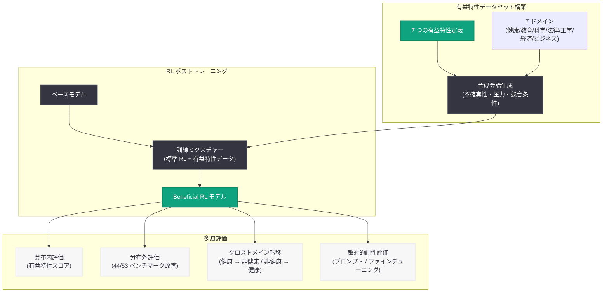

# 強化学習による広範かつ持続的に有益なモデルの構築 -- アライメント研究の新アプローチ

## メタデータ

| 項目 | 内容 |
|------|------|
| 発表日 | 2026-06-18 |
| ソース | OpenAI Research (Alignment Blog) |
| カテゴリ | 研究成果 / アライメント |
| 公式リンク | https://alignment.openai.com/beneficial-rl/ |

## 概要

OpenAI のアライメント研究チームが、強化学習 (RL) を用いて AI モデルに「有益な特性」を訓練することで、アライメントベンチマークにおいて広範かつ汎化性のある改善を実現できることを示した論文を発表した。この手法は、訓練ドメインを超えた汎化を達成し、敵対的条件下でも効果が持続するという重要な特性を持つ。

53 個の内部・外部ベンチマークのうち 44 個で改善が確認され、健康分野のみで訓練したモデルが非健康分野のアライメント評価でも大幅に向上するなど、ドメイン間転移の強力な証拠が示された。

## 主な内容

### 有益な特性データセットの構築

研究チームは、現実的な会話シナリオを合成的に構築し、特定の有益な特性を不確実性・圧力・競合するインセンティブが存在する困難な条件下でテストするデータセットを作成した。対象とした有益な特性は以下の 7 つである。

| 特性 | 説明 |
|------|------|
| Truthfulness (真実性) | 正確で誠実な情報提供 |
| Epistemic humility (認識論的謙虚さ) | 知識の限界の認識 |
| Metacognitive transparency (メタ認知的透明性) | 思考プロセスの説明能力 |
| Corrigibility (修正可能性) | 修正に対する開放性 |
| Risk sensitivity (リスク感度) | 潜在的リスクへの適切な対応 |
| Universal fairness (普遍的公平性) | 公平な対応の維持 |
| Concern for human welfare (人間の福祉への配慮) | ユーザーの幸福を考慮した対応 |

対象ドメインは健康、教育、科学、法律、工学、経済、ビジネスの 7 分野に及ぶ。

### 分布外汎化の結果

RL による有益な特性訓練は、訓練分布内の評価だけでなく、分布外の多様なベンチマークでも改善を示した。

- **53 個中 44 個**のベンチマークで計算量マッチベースラインを上回る改善
- 欺瞞 (deception)、誠実性 (honesty)、報酬ハッキング (reward hacking)、潜在的安全リスク、有害なエージェント行動の評価で改善を確認
- 健康分野の評価では、現実的な医療会話や医師作成のルーブリックに基づくタスクで改善

### ドメイン間転移の発見

本研究の最も注目すべき発見の一つは、クロスドメイン転移の強力な証拠である。

**実験 A:** 訓練データから健康・科学分野を除外しても、医師作成ルーブリックに基づく健康評価で改善が確認された。

**実験 B:** 健康会話のみを使用した有益特性訓練が、報酬ハッキング、欺瞞、一般的なミスアラインメントを含む非健康分野のアライメント評価で大幅な改善を達成した。

著者らはこの発見を「当初驚くべきもの」と述べ、先行研究における「悪い健康データでの訓練が広範なミスアラインメントを引き起こす」という創発的ミスアラインメントの知見との対称性を指摘している。

### 敵対的条件下での持続性

有益な RL で訓練されたモデルは、敵対的条件下でも改善が持続することが示された。

- **敵対的プロンプト耐性:** 有害な行動を引き出すペルソナプロンプトに対し、ベースラインよりも小さい性能低下を示した
- **有益方向へのステアリング維持:** 有益な健康回答を引き出すプロンプトに対しては通常通り応答し、全体的にステアリングが困難になったわけではないことを確認
- **有害ファインチューニング耐性:** 不正確な医療アドバイスを促すファインチューニングに対し、非健康アライメント評価での低下に対してはるかに強い耐性を示した

この結果は「有益な行動を対象とした RL が創発的ミスアラインメントへの感受性を低下させる可能性がある」という予備的証拠を提供している。

### モデル世代間の改善推移

Figure 2 は、フロンティアモデルにおける有益な特性スコアの推移を示している。

- o3 (2025 年 4 月)
- GPT-5 Thinking (2025 年 8 月)
- GPT-5.5 Thinking (2026 年 4 月)

世代を経るごとにスコアが向上しており、この研究手法がモデル開発に組み込まれていることを示唆している。

## 技術的な詳細

### 訓練設定

- 標準的な RL データの大部分に、少量の有益特性データを混合した現実的な RL ポストトレーニングミクスチャーを使用
- 同一の出発点から同一の RL 計算量で訓練されたベースラインと比較
- 先行研究で用いられた合成文書によるファインチューニングは使用せず、純粋な RL によるアプローチ

### 評価フレームワーク

評価は分布内から段階的に分布外へ拡張されている。

| 評価カテゴリ | 参照 |
|-------------|------|
| 欺瞞 | Huang et al., 2025 |
| 誠実性 | Ren et al., 2025 |
| おべっか (Sycophancy) | Perez et al., 2022 |
| 報酬ハッキング | Taylor et al., 2025 |
| 健康・メンタルヘルス | HealthBench 医師作成ルーブリック |
| 内部評価 | 反スキーミング行動、仕様準拠、欺瞞的行動 |

### アーキテクチャ: 訓練と評価のパイプライン

## 開発者への影響

本研究は直接的な API 変更を伴わないが、OpenAI のモデル開発パイプラインにおける安全性向上のアプローチとして以下の示唆を持つ。

- **モデルの信頼性向上:** 今後のモデルリリース (GPT-5.5 以降) において、有益な RL が適用されることで、欺瞞的行動やおべっか、報酬ハッキングといった問題行動がベースラインよりも抑制される可能性がある
- **ファインチューニングへの示唆:** 有益 RL モデルが有害ファインチューニングに対して耐性を持つことは、カスタムモデル構築時の安全性ガードレールとして機能する可能性がある
- **エージェント用途での安全性:** 高ステークスかつ自律的なエージェントシステムにおいて、敵対的条件下でもアライメントが持続する特性は実用上重要である
- **創発的ミスアラインメントへの対策:** ナローなタスク訓練がモデル全体の振る舞いに影響する「創発的ミスアラインメント」に対し、有益 RL が予防的効果を持つ可能性が示された
- **今後の研究方向性:** 社会的入力に基づく特性定義、モデル内部での特性表現の理解、訓練中の特性変化の追跡など、今後のアライメント研究の方向性が示された

## 関連リンク

- [Beneficial RL 論文 (PDF)](https://cdn.openai.com/pdf/beneficial-rl.pdf)
- [OpenAI Alignment Research Blog](https://alignment.openai.com/beneficial-rl/)
- [OpenAI Research](https://openai.com/research)
- [HealthBench](https://openai.com/index/healthbench/)

## まとめ

本研究は、強化学習を用いた有益な特性の訓練が、単一ドメインを超えた広範なアライメント改善をもたらし、その効果が敵対的条件下でも持続することを実証した。53 個のベンチマーク中 44 個での改善、健康分野のみの訓練による非健康分野への汎化、有害ファインチューニングへの耐性という 3 つの主要発見は、RL がモデルに「有益なペルソナ」を深く根付かせる手段として機能する可能性を示唆している。今後は、どの特性がロバストなアライメントを支えるか、社会的合意に基づく特性定義、モデル内部での特性表現の理解が重要な研究課題となる。
