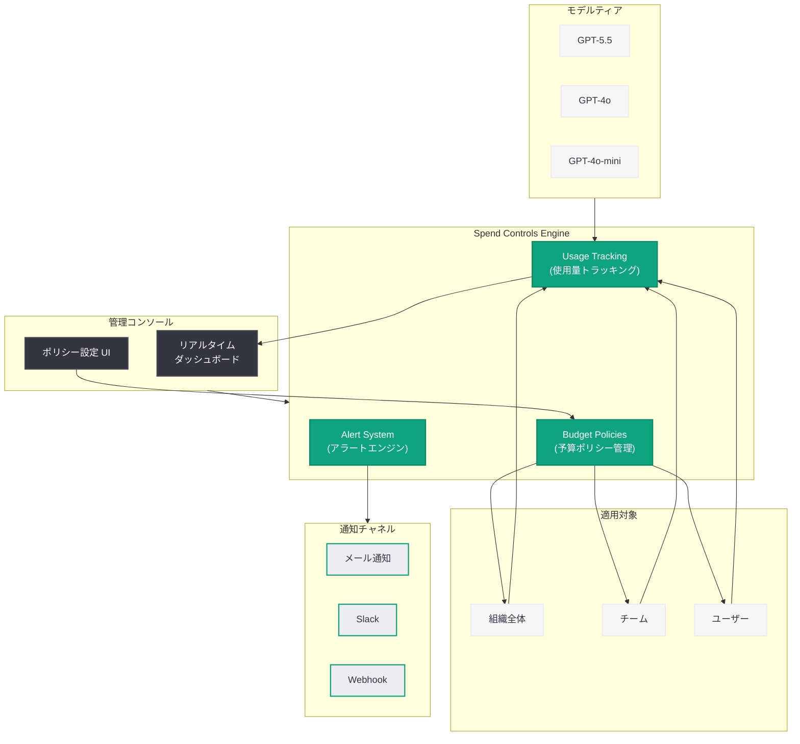

# ChatGPT Enterprise にスペンドコントロール機能を導入 -- 企業の AI 利用コストを可視化・制御

## メタデータ

| 項目 | 内容 |
|------|------|
| 発表日 | 2026-06-18 |
| ソース | OpenAI Product |
| カテゴリ | エンタープライズ / 管理機能 |
| 公式リンク | https://openai.com/index/chatgpt-enterprise-spend-controls/ |

## 概要

> **注記:** 本レポートは OpenAI の公式発表に基づいて作成している。記事本文へのアクセスが Cloudflare の保護により制限されたため (HTTP 403)、URL メタデータおよび OpenAI のエンタープライズ製品の文脈に基づいて内容を構成している。正確な詳細については[公式ページ](https://openai.com/index/chatgpt-enterprise-spend-controls/)を参照されたい。

OpenAI は、ChatGPT Enterprise および Team プランの管理者向けに新しい「スペンドコントロール (Spend Controls)」機能を発表した。この機能により、組織全体の AI 利用コストを可視化し、予算上限やアラートを設定して支出を制御できるようになる。

エンタープライズ顧客が最も懸念する課題の一つである「予測不可能な AI 支出」に対応するもので、管理者はチーム単位、ユーザー単位、または組織全体で利用上限を設定し、リアルタイムのダッシュボードで使用状況を監視できる。既存の管理機能 (ユーザー管理、データプライバシー、コンプライアンス) を補完する重要な追加機能となる。

## 主な内容

### 予算管理と支出上限の設定

スペンドコントロール機能の中核は、柔軟な予算管理メカニズムである。管理者は以下の粒度で支出上限を設定できる。

- **組織全体:** 組織レベルでの月間・四半期の支出上限
- **チーム単位:** 部門やプロジェクトチームごとの個別予算
- **ユーザー単位:** 個々のユーザーに対する利用上限

予算期間は月次または四半期単位で設定可能であり、組織の請求サイクルに合わせた柔軟な運用が可能である。

### モデルティア別の制御

異なるモデルティアに対して個別の利用制限を設定できる。例えば、GPT-5.5 のような高コストモデルに対してはより厳格な上限を設定し、GPT-4o のような標準モデルには緩やかな制限を適用するといった運用が可能である。

| モデルティア | 制御例 |
|-------------|--------|
| GPT-5.5 | 月間 $500/ユーザー上限 |
| GPT-4o | 月間 $200/ユーザー上限 |
| GPT-4o-mini | 制限なし |

### アラートと通知システム

予算の消化状況に応じて、段階的な通知を管理者に送信する。

- **警告アラート:** 予算の 75% に到達した時点で通知
- **緊急アラート:** 予算の 90% に到達した時点で通知
- **上限到達通知:** 予算上限に達した際の通知とアクション選択

管理者はアラートの閾値をカスタマイズでき、Slack や Microsoft Teams などのツールへの通知連携も可能である。

### リアルタイム使用状況ダッシュボード

管理コンソールに統合されたダッシュボードにより、以下の情報をリアルタイムで確認できる。

- 組織全体の累積支出と予算消化率
- チーム別・ユーザー別の利用状況ランキング
- モデル別の使用量内訳
- 時系列での利用トレンドと予測
- 前月比・前四半期比の変動分析

## 技術的な詳細

### Admin API によるプログラマティック制御

スペンドコントロールは管理コンソールの GUI に加えて、Admin API を通じたプログラマティックな設定も可能である。

```python
from openai import OpenAI

client = OpenAI()

# 組織レベルの予算ポリシーを設定
policy = client.organization.spend_controls.create(
    scope="organization",
    budget={
        "amount": 10000,
        "currency": "usd",
        "period": "monthly",
    },
    alerts=[
        {"threshold_percent": 75, "action": "notify"},
        {"threshold_percent": 90, "action": "notify"},
        {"threshold_percent": 100, "action": "soft_block"},
    ],
)

# チーム単位の予算ポリシーを設定
team_policy = client.organization.spend_controls.create(
    scope="team",
    team_id="team_abc123",
    budget={
        "amount": 2000,
        "currency": "usd",
        "period": "monthly",
    },
    model_limits={
        "gpt-5.5": {"max_spend": 500},
        "gpt-4o": {"max_spend": 1000},
    },
)
```

### 使用状況の取得

```python
# リアルタイムの使用状況を取得
usage = client.organization.spend_controls.usage.retrieve(
    period="current",
    group_by="team",
)

for team in usage.data:
    print(f"Team: {team.name}")
    print(f"  Spent: ${team.total_spend:.2f} / ${team.budget_limit:.2f}")
    print(f"  Utilization: {team.utilization_percent:.1f}%")
```

### Webhook による通知連携

予算アラートを外部システムに連携するための Webhook エンドポイントを設定できる。

```python
# Webhook エンドポイントの設定
webhook = client.organization.spend_controls.webhooks.create(
    url="https://example.com/webhooks/openai-spend-alerts",
    events=[
        "spend_control.threshold_reached",
        "spend_control.limit_reached",
        "spend_control.period_reset",
    ],
)
```

## アーキテクチャ



## 開発者への影響

- **IT 管理者のコスト予測性向上:** 予算上限の設定により、AI 利用コストが予想外に膨らむリスクを排除できる。四半期ごとの IT 予算計画において AI 支出の確実性が大幅に向上する
- **段階的な AI 導入の促進:** チーム単位・ユーザー単位の予算制御により、限定的なパイロットから組織全体への段階的な展開を安全に実施できる
- **モデル選択の最適化:** モデルティア別の支出データにより、コストパフォーマンスを分析し、ユースケースに応じた最適なモデル選択の意思決定が可能になる
- **既存ワークフローへの統合:** Admin API と Webhook により、既存の IT 管理ツール (ServiceNow、Jira Service Management など) やコスト管理プラットフォーム (FinOps ツール) との連携が可能
- **ガバナンスとコンプライアンスの強化:** 支出ログの監査証跡により、AI 利用に関する内部統制の要件を満たすことが容易になる

## 関連リンク

- [ChatGPT Enterprise Spend Controls 公式発表](https://openai.com/index/chatgpt-enterprise-spend-controls/)
- [ChatGPT Enterprise 管理者ガイド](https://platform.openai.com/docs/chatgpt-enterprise)
- [OpenAI Admin API リファレンス](https://platform.openai.com/docs/api-reference/administration)
- [ChatGPT Enterprise セキュリティとコンプライアンス](https://openai.com/enterprise-privacy)
- [OpenAI News](https://openai.com/news)

## まとめ

ChatGPT Enterprise のスペンドコントロール機能は、エンタープライズ顧客が抱える AI 支出の予測不可能性という根本的な課題に対する包括的なソリューションである。組織全体からユーザー単位までの粒度で予算を設定し、リアルタイムのダッシュボードとアラートシステムにより支出を可視化・制御できる。Admin API を通じたプログラマティックな管理や外部システムとの連携も可能であり、既存の IT ガバナンスフレームワークに統合しやすい設計となっている。この機能により、企業は AI 活用のスケールアップにおいてコスト面の安心感を得ながら、戦略的に ChatGPT の組織展開を推進できるようになる。
