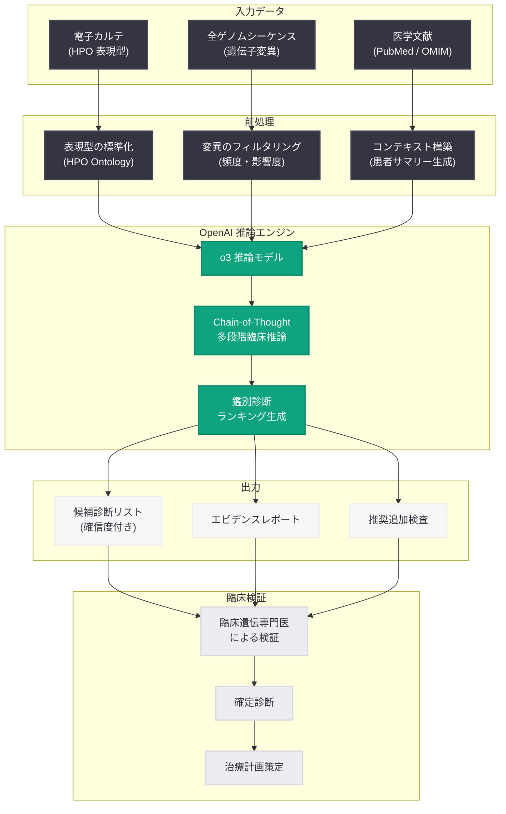

# AI による小児希少遺伝性疾患の診断支援 -- OpenAI 推論モデルが未解決症例 18 件の新規診断を実現

## メタデータ

| 項目 | 内容 |
|------|------|
| 発表日 | 2026-06-18 |
| ソース | OpenAI News/Blog |
| カテゴリ | 研究成果 / ヘルスケア |
| 公式リンク | https://openai.com/index/diagnose-rare-childhood-diseases |

## 概要

OpenAI は、研究者チームが OpenAI の推論モデルを活用し、小児の希少遺伝性疾患の診断を支援する取り組みについて発表した。この研究では、従来の診断プロセスでは解決できなかった症例に対して AI 推論モデルを適用し、18 件の新規診断を達成するという画期的な成果を上げた。

希少遺伝性疾患は世界で約 3 億人に影響を与えているとされ、個々の疾患の患者数が少ないため、正確な診断に平均 5 - 7 年を要する「診断オデッセイ」と呼ばれる長期的な困難が知られている。OpenAI の推論モデル (o シリーズ) は、複雑な多段階推論を得意としており、膨大な医学文献と遺伝情報を統合的に分析することで、臨床医が見落としがちなパターンを検出できる可能性を示した。

## 主な内容

### 研究の背景と課題

希少遺伝性疾患の診断には、以下のような構造的な課題が存在する。

- **疾患の多様性:** 既知の希少疾患は 7,000 種以上存在し、個々の臨床医がすべてを把握することは不可能
- **診断オデッセイ:** 患者は平均 5 - 7 年、7 人以上の専門医を受診してようやく正しい診断に至る
- **小児への影響:** 希少疾患の約 50% は小児期に発症し、早期診断が治療成果に直結する
- **未解決症例:** 全ゲノムシーケンシング後も約 50 - 70% の症例が診断未確定のまま残る

### OpenAI 推論モデルによる診断支援

研究チームは、OpenAI の推論モデルを臨床遺伝学の専門家と連携させ、以下のアプローチで未解決症例に取り組んだ。

- **多段階推論の活用:** 推論モデルの chain-of-thought 能力を活用し、遺伝子変異、表現型、家族歴を統合的に分析
- **文献マイニング:** 最新の医学文献から関連する遺伝子-疾患関連を自動的に抽出
- **鑑別診断の生成:** 複数の候補診断を体系的にランク付けし、臨床医に提示
- **エビデンスの提示:** 各候補に対する根拠を明示し、臨床医の最終判断を支援

### 18 件の新規診断の達成

従来の方法では診断に至らなかった症例から、推論モデルの支援により 18 件の新規診断が確定した。

- **診断の質:** すべての新規診断は、臨床遺伝学の専門家による検証を経て確定
- **多様な疾患カテゴリ:** 代謝異常、神経発達障害、骨格異形成など幅広い領域にわたる
- **治療への直結:** 一部の症例では、正確な診断により特異的治療法の適用が可能になった
- **家族への影響:** 遺伝カウンセリングにおけるリスク評価の精度が向上

### 従来アプローチとの比較

| 項目 | 従来の診断プロセス | AI 推論モデル支援 |
|------|------------------|------------------|
| 平均診断期間 | 5 - 7 年 | 数日 - 数週間 |
| 候補遺伝子の網羅性 | 専門医の知識に依存 | 全既知遺伝子を考慮 |
| 文献参照範囲 | 限定的 | 包括的 |
| スケーラビリティ | 低い (専門医不足) | 高い |
| バイアス | 専門分野に偏りあり | 体系的な分析 |

## 技術的な詳細

### 推論モデルの特性

OpenAI の推論モデル (o シリーズ) は、通常の言語モデルとは異なり、回答を生成する前に内部的な「思考」プロセスを実行する。この特性が複雑な臨床推論に適している理由は以下の通り。

1. **段階的推論:** 症状から候補疾患、候補疾患から関連遺伝子へと論理的に絞り込む
2. **矛盾検出:** 患者の表現型と候補診断の間の不整合を検出
3. **複合的判断:** 複数の遺伝子変異の相互作用や浸透率を考慮
4. **不確実性の表現:** 確信度を段階的に表現し、追加検査の提案が可能

### API を使用した臨床推論の実装例

```python
from openai import OpenAI

client = OpenAI()

# 患者の臨床情報を構造化
patient_data = {
    "age": "3 years",
    "sex": "female",
    "phenotypes": [
        "HP:0001263",  # Global developmental delay
        "HP:0001252",  # Hypotonia
        "HP:0000256",  # Macrocephaly
        "HP:0001999",  # Abnormal facial shape
        "HP:0002376",  # Developmental regression
    ],
    "genetic_variants": [
        {
            "gene": "GNAO1",
            "variant": "c.607G>A",
            "zygosity": "heterozygous",
            "inheritance": "de novo",
            "classification": "VUS"
        }
    ],
    "family_history": "No consanguinity. No family history of neurological disorders.",
    "prior_workup": "Normal metabolic screening. Brain MRI shows mild white matter changes."
}

# 推論モデルを使用した鑑別診断支援
response = client.chat.completions.create(
    model="o3",  # OpenAI 推論モデル
    messages=[
        {
            "role": "system",
            "content": (
                "You are a clinical genetics expert assistant. "
                "Analyze the patient's phenotype, genetic variants, and clinical history "
                "to generate a ranked differential diagnosis. "
                "For each candidate diagnosis, provide: "
                "1) The disease name and OMIM number, "
                "2) Supporting evidence from the patient's data, "
                "3) Contradicting evidence, "
                "4) Recommended confirmatory tests, "
                "5) Confidence level (high/medium/low)."
            )
        },
        {
            "role": "user",
            "content": f"""
Please analyze the following patient case and provide a differential diagnosis:

Patient Demographics: {patient_data['age']}, {patient_data['sex']}

HPO Phenotypes: {', '.join(patient_data['phenotypes'])}

Genetic Variants:
- Gene: {patient_data['genetic_variants'][0]['gene']}
- Variant: {patient_data['genetic_variants'][0]['variant']}
- Zygosity: {patient_data['genetic_variants'][0]['zygosity']}
- Inheritance: {patient_data['genetic_variants'][0]['inheritance']}
- Current Classification: {patient_data['genetic_variants'][0]['classification']}

Family History: {patient_data['family_history']}
Prior Workup: {patient_data['prior_workup']}

Please provide your differential diagnosis with reasoning.
"""
        }
    ],
    reasoning_effort="high",  # 最大限の推論深度を使用
)

# 推論結果の取得
diagnosis_report = response.choices[0].message.content
print(diagnosis_report)

# reasoning_tokens の使用量を確認
usage = response.usage
print(f"\nReasoning tokens: {usage.completion_tokens_details.reasoning_tokens}")
print(f"Total tokens: {usage.total_tokens}")
```

### バッチ処理による大規模症例解析

```python
from openai import OpenAI
import json

client = OpenAI()


def create_diagnosis_request(patient_id: str, patient_data: dict) -> dict:
    """バッチ処理用のリクエストを生成"""
    return {
        "custom_id": f"patient-{patient_id}",
        "method": "POST",
        "url": "/v1/chat/completions",
        "body": {
            "model": "o3",
            "messages": [
                {
                    "role": "system",
                    "content": (
                        "You are a clinical genetics expert. "
                        "Analyze the patient case and return a JSON object with: "
                        "candidate_diagnoses (array of {disease, omim_id, confidence, evidence}), "
                        "recommended_tests (array of strings), "
                        "reasoning_summary (string)."
                    )
                },
                {
                    "role": "user",
                    "content": json.dumps(patient_data)
                }
            ],
            "reasoning_effort": "high",
            "response_format": {"type": "json_object"}
        }
    }


# 複数患者の一括解析をバッチ API で実行
patients = load_unresolved_cases()  # 未解決症例データの読み込み

# JSONL ファイルの作成
batch_requests = []
for pid, pdata in patients.items():
    batch_requests.append(create_diagnosis_request(pid, pdata))

with open("/tmp/diagnosis_batch.jsonl", "w") as f:
    for req in batch_requests:
        f.write(json.dumps(req) + "\n")

# バッチジョブの送信
batch_file = client.files.create(
    file=open("/tmp/diagnosis_batch.jsonl", "rb"),
    purpose="batch"
)

batch_job = client.batches.create(
    input_file_id=batch_file.id,
    endpoint="/v1/chat/completions",
    completion_window="24h"
)

print(f"Batch job created: {batch_job.id}")
print(f"Status: {batch_job.status}")
```

## アーキテクチャ



## 開発者への影響

- **推論モデルの医療応用:** o3 などの推論モデルは、単純な質疑応答を超えた複雑な臨床推論タスクに適しており、ヘルスケア AI 開発者にとって新たな設計パターンを提供する
- **reasoning_effort パラメータの活用:** 臨床診断のような高精度が要求されるタスクでは `reasoning_effort="high"` を設定し、推論深度を最大化することが推奨される
- **構造化出力との組み合わせ:** 鑑別診断リストの生成には `response_format: json_object` を組み合わせることで、下流のシステムとの統合が容易になる
- **バッチ API による大規模解析:** 未解決症例の一括解析にはバッチ API を活用することで、コスト効率とスループットを最適化できる
- **Human-in-the-Loop 設計:** AI は診断の候補を提示するが、最終判断は必ず臨床専門医が行うアーキテクチャが必須である
- **HPO (Human Phenotype Ontology) の活用:** 表現型データの標準化により、モデルへの入力品質が向上し、診断精度が改善される
- **規制対応:** 医療 AI アプリケーションの開発には、各国の医療機器規制 (FDA、PMDA 等) への準拠が必要

## 関連リンク

- [Using AI to help physicians diagnose rare genetic diseases affecting children (公式発表)](https://openai.com/index/diagnose-rare-childhood-diseases)
- [Improving Health Intelligence in ChatGPT](https://openai.com/index/improving-health-intelligence-in-chatgpt/)
- [OpenAI o3 モデル ドキュメント](https://platform.openai.com/docs/models)
- [OpenAI for Healthcare](https://openai.com/healthcare)
- [OpenAI API リファレンス](https://platform.openai.com/docs/api-reference)
- [Human Phenotype Ontology (HPO)](https://hpo.jax.org/)
- [OMIM - Online Mendelian Inheritance in Man](https://omim.org/)

## まとめ

OpenAI の推論モデルを活用した希少遺伝性疾患の診断支援研究は、AI が複雑な臨床推論を支援し、従来未解決だった 18 件の症例で新規診断を実現するという具体的な成果を示した。推論モデルの chain-of-thought 能力は、遺伝子変異と表現型の複雑な関係性を多段階で分析する臨床遺伝学に特に適しており、診断オデッセイの短縮に貢献する可能性がある。今後、推論モデルの医療分野への応用は、希少疾患に限らず、複雑な鑑別診断全般へと拡大していくことが期待される。開発者にとっては、推論モデルと構造化出力、バッチ処理を組み合わせた Human-in-the-Loop 型の臨床意思決定支援システムの設計パターンが重要な参考事例となる。
