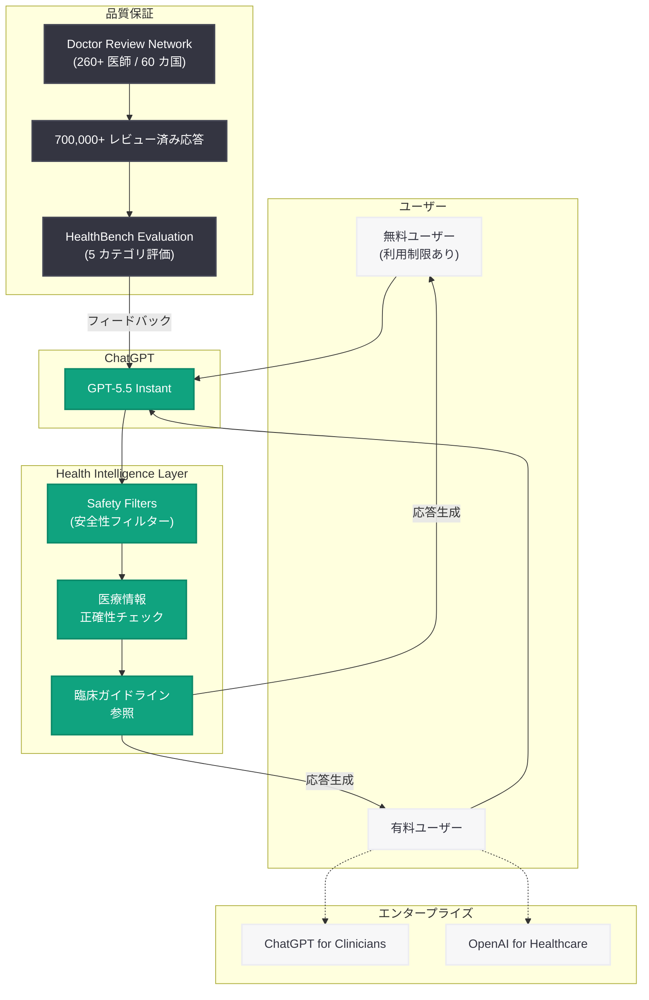

# ChatGPT のヘルスインテリジェンス向上 -- GPT-5.5 Instant による医療情報精度の飛躍的改善

## メタデータ

| 項目 | 内容 |
|------|------|
| 発表日 | 2026-06-18 |
| ソース | OpenAI News/Blog |
| カテゴリ | 新機能 / ヘルスケア AI |
| 公式リンク | https://openai.com/index/improving-health-intelligence-in-chatgpt/ |

## 概要

OpenAI は、ChatGPT のヘルスケア対応能力を大幅に強化する GPT-5.5 Instant モデルの導入を発表した。GPT-5.5 Instant は、高コストな Thinking モデルと同等の性能を HealthBench および HealthBench Professional ベンチマークで達成しながら、コストを大幅に削減している。

毎週 2 億 3,000 万人以上が ChatGPT を健康関連の質問に利用している現状を踏まえ、OpenAI は医療情報の正確性と安全性を最優先課題として位置づけている。GPT-5.5 Instant は GPT-4o および医師が執筆した回答の両方を 5 つの評価カテゴリすべてで上回り、不正確な健康情報の発生率を過去 2 ヶ月間で 71% 削減した。

## 主な内容

### GPT-5.5 Instant モデルの性能

GPT-5.5 Instant は、医療情報の質において飛躍的な改善を実現している。

- **HealthBench スコア:** 高コストな Thinking モデルと同等の性能をフラクションコストで達成
- **指示遵守率:** 最大 89.9% のスコアを記録
- **不正確情報の削減:** 誤った健康情報の発生率が過去 2 ヶ月間で 71% 低下
- **GPT-4o との比較:** 5 つの評価カテゴリすべてで GPT-4o を上回る
- **医師執筆回答との比較:** 医師が書いた回答よりも高い評価を獲得

### 無料ユーザーへの提供

GPT-5.5 Instant による医療情報改善機能は、すべての無料 ChatGPT ユーザーに提供される (利用制限あり)。これにより、有料プランに加入していないユーザーも高精度な医療情報にアクセスできるようになった。

### 医師ネットワークによる品質保証

OpenAI は医療情報の品質を担保するため、大規模な医師レビューネットワークを構築している。

- **260 名以上の医師:** 60 カ国以上から参加
- **70 万件以上のレビュー:** モデル応答に対する専門家評価を実施
- **継続的改善:** レビュー結果をモデルの学習と評価に反映

### HealthBench 評価フレームワーク

HealthBench は OpenAI が開発した医療 AI 評価ベンチマークで、以下の 5 つのカテゴリでモデルを評価する。

1. **正確性 (Accuracy):** 医学的事実の正しさ
2. **完全性 (Completeness):** 情報の網羅性
3. **安全性 (Safety):** 有害な情報の回避
4. **指示遵守 (Instruction Following):** ユーザーの質問への適切な対応
5. **有用性 (Helpfulness):** 実用的な情報提供

### エンタープライズ向け製品

OpenAI は個人ユーザー向けの改善に加え、医療機関向けの専用製品も展開している。

- **ChatGPT for Clinicians:** 臨床医向けに最適化された ChatGPT
- **OpenAI for Healthcare:** 医療機関向けエンタープライズソリューション

## 技術的な詳細

### GPT-5.5 Instant のポジショニング

GPT-5.5 Instant は、以下の特徴を持つ医療用途に最適化されたモデルである。

| 特性 | GPT-5.5 Instant | Thinking モデル | GPT-4o |
|------|-----------------|----------------|--------|
| HealthBench スコア | 高 | 高 | 中 |
| コスト | 低 | 高 | 中 |
| レイテンシ | 低 | 高 | 中 |
| 無料ユーザー利用 | 可 | 不可 | 可 |

### HealthBench 参照論文

評価手法の詳細は arXiv 2604.27470v1 に記載されている。HealthBench Professional は、より高度な臨床知識を要するタスクで構成された上位ベンチマークである。

### コードサンプル

```python
from openai import OpenAI

client = OpenAI()

# GPT-5.5 Instant を使用した医療関連クエリ
response = client.chat.completions.create(
    model="gpt-5.5-instant",
    messages=[
        {
            "role": "system",
            "content": (
                "あなたは医療情報を提供するアシスタントです。"
                "正確で安全な情報を提供し、必要に応じて医療専門家への相談を推奨してください。"
            )
        },
        {
            "role": "user",
            "content": "頭痛が3日間続いています。考えられる原因と対処法を教えてください。"
        }
    ],
    temperature=0.3,  # 医療情報には低めの temperature を推奨
)

print(response.choices[0].message.content)
```

```python
from openai import OpenAI

client = OpenAI()

# ストリーミングを使用した医療相談の例
stream = client.chat.completions.create(
    model="gpt-5.5-instant",
    messages=[
        {
            "role": "system",
            "content": (
                "You are a health information assistant. "
                "Provide accurate, evidence-based health information. "
                "Always recommend consulting a healthcare professional for diagnosis and treatment."
            )
        },
        {
            "role": "user",
            "content": "What are the warning signs that a headache requires immediate medical attention?"
        }
    ],
    stream=True,
)

for chunk in stream:
    if chunk.choices[0].delta.content is not None:
        print(chunk.choices[0].delta.content, end="")
```

## アーキテクチャ



## 開発者への影響

- **GPT-5.5 Instant の API 利用:** 医療関連アプリケーションの開発者は、高コストな Thinking モデルの代わりに GPT-5.5 Instant を使用することで、同等の医療情報精度を低コスト・低レイテンシで実現できる
- **ヘルスケアアプリの品質基準:** HealthBench の 5 カテゴリ評価フレームワークは、医療 AI アプリケーションの品質評価基準として活用できる
- **安全性設計の参考:** 260 名以上の医師によるレビューネットワークと 70 万件以上の応答評価という OpenAI のアプローチは、医療 AI 開発における安全性確保のベストプラクティスを示している
- **エンタープライズ連携:** ChatGPT for Clinicians や OpenAI for Healthcare との API 連携により、医療機関向けソリューションの構築が容易になる
- **無料ティアでの提供:** GPT-5.5 Instant が無料ユーザーにも提供されることで、医療情報アクセスの民主化が進み、ヘルスケア AI 市場全体の成長が期待される

## 関連リンク

- [Improving Health Intelligence in ChatGPT (公式発表)](https://openai.com/index/improving-health-intelligence-in-chatgpt/)
- [HealthBench 論文 (arXiv 2604.27470v1)](https://arxiv.org/abs/2604.27470v1)
- [OpenAI for Healthcare](https://openai.com/healthcare)
- [OpenAI API リファレンス](https://platform.openai.com/docs/api-reference)
- [OpenAI News](https://openai.com/news)

## まとめ

OpenAI は GPT-5.5 Instant モデルの導入により、ChatGPT の医療情報提供能力を飛躍的に向上させた。高コストな Thinking モデルと同等の HealthBench スコアを低コストで達成し、不正確な健康情報の発生率を 71% 削減した。60 カ国 260 名以上の医師による 70 万件超のレビューという大規模な品質保証体制に支えられ、毎週 2 億 3,000 万人以上の健康関連クエリに対してより安全で正確な情報提供が可能になった。無料ユーザーを含む全ユーザーへの展開は、医療情報アクセスの民主化における重要なマイルストーンである。
