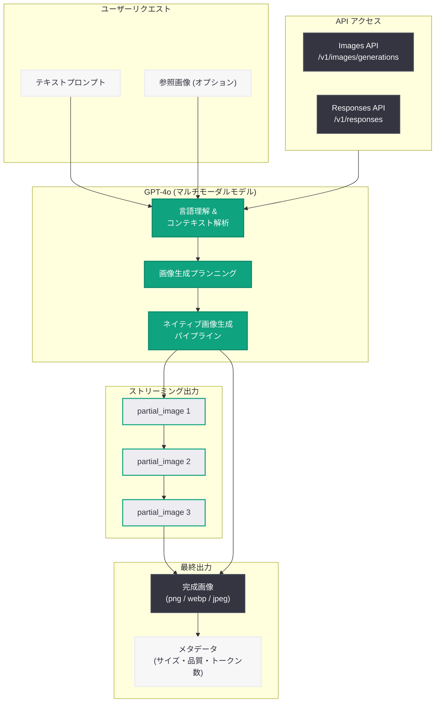

# 4o Image Generation の導入 -- GPT-4o ネイティブ画像生成の新世代

## メタデータ

| 項目 | 内容 |
|------|------|
| 発表日 | 2026-06-18 |
| ソース | OpenAI Product / API |
| カテゴリ | 新機能 / 画像生成 |
| 公式リンク | https://openai.com/index/introducing-4o-image-generation/ |

## 概要

OpenAI は、GPT-4o モデルファミリーにネイティブ画像生成機能を統合した「4o Image Generation」を発表した。従来の DALL-E 3 や専用画像モデル (gpt-image-1、gpt-image-2) とは異なり、会話型モデルに直接画像生成能力を組み込むことで、マルチモーダル理解に基づいたより正確なプロンプト追従と、テキストと画像のシームレスな統合を実現している。

この機能は Images API および Responses API の両方から利用可能であり、ストリーミングによる段階的な画像レンダリングにも対応している。GPT-4o の言語理解力と画像生成能力を統合することで、より文脈を理解した高品質な画像出力が期待できる。

## 主な内容

### ネイティブ画像生成のアプローチ

従来の画像生成では、テキストモデルと画像生成モデルが分離されていたため、複雑なプロンプトの意図を正確に画像に反映することが困難であった。4o Image Generation では、GPT-4o のマルチモーダル理解能力を直接活用することで、以下の改善を実現している.

- **プロンプト追従性の向上:** GPT-4o の高度な言語理解により、複雑な指示や微妙なニュアンスをより正確に画像に反映
- **会話コンテキストの活用:** Responses API を通じてマルチターンの対話の中で画像を生成・編集可能
- **統合的なマルチモーダル体験:** テキスト生成と画像生成を同一モデル内でシームレスに実行

### 画像生成モデルの進化

OpenAI の画像生成技術は以下のように進化してきた.

| 世代 | モデル | 特徴 |
|------|--------|------|
| 第 1 世代 | DALL-E 3 | テキストから画像生成の確立 |
| 第 2 世代 | gpt-image-1 | API ファースト設計、編集機能 |
| 第 3 世代 | gpt-image-1.5 / gpt-image-2 | 高解像度、透過背景、柔軟なサイズ |
| 第 4 世代 | GPT-4o ネイティブ | 会話モデルへの統合、マルチモーダル理解 |

### サポートされるパラメータ

**サイズオプション:**

| サイズ | アスペクト比 | 用途 |
|--------|-------------|------|
| 1024x1024 | 1:1 | 正方形、汎用 |
| 1024x1536 | 2:3 | ポートレート、縦長 |
| 1536x1024 | 3:2 | ランドスケープ、横長 |
| auto | 自動判定 | コンテンツに応じた最適サイズ |

**品質オプション:**

- `low`: 高速生成、コスト重視
- `medium`: バランス型
- `high`: 最高品質
- `auto`: コンテンツに応じた自動選択

**出力フォーマット:**

- `png`: 高品質、透過対応 (デフォルト)
- `webp`: 軽量、Web 向け
- `jpeg`: 高速出力、レイテンシ重視

**背景オプション:**

- `transparent`: 透明背景 (png/webp のみ)
- `opaque`: 不透明背景
- `auto`: 自動判定

### ストリーミング対応

`partial_images` パラメータ (0-3) を設定することで、画像生成の途中経過を段階的に受信できる。ユーザーに対してプログレッシブなレンダリング体験を提供し、体感待ち時間を削減する。

- Responses API: `response.image_generation_call.partial_image` イベント
- Image API: `image_generation.partial_image` イベント

## 技術的な詳細

### Images API でのアクセス

Images API を使用する場合、従来の画像生成エンドポイントと同様のインターフェースで GPT-4o の画像生成機能にアクセスできる。

```python
from openai import OpenAI

client = OpenAI()

response = client.images.generate(
    model="gpt-4o",
    prompt="A serene sunset over the Tokyo skyline with Mt. Fuji in the background",
    size="1536x1024",
    quality="high",
    output_format="png",
    n=1,
)

image_url = response.data[0].url
```

### Responses API でのアクセス (推奨)

Responses API を使用する場合、会話のコンテキストを活用した画像生成が可能になる。`image_generation` ツールを指定することで、モデルが適切なタイミングで画像を生成する。

```python
from openai import OpenAI

client = OpenAI()

response = client.responses.create(
    model="gpt-4o",
    input="Generate an image of a sunset over Tokyo skyline",
    tools=[{"type": "image_generation"}],
)

# Extract image from response
for output in response.output:
    if output.type == "image_generation_call":
        image_data = output.result  # base64-encoded image
```

### ストリーミングによる段階的レンダリング

```python
from openai import OpenAI

client = OpenAI()

stream = client.responses.create(
    model="gpt-4o",
    input="Generate a detailed illustration of a futuristic city",
    tools=[{
        "type": "image_generation",
        "partial_images": 3,
        "quality": "high",
        "size": "1536x1024",
    }],
    stream=True,
)

for event in stream:
    if event.type == "response.image_generation_call.partial_image":
        # Progressive rendering - display intermediate result
        partial_data = event.partial_image  # base64-encoded partial image
        print(f"Received partial image (index: {event.partial_image_index})")
    elif event.type == "response.completed":
        # Final complete image
        for output in event.response.output:
            if output.type == "image_generation_call":
                final_image = output.result
```

### マルチターン編集の例

Responses API を使用すると、会話コンテキストを維持したまま画像を編集できる。

```python
from openai import OpenAI

client = OpenAI()

# Initial generation
response = client.responses.create(
    model="gpt-4o",
    input="Generate an image of a cat sitting on a windowsill",
    tools=[{"type": "image_generation"}],
)

# Follow-up edit using conversation context
response = client.responses.create(
    model="gpt-4o",
    input="Now add a rainbow outside the window",
    tools=[{
        "type": "image_generation",
        "action": "edit",
    }],
    previous_response_id=response.id,
)
```

### 料金体系

4o Image Generation はトークンベースの課金モデルを採用している。入力テキストトークン + 入力画像トークン (編集時) + 出力画像トークンの合計でコストが決定される。

| 品質 | 1024x1024 | 1024x1536 | 1536x1024 |
|------|-----------|-----------|-----------|
| Low | 272 tokens | 408 tokens | 400 tokens |
| Medium | 1,056 tokens | 1,584 tokens | 1,568 tokens |
| High | 4,160 tokens | 6,240 tokens | 6,208 tokens |

Responses API 経由で使用する場合、メインラインモデル (GPT-4o) のテキストトークン使用量も追加される点に注意が必要である。

## アーキテクチャ



## 開発者への影響

- **API 統合の簡素化:** Responses API を使用することで、テキスト生成と画像生成を単一のモデル呼び出しで実現可能。従来のように別途画像生成モデルを呼び出す必要がなくなる
- **マルチターン画像編集:** 会話コンテキストを維持したまま画像を反復的に修正できるため、チャットボットやクリエイティブツールでの画像生成ワークフローが大幅に改善される
- **プロンプトエンジニアリングの効率化:** GPT-4o の言語理解力により、自然な日本語での指示でも高品質な画像が生成可能。従来必要だった詳細なプロンプト設計の負担が軽減される
- **ストリーミング UX の実装:** partial_images パラメータにより、リアルタイムのプログレッシブレンダリングが実装可能。ユーザー体験の向上に直結する
- **コスト設計の変化:** トークンベースの課金により、使用量に応じた柔軟なコスト管理が可能。ただし Responses API 経由の場合はテキストトークンも加算されるため、大量生成時のコスト比較が重要

## 関連リンク

- [4o Image Generation 公式発表](https://openai.com/index/introducing-4o-image-generation/)
- [Image Generation ガイド](https://platform.openai.com/docs/guides/image-generation)
- [Responses API リファレンス](https://platform.openai.com/docs/api-reference/responses)
- [Images API リファレンス](https://platform.openai.com/docs/api-reference/images)
- [OpenAI API Pricing](https://openai.com/api/pricing/)

## まとめ

4o Image Generation は、GPT-4o の会話型 AI モデルにネイティブ画像生成機能を統合した新世代の画像生成ソリューションである。従来の DALL-E シリーズや専用画像モデルからの進化として、マルチモーダル理解に基づくプロンプト追従性の向上、Responses API を通じたマルチターン編集、ストリーミングによる段階的レンダリングなど、開発者とエンドユーザー双方にとって大きな利便性向上をもたらす。Images API と Responses API の 2 つのアクセス方法が提供されており、用途に応じた柔軟な統合が可能である。
