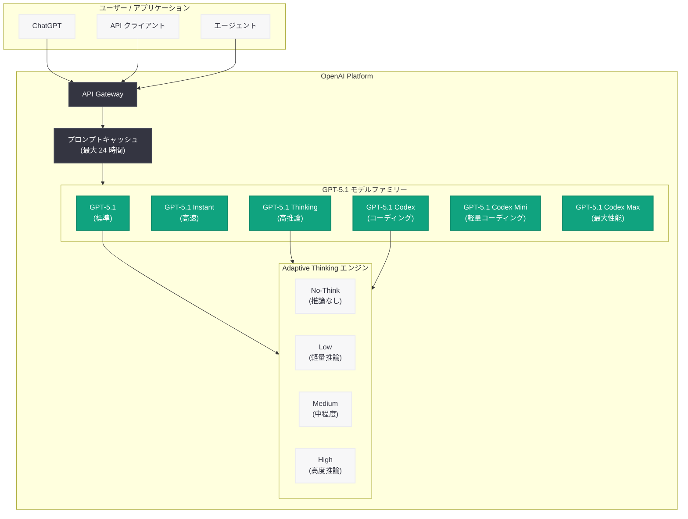

# GPT-5.1 ページ更新 -- Adaptive Thinking とエージェント最適化を備えたモデルファミリーの全容

## メタデータ

| 項目 | 内容 |
|------|------|
| 発表日 | 2026-06-19 |
| ソース | OpenAI Product |
| カテゴリ | モデル / AI 推論 |
| 公式リンク | [openai.com](https://openai.com/index/gpt-5-1/) |

## 概要

OpenAI は GPT-5.1 の公式ページ (https://openai.com/index/gpt-5-1/) を 2026 年 6 月 19 日付で大幅に更新した。GPT-5.1 は 2025 年 11 月 12 日に初回リリースされたモデルであり、GPT-5 (2025 年 8 月 7 日リリース) から約 3 か月後のミッドサイクルアップデートとして位置づけられている。今回のページ更新では、モデルファミリーの全体像や新機能の詳細が追加・整理されたと考えられる。

**注記:** 本記事の作成にあたり、公式ページは Cloudflare のアクセス保護により直接的な全文取得が制限されていた。そのため、本レポートの内容は Web リサーチ、OpenAI API Changelog のデータ、および公開されている技術情報に基づいて構成している。

## 主な内容

### GPT-5.1 モデルファミリーの構成

GPT-5.1 は単一モデルではなく、5 つの大規模言語モデルで構成されるファミリーである。用途や要件に応じて最適なバリアントを選択できる設計となっている。

- **GPT-5.1:** 標準モデル。バランスの取れた性能と速度を提供
- **GPT-5.1 Instant:** 低レイテンシに最適化された高速バリアント
- **GPT-5.1 Thinking:** 推論能力を強化したバリアント
- **GPT-5.1 Codex:** コーディング特化モデル (2025 年 11 月 13 日リリース)
- **GPT-5.1 Codex Mini:** 軽量コーディングモデル (2025 年 11 月 13 日リリース)

さらに、2025 年 12 月 4 日には `gpt-5.1-codex-max` が追加リリースされ、大規模コーディングタスク向けの最大性能バリアントが利用可能になった。

### Adaptive Thinking (適応型推論)

GPT-5.1 の最大の技術的特徴は「Adaptive Thinking」機能である。タスクの複雑さに応じて推論時間を動的に調整する仕組みであり、従来の固定的な推論パイプラインとは根本的に異なるアプローチを採用している。

- **動的な推論時間配分:** 複雑な問題にはより多くの計算リソースを割り当て、単純な問題には最小限の推論で即座に応答
- **No-Think モード:** シンプルなクエリに対しては推論プロセスをスキップし、高速なレスポンスを実現
- **コスト効率の最適化:** タスクに応じた推論リソースの自動配分により、不要な計算コストを削減

### エージェントワークフロー最適化

GPT-5.1 はエージェント (Agentic) ワークフローに特化した最適化が施されている。

- **ステアラビリティの向上:** エージェントの行動指示に対する遵守性の改善
- **コード生成の強化:** 自律的なコーディングタスクにおける精度と効率の向上
- **マルチステップ推論:** 複雑なタスクを段階的に分解し、自律的に遂行する能力

### ChatGPT 体験の改善

GPT-5.1 は ChatGPT でのユーザー体験も大きく改善している。

- **温かみのある会話トーン:** より自然で人間的な対話スタイル
- **カスタマイズ可能なトーンとスタイル:** ユーザーの好みに合わせた応答スタイルの調整
- **高速レスポンス:** デフォルトで推論設定が "none" に設定され、日常的な会話での応答速度が向上

## 技術的な詳細

### 推論設定 (Reasoning Settings)

GPT-5.1 の API では、推論の動作を細かく制御するためのパラメータが提供されている。

| パラメータ | 値 | 説明 |
|-----------|-----|------|
| `reasoning_effort` | `"none"` | 推論なし (デフォルト)。最速レスポンス |
| `reasoning_effort` | `"low"` | 軽量推論。簡単な分析タスク向け |
| `reasoning_effort` | `"medium"` | 中程度の推論。一般的なタスク向け |
| `reasoning_effort` | `"high"` | 高度な推論。複雑な問題解決向け |

GPT-5.1 はデフォルトで `"none"` に設定されている点が特筆すべき特徴である。これにより、開発者が明示的に推論を要求しない限り、最速のレスポンスが返される。

### プロンプトキャッシュ

GPT-5.1 では、プロンプトキャッシュの保持期間が最大 24 時間に延長された。これにより、繰り返し利用されるシステムプロンプトやコンテキストのキャッシュヒット率が向上し、レイテンシとコストの両面で恩恵を受けることができる。

### モデルバリアントの API 識別子

| モデル | API 識別子 | リリース日 |
|--------|-----------|-----------|
| GPT-5.1 | `gpt-5.1` | 2025-11-12 |
| GPT-5.1 Instant | `gpt-5.1-instant` | 2025-11-12 |
| GPT-5.1 Thinking | `gpt-5.1-thinking` | 2025-11-12 |
| GPT-5.1 Codex | `gpt-5.1-codex` | 2025-11-13 |
| GPT-5.1 Codex Mini | `gpt-5.1-codex-mini` | 2025-11-13 |
| GPT-5.1 Codex Max | `gpt-5.1-codex-max` | 2025-12-04 |

### コードサンプル

```python
from openai import OpenAI

client = OpenAI()

# GPT-5.1 の基本的な利用 (デフォルト: 推論なし、高速レスポンス)
response = client.chat.completions.create(
    model="gpt-5.1",
    messages=[
        {"role": "system", "content": "You are a helpful assistant."},
        {"role": "user", "content": "What is the capital of France?"}
    ]
)
print(response.choices[0].message.content)


# Adaptive Thinking を活用した高度な推論
response = client.chat.completions.create(
    model="gpt-5.1",
    messages=[
        {"role": "system", "content": "You are an expert mathematician."},
        {"role": "user", "content": "Prove that the sum of two even numbers is always even."}
    ],
    reasoning_effort="high"  # 複雑なタスクには高い推論レベルを指定
)
print(response.choices[0].message.content)


# GPT-5.1 Codex を使用したコード生成
response = client.chat.completions.create(
    model="gpt-5.1-codex",
    messages=[
        {
            "role": "system",
            "content": "You are an expert software engineer. Write clean, well-documented code."
        },
        {
            "role": "user",
            "content": "Implement a thread-safe LRU cache in Python with O(1) operations."
        }
    ],
    reasoning_effort="medium"
)
print(response.choices[0].message.content)


# GPT-5.1 Instant で低レイテンシ応答
response = client.chat.completions.create(
    model="gpt-5.1-instant",
    messages=[
        {"role": "user", "content": "Translate 'Hello, world!' to Japanese."}
    ]
)
print(response.choices[0].message.content)
```

> **注:** 上記のコード例は公開情報に基づく一般的な利用パターンの想定である。実際のパラメータ名や利用可能なオプションの詳細は、OpenAI の公式 API ドキュメントを参照されたい。

## アーキテクチャ



## 開発者への影響

### レスポンス速度の大幅改善

GPT-5.1 のデフォルト推論設定が "none" であることにより、日常的な API 呼び出しにおけるレスポンス速度が大幅に改善される。開発者は、推論が不要な単純なタスク (翻訳、要約、分類など) でコストと時間を節約できる。

- シンプルなクエリではレイテンシが大幅に削減
- 推論が必要な場合のみ `reasoning_effort` パラメータで明示的に指定
- トークン使用量の削減によるコスト最適化

### エージェント開発の加速

GPT-5.1 はエージェントワークフローに最適化されているため、AI エージェントの開発が加速する。

- ステアラビリティの向上により、エージェントの行動制御が容易に
- Adaptive Thinking による動的なリソース配分で、エージェントの効率が向上
- Codex バリアントによる自律的なコーディングエージェントの構築が現実的に

### プロンプトキャッシュの戦略的活用

24 時間のキャッシュ保持により、以下のユースケースで特に大きなメリットがある。

- 長大なシステムプロンプトを使用するアプリケーション
- 同一コンテキストで繰り返し呼び出されるバッチ処理
- ユーザーセッション内での連続的な対話

### 移行時の注意点

- GPT-5 から GPT-5.1 への移行では、デフォルトの推論設定が変更されている点に注意が必要
- 推論を前提としたプロンプト設計をしている場合、`reasoning_effort` の明示的な指定が必要
- Codex バリアントの選択基準 (Mini vs 標準 vs Max) をタスク要件に応じて検討すべき

## 関連リンク

- [GPT-5.1 公式ページ](https://openai.com/index/gpt-5-1/)
- [OpenAI API Changelog](https://platform.openai.com/docs/changelog)
- [OpenAI API ドキュメント](https://platform.openai.com/docs)
- [OpenAI モデル一覧](https://platform.openai.com/docs/models)
- [OpenAI Pricing](https://openai.com/pricing)

## まとめ

GPT-5.1 は GPT-5 ファミリーのミッドサイクルアップデートとして、速度・効率・開発者体験の 3 つの軸で大きな進化を遂げたモデルファミリーである。最大の特徴である Adaptive Thinking により、タスクの複雑さに応じた動的な推論時間配分が可能になり、不要な計算コストを排除しつつ高度な問題解決能力を維持する。5 つのバリアントから成るモデルファミリーは、高速応答が求められるリアルタイムアプリケーションから、高度なコーディングタスクまで幅広いユースケースをカバーする。デフォルトで推論を行わない設計思想は、API 利用のコスト効率を根本的に改善し、エージェントワークフローとの親和性を高めている。2026 年 6 月 19 日のページ更新は、これらの機能が成熟し広く利用可能になったことを示す重要なマイルストーンと言える。
