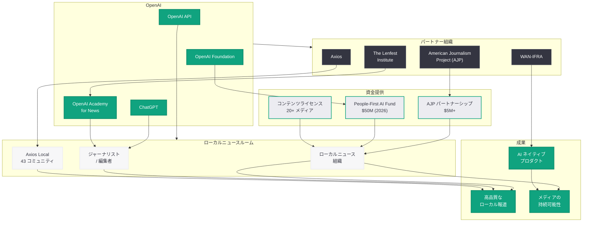

# OpenAI とジャーナリズム -- ローカルニュース支援とメディアパートナーシップの全体像

## メタデータ

| 項目 | 内容 |
|------|------|
| 発表日 | 2026-06-19 |
| ソース | OpenAI News |
| カテゴリ | パートナーシップ / ジャーナリズム |
| 公式リンク | [openai.com/index/openai-and-journalism/](https://openai.com/index/openai-and-journalism/) |

## 概要

OpenAI は「OpenAI and Journalism」と題した記事を公開し、ジャーナリズム分野における同社の包括的な取り組みとパートナーシップの全体像を示した。ローカルニュースの持続可能性支援、報道機関向けの AI 教育プログラム、コンテンツライセンス契約、そして非営利組織への資金提供など、多角的なアプローチでジャーナリズムの未来を支えるエコシステムを構築している。

**注記:** 本記事は Cloudflare のアクセス保護により直接的なコンテンツ取得が制限されていたため、本レポートの内容は Web リサーチおよび関連する公式発表に基づいて構成している。

## 主な内容

### OpenAI Academy for News Organizations

OpenAI は American Journalism Project (AJP) および The Lenfest Institute と提携し、報道機関向けの教育ハブ「OpenAI Academy for News Organizations」を設立した。このプログラムはジャーナリスト、編集者、パブリッシャーを対象とし、以下の目標を掲げている。

- **調査報道への AI 活用:** AI ツールを活用した調査報道手法の習得を支援し、ローカルニュースルームの調査能力を強化する
- **ビジネスオペレーションの改善:** 広告収入の最適化、購読者管理、コスト削減など、報道機関の経営面での AI 活用を推進する
- **持続可能性の向上:** ローカルニュースが直面する経営課題に対し、AI を活用した新しい収益モデルや業務効率化の手法を提供する
- **責任ある AI 導入:** ジャーナリズムの倫理基準を維持しながら AI を導入するためのガイドラインとベストプラクティスを共有する

### OpenAI と Axios のローカルニュース拡大パートナーシップ

OpenAI は Axios との複数年にわたるパートナーシップを通じて、ローカルニュースのカバレッジを大幅に拡大している。2026 年の主な展開は以下の通りである。

- **9 つの新しいローカルコミュニティへの展開:** Axios Local が新たに 9 つの都市 / 地域でサービスを開始
- **合計 43 コミュニティへの拡大:** パートナーシップにより Axios Local の配信地域が合計 43 コミュニティに到達
- **新規記者の採用:** コロラド州、アリゾナ州、フロリダ州、オハイオ州で新たにローカル記者を採用
- **AI 支援によるスケーラビリティ:** AI ツールを活用することで、少人数の記者チームでも質の高いローカル報道を維持

### American Journalism Project (AJP) パートナーシップ

OpenAI は American Journalism Project と 500 万ドル以上の規模のパートナーシップを締結し、AI がローカルニュースの活性化にどのように貢献できるかを探索している。

- **投資規模:** 500 万ドル以上 ($5+ million)
- **目的:** AI が繁栄し革新的なローカルニュース分野を支援する方法の探索
- **ビジョン:** ローカルニュース組織が AI の未来を形作る側に立つことを保証する
- **対象:** 全米各地のローカルニュース組織、特に経営基盤の脆弱な小規模メディア

### WAN-IFRA プログラム

World Association of News Publishers (WAN-IFRA) と連携した 6 か月間のプログラムを通じて、ニュースパブリッシャー向けの AI ネイティブなプロダクト開発を支援している。

- **期間:** 6 か月間のプログラム
- **目標:** AI ネイティブなプロダクト開発を通じて高品質なジャーナリズムを支援し、読者体験を向上させる
- **対象:** 世界各地のニュースパブリッシャー
- **アプローチ:** ハンズオンのワークショップ、メンタリング、技術サポートを組み合わせた実践的プログラム

### 2026 People-First AI Fund

OpenAI Foundation は 2026 年に 5,000 万ドル (5000 万ドル) の資金を投入し、AI に取り組む非営利組織を支援する「People-First AI Fund」を運営している。

- **総額:** 5,000 万ドル ($50 million)
- **申請期限:** 2026 年 7 月 15 日
- **対象:** AI の社会的活用に取り組む非営利組織
- **ジャーナリズムとの関連:** ローカルニュースの非営利組織も申請対象に含まれる

### コンテンツライセンスネットワーク

OpenAI は 20 以上のメディア組織とコンテンツライセンス契約を締結しており、AI モデルのトレーニングやサービス提供において報道コンテンツを正当に利用するための枠組みを構築している。

- **契約数:** 20 以上のメディア組織
- **目的:** AI モデルの学習データとしての利用、ChatGPT での情報提供における引用
- **原則:** 著作権の尊重、公正な対価の支払い、メディア組織の持続可能性への貢献

## 技術的な詳細

### ジャーナリズムにおける AI 活用パターン

OpenAI のジャーナリズム支援プログラムで想定される AI の技術的活用領域は、以下のように分類される。

#### 取材・調査支援

- **データ分析:** 公共データベース、財務情報、議事録などの大規模データからパターンを発見し、調査報道の端緒を提供する
- **文書解析:** 大量の公文書やリーク文書の自動分類、要約、クロスリファレンス生成
- **トレンド検出:** 地域の犯罪統計、経済指標、環境データなどからニュース性のあるトレンドを自動検出する

#### 編集・制作支援

- **ドラフト補助:** 記者が書いた記事の校正、ファクトチェック候補の提示、代替見出しの生成
- **多言語対応:** 地域の多様な言語コミュニティ向けにコンテンツを翻訳・ローカライズする
- **マルチメディア生成:** テキスト記事から要約動画のスクリプトやインフォグラフィックの素案を生成する

#### ビジネス・運営支援

- **広告最適化:** 読者データに基づく広告配信の最適化、収益予測モデルの構築
- **購読者分析:** 解約リスクの予測、エンゲージメント向上のための施策提案
- **コスト最適化:** 反復的な編集作業の自動化による運営コスト削減

## アーキテクチャ

以下の図は、OpenAI のジャーナリズムエコシステムの全体構造を示している。

## 開発者への影響

### メディア技術者・パブリッシャーへのインパクト

OpenAI のジャーナリズム戦略は、メディア業界の技術者やパブリッシャーに以下の影響をもたらす。

- **API 活用の拡大:** ニュースルーム向けの AI ツール開発において、OpenAI API の Chat Completions、Assistants API、Embeddings などの活用機会が広がる
- **カスタム GPT の報道活用:** 報道機関固有のスタイルガイドや編集ポリシーを組み込んだカスタム GPT の構築が可能になる
- **データパイプラインの構築:** 公共データの収集から分析、記事ドラフト生成までのパイプラインを API を用いて自動化する事例が増加する

### ビジネスモデルへの示唆

- **コンテンツライセンスの収益化:** 20 以上のメディア組織とのライセンス契約は、報道機関にとって新たな収益源となる可能性を示している
- **AI 支援による収益拡大:** Axios の事例が示すように、AI を活用してカバレッジを 43 コミュニティに拡大するモデルは、ローカルメディアの成長戦略のリファレンスとなる
- **非営利モデルとの両立:** People-First AI Fund を通じた非営利報道組織への支援は、商業メディアだけでなく公共ジャーナリズムの持続可能性にも貢献する

### AI 倫理とジャーナリズム

- **責任ある AI 利用のガイドライン:** OpenAI Academy for News Organizations が提供する教育リソースは、AI を導入する報道機関が編集の独立性と正確性を維持するための指針となる
- **透明性の確保:** AI が関与した記事制作プロセスにおいて、読者への透明性をどのように確保するかというフレームワークが形成されつつある
- **バイアスへの対処:** AI モデルが持ちうる偏りがジャーナリズムに影響を与えないよう、適切な検証プロセスの設計が求められる

## 関連リンク

- [OpenAI and Journalism (公式)](https://openai.com/index/openai-and-journalism/)
- [OpenAI Academy](https://openai.com/academy)
- [American Journalism Project](https://www.theajp.org/)
- [The Lenfest Institute](https://www.lenfestinstitute.org/)
- [WAN-IFRA](https://wan-ifra.org/)
- [Axios Local](https://www.axios.com/local)
- [関連レポート: Axios が AI を活用して高インパクトなローカルジャーナリズムを実現する方法](2026-03-04-axios-ai-journalism.md)
- [関連レポート: OpenAI Academy を正式ローンチ](2026-04-10-openai-academy-launch.md)
- [関連レポート: People-First AI Fund](2026-04-15-people-first-ai-fund.md)
- [関連レポート: People-First AI Fund Grantees](2026-04-20-people-first-ai-fund-grantees.md)
- [OpenAI News](https://openai.com/news)

## まとめ

OpenAI のジャーナリズム支援戦略は、単なる技術提供にとどまらず、資金提供、教育、パートナーシップ、コンテンツライセンスという多層的なアプローチでメディアエコシステム全体の強化を目指している。American Journalism Project との 500 万ドル以上のパートナーシップ、Axios との複数年契約による 43 コミュニティへのローカルニュース拡大、WAN-IFRA との 6 か月間の AI ネイティブプロダクト開発プログラム、そして OpenAI Foundation による 5,000 万ドルの People-First AI Fund は、いずれもジャーナリズムの持続可能性と革新を同時に追求する取り組みである。OpenAI Academy for News Organizations を通じた報道機関向けの教育プログラムは、AI の責任ある導入を保証する重要な基盤であり、ローカルニュース組織が AI の恩恵を受けるだけでなく、AI の未来を形作る主体となることを目指している。20 以上のメディア組織とのコンテンツライセンス契約と合わせ、OpenAI はジャーナリズムとの共存・共栄モデルを業界に提示している。
