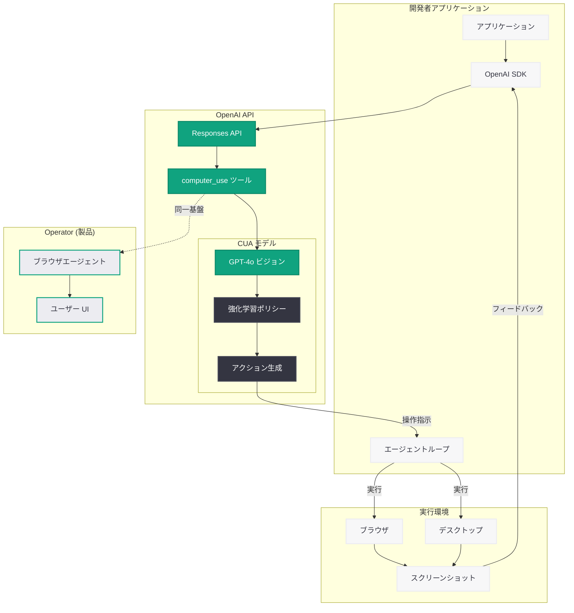

# Computer-Using Agent (CUA) -- コンピュータ操作 AI の API 公開

> **注記:** 本記事の公式ページは Cloudflare によるアクセス保護が適用されており、直接的なコンテンツ取得が制限されている。本レポートの内容は、OpenAI の公開情報、サイトマップデータ (lastmod: 2026-06-20T08:53:09.429Z)、および関連する CUA / Operator の発表履歴に基づいて構成している。

## メタデータ

| 項目 | 内容 |
|------|------|
| 発表日 | 2026-06-20 |
| ソース | OpenAI Product / Release |
| カテゴリ | AI エージェント / プロダクト |
| 公式リンク | https://openai.com/index/computer-using-agent/ |

## 概要

OpenAI は 2026 年 6 月 20 日、Computer-Using Agent (CUA) に関するページを公開した。CUA は AI がコンピュータのインターフェースを人間と同様に操作する技術であり、GPT-4o のビジョン能力と強化学習を組み合わせた専用モデルによって実現される。同日に Operator (CUA を基盤とするブラウザエージェント製品) のページも更新されており、CUA エコシステム全体の大規模なアップデートが実施されたことが示唆される。

CUA のリリースサイトマップ上での独立した公開は、Operator というコンシューマー向け製品とは別に、CUA モデル / API 自体が開発者向けに一般提供 (GA) されたことを意味する可能性が高い。これにより、開発者は Responses API の `computer_use` ツールを通じて、独自のコンピュータ操作エージェントを構築できるようになる。

## 主な内容

### CUA とは何か

Computer-Using Agent (CUA) は、スクリーンショットの視覚情報を解析し、マウスクリック、キーボード入力、スクロール、ドラッグアンドドロップなどの GUI 操作を自律的に実行する AI モデルである。従来の API ベースの自動化 (DOM セレクタや API エンドポイントに依存) とは根本的に異なり、人間がコンピュータを操作する方法そのものを AI が模倣する。

**CUA の核心的な能力:**

- **視覚認識:** スクリーンショットからボタン、メニュー、テキストフィールド、アイコンなどの UI 要素を識別
- **空間推論:** 画面上の座標を理解し、適切なクリック位置やスクロール方向を判断
- **GUI インタラクション:** マウスクリック、キーボード入力、ドラッグアンドドロップ、修飾キー付き操作を生成
- **マルチステップ計画:** 複雑なタスクを分解し、ステップごとに実行計画を立案・修正
- **エラー回復:** 操作の結果を視覚的に確認し、期待通りでない場合に代替戦略を実行

### CUA の進化の歴史

| 時期 | マイルストーン |
|------|--------------|
| 2025 年初頭 | CUA モデル初回発表、Operator に搭載 |
| 2025 年 8 月 | Operator サービス終了、ChatGPT Agent に統合 |
| 2026 年 3 月 11 日 | Responses API にコンピュータ環境を装備 (Shell ツール) |
| 2026 年 3 月 25 日 | SDK v2.30.0 で Computer Action に keys フィールド追加 |
| 2026 年 6 月 20 日 | CUA ページ公開 (本発表)、Operator 再始動 |

### Operator との関係

CUA と Operator は以下のように位置付けられる.

- **CUA:** 基盤となる AI モデル / API 技術。開発者が自由にアプリケーションに組み込める
- **Operator:** CUA を搭載した OpenAI の公式ブラウザエージェント製品。エンドユーザー向け

同日に両ページが更新されたことは、CUA 技術がモデル / API レベルで開発者に解放されると同時に、OpenAI 自身のプロダクトとしても Operator が再始動したことを示している。

### 開発者向け API としての CUA

CUA の API 公開により、開発者は以下のようなアプリケーションを構築可能になる.

- **カスタム RPA ソリューション:** レガシーシステムの GUI 操作を AI で自動化
- **テスト自動化:** Web アプリケーションやデスクトップアプリのビジュアルテスト
- **ユーザーサポートエージェント:** 画面を共有しながら操作を代行するアシスタント
- **データ入力自動化:** フォーム入力や転記作業の自律実行
- **マルチアプリケーション連携:** API が存在しないアプリケーション間のデータ連携

## 技術的な詳細

### CUA モデルのアーキテクチャ

CUA モデルは以下の技術要素で構成される.

1. **GPT-4o ビジョンエンコーダ:** スクリーンショットを解析し、UI 要素のセマンティック情報を抽出
2. **強化学習ポリシー:** GUI 操作の最適なアクション系列を学習。タスク完了率とステップ効率で報酬を定義
3. **アクションスペース:** click、double_click、type、scroll、keypress、drag、move、wait の各操作型
4. **修飾キーサポート:** keys フィールドによる Ctrl+Click、Shift+Drag 等の複合操作 (SDK v2.30.0 以降)
5. **状態追跡:** 各ステップの画面状態を視覚的に追跡し、操作結果を確認してから次アクションを決定

### Responses API での利用

CUA は Responses API の `computer_use` ツールタイプを通じて利用する。開発者はスクリーンショットを送信し、モデルが次に実行すべき操作を返却するループを構築する。

### コードサンプル

```python
from openai import OpenAI
import base64

client = OpenAI()

# CUA エージェントの基本的な実行ループ
def run_cua_agent(task: str, screenshot_path: str):
    """Computer-Using Agent を使用してタスクを実行する"""

    # スクリーンショットを Base64 エンコード
    with open(screenshot_path, "rb") as f:
        screenshot_b64 = base64.b64encode(f.read()).decode()

    # Responses API で CUA を呼び出し
    response = client.responses.create(
        model="computer-use-preview",
        tools=[{
            "type": "computer_use_preview",
            "display_width": 1920,
            "display_height": 1080,
            "environment": "browser"
        }],
        input=[
            {
                "role": "user",
                "content": [
                    {"type": "text", "text": task},
                    {
                        "type": "image_url",
                        "image_url": {
                            "url": f"data:image/png;base64,{screenshot_b64}"
                        }
                    }
                ]
            }
        ]
    )

    return response


# マルチステップでの CUA ループ実行
def cua_loop(task: str, initial_screenshot_path: str, max_steps: int = 20):
    """CUA エージェントをループで実行し、タスク完了まで操作を繰り返す"""

    screenshot_path = initial_screenshot_path
    previous_calls = []

    for step in range(max_steps):
        with open(screenshot_path, "rb") as f:
            screenshot_b64 = base64.b64encode(f.read()).decode()

        # 入力メッセージを構築
        input_messages = [
            {"role": "user", "content": task}
        ]

        # 前回の操作結果をフィードバック
        if previous_calls:
            input_messages.append({
                "type": "computer_call_output",
                "call_id": previous_calls[-1]["call_id"],
                "output": {
                    "type": "computer_screenshot",
                    "image_url": f"data:image/png;base64,{screenshot_b64}"
                }
            })

        response = client.responses.create(
            model="computer-use-preview",
            tools=[{
                "type": "computer_use_preview",
                "display_width": 1920,
                "display_height": 1080,
                "environment": "browser"
            }],
            input=input_messages
        )

        # レスポンスからアクションを抽出
        for item in response.output:
            if item.type == "computer_call":
                action = item.action
                print(f"Step {step + 1}: {action.type} at ({action.x}, {action.y})")

                # アクションを実行環境に送信 (実装は環境依存)
                execute_action(action)

                previous_calls.append({
                    "call_id": item.call_id,
                    "action": action
                })
            elif item.type == "message":
                print(f"Agent: {item.content[0].text}")
                return response  # タスク完了

    return response


def execute_action(action):
    """アクションを実行環境に送信する (実装例)"""
    if action.type == "click":
        # keys フィールドで修飾キーもサポート
        keys = getattr(action, "keys", [])
        print(f"  Click ({action.x}, {action.y}) keys={keys}")
    elif action.type == "type":
        print(f"  Type: {action.text}")
    elif action.type == "scroll":
        print(f"  Scroll: direction={action.direction}")
    elif action.type == "drag":
        print(f"  Drag: ({action.start_x}, {action.start_y}) -> "
              f"({action.end_x}, {action.end_y})")
```

> **注:** 上記のコード例は、CUA API の公開情報と Responses API の既知の仕様に基づく想定実装パターンである。実際のパラメータ名やモデル ID については公式ドキュメントを参照してください。

## アーキテクチャ



## 開発者への影響

### GUI 自動化の民主化

- **API 非対応サービスの自動化:** API が提供されていないレガシーシステムや Web アプリケーションを、CUA を使って GUI レベルで操作可能になる
- **RPA の次世代化:** DOM セレクタやピクセル座標に依存する従来の RPA と異なり、UI 変更に対して視覚的に適応する堅牢な自動化が実現できる
- **低コストなプロトタイピング:** 自然言語でタスクを指示するだけで、複雑な GUI 操作フローを素早く検証可能

### 既存ツールとの差別化

| 項目 | 従来の RPA / Selenium | CUA API |
|------|----------------------|---------|
| UI 変更への耐性 | DOM セレクタ変更で破綻 | 視覚認識により自動適応 |
| セットアップコスト | 個別のセレクタ定義が必要 | 自然言語でタスク指示 |
| マルチプラットフォーム | ブラウザ限定が多い | ブラウザ + デスクトップ対応 |
| エラーハンドリング | 固定リトライロジック | 文脈に応じた判断と修復 |
| 修飾キー操作 | 個別実装が必要 | keys フィールドでネイティブ対応 |

### Responses API エコシステムとの統合

- **Shell ツールとの併用:** CUA (GUI 操作) と Shell ツール (CLI 操作) を組み合わせることで、あらゆるコンピュータ操作をカバーするエージェントを構築可能
- **Agents SDK との連携:** Python / TypeScript SDK を通じて、CUA をマルチエージェントワークフローの一部として組み込み可能
- **ホステッドコンテナ環境:** OpenAI が提供するサンドボックス環境内で安全に CUA を実行可能

### セキュリティ上の考慮事項

- CUA に機密情報を扱わせる場合、適切なユーザー確認フローの実装が不可欠
- 操作ログの記録と監査証跡の確保が推奨される
- サンドボックス環境での実行により、意図しないシステム変更のリスクを低減すべき

## 関連リンク

- [Computer-Using Agent 公式ページ](https://openai.com/index/computer-using-agent/)
- [Introducing Operator](https://openai.com/index/introducing-operator/)
- [Responses API ドキュメント](https://platform.openai.com/docs/api-reference/responses)
- [Computer Use ガイド](https://platform.openai.com/docs/guides/computer-use)
- [OpenAI Agents SDK](https://github.com/openai/openai-agents-python)
- [SDK v2.30.0 -- Computer Action keys フィールド追加](https://github.com/openai/openai-python/releases/tag/v2.30.0)

## まとめ

2026 年 6 月 20 日の CUA ページ公開は、OpenAI のコンピュータ操作 AI 技術が開発者向け API として本格展開される重要なマイルストーンである。CUA は GPT-4o のビジョン能力と強化学習を組み合わせ、スクリーンショットの視覚情報から UI 要素を認識し、マウスやキーボード操作を自律的に実行する。Responses API の `computer_use` ツールとして提供されることで、開発者は独自のコンピュータ操作エージェントを構築でき、API が存在しないアプリケーションの自動化や、視覚ベースの堅牢な RPA の構築が可能になる。同日の Operator 再始動と合わせ、OpenAI は CUA 技術をプラットフォーム (API) とプロダクト (Operator) の両面から展開する戦略を明確にした。
