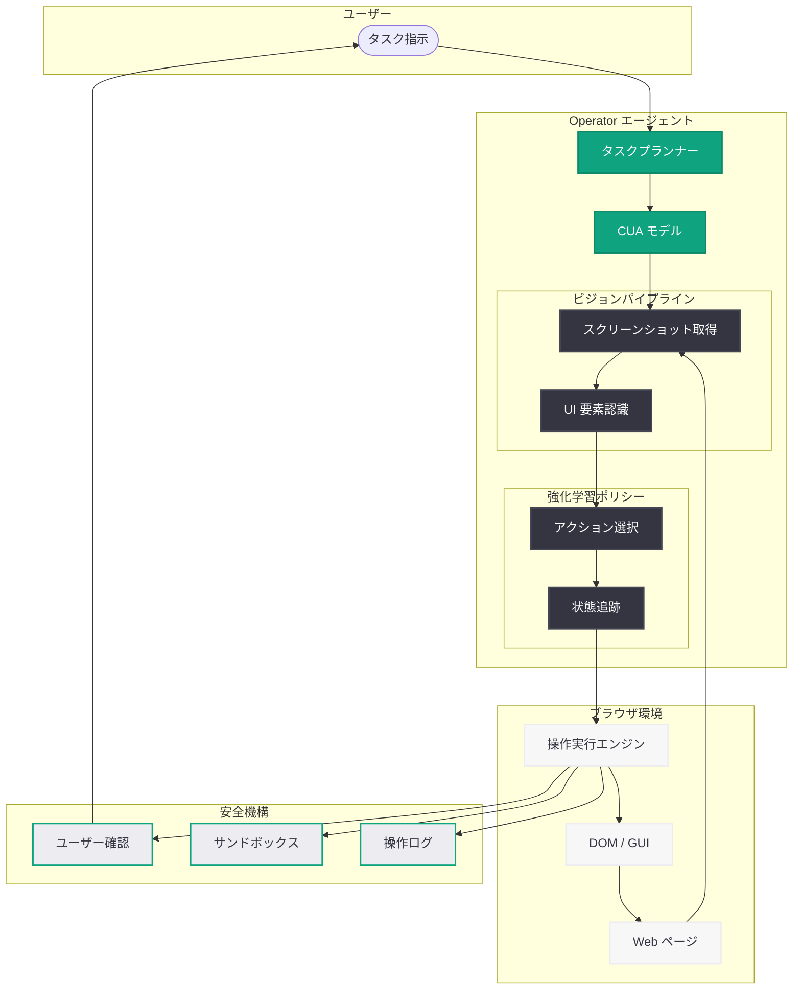

# Introducing Operator -- AI ブラウザエージェントの再始動

## メタデータ

| 項目 | 内容 |
|------|------|
| 発表日 | 2026-06-20 |
| ソース | OpenAI Product |
| カテゴリ | AI エージェント / プロダクト |
| 公式リンク | https://openai.com/index/introducing-operator/ |

## 概要

OpenAI は、ブラウザベースのタスクを自律的に実行する AI エージェント「Operator」のページを更新した (lastmod: 2026-06-20)。Operator は Computer-Using Agent (CUA) モデルを基盤とし、GUI 操作 (ボタンクリック、メニュー選択、テキスト入力) を AI が直接実行できるプロダクトである。

なお、本記事の公式ページは Cloudflare によるアクセス保護が適用されており、直接的なコンテンツ取得が制限されている。本レポートの内容は、OpenAI の公式発表履歴、プロダクトコンテキスト、および Web 上の公開情報に基づいて構成している。

Operator は 2025 年初頭に初回ローンチされ、同年 8 月 31 日に一度サービスを終了し、その機能は ChatGPT Agent に統合された。2026 年 6 月のページ更新は、独立プロダクトとしての再始動または大幅なアップデートを示唆している。

## 主な内容

### Operator の基本コンセプト

Operator は「AI がデジタル世界と対話するためのユニバーサルインターフェース」を目指すプロダクトである。従来の API ベースの自動化とは異なり、人間と同じように Web ブラウザの GUI を操作してタスクを完了する。

主なユースケースは以下の通り.

- **Web 上のタスク自動化:** フォーム入力、予約手続き、情報検索
- **マルチステップワークフロー:** 複数のサイトをまたいだ一連の操作
- **反復的な業務の代行:** 定型的なブラウザ操作の自律実行

### Computer-Using Agent (CUA) モデル

Operator の中核技術である CUA モデルは、GPT-4o のビジョン能力と強化学習による高度な推論を組み合わせた専用モデルである。

**主要な技術特性:**

- **視覚認識:** スクリーンショットからボタン、メニュー、テキストフィールドなどの UI 要素を認識
- **空間推論:** 画面上の座標を理解し、クリック位置やスクロール方向を判断
- **GUI インタラクション:** マウスクリック、キーボード入力、ドラッグアンドドロップなどの操作を生成
- **マルチステップ計画:** タスク全体を分解し、ステップごとに実行計画を立案

### 初回ローンチから再始動までの経緯

| 時期 | 出来事 |
|------|--------|
| 2025 年初頭 | Operator 初回ローンチ (CUA モデル搭載) |
| 2025 年 8 月 31 日 | Operator サービス終了 |
| 2025 年後半 | 機能が ChatGPT Agent に統合 |
| 2026 年 6 月 20 日 | 公式ページ更新 (再始動を示唆) |

### 2026 年のエージェント競争環境

Operator の再始動は、AI エージェント市場の急速な成長を背景としている.

- **Anthropic Claude Computer Use:** Claude モデルによるデスクトップ操作エージェント
- **Devin:** ソフトウェアエンジニアリング特化のエージェント
- **Manus:** 汎用タスク実行エージェント

OpenAI 自身も Codex エージェント、Agents SDK、Responses API エージェントフレームワークなど、エージェント技術のエコシステムを拡充しており、Operator はその GUI 操作レイヤーを担う位置付けである。

## 技術的な詳細

### CUA モデルのアーキテクチャ

CUA モデルは以下の技術要素を統合している.

1. **GPT-4o ビジョンエンコーダ:** ブラウザのスクリーンショットをリアルタイムで解析し、UI 要素のセマンティック情報を抽出
2. **強化学習ポリシー:** GUI 操作の最適なアクション系列を学習。報酬はタスク完了率とステップ効率で定義
3. **アクションスペース:** クリック (座標指定)、タイプ (テキスト入力)、スクロール、キー押下、待機の 5 種類
4. **状態管理:** 各ステップの画面状態を追跡し、操作の結果を確認してから次のアクションを決定

### 安全性とセキュリティ

Operator は機密情報を扱う操作に対して以下の安全機構を備えている.

- **ユーザー確認フロー:** 決済やアカウント設定変更など重要操作の前に人間の確認を要求
- **サンドボックス実行:** ブラウザ環境の隔離による意図しない操作の防止
- **操作ログ:** 全アクションの記録と再現性の確保

### API との関係

Operator は Responses API のエージェントフレームワークと連携する設計となっている。`computer` ツールタイプを通じて、開発者がプログラム的にブラウザ操作エージェントを組み込むことが可能である。

## アーキテクチャ

## 開発者への影響

### API 統合の可能性

Operator の再始動により、開発者は以下の恩恵を受ける可能性がある.

- **Responses API の `computer` ツール:** ブラウザ操作エージェントをアプリケーションに組み込む API アクセス
- **Agents SDK との連携:** Python / TypeScript SDK を通じた Operator 機能のプログラム的制御
- **カスタムワークフロー構築:** 特定業務に特化したブラウザ自動化パイプラインの開発

### 既存自動化ツールとの差別化

| 項目 | 従来の RPA / Selenium | Operator (CUA) |
|------|----------------------|----------------|
| セットアップ | DOM セレクタの個別定義が必要 | 視覚認識による自動適応 |
| UI 変更への耐性 | セレクタ変更で破綻 | 視覚的理解により堅牢 |
| 対応範囲 | 事前定義されたフローのみ | 自然言語指示で柔軟に対応 |
| エラー対応 | 固定的なリトライロジック | 文脈に応じた判断と修復 |

### 開発者が準備すべきこと

1. **Responses API の理解:** エージェントツールの定義方法と実行フローの把握
2. **コンピュータツールの活用:** `computer` ツールタイプのパラメータと制約の理解
3. **安全設計:** ユーザー確認フローの適切な組み込みとエラーハンドリング

## 関連リンク

- [Responses API ドキュメント](https://platform.openai.com/docs/api-reference/responses)
- [Agents SDK (Python)](https://github.com/openai/openai-agents-python)
- [OpenAI Codex](https://openai.com/index/introducing-codex/)
- [Computer Use ツール仕様](https://platform.openai.com/docs/guides/tools/computer-use)

## まとめ

OpenAI Operator は、CUA モデルを基盤とするブラウザ操作 AI エージェントである。2025 年の初回ローンチと ChatGPT Agent への統合を経て、2026 年 6 月にページが更新され、独立プロダクトとしての再始動が示唆されている。GPT-4o のビジョン能力と強化学習を組み合わせた CUA モデルにより、DOM セレクタに依存しない視覚ベースの GUI 操作を実現し、従来の RPA ツールとは根本的に異なるアプローチを提供する。AI エージェント市場の競争が激化する中、OpenAI のエージェント戦略における GUI 操作レイヤーとしての Operator の再始動は、開発者にとってブラウザ自動化の新たな選択肢となる可能性が高い。
