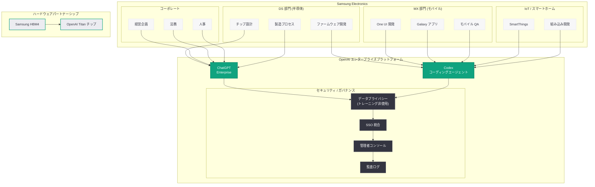

# Samsung Electronics が ChatGPT と Codex を全社展開

## メタデータ

| 項目 | 内容 |
|------|------|
| 発表日 | 2026-06-22 |
| ソース | OpenAI News |
| カテゴリ | エンタープライズ / パートナーシップ |
| 公式リンク | [openai.com/index/samsung-electronics-chatgpt-codex-deployment](https://openai.com/index/samsung-electronics-chatgpt-codex-deployment/) |

> **注記:** 本レポートは、元記事が Cloudflare の保護により全文取得できなかったため、サイトマップデータ (lastmod: 2026-06-22T04:37:34.052Z)、公開情報、および Samsung - OpenAI 間の関連発表に基づいて作成されている。正確な詳細については [公式ページ](https://openai.com/index/samsung-electronics-chatgpt-codex-deployment/) を参照されたい。

## 概要

Samsung Electronics が ChatGPT と Codex を組織全体に展開することが OpenAI News で発表された。Samsung は世界最大級のテクノロジー企業であり、半導体、スマートフォン、家電、ディスプレイなど多岐にわたる事業を展開している。本パートナーシップは、OpenAI のエンタープライズ製品が世界有数の製造業かつテクノロジー企業に全社規模で採用されたことを示す極めて重要な事例である。

両社の関係は 2026 年 3 月に報じられた Samsung による OpenAI カスタム AI チップ「Titan」向け HBM4 供給に続くものであり、ハードウェア供給からソフトウェア活用へと関係が双方向に深化していることを示している。Samsung の数十万人規模の従業員が ChatGPT Enterprise と Codex を活用することで、半導体設計からモバイルソフトウェア開発、エンタープライズ業務に至るまで広範な生産性向上が期待される。

## 主な内容

### Samsung Electronics の概要と AI 活用の背景

Samsung Electronics は韓国に本社を置く世界最大級のテクノロジー企業であり、連結売上高は年間 200 兆ウォン (約 20 兆円) を超える。以下の主要事業領域を有する。

- **DS (Device Solutions) 部門:** DRAM、NAND フラッシュ、システム LSI、ファウンドリなどの半導体事業。世界最大のメモリ半導体メーカーであり、HBM (高帯域幅メモリ) 市場でも主要プレーヤー
- **MX (Mobile eXperience) 部門:** Galaxy スマートフォン、タブレット、ウェアラブルデバイスの開発・販売。Android ベースの One UI を独自開発
- **VD (Visual Display) 部門:** テレビ、モニター、デジタルサイネージの開発・販売
- **DA (Digital Appliances) 部門:** 冷蔵庫、洗濯機、エアコンなどのスマート家電
- **Harman:** 車載インフォテインメントシステム、プロフェッショナルオーディオ機器

Samsung は従来から独自 AI 技術の開発に注力しており、Samsung Research を通じた AI 研究、Galaxy AI (オンデバイス AI 機能)、Bixby (音声アシスタント) などを展開してきた。ChatGPT と Codex の全社展開は、自社 AI 開発に加えて外部の最先端 AI プラットフォームを活用するハイブリッド戦略への転換を示すものである。

### ChatGPT Enterprise の活用領域

Samsung Electronics の多岐にわたる事業部門において、ChatGPT Enterprise は以下のような活用が想定される。

#### 半導体事業での活用

- **設計仕様書の分析と作成:** 複雑な半導体設計ドキュメントの要約、分析、生成支援
- **技術文書の多言語対応:** 韓国語、英語、日本語、中国語での技術文書作成を効率化
- **市場分析とインテリジェンス:** 半導体市場のトレンド分析、競合動向の調査支援
- **プロセス最適化の知見抽出:** 製造工程に関する膨大なデータからの知見抽出

#### モバイル事業での活用

- **ユーザーエクスペリエンス設計:** UI/UX デザインの提案、ユーザーリサーチの分析
- **マーケティングコンテンツ生成:** Galaxy シリーズの製品説明、広告コピー、プレスリリースの作成支援
- **カスタマーサポート効率化:** サポートナレッジベースの構築と応答品質の向上
- **製品企画の支援:** 市場調査データの分析と製品コンセプトの策定支援

#### コーポレート部門での活用

- **経営会議資料の作成:** 事業報告書、戦略文書の草案作成と分析
- **法務・コンプライアンス:** 契約書レビュー、規制対応ドキュメントの作成支援
- **HR・人材開発:** 採用プロセスの効率化、研修コンテンツの作成
- **サプライチェーン管理:** 調達・物流に関するデータ分析と意思決定支援

### Codex の活用領域

Samsung の大規模なソフトウェアエンジニアリング組織において、Codex は以下の領域で活用が想定される。

#### モバイルソフトウェア開発

- **One UI 開発:** Galaxy デバイス向けカスタム Android UI の開発効率化
- **アプリ開発:** Samsung 独自アプリケーション (Samsung Health、Samsung Pay など) の開発加速
- **OS 最適化:** Android カーネルのカスタマイズおよびパフォーマンスチューニング

#### 半導体設計ツール開発

- **EDA (Electronic Design Automation) ツール:** 半導体設計を支援するソフトウェアの開発・保守
- **テスト自動化:** チップ検証プロセスの自動化スクリプトとテストベンチの生成
- **ファームウェア開発:** SSD コントローラーなどのファームウェア開発支援

#### IoT・スマートホーム

- **SmartThings プラットフォーム:** IoT エコシステムのバックエンドおよびフロントエンド開発
- **組み込みソフトウェア:** 家電製品向けの組み込みシステム開発支援
- **クラウドサービス:** Samsung Cloud やデバイス管理サービスの開発効率化

### Samsung - OpenAI パートナーシップの全体像

Samsung と OpenAI の関係は、2026 年を通じて多面的に深化している。

| 時期 | 内容 | 方向性 |
|------|------|--------|
| 2026 年 3 月 | Samsung が OpenAI の Titan チップ向けに HBM4 供給 | Samsung → OpenAI (ハードウェア) |
| 2026 年 6 月 | Samsung が ChatGPT と Codex を全社展開 | OpenAI → Samsung (ソフトウェア) |

この双方向の関係は、両社の戦略的パートナーシップが単なる顧客 - ベンダー関係を超えた、技術エコシステム全体にわたる協力関係に発展していることを示す。Samsung は OpenAI に AI チップの重要部品を供給する一方で、OpenAI の AI プラットフォームを自社の業務効率化に活用するという相互補完的な構図が形成されている。

### エンタープライズ AI 市場への影響

Samsung Electronics の規模での ChatGPT と Codex の導入は、エンタープライズ AI 市場に以下の影響を与える。

- **製造業への AI 浸透:** 世界最大級の製造業企業が OpenAI のプラットフォームを採用したことで、製造業全体での AI 導入が加速する可能性がある
- **韓国市場の拡大:** Samsung の導入を契機に、韓国の大手企業での OpenAI エンタープライズ製品の採用が進む可能性がある
- **競合への圧力:** Samsung の動きは、競合他社 (Apple、Google、Qualcomm など) にも同様の AI プラットフォーム導入を促す圧力となる
- **OpenAI の収益基盤強化:** 数十万人規模の企業での全社展開は、OpenAI のエンタープライズ収益に大きく貢献する

## 技術的な詳細

### ChatGPT Enterprise のデプロイメント構成

Samsung 規模の組織での ChatGPT Enterprise 展開においては、以下の技術的な考慮事項が想定される。

| 要素 | 想定される構成 |
|------|--------------|
| ユーザー規模 | 数万〜数十万人のナレッジワーカー |
| 認証基盤 | SSO (SAML 2.0 / OIDC) による Samsung 社内 IdP 連携 |
| データ保護 | ビジネスデータのモデルトレーニング非使用保証 |
| 管理体制 | 事業部門別の管理者ロール、利用ポリシーの階層管理 |
| コンプライアンス | 韓国個人情報保護法 (PIPA)、EU GDPR、各国データ規制への対応 |
| カスタマイズ | 事業部門別カスタム GPTs、社内ナレッジベースとの連携 |

### Codex のエンタープライズ展開

Samsung のソフトウェア開発チームにおける Codex の展開は、以下の構成が想定される。

- **リポジトリ統合:** Samsung の内部 Git リポジトリ (GitHub Enterprise / GitLab) との接続
- **サンドボックス実行環境:** セキュアな分離環境でのコード生成・テスト実行
- **カスタムエージェント設定:** Samsung のコーディング標準、アーキテクチャパターンに準拠した設定
- **CI/CD パイプライン連携:** Jenkins、GitHub Actions 等との統合による自動化ワークフロー
- **多言語対応:** C/C++ (半導体・組み込み)、Java/Kotlin (Android)、Python (ML/データ分析)、JavaScript/TypeScript (Web) など多様な言語をカバー

### セキュリティとガバナンス

Samsung のような大規模テクノロジー企業での AI プラットフォーム導入においては、厳格なセキュリティ要件が課される。

- **知的財産保護:** 未公開の半導体設計情報、モバイル OS のソースコード、特許関連情報の保護
- **データ分類:** 機密レベルに応じたデータの分類と AI ツールへの入力制限
- **監査ログ:** 全てのインタラクションの記録と監査対応
- **地域データ要件:** 韓国国内でのデータ処理要件への対応
- **サードパーティリスク管理:** OpenAI をサードパーティベンダーとして管理するためのリスク評価フレームワーク

## アーキテクチャ

## 開発者への影響

- **製造業における AI 活用の先行事例:** Samsung のような大規模製造業が ChatGPT と Codex を全社展開した事例は、同業界の企業にとって AI 導入の実践的なリファレンスとなる。半導体設計、組み込みソフトウェア、IoT プラットフォームといった多様な技術領域での AI 活用モデルが確立される
- **Codex のハードウェア開発への適用拡大:** 従来は Web アプリケーションやクラウドサービスの開発が中心であった Codex の活用が、ファームウェア、EDA ツール、組み込みシステムといったハードウェアに近い領域にも拡大することを示唆する
- **多言語コードベースでの AI 活用:** Samsung の開発環境は C/C++、Java、Kotlin、Python、JavaScript など多様な言語が混在している。Codex がこのような多言語環境で効果的に機能する事例は、同様の技術スタックを持つ企業にとって有益な参考となる
- **エンタープライズ AI のアジア太平洋展開加速:** CyberAgent (日本)、Rakuten (日本) に続き、Samsung (韓国) という世界的な大企業の採用は、アジア太平洋地域での OpenAI エンタープライズ製品の浸透が加速していることを示す
- **AI チップとソフトウェアの垂直統合エコシステム:** Samsung が HBM4 を OpenAI に供給しつつ、OpenAI の AI ソフトウェアを活用するという双方向の関係は、AI エコシステムにおける新たなパートナーシップモデルを提示している

## 関連リンク

- [Samsung Electronics ChatGPT Codex Deployment (公式)](https://openai.com/index/samsung-electronics-chatgpt-codex-deployment/)
- [関連レポート: Samsung、OpenAI 初の AI チップ「Titan」向けに HBM4 を供給へ](2026-03-21-samsung-hbm4-openai-titan-chip.md)
- [関連レポート: CyberAgent が ChatGPT Enterprise と Codex で AI 活用を加速](2026-04-09-cyberagent-chatgpt-enterprise-codex.md)
- [関連レポート: Rakuten が Codex で問題修復速度を 2 倍に向上](2026-03-11-rakuten-codex.md)
- [関連レポート: OpenAI、エンタープライズ AI の次なるフェーズを発表](2026-04-08-next-phase-of-enterprise-ai.md)
- [ChatGPT Enterprise](https://openai.com/chatgpt/enterprise)
- [OpenAI Codex](https://openai.com/codex)
- [OpenAI News](https://openai.com/news)

## まとめ

Samsung Electronics が ChatGPT と Codex を全社展開するという発表は、OpenAI のエンタープライズ戦略における画期的なマイルストーンである。世界最大級のテクノロジー企業かつ製造業である Samsung が、半導体設計、モバイルソフトウェア開発、IoT、コーポレート業務に至る全事業領域で OpenAI のプラットフォームを採用したことは、エンタープライズ AI 市場の成熟と拡大を明確に示している。特に注目すべきは、Samsung が OpenAI に HBM4 チップを供給しつつ OpenAI の AI プラットフォームを活用するという双方向のパートナーシップ構造であり、AI 時代における企業間関係の新たなモデルを提示している。本事例は、製造業や半導体産業における AI 活用の可能性を大きく拡張するものであり、同業界の企業にとって重要な先行事例となるであろう。
