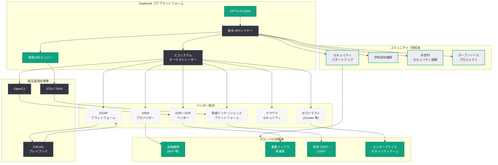
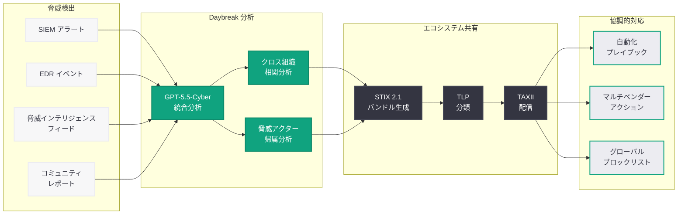

# サイバー防衛エコシステムの加速: Daybreak のベンダー統合拡大とコミュニティ構築

## メタデータ

| 項目 | 内容 |
|------|------|
| 発表日 | 2026-06-23 |
| ソース | OpenAI Safety |
| カテゴリ | セキュリティ / サイバー防衛 |
| 公式リンク | [Accelerating Cyber Defense Ecosystem](https://openai.com/index/accelerating-cyber-defense-ecosystem/) |

> **注記:** 本記事のページは Cloudflare によるアクセス保護が有効であり、記事本文の直接取得ができなかった。本レポートは、記事タイトル、同日に公開された関連記事 ("Daybreak: Securing the World"、"Scaling Trusted Access for Cyber Defense") の文脈、および 2026 年 5 月 11 日以降の Daybreak イニシアチブに関する過去の関連レポート群に基づいて構成されている。正確な詳細については公式ページを参照されたい。
>
> **関連レポート:** 本レポートは同日 (6 月 23 日) に公開された 3 記事のうちの 1 つである。他の 2 記事については [Daybreak: Securing the World](./2026-06-23-daybreak-securing-the-world.md) を参照されたい。

## 概要

OpenAI は 2026 年 6 月 23 日、サイバー防衛エコシステムの加速に関する記事を OpenAI Safety カテゴリで公開した。本記事は、同日に発表された "Daybreak: Securing the World" および "Scaling Trusted Access for Cyber Defense" と並行して公開されたものであり、2026 年 5 月 11 日に始動した Daybreak サイバーセキュリティイニシアチブの新たなフェーズとして、エコシステム全体の拡大・加速に焦点を当てたものと位置づけられる。

「Accelerating (加速)」というタイトルが示す通り、本発表は 4 月 16 日の初回エコシステム記事の進化版であり、ベンダー統合の拡大、サイバー防衛者コミュニティの成長、システム間の相互運用性向上という 3 つの軸でエコシステムの発展を加速させる施策を発表したものと考えられる。AI を利用した攻撃が自動化・高度化する中、防衛側もまた AI を活用したエコシステムレベルの連携が不可欠であるという認識のもと、OpenAI が防衛者のための包括的なプラットフォームを構築する戦略の最新段階を示している。

## 主な内容

### エコシステム加速の 3 つの柱

本記事のタイトルと文脈から、エコシステム加速は以下の 3 つの柱で構成されると推定される。

#### 1. ベンダー統合の拡大

4 月 16 日時点では BNY と Zscaler が主要パートナーとして公表されていたが、6 月 23 日の時点ではパートナーネットワークが大幅に拡大していると考えられる。

- **セキュリティベンダーの統合拡大:** SIEM、SOAR、EDR、NDR、CSPM などの主要セキュリティカテゴリにおけるベンダーとの API 統合が進行
- **クラウドセキュリティプロバイダー:** マルチクラウド環境の防衛を強化するための統合パートナーシップ
- **ICS/OT セキュリティベンダー:** 重要インフラの制御系システムを防衛するための専門ベンダーとの連携
- **脅威インテリジェンスプラットフォーム:** 既存の TIP (Threat Intelligence Platform) との双方向データ連携

#### 2. サイバー防衛者コミュニティの成長

Daybreak エコシステムに参加するサイバー防衛者コミュニティの拡大施策として、以下が想定される。

- **Trusted Access プログラムの規模拡大:** 審査済み防衛者の数を大幅に増加させ、より多くの組織がGPT-5.5-Cyber を活用可能に
- **開発者コミュニティの構築:** セキュリティ開発者向けのフォーラム、ハッカソン、ドキュメント・SDK の充実
- **助成金プログラムの拡充:** 1,000 万ドルの Cybersecurity Grant Program の受給者拡大と新規応募枠の設定
- **教育・トレーニングリソース:** サイバーセキュリティ AI の活用方法に関する学習コンテンツの提供
- **国際コミュニティの形成:** グローバル展開 ("Securing the World") と連動した多地域・多言語のコミュニティ構築

#### 3. 相互運用性の向上

エコシステム内の各コンポーネント間の相互運用性を高めるための技術的施策として、以下が推定される。

- **標準化された API インターフェース:** STIX/TAXII、OpenC2 などの国際標準に基づくデータ交換インターフェースの整備
- **統合プレイブック:** 複数のセキュリティツール間で連携動作する自動化プレイブックの標準化
- **共有脅威インテリジェンス:** Daybreak ネットワーク内での脅威情報のリアルタイム共有メカニズム
- **マルチベンダー防衛パイプライン:** 異なるベンダーの製品を GPT-5.5-Cyber で統合的にオーケストレーションする機能

### 4 月 16 日発表からの進化

本記事は 4 月 16 日に公開された "Accelerating the cyber defense ecosystem that protects us all" の続編的な位置づけと考えられる。約 2 か月間での主な進化は以下の通りである。

| 観点 | 4 月 16 日 | 6 月 23 日 (本レポート) |
|------|-----------|----------------------|
| モデル | GPT-5.4-Cyber | GPT-5.5-Cyber (5 月 7 日に移行) |
| ブランド | 個別施策の発表 | Daybreak 統合ブランド下での展開 |
| パートナー範囲 | BNY、Zscaler 中心 | グローバル規模のパートナーネットワーク |
| 地理的範囲 | 米国中心 | 国際展開 ("Securing the World") |
| エコシステム成熟度 | 基盤構築フェーズ | 加速・スケールフェーズ |
| 助成金 | プログラム発表 | 受給者の拡大と成果の可視化 |

### Daybreak の全体戦略における位置づけ

6 月 23 日には 3 つの記事が同時に公開されており、それぞれの役割は以下のように整理される。

| 記事 | 焦点 | 対象 |
|------|------|------|
| Daybreak: Securing the World | グローバル展開戦略とビジョン | 国家機関、国際パートナー |
| Scaling Trusted Access for Cyber Defense | アクセス制御と信頼モデルの拡大 | プログラム参加者、審査プロセス |
| **Accelerating Cyber Defense Ecosystem** (本記事) | **エコシステムの拡大と相互運用性** | **ベンダー、開発者、コミュニティ** |

3 つの記事は相互に補完的であり、Daybreak イニシアチブの異なる側面をそれぞれカバーしている。本記事は特に、技術的なエコシステムの構築と開発者・ベンダー視点でのプラットフォーム拡大に重点を置いていると考えられる。

### AI を活用した攻撃への対抗

エコシステム加速の背景には、AI を悪用した攻撃の急速な進化がある。

- **自動化されたフィッシング:** 大規模言語モデルを使用した高品質なフィッシングメールの大量生成
- **AI 駆動の脆弱性発見:** AI を活用した未知の脆弱性のスキャンと自動エクスプロイト生成
- **ポリモーフィックマルウェア:** AI が生成する回避的なマルウェアの急増
- **ディープフェイクを活用したソーシャルエンジニアリング:** 音声・映像の偽造による高度な詐欺攻撃

これらの脅威に対抗するためには、個別の防衛ソリューションではなく、エコシステム全体が連携して情報を共有し、協調的に防衛するアプローチが必要であり、本記事はその実現を加速させるための施策を提示していると考えられる。

## 技術的な詳細

### エコシステム統合アーキテクチャ

Daybreak エコシステムにおけるベンダー統合は、標準化された API レイヤーを通じて実現される。以下は、セキュリティベンダーが Daybreak エコシステムに統合する際の基本的なパターンを示す。

#### ベンダー統合パターン: SIEM 連携

```python
from openai import OpenAI

client = OpenAI()


def daybreak_siem_integration(
    siem_alerts: list[dict],
    context_data: dict
) -> dict:
    """
    Daybreak エコシステムの一部として、SIEM から受信した
    アラートを GPT-5.5-Cyber で分析し、エコシステム全体に
    共有可能な脅威インテリジェンスを生成する。
    """
    alerts_text = "\n".join(
        f"- [{a['severity']}] {a['rule_name']}: {a['description']}"
        for a in siem_alerts
    )

    response = client.chat.completions.create(
        model="gpt-5.5-cyber",
        messages=[
            {
                "role": "system",
                "content": (
                    "You are a Daybreak ecosystem threat analyst. Analyze "
                    "SIEM alerts and generate structured threat intelligence "
                    "suitable for sharing across the Daybreak partner network. "
                    "Output in STIX 2.1 format with TLP classification. "
                    "Correlate with known campaigns and provide attribution "
                    "confidence levels."
                )
            },
            {
                "role": "user",
                "content": (
                    f"SIEM Alerts:\n{alerts_text}\n\n"
                    f"Context Data:\n"
                    f"- Organization Sector: {context_data.get('sector')}\n"
                    f"- Region: {context_data.get('region')}\n"
                    f"- Asset Criticality: {context_data.get('criticality')}\n\n"
                    "Generate:\n"
                    "1. Consolidated threat assessment\n"
                    "2. STIX 2.1 indicators for ecosystem sharing\n"
                    "3. Recommended defensive actions\n"
                    "4. Cross-organization correlation findings"
                )
            }
        ],
        max_tokens=8192,
        response_format={"type": "json_object"}
    )
    return response.choices[0].message.content
```

#### エコシステム相互運用性: マルチベンダーオーケストレーション

```python
from openai import OpenAI
from typing import TypedDict

client = OpenAI()


class EcosystemAction(TypedDict):
    vendor: str
    action_type: str
    parameters: dict
    priority: int
    dependency: list[str]


def orchestrate_ecosystem_response(
    threat_assessment: dict,
    available_vendors: list[str]
) -> list[EcosystemAction]:
    """
    Daybreak エコシステム内の複数ベンダーのセキュリティツールを
    GPT-5.5-Cyber で統合的にオーケストレーションし、
    協調的なインシデント対応を実行する。
    """
    response = client.chat.completions.create(
        model="gpt-5.5-cyber",
        messages=[
            {
                "role": "system",
                "content": (
                    "You are the Daybreak ecosystem orchestrator. Given a "
                    "threat assessment and available security vendor "
                    "integrations, generate a coordinated response plan that "
                    "leverages multiple vendors' capabilities in the optimal "
                    "sequence. Consider dependencies between actions and "
                    "minimize mean time to containment (MTTC)."
                )
            },
            {
                "role": "user",
                "content": (
                    f"Threat Assessment:\n{threat_assessment}\n\n"
                    f"Available Vendor Integrations: {available_vendors}\n\n"
                    "Generate an orchestrated response plan with:\n"
                    "- Ordered list of actions across vendors\n"
                    "- Dependencies between actions\n"
                    "- Priority levels (1=immediate, 5=follow-up)\n"
                    "- Expected containment timeline\n"
                    "- Rollback procedures if actions fail"
                )
            }
        ],
        max_tokens=4096,
        response_format={"type": "json_object"}
    )
    return response.choices[0].message.content
```

#### コミュニティ向け助成金 API 利用例

```python
from openai import OpenAI

# Cybersecurity Grant Program 受給者向けの基本利用パターン
client = OpenAI()


def community_threat_detection(
    network_traffic: str,
    organization_profile: str
) -> str:
    """
    助成金プログラム受給者 (スタートアップ、研究機関、
    非営利組織) が GPT-5.5-Cyber を活用して
    脅威検出サービスを構築するための基本パターン。
    """
    response = client.chat.completions.create(
        model="gpt-5.5-cyber",
        messages=[
            {
                "role": "system",
                "content": (
                    "You are a threat detection system built by a Daybreak "
                    "ecosystem grant recipient. Provide accessible, actionable "
                    "threat analysis suitable for organizations with limited "
                    "security resources. Focus on clear explanations and "
                    "practical remediation steps."
                )
            },
            {
                "role": "user",
                "content": (
                    f"Network Traffic Summary:\n{network_traffic}\n\n"
                    f"Organization Profile:\n{organization_profile}\n\n"
                    "Analyze for threats and provide:\n"
                    "1. Identified threats (plain language explanation)\n"
                    "2. Risk level and business impact\n"
                    "3. Step-by-step remediation guide\n"
                    "4. Preventive measures for the future"
                )
            }
        ],
        max_tokens=4096
    )
    return response.choices[0].message.content
```

### Daybreak エコシステムの技術標準

エコシステムの相互運用性を確保するため、以下の技術標準が採用されていると考えられる。

| 標準 | 用途 | 役割 |
|------|------|------|
| STIX 2.1 | 脅威情報の構造化 | エコシステム内での脅威データの統一フォーマット |
| TAXII 2.1 | 脅威情報の配信 | パートナー間のリアルタイム脅威情報共有 |
| OpenC2 | セキュリティコマンド | マルチベンダー間の防衛アクションの統一的な命令 |
| CACAO | プレイブック | 自動化されたインシデント対応手順の標準化 |
| SARIF | 脆弱性レポート | 静的分析・脆弱性スキャン結果の標準フォーマット |
| TLP | 情報分類 | 共有情報の機密レベル管理 |

## アーキテクチャ

以下の図は、Daybreak サイバー防衛エコシステムの全体構造を示している。GPT-5.5-Cyber を中核として、パートナーベンダー、助成金コミュニティ、脅威インテリジェンス共有ネットワークが相互に接続されたエコシステムを形成している。



### エコシステム加速のデータフロー

以下の図は、エコシステム内で脅威情報がどのように流通し、協調的な防衛が実現されるかのデータフローを示している。



## 開発者への影響

### ベンダー統合開発者への影響

- **標準化された統合パターン:** Daybreak エコシステムへの統合に必要な API インターフェースと設計パターンが標準化されることで、セキュリティベンダーの開発者はより迅速に統合を実現できる
- **GPT-5.5-Cyber の活用拡大:** パートナーベンダーの開発者は、自社製品に GPT-5.5-Cyber の脅威分析・インシデント対応能力を組み込むための優先的な API アクセスを得られる
- **相互運用性テストの支援:** エコシステム内のマルチベンダー連携を検証するためのテストフレームワークや検証環境が提供される可能性がある

### コミュニティ開発者への影響

- **助成金プログラムの拡充:** Cybersecurity Grant Program の受給者枠が拡大されることで、より多くのセキュリティスタートアップや研究者が GPT-5.5-Cyber を活用した開発に着手できる
- **オープンソースエコシステムの成長:** 助成金受給者による成果がオープンソースとして公開されることで、コミュニティ全体の防衛能力が底上げされる
- **開発者リソースの充実:** SDK、ドキュメント、サンプルコード、チュートリアルの拡充により、サイバーセキュリティ AI の活用に関する学習コストが低下する
- **ハッカソンやコンペティション:** エコシステム成長の一環として、開発者コミュニティを活性化するイベントの開催が期待される

### エンタープライズセキュリティチームへの影響

- **マルチベンダー統合の簡素化:** Daybreak オーケストレーターを通じて、既存のセキュリティスタックを統合的に管理・自動化できる環境が整備される
- **脅威インテリジェンスの質向上:** エコシステム全体から集約された脅威情報により、個別組織では検出困難な高度な脅威を早期に把握できる
- **インシデント対応の自動化:** 標準化されたプレイブックとオーケストレーション機能により、インシデント対応の MTTC (Mean Time to Containment) の短縮が期待される

### 日本のセキュリティコミュニティへの示唆

- **国内セキュリティベンダーの統合機会:** Daybreak エコシステムのグローバル展開に伴い、日本のセキュリティベンダーもパートナーとして参画する機会が拡大
- **JPCERT/CC との連携:** 日本の CERT 組織が Daybreak の脅威インテリジェンス共有ネットワークに参加する可能性
- **国内スタートアップへの助成金:** 助成金プログラムの国際化により、日本のサイバーセキュリティスタートアップも応募可能に

## 関連リンク

- [Accelerating Cyber Defense Ecosystem (公式)](https://openai.com/index/accelerating-cyber-defense-ecosystem/)
- [Daybreak: Securing the World (同日発表)](https://openai.com/index/daybreak-securing-the-world/)
- [Daybreak: Securing the World (関連レポート)](./2026-06-23-daybreak-securing-the-world.md)
- [Daybreak ポータル](https://openai.com/daybreak/)
- [Daybreak: Frontier AI for Cyber Defenders (関連レポート 5/11)](./2026-05-11-openai-daybreak-cyber-defenders.md)
- [サイバー防衛エコシステムの加速: 4 月版 (関連レポート 4/16)](./2026-04-16-accelerating-cyber-defense-ecosystem.md)
- [Trusted Access プログラムの拡大 (関連レポート 4/14)](./2026-04-14-scaling-trusted-access-cyber-defense.md)
- [OpenAI Safety](https://openai.com/safety)
- [OpenAI API ドキュメント](https://platform.openai.com/docs)
- [STIX/TAXII 標準](https://oasis-open.github.io/cti-documentation/)
- [OpenC2 標準](https://openc2.org/)

## まとめ

OpenAI が 2026 年 6 月 23 日に公開した "Accelerating Cyber Defense Ecosystem" は、同日発表された "Daybreak: Securing the World" および "Scaling Trusted Access for Cyber Defense" と三位一体をなすエコシステム拡大の発表である。4 月 16 日の初回エコシステム記事から約 2 か月が経過し、Daybreak ブランドのもとでエコシステムの加速が本格化したことを示している。

本記事の焦点は、ベンダー統合の拡大、コミュニティの成長、相互運用性の向上という 3 つの柱にあると考えられる。GPT-5.5-Cyber を中核とした統合 API レイヤーを通じて、SIEM、SOAR、EDR、ゼロトラストなどの主要セキュリティカテゴリのベンダーが相互に連携し、エコシステム全体として協調的な防衛を実現するアーキテクチャが構築されつつある。

AI を悪用した攻撃が自動化・高度化する中、防衛側もまたエコシステムレベルの連携が不可欠であるという認識のもと、OpenAI は単なるモデル提供を超えて、防衛者のためのプラットフォーム全体を構築する戦略を推進している。助成金プログラムによるコミュニティ支援、標準化されたインターフェースによる相互運用性、グローバルな脅威インテリジェンス共有の組み合わせが、Daybreak エコシステムの競争優位性を形成しており、セキュリティ開発者にとって今後の動向を注視すべき重要な発表である。

> **免責事項:** 本レポートは Cloudflare によるアクセス保護のため記事本文を直接取得できなかったため、記事タイトル、同日公開の関連記事の文脈、および過去の Daybreak 関連レポート群に基づいて構成されたものである。実際の発表内容には、新たなパートナー企業の具体名、助成金プログラムの拡大規模の詳細数値、新たな技術機能の仕様などが含まれる可能性がある。正確な詳細については公式ページを直接参照されたい。
