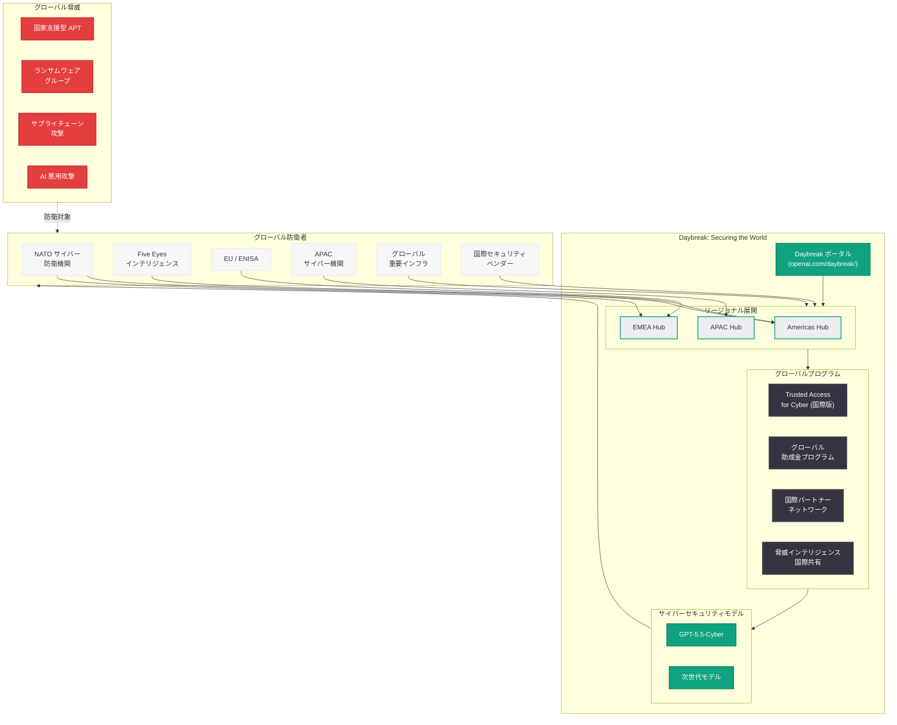

# Daybreak: Securing the World — OpenAI サイバー防衛イニシアチブのグローバル展開

## メタデータ

| 項目 | 内容 |
|------|------|
| 発表日 | 2026-06-23 |
| ソース | OpenAI News |
| カテゴリ | セキュリティ / サイバー防衛 |
| 公式リンク | [Daybreak: Securing the World](https://openai.com/index/daybreak-securing-the-world/) |

> **注記:** 本記事のページは Cloudflare によるアクセス保護が有効であり、記事本文の直接取得ができなかった。本レポートは、サイトマップ情報 (lastmod: 2026-06-23T03:46:07.417Z)、記事タイトル、および 2026 年 5 月 11 日の Daybreak 発表レポートをはじめとする過去の関連レポート群に基づいて構成されている。正確な詳細については公式ページを参照されたい。

## 概要

OpenAI は 2026 年 6 月 23 日、サイバーセキュリティ防衛の統合ブランド「Daybreak」の大規模なグローバル展開を発表した。「Securing the World」(世界を守る) というタイトルが示す通り、本発表は 2026 年 5 月 11 日に始動した Daybreak イニシアチブを国際的なスケールに拡大し、世界中のサイバー防衛者が AI を活用した防御能力を獲得できるようにする戦略的な展開宣言と位置づけられる。

5 月の Daybreak 発表以降、EU へのサイバーモデルアクセス提供が報じられていたが、今回の「Securing the World」は、その国際展開をさらに拡大し、グローバルなサイバー防衛エコシステムの構築を本格化させるものと考えられる。Trusted Access for Cyber プログラム、GPT-5.5-Cyber をはじめとするサイバー特化モデル、1,000 万ドル助成金プログラム、産業パートナーシップの全てがグローバル規模で展開される次の段階に入ったことを示す発表である。

## 主な内容

### グローバル展開の意義: 「世界を守る」というビジョン

「Securing the World」というタイトルは、Daybreak がもはや米国中心のイニシアチブではなく、世界全体のサイバー防衛を視野に入れたプログラムへと進化したことを示している。サイバー脅威はその性質上国境を越えるものであり、効果的な防衛には国際的な協調が不可欠である。

本発表の背景には、以下のような国際的なサイバーセキュリティ情勢がある。

- **国家支援型 APT グループの活動激化:** 中国、ロシア、北朝鮮、イランを起源とする国家支援型の高度持続的脅威 (APT) が、世界各国の重要インフラや政府機関を標的としている
- **ランサムウェアのグローバル化:** ランサムウェア攻撃が先進国だけでなく新興国のインフラにも拡大し、社会的影響が深刻化している
- **サプライチェーン攻撃の複雑化:** グローバルなソフトウェアサプライチェーンを標的とした攻撃が増加し、一国の防衛だけでは対処が困難になっている
- **AI を悪用した攻撃の高度化:** 攻撃者が汎用 AI を活用してフィッシング、マルウェア生成、脆弱性発見を行うケースが増加しており、防衛側も AI を活用する必要性が高まっている

### 国際パートナーシップの拡大

5 月 11 日の Daybreak 発表時点では BNY、Zscaler との連携が中心であったが、「Securing the World」では国際的なパートナーシップが大幅に拡大されたと考えられる。想定される展開先は以下の通りである。

#### 政府・防衛機関

- **NATO 加盟国のサイバー防衛機関:** 欧州を中心としたサイバー防衛能力の強化
- **Five Eyes 諸国のインテリジェンス機関:** 米英加豪新の情報共有と AI 活用サイバー防衛の連携
- **EU サイバーセキュリティ機関 (ENISA):** EU 全体のサイバーレジリエンス向上への支援
- **アジア太平洋地域のパートナー:** 日本、韓国、オーストラリア、シンガポールなどの先進的なサイバー防衛国家との協力
- **新興国への防衛能力移転:** サイバーセキュリティ人材が不足する地域への AI による能力補完

#### 産業パートナー

- **グローバル金融機関:** 国際的な金融インフラの防衛強化
- **重要インフラ事業者:** エネルギー、通信、交通セクターの国際的な防衛ネットワーク
- **グローバルセキュリティベンダー:** 世界規模でセキュリティサービスを展開するベンダーとの連携拡大
- **テクノロジー企業:** クラウドプロバイダー、ネットワーク機器メーカーとのセキュリティ統合

### Daybreak プログラムのグローバル展開構造

「Securing the World」フェーズにおける Daybreak の展開構造は、以下のような多層的なアプローチで構成されると考えられる。

| 展開層 | 対象 | 提供内容 |
|--------|------|----------|
| グローバルパートナー | 国家レベルの CERT/CSIRT | GPT-5.5-Cyber フルアクセス、脅威情報共有 |
| リージョナルハブ | 地域のセキュリティセンター | 地域特化の脅威インテリジェンス、ローカライズされた支援 |
| セクター別展開 | 重要インフラ事業者 | セクター特化のセキュリティ分析、ICS/OT 防衛 |
| エコシステム拡大 | 国際的なスタートアップ | 助成金プログラムの国際化、グローバル開発者コミュニティ |
| 学術ネットワーク | 世界の研究機関 | 脆弱性研究、AI セキュリティ研究の国際協力 |

### サイバー防衛の民主化: グローバル規模での実現

4 月 29 日の「インテリジェンス時代のサイバーセキュリティ」ビジョン文書で掲げられた「サイバー防衛の民主化」が、「Securing the World」により世界規模で推進されることになる。

- **先進国と新興国のサイバー格差解消:** セキュリティ人材が不足する国や地域に対して、AI を通じた防衛能力の提供
- **中小国のサイバーレジリエンス向上:** 大国と同等のサイバー防衛インテリジェンスを、AI を活用して中小国にも展開
- **多言語対応の強化:** GPT-5.5-Cyber の多言語能力を活かし、各国語での脅威分析・レポーティングを実現
- **地域固有の脅威への対応:** 各地域で活発な脅威アクターやマルウェアファミリーに対する、ローカライズされたインテリジェンス提供

### Daybreak の進化タイムライン (2026 年 4 月 - 6 月)

| 日付 | 施策 | 位置づけ |
|------|------|----------|
| 2026-04-14 | Trusted Access for Cyber 拡大 | 基盤プログラムの確立 |
| 2026-04-16 | 1,000 万ドル助成金 | エコシステムへの投資 |
| 2026-04-24 | GPT-5.4-Cyber 限定リリース | 初期モデルの展開 |
| 2026-04-29 | サイバーセキュリティ 5 アクションプラン | ビジョンと政策フレームワーク |
| 2026-05-07 | GPT-5.5-Cyber 展開 | 次世代モデルへの移行 |
| 2026-05-11 | Daybreak 統合ブランド発表 | 全施策のブランド統合 |
| 2026-05-11 | EU へのサイバーモデルアクセス提供 | 国際展開の開始 |
| 2026-06-23 | **Daybreak: Securing the World** | **グローバル展開の本格化** |

## 技術的な詳細

### グローバル展開における技術アーキテクチャの拡張

世界規模での Daybreak 展開には、以下の技術的な基盤が必要となる。

#### データ主権とプライバシーの確保

- **リージョナルデプロイメント:** 各地域のデータ主権規制 (EU の GDPR、日本の個人情報保護法等) に対応するため、リージョナルなインフラストラクチャでの処理を提供
- **脅威データの匿名化:** 国際的な脅威情報共有において、個別組織の機密情報を保護しつつ防衛に有用なインテリジェンスを抽出
- **クロスボーダーのセキュリティガバナンス:** 複数の法域にまたがるデータ処理に対する統一的なセキュリティポリシーの適用

#### 脅威インテリジェンスの国際共有フレームワーク

- **STIX/TAXII 標準に準拠した脅威共有:** 国際標準プロトコルを使用し、参加国・組織間でのシームレスな脅威情報交換を実現
- **TLP (Traffic Light Protocol) によるアクセス制御:** 脅威情報の機密レベルに応じた適切な共有範囲の管理
- **自動化されたインジケーター配信:** GPT-5.5-Cyber が検出した IoC (Indicators of Compromise) をリアルタイムでグローバルネットワークに配信

#### グローバルスケールの API インフラストラクチャ

```python
from openai import OpenAI

client = OpenAI()

# Daybreak グローバル展開における脅威インテリジェンス共有の例
response = client.chat.completions.create(
    model="gpt-5.5-cyber",
    messages=[
        {
            "role": "system",
            "content": (
                "You are a global cyber threat intelligence analyst operating "
                "under the Daybreak program. Analyze threats with awareness of "
                "regional threat landscapes, geopolitical context, and "
                "cross-border attack campaigns. Provide intelligence in STIX 2.1 "
                "format suitable for international sharing via TAXII feeds. "
                "Apply TLP classification to all outputs."
            )
        },
        {
            "role": "user",
            "content": (
                "Analyze the following cross-border APT campaign indicators:\n\n"
                "- Spear-phishing targeting energy sector in EU and APAC\n"
                "- C2 infrastructure rotating across 15 countries\n"
                "- Custom implant with Modbus/TCP capabilities\n"
                "- Supply chain compromise via regional MSP\n"
                "- Overlapping TTPs with known state-sponsored groups\n\n"
                "Provide: attribution assessment, global impact analysis, "
                "regional containment recommendations, and STIX 2.1 bundle."
            )
        }
    ],
    max_tokens=8192,
    response_format={"type": "json_object"}
)

print(response.choices[0].message.content)
```

### 国際的な Trusted Access の審査フレームワーク

グローバル展開に伴い、Trusted Access for Cyber の審査フレームワークも国際対応が強化されていると想定される。

| 審査基準 | 国内組織 | 国際組織 |
|----------|----------|----------|
| 組織信頼性 | 国内の認証・認定基準 | 当該国政府の推薦または国際機関の認証 |
| セキュリティクリアランス | 国内基準 | 相互認証協定に基づく国際基準 |
| 利用目的 | 防衛目的の確認 | 防衛目的 + 国際法遵守の確認 |
| データ管理 | 国内規制準拠 | 複数法域にまたがるデータ管理能力 |
| 監査体制 | 国内監査 | 国際基準に基づく監査証跡 |

## アーキテクチャ



### Daybreak 戦略の全体進化

```mermaid
flowchart LR
    subgraph Phase1["Phase 1: 基盤構築<br/>(2026年4月)"]
        T1["Trusted Access<br/>プログラム拡大"]
        T2["$10M 助成金"]
        T3["GPT-5.4-Cyber"]
        T4["ビジョン文書"]
    end

    subgraph Phase2["Phase 2: 次世代展開<br/>(2026年5月)"]
        T5["GPT-5.5-Cyber"]
        T6["Daybreak<br/>ブランド発表"]
        T7["EU アクセス<br/>提供開始"]
    end

    subgraph Phase3["Phase 3: グローバル展開<br/>(2026年6月)"]
        T8["Daybreak:<br/>Securing the World"]
        T9["国際パートナー<br/>ネットワーク"]
        T10["リージョナル<br/>ハブ展開"]
    end

    T1 --> T2
    T2 --> T3
    T3 --> T4
    T4 --> T5
    T5 --> T6
    T6 --> T7
    T7 --> T8
    T8 --> T9
    T9 --> T10

    classDef openai fill:#10A37F,stroke:#0D8A6A,stroke-width:2px,color:white
    classDef dark fill:#343541,stroke:#444654,stroke-width:2px,color:white
    classDef accent fill:#ECECF1,stroke:#10A37F,stroke-width:2px,color:#343541
    classDef highlight fill:#10A37F,stroke:#0D8A6A,stroke-width:3px,color:white

    class T8,T9,T10 highlight
    class T5,T6,T7 openai
    class T1,T3 dark
    class T2,T4 accent
```



## 開発者への影響

### 国際的なセキュリティ開発者への機会

- **グローバルアクセスの拡大:** これまで米国中心であった Trusted Access for Cyber プログラムが国際化されることで、世界各国のセキュリティ開発者が GPT-5.5-Cyber を活用したソリューション開発に参加できるようになる
- **多言語セキュリティツールの開発:** GPT-5.5-Cyber の多言語能力を活用し、各国語で動作する脅威分析ツール、インシデントレスポンスプラットフォーム、脆弱性レポーティングシステムの開発が可能に
- **地域特化のセキュリティソリューション:** 各地域固有の脅威ランドスケープに対応したローカライズされたセキュリティプロダクトの開発機会が拡大
- **国際的な助成金への応募:** Daybreak の助成金プログラムが国際化されることで、世界各国のセキュリティスタートアップや研究機関が資金支援を受けられる可能性が高まる

### 日本のサイバーセキュリティコミュニティへの示唆

- **JPCERT/CC や NISC との連携可能性:** 日本の主要サイバーセキュリティ機関が Daybreak のグローバルパートナーとして参加する機会
- **国内セキュリティベンダーの活用:** Trusted Access プログラムを通じた GPT-5.5-Cyber の活用により、国内セキュリティ製品・サービスの高度化が期待される
- **日本語での脅威分析:** GPT-5.5-Cyber を活用した日本語でのインシデント分析やレポーティングの実現
- **アジア太平洋地域の脅威インテリジェンス:** 地域特化の APT グループ (APT10、APT41 等) に対するインテリジェンスの強化

### 既存 Daybreak 参加者への影響

- **グローバルな脅威インテリジェンスへのアクセス:** 国際展開に伴い、世界各地で検出された脅威情報がネットワーク全体で共有されるようになり、防衛者の視野が拡大する
- **国際的なコラボレーション機会:** グローバルパートナーネットワークを通じた国際的なセキュリティ研究・開発の協力体制への参加
- **リージョナルハブの活用:** 最寄りのリージョナルハブを通じた低レイテンシのサービス利用と、地域特化のサポートの享受

## 関連リンク

- [Daybreak: Securing the World (公式)](https://openai.com/index/daybreak-securing-the-world/)
- [Daybreak ポータル](https://openai.com/daybreak/)
- [Daybreak: Frontier AI for Cyber Defenders (関連レポート 5/11)](./2026-05-11-openai-daybreak-cyber-defenders.md)
- [GPT-5.5 と GPT-5.5-Cyber による Trusted Access 拡大 (関連レポート 5/7)](./2026-05-07-gpt-5-5-trusted-access-cyber.md)
- [インテリジェンス時代のサイバーセキュリティ (関連レポート 4/29)](./2026-04-29-cybersecurity-intelligence-age.md)
- [GPT-5.4-Cyber の限定リリース (関連レポート 4/24)](./2026-04-24-gpt-5-4-cyber-limited-release.md)
- [サイバー防衛エコシステムの加速 (関連レポート 4/16)](./2026-04-16-accelerating-cyber-defense-ecosystem.md)
- [Trusted Access プログラムの拡大 (関連レポート 4/14)](./2026-04-14-scaling-trusted-access-cyber-defense.md)
- [OpenAI Safety](https://openai.com/safety)

## まとめ

OpenAI が 2026 年 6 月 23 日に発表した「Daybreak: Securing the World」は、5 月 11 日に始動したサイバーセキュリティ統合ブランド「Daybreak」をグローバル規模に拡大する戦略的な宣言である。「世界を守る」というビジョンのもと、Trusted Access for Cyber プログラム、GPT-5.5-Cyber、助成金プログラム、パートナーシップの全てが国際展開の次のフェーズに入ったことを示している。

国家支援型 APT の活動激化、ランサムウェアのグローバル化、サプライチェーン攻撃の複雑化という国際的な脅威環境の中で、AI を活用したサイバー防衛の「民主化」を世界規模で推進するという OpenAI の野心は、サイバーセキュリティの国際協調における新たなモデルを提示している。各地域にリージョナルハブを設置し、国際的な脅威インテリジェンス共有フレームワークを構築するアプローチは、従来の政府間・ベンダー間の情報共有を AI で加速・拡張するものである。

日本を含むアジア太平洋地域のサイバーセキュリティコミュニティにとっても、Daybreak のグローバル展開は GPT-5.5-Cyber を活用した防衛能力の向上と、国際的な脅威インテリジェンスネットワークへの参加という重要な機会を提供するものとなる。セキュリティ開発者には、Daybreak ポータル (openai.com/daybreak/) を通じたプログラムの最新情報の確認と、参加に向けた早期準備を推奨する。

> **免責事項:** 本レポートは Cloudflare によるアクセス保護のため記事本文を直接取得できなかったため、サイトマップ情報、記事タイトル、および過去の関連レポート群に基づいて構成されたものである。実際の発表内容には、新たなパートナーシップの具体的な組織名、助成金プログラムの拡大規模、新たな技術的機能などが含まれる可能性がある。正確な詳細については公式ページを直接参照されたい。
