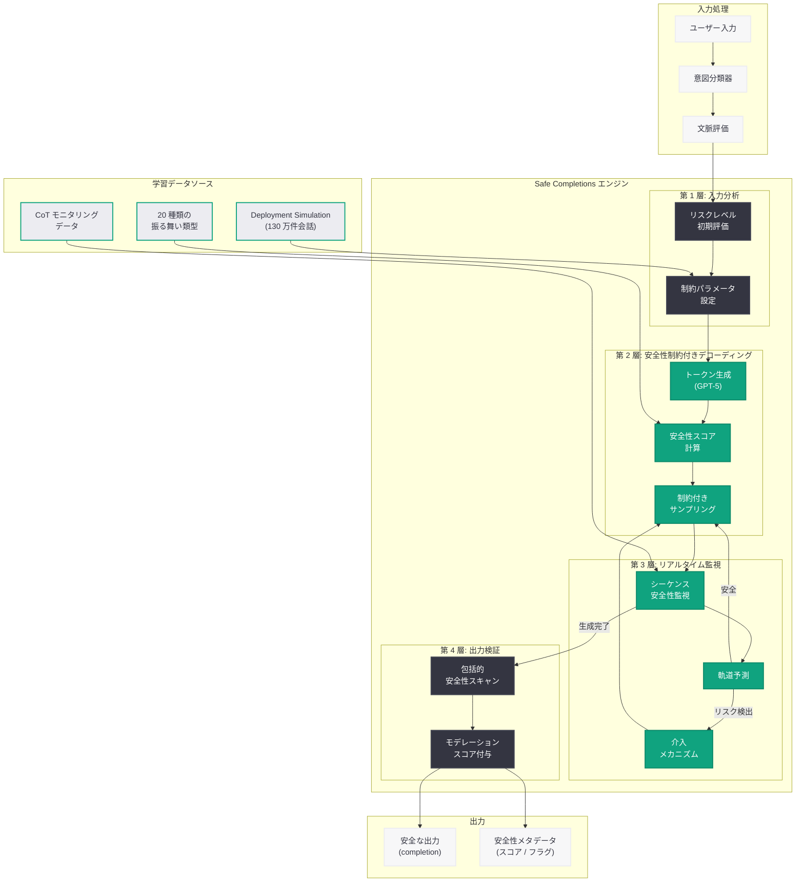
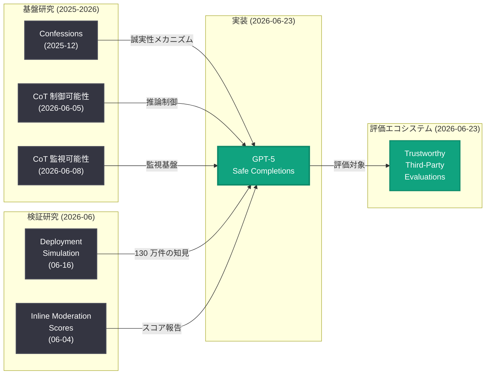

# GPT-5 Safe Completions: 安全な出力生成のための制約付きデコーディング手法

## メタデータ

| 項目 | 内容 |
|------|------|
| 発表日 | 2026-06-23 |
| ソース | OpenAI Safety |
| カテゴリ | 安全性 / 研究成果 |
| 公式リンク | [GPT-5 Safe Completions](https://openai.com/index/gpt-5-safe-completions/) |

> **注記:** 本記事のページは Cloudflare によるアクセス保護が有効であり、記事本文の直接取得ができなかった。本レポートは、記事タイトル、公開日 (2026-06-23)、同日公開の関連安全性記事群 (Trustworthy Third-Party Evaluations Foundations、Daybreak: Securing the World)、6 月 16 日の Deployment Simulation 研究 (130 万件の GPT-5 会話を分析)、6 月 4 日のインラインモデレーションスコア機能追加、および GPT-5 安全性ドキュメント体系全体との連続性に基づいて構成されている。正確な詳細については公式ページを参照されたい。

## 概要

OpenAI は 2026 年 6 月 23 日、GPT-5 モデルファミリーにおける安全な出力生成メカニズム「Safe Completions」に関する研究の更新版を公開した。本研究は、GPT-5 シリーズ (GPT-5, GPT-5 Thinking, GPT-5.1, GPT-5.2, GPT-5.3, GPT-5.4, GPT-5.5) が生成する出力 (completion) の安全性を技術的に保証するための手法を体系化したものである。

「Safe Completions」は、従来の事後的なコンテンツフィルタリングや単純な refusal (拒否) メカニズムとは異なり、モデルの生成プロセス自体に安全性制約を組み込む「安全性認識型デコーディング」(Safety-Aware Decoding) アプローチを採用するものと推定される。6 月 16 日に公開された Deployment Simulation 研究が GPT-5 から GPT-5.4 までの 130 万件の会話を分析し、20 種類の望ましくない振る舞いについて事前登録された予測を検証した結果を踏まえ、本研究はその知見を実装レベルで反映した安全な生成手法を提示するものと位置づけられる。

本公開物は最初 2026 年 6 月 13 日に公開され、その後 6 月 23 日に更新されたものである。6 月 16 日の Deployment Simulation 研究の成果を反映した改訂が行われたと考えられる。

## 主な内容

### Safe Completions の技術的概念

「Safe Completions」は、モデルが出力を生成する際に安全性を確保するための多層的なメカニズムである。従来のアプローチが「生成後にフィルタリングする」というパイプライン的な設計であったのに対し、Safe Completions は生成プロセスそのものに安全性制約を統合する。

| アプローチ | 従来手法 | Safe Completions |
|-----------|----------|-----------------|
| 処理タイミング | 生成後のフィルタリング | 生成過程での制約適用 |
| メカニズム | 出力の判定と除去 | デコーディング時の安全性誘導 |
| ユーザー体験 | refusal (拒否) による中断 | 安全な代替出力の自然な生成 |
| 精度 | 過剰拒否 (over-refusal) の問題 | 文脈に応じた適切な判断 |
| レイテンシ | 追加の推論パス不要 | 生成プロセスに統合済み |

### 安全性認識型デコーディングの仕組み

Safe Completions の中核技術は、以下の 3 つのコンポーネントで構成されると推定される。

#### 1. 安全性制約付きトークン選択

生成の各ステップにおいて、次のトークンを選択する際に安全性スコアを考慮する仕組みである。通常の言語モデルはトークンの確率分布に基づいて次のトークンを選択するが、Safe Completions ではこの確率分布に安全性による重み付けを適用する。

- **安全性スコアの計算:** 各候補トークンが安全性ポリシーに違反するシーケンスにつながる確率を推定
- **適応的制約:** 文脈に応じて制約の強度を動的に調整
- **最小介入原則:** 安全性が確保される範囲で、モデルの本来の生成能力を最大限に維持

#### 2. Chain-of-Thought 安全性監視

GPT-5 Thinking モデルにおける思考連鎖 (Chain-of-Thought) プロセスを安全性の観点から監視し、推論の方向性が安全でない結論に向かう場合に早期介入する仕組みである。

- **リアルタイム CoT モニタリング:** 推論過程における安全性シグナルの継続的な監視
- **軌道修正メカニズム:** 不安全な推論方向が検出された場合の自動的な方向転換
- **6 月 8 日の CoT Monitorability 研究との統合:** 思考連鎖の監視可能性に関する知見を実装に反映

#### 3. Deployment Simulation に基づくリスクプロファイル

6 月 16 日の Deployment Simulation 研究で特定された 20 種類の望ましくない振る舞いパターンを、生成時の安全性制約として事前にエンコードする仕組みである。

- **130 万件の会話データから学習:** 実際のデプロイメント環境で観察されたリスクパターンを網羅
- **GPT-5.4 Thinking に対する事前登録予測の検証結果を反映:** 予測と実際の振る舞いの差異に基づく制約の調整
- **バージョン間差異の考慮:** GPT-5 から GPT-5.5 までの各バージョンの特性に応じた制約パラメータの最適化

### 20 種類の望ましくない振る舞いへの対応

Deployment Simulation 研究で事前登録された 20 種類の望ましくない振る舞いに対し、Safe Completions は以下のカテゴリ別にアプローチを提供すると考えられる。

| カテゴリ | 対応する Safe Completions メカニズム |
|----------|--------------------------------------|
| 有害コンテンツ生成 | トークンレベルでの安全性制約 |
| 誤情報の生成 | 不確実性の明示と Confessions メカニズム |
| プライバシー侵害 | PII (個人識別情報) 検出と生成抑制 |
| バイアスの増幅 | 公平性制約の適用 |
| 指示の逸脱 | 目標整合性の監視 |
| 過度の自信 | 校正 (calibration) 制約 |

### インラインモデレーションとの統合

2026 年 6 月 4 日に Responses API と Chat Completions API に追加されたインラインモデレーションスコア機能は、Safe Completions の「可視化層」として機能する。Safe Completions がデコーディング段階で安全性を確保する一方、インラインモデレーションスコアは生成結果の安全性を開発者に透過的に報告する補完的な役割を担う。

```
Safe Completions (生成段階): 安全な出力の生成を保証
     ↓
Inline Moderation Scores (報告段階): 安全性スコアを開発者に提供
     ↓
開発者のポリシー判断: アプリケーション固有のフィルタリング
```

### GPT-5 安全性ドキュメント体系における位置づけ

| 日付 | ドキュメント | 役割 |
|------|-------------|------|
| 発表時 | GPT-5 System Card | モデルの安全性特性の包括的記述 |
| 発表時 | System Card Addendum (各バージョン) | バージョン固有の安全性情報 |
| 2026-06-12 | Sensitive Conversations | センシティブな会話での動作仕様 |
| **2026-06-23** | **Safe Completions (本研究)** | **安全な出力生成の技術的手法** |
| 2026-06-16 | Deployment Simulation | デプロイ前のリスク検証手法 |
| 2026-06-23 | Trustworthy Third-Party Evaluations | 第三者による安全性評価の基盤 |

## 技術的な詳細

### Safe Completions のアーキテクチャ

Safe Completions は以下の 4 層で構成されるアーキテクチャと推定される。

#### 第 1 層: 入力分析層 (Pre-Generation)

ユーザー入力を受け取った段階で、リスクレベルの初期評価を行う。

- **意図分類:** ユーザーの意図が安全性ポリシーの境界付近にあるかを判定
- **文脈評価:** 会話履歴を考慮した文脈依存のリスク評価
- **制約パラメータ設定:** 以降のデコーディングで適用する安全性制約の強度を決定

#### 第 2 層: 安全性制約付きデコーディング層 (Generation)

トークン生成の各ステップで安全性制約を適用する中核層である。

```python
# Safe Completions の概念的な動作 (推定)
def safe_decode(model, context, safety_constraints):
    """安全性制約付きデコーディングの概念的実装"""
    tokens = []
    for step in range(max_tokens):
        # 通常のトークン確率分布を取得
        logits = model.forward(context + tokens)
        
        # 安全性スコアによる重み付け
        safety_scores = safety_classifier(
            context=context,
            generated=tokens,
            candidates=logits
        )
        
        # 制約付き確率分布の計算
        adjusted_logits = logits * safety_scores
        
        # 安全性を考慮したトークン選択
        next_token = sample(adjusted_logits, constraints=safety_constraints)
        tokens.append(next_token)
        
        # 早期停止条件の確認
        if safety_monitor.should_stop(context, tokens):
            tokens.append(safe_completion_token)
            break
    
    return tokens
```

#### 第 3 層: リアルタイム監視層 (Monitoring)

生成中の出力を継続的に監視し、安全性閾値を超える場合に介入する。

- **シーケンスレベル安全性評価:** 生成されたトークン列全体の安全性を逐次評価
- **軌道予測:** 現在の生成方向が将来的に不安全な出力につながる確率を予測
- **介入メカニズム:** 閾値を超えた場合の生成中断または方向転換

#### 第 4 層: 出力検証層 (Post-Generation Verification)

生成完了後に最終的な安全性検証を行う層であり、インラインモデレーションスコアと連携する。

- **包括的安全性スキャン:** 完成した出力に対する 13 カテゴリでのモデレーション評価
- **文脈整合性検証:** 出力が元の安全性制約を満たしているかの最終確認
- **メタデータ付与:** 開発者向けの安全性スコアとフラグの付与

### Deployment Simulation データの活用

Deployment Simulation 研究で収集された 130 万件の会話データは、Safe Completions の制約パラメータを最適化するための訓練データとして活用されると推定される。

| データソース | 規模 | 活用方法 |
|-------------|------|----------|
| GPT-5 会話ログ | 初期デプロイ分 | 基本的なリスクパターンの抽出 |
| GPT-5 Thinking 会話ログ | CoT 含む | 推論プロセスの安全性パターン |
| GPT-5.1 - 5.3 会話ログ | 段階的改善分 | 制約の効果検証 |
| GPT-5.4 Thinking 予測検証 | 20 行動類型 | 事前登録予測との差異分析 |
| GPT-5.5 評価データ | 最新モデル | 最新制約パラメータの検証 |

### 過剰拒否 (Over-Refusal) 問題への対応

Safe Completions の重要な設計目標の一つは、安全性を確保しつつ過剰拒否を最小化することである。従来のフィルタリング手法では、安全性閾値を厳しく設定すると無害な要求まで拒否してしまう問題があった。

Safe Completions は以下のアプローチでこの問題に対処すると考えられる。

- **段階的介入:** 二値的な許可/拒否ではなく、制約の強度を連続的に調整
- **文脈感度:** 同じトークン列でも文脈に応じて安全性判断を変化させる
- **代替生成:** 完全な拒否ではなく、安全な代替表現の自然な生成を優先
- **Confessions メカニズムとの連携:** 不確実な場合にモデルが率直にその旨を表明

## アーキテクチャ



### 安全性研究の統合関係



## 開発者への影響

- **出力品質の向上:** Safe Completions による生成段階での安全性確保は、従来の事後フィルタリングと比較してユーザー体験の向上をもたらす。安全な代替表現が自然に生成されるため、唐突な refusal による会話の中断が減少する

- **過剰拒否の軽減:** GPT-5 ファミリーを利用するアプリケーションにおいて、無害な要求が誤って拒否される頻度の低下が期待される。特に医療、法律、教育などの分野で、適切な情報提供と安全性のバランスが改善される

- **インラインモデレーションとの組み合わせ:** 6 月 4 日に追加されたインラインモデレーションスコア機能と Safe Completions を組み合わせることで、開発者はモデルの安全性判断の透明性を確保しつつ、アプリケーション固有のポリシーを上乗せできる

- **API パラメータの追加の可能性:** Safe Completions の制約レベルを API パラメータとして調整可能にする機能が提供される可能性がある。これにより、アプリケーションのユースケースに応じた安全性レベルの設定が可能になる

- **Deployment Simulation の活用:** 130 万件の会話データから得られた知見が Safe Completions に反映されているため、実際のデプロイ環境で観察される典型的なリスクパターンに対して事前に対策された出力が得られる

- **GPT-5 シリーズ全体への適用:** GPT-5 から GPT-5.5 までの全バリアントに Safe Completions が適用されているため、モデルバージョンを問わず一貫した安全性保証が提供される

## 関連リンク

- [GPT-5 Safe Completions (公式)](https://openai.com/index/gpt-5-safe-completions/)
- [Deployment Simulation (関連レポート 6/16)](./2026-06-16-deployment-simulation.md)
- [Trustworthy Third-Party Evaluations Foundations (関連レポート 6/23)](./2026-06-23-trustworthy-third-party-evaluations.md)
- [Evaluating CoT Monitorability (関連レポート 6/8)](./2026-06-08-evaluating-cot-monitorability.md)
- [Inline Moderation Scores (関連レポート 6/4)](./2026-06-04-moderation-scores-responses-chat-completions.md)
- [OpenAI Safety](https://openai.com/safety)
- [OpenAI Research](https://openai.com/research)

## まとめ

OpenAI が 2026 年 6 月 23 日に更新公開した「GPT-5 Safe Completions」は、GPT-5 モデルファミリーにおける安全な出力生成を技術的に保証するためのメカニズムを体系化した研究である。従来の事後的なコンテンツフィルタリングとは異なり、デコーディングプロセス自体に安全性制約を統合する「安全性認識型デコーディング」アプローチを採用しており、安全性の確保と過剰拒否の軽減を両立する設計となっている。

本研究は、入力分析層、安全性制約付きデコーディング層、リアルタイム監視層、出力検証層の 4 層アーキテクチャで構成され、6 月 16 日の Deployment Simulation 研究で得られた 130 万件の会話データからの知見、CoT モニタリング研究の成果、Confessions メカニズムによる誠実性の確保など、OpenAI の複数の安全性研究を統合的に実装したものと位置づけられる。

同日に公開された Trustworthy Third-Party Evaluations Foundations と併せて、GPT-5 ファミリーの安全性を「生成段階での保証」と「第三者による検証」の両面から確保する包括的なフレームワークの一翼を担う研究である。開発者にとっては、出力品質の向上、過剰拒否の軽減、そしてインラインモデレーションスコアとの組み合わせによる柔軟な安全性制御という実践的な利点をもたらす発表である。

> **免責事項:** 本レポートは Cloudflare によるアクセス保護のため記事本文を直接取得できなかったため、記事タイトル、公開日、関連する安全性記事群との連続性、Deployment Simulation 研究との関連性、およびインラインモデレーションスコア機能の技術的文脈に基づいて構成されたものである。実際の発表内容には、具体的なアルゴリズムの詳細、定量的な評価結果、ベンチマークデータ、および実装の技術仕様が含まれる可能性がある。正確な詳細については公式ページを直接参照されたい。
