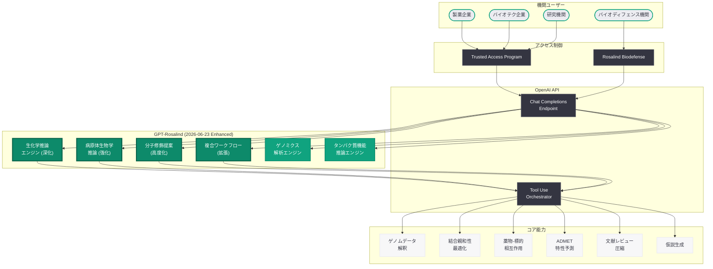
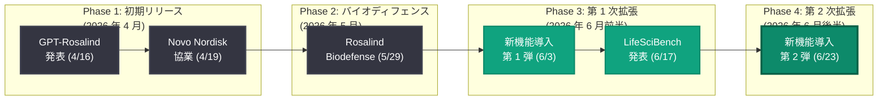

# GPT-Rosalind に新たな能力を導入: 生化学推論の深化と複合ワークフローの拡張

## メタデータ

| 項目 | 内容 |
|------|------|
| 発表日 | 2026-06-23 |
| ソース | OpenAI Research / Product |
| カテゴリ | 研究成果 / 新機能 |
| 公式リンク | [Introducing New Capabilities to GPT Rosalind](https://openai.com/index/introducing-new-capabilities-to-gpt-rosalind/) |

> **注記:** 本記事のページは Cloudflare によるアクセス保護が有効であり、記事本文の直接取得ができなかった。本レポートは、公開されている GPT-Rosalind の過去の発表情報 (2026 年 4 月 16 日の初期発表、6 月 3 日の第 1 次機能拡張、5 月 29 日の Rosalind Biodefense プログラム)、LifeSciBench ベンチマーク結果 (2026 年 6 月 17 日)、および Web リサーチによる関連コンテキストに基づいて構成されている。正確な詳細については公式ページを参照されたい。

## 概要

OpenAI は 2026 年 6 月 23 日、ライフサイエンス研究特化型フロンティアモデル「GPT-Rosalind」に対する新たな能力拡張を発表した。今回のアップデートは、6 月 3 日の第 1 次機能拡張に続く第 2 次の大規模強化であり、より深い生化学推論 (biochemical reasoning)、複合的な研究ワークフロー、病原体生物学の推論強化、および分子修飾提案能力の高度化が含まれると考えられる。

GPT-Rosalind は「生物学初のドメインフロンティアモデルであり、測定可能なラボ上の優位性を持つ」と評されており、2026 年 6 月 17 日に発表された LifeSciBench (750 タスク) において正規化スコア 0.576、タスクパス率 36.1% を記録し、全モデル中トップの成績を達成した。750 タスク中 386 タスクでリードするなど、ライフサイエンス分野における圧倒的な性能を実証している。今回の能力拡張により、GPT-Rosalind の実践的な研究支援能力がさらに強化されることが期待される。

## 主な内容

### 生化学推論の深化

今回のアップデートの中核は、GPT-Rosalind の生化学推論 (biochemical reasoning) 能力のさらなる深化である。6 月 3 日の機能拡張ではマルチスケール生物学的推論が強化されたが、今回はより複雑な生化学的メカニズムの理解と推論に焦点が当てられていると考えられる。

**強化が想定されるポイント:**

- **酵素反応メカニズムの精密推論:** 酵素の触媒機構、遷移状態の安定化、アロステリック制御に関する詳細な推論能力
- **代謝パスウェイの動態解析:** 代謝フラックスの予測、ボトルネック酵素の同定、代謝工学的介入ポイントの提案
- **タンパク質間相互作用ネットワーク:** シグナル伝達カスケードの上流から下流までの統合的推論と、介入標的の優先順位付け
- **エピジェネティクス制御の推論:** クロマチンリモデリング、DNA メチル化パターン、ヒストン修飾と遺伝子発現の因果関係の推論

### 病原体生物学の推論強化

5 月 29 日に発表された Rosalind Biodefense プログラムとの連携を踏まえ、病原体生物学に関する推論能力が大幅に強化されたと考えられる。

**新たに追加された能力 (推定):**

| 能力 | 説明 |
|------|------|
| 病原体ゲノム解析 | ウイルス・細菌のゲノム変異の機能的影響評価 |
| 抗菌薬耐性予測 | 耐性遺伝子の同定と耐性メカニズムの推論 |
| 宿主-病原体相互作用 | 感染メカニズムの分子レベルでの解析 |
| パンデミックサーベイランス | 変異パターンからの感染力・病原性変化の予測 |
| ワクチンターゲット同定 | 保存されたエピトープの同定と免疫原性の予測 |

### 分子修飾提案能力の高度化

GPT-Rosalind の創薬化学支援能力がさらに強化され、結合親和性 (binding affinity) の改善を目的とした分子修飾の提案精度が向上した。

**強化されたポイント:**

- **結合親和性の最適化:** 標的タンパク質に対するリガンドの結合モードを解析し、親和性向上のための構造修飾を提案
- **選択性の向上:** オフターゲット効果を最小化する構造修飾の設計
- **薬物-標的相互作用 (DTI) の精密予測:** タンパク質-リガンド複合体の安定性予測と最適化戦略の提案
- **ADMET プロファイルとの統合最適化:** 結合親和性と ADMET 特性のバランスを考慮したマルチパラメータ最適化

### 複合ワークフローの拡張

6 月 3 日に導入された実験ワークフロー機能がさらに拡張され、より複雑な研究ワークフローに対応できるようになった。

**新たなワークフロー機能 (推定):**

- **文献レビューの圧縮:** 数千の論文を体系的にスキャンし、関連知見を構造化して提示する能力の強化
- **仮説生成の高度化:** 複数のデータソースを統合し、新規性の高い仮説を自動生成する機能
- **実験計画の自動化:** 仮説検証に必要な実験のフルプランニング (プロトコル設計、サンプルサイズ算出、コントロール設計)
- **ゲノムバリアントの機能解釈:** 臨床ゲノミクスデータから病態メカニズムの推論と治療標的の同定までの一貫したワークフロー

### LifeSciBench における性能実績

2026 年 6 月 17 日に発表された LifeSciBench ベンチマーク結果は、GPT-Rosalind の能力を定量的に示すものである。

| 指標 | GPT-Rosalind | GPT-5.5 | 差分 |
|------|-------------|---------|------|
| 正規化スコア | 0.576 | - | 全モデル中トップ |
| タスクパス率 | 36.1% | 25.7% | +10.4pp |
| リードタスク数 | 386/750 | - | 全タスクの 51.5% |
| Translation 平均スコア | 0.712 | - | 最高カテゴリ |
| Scientific Communication パス率 | 71.1% | 56.3% | +14.8pp |
| Translation パス率 | 57.7% | 36.8% | +20.9pp |
| 専門家有用率 | 44.7% | 29.1% | +15.6pp |

特に Translation (創薬プロセスにおけるベンチからベッドサイドへの橋渡し) カテゴリでの平均スコア 0.712 は、GPT-Rosalind が臨床応用に向けた研究支援において際立った能力を持つことを示している。

## 技術的な詳細

### アクセスモデルと提供形態

GPT-Rosalind へのアクセスは引き続き制限付きであり、以下の対象に限定されている。

- **製薬企業:** Amgen、Novo Nordisk をはじめとする大手製薬企業
- **バイオテクノロジー企業:** 審査を通過した適格なバイオテク企業
- **研究機関:** 大学、国立研究所などの学術研究機関
- **バイオディフェンス機関:** Rosalind Biodefense プログラムを通じた審査済みユーザー

### API の利用: 新機能を活用したコード例

GPT-Rosalind の新たな能力は、OpenAI API の Chat Completions エンドポイントを通じてアクセス可能である。

#### 病原体ゲノム解析と結合親和性最適化

```python
from openai import OpenAI

client = OpenAI()

# 病原体ゲノムの変異解析と薬物結合親和性の最適化
response = client.chat.completions.create(
    model="gpt-rosalind",
    messages=[
        {
            "role": "system",
            "content": (
                "You are an expert in pathogen biology and structural virology. "
                "Analyze genomic variants for functional impact, predict effects "
                "on host-pathogen interactions, and suggest molecular modifications "
                "for improved binding affinity of therapeutic candidates."
            )
        },
        {
            "role": "user",
            "content": (
                "Analyze the spike protein mutation E484K in SARS-CoV-2:\n"
                "1. Structural impact on RBD-ACE2 interface\n"
                "2. Effect on class 2 neutralizing antibody binding\n"
                "3. Suggest modifications to antibody CDR-H3 loop to restore "
                "binding affinity\n"
                "4. Predict ADMET implications of proposed antibody modifications"
            )
        }
    ],
    max_tokens=8192
)

print(response.choices[0].message.content)
```

#### タンパク質機能推論とゲノムバリアント解釈

```python
from openai import OpenAI

client = OpenAI()

# タンパク質機能の推論とゲノムバリアントの臨床解釈
response = client.chat.completions.create(
    model="gpt-rosalind",
    messages=[
        {
            "role": "system",
            "content": (
                "You are an expert in protein function and clinical genomics. "
                "Reason about protein function from sequence and structural data, "
                "interpret genomic variants for clinical significance, and predict "
                "drug-target interactions based on molecular mechanisms."
            )
        },
        {
            "role": "user",
            "content": (
                "A patient with refractory AML has the following mutations:\n"
                "- FLT3-ITD (allelic ratio 0.8)\n"
                "- NPM1 Type A insertion\n"
                "- DNMT3A R882H\n\n"
                "Provide:\n"
                "1. Protein function impact for each variant\n"
                "2. Drug-target interactions for available therapies\n"
                "3. Predicted resistance mechanisms to midostaurin\n"
                "4. Suggested combination strategies with molecular rationale"
            )
        }
    ],
    max_tokens=8192
)

print(response.choices[0].message.content)
```

> **注:** 上記のコードサンプルは、公開情報に基づく想定的な利用パターンである。実際の API パラメータおよびモデルの応答形式の詳細は OpenAI の公式ドキュメントを参照されたい。

### GPT-Rosalind の機能エンジン構成

GPT-Rosalind は以下の専門モジュールから構成されていると考えられる。

| モジュール | 機能 | 6 月 23 日の強化点 |
|-----------|------|-------------------|
| ゲノミクスエンジン | ゲノムデータの解釈、バリアント分類 | 病原体ゲノミクスの統合 |
| タンパク質推論エンジン | タンパク質機能、構造、相互作用の推論 | 結合親和性予測の高精度化 |
| 創薬化学モジュール | SAR 解析、ADMET 予測、リード最適化 | 分子修飾提案の高度化 |
| 実験ワークフローエンジン | プロトコル生成、実験設計 | 複合ワークフローの拡張 |
| 文献解析エンジン | 科学文献の検索・要約・統合 | 文献レビュー圧縮の強化 |
| 生化学推論エンジン | 生化学メカニズムの理解と推論 | **新規強化** (深層推論) |

## アーキテクチャ



### GPT-Rosalind の進化タイムライン



## 開発者への影響

### 既存ユーザーへのインパクト

- **創薬パイプラインの高速化:** 生化学推論の深化と分子修飾提案の高度化により、リード化合物の最適化サイクルがさらに短縮される。結合親和性と ADMET プロファイルの統合最適化は、従来は複数の専門チームが必要としたタスクを単一の API 呼び出しで実現する
- **病原体研究の強化:** Rosalind Biodefense プログラムの参加機関は、病原体ゲノム解析や抗菌薬耐性予測の強化された能力を活用し、新興感染症への対応を加速できる
- **研究ワークフローの統合:** 文献レビュー、仮説生成、実験計画の一貫したワークフローにより、研究者が個別ツール間のコンテキストスイッチングを大幅に削減できる
- **ベンチマーク実証済みの信頼性:** LifeSciBench における客観的な性能実績が、GPT-Rosalind の導入決定における根拠を提供する

### アクセス拡大の可能性

6 月 3 日の第 1 次拡張から 20 日での第 2 次拡張は、GPT-Rosalind の開発サイクルが加速していることを示唆する。以下のアクセス拡大が今後期待される。

- **Trusted Access Program の対象拡大:** より多くの研究機関やバイオテク企業への門戸開放
- **API レート制限の緩和:** 大規模スクリーニングや網羅的解析を可能にする処理能力の向上
- **新たな産業パートナーシップ:** 製薬企業以外のヘルスケア、農業バイオテクノロジーへの展開

### 競争環境への示唆

- **Google DeepMind AlphaFold 3 との差別化拡大:** GPT-Rosalind は構造予測に留まらず、病原体生物学、創薬化学、臨床ゲノミクスを包括的にカバーするエンドツーエンドの研究パートナーとしての地位を強化
- **Recursion、Insilico Medicine 等の AI 創薬企業との競合:** 汎用 API としての提供は、専門スタートアップの競争優位性を侵食する可能性がある
- **ドメインフロンティアモデルの先例:** ライフサイエンスに特化したフロンティアモデルの成功は、他のドメイン (材料科学、気候科学等) への展開モデルを提示

## 関連リンク

- [Introducing New Capabilities to GPT Rosalind (公式)](https://openai.com/index/introducing-new-capabilities-to-gpt-rosalind/)
- [GPT-Rosalind 初期発表 (2026-04-16)](https://openai.com/index/introducing-gpt-rosalind)
- [GPT-Rosalind 第 1 次機能拡張 (2026-06-03) - 本リポジトリレポート](./2026-06-03-introducing-new-capabilities-gpt-rosalind.md)
- [Rosalind Biodefense プログラム (2026-05-29)](https://openai.com/index/strengthening-societal-resilience-with-rosalind-biodefense)
- [LifeSciBench ベンチマーク (2026-06-17) - 本リポジトリレポート](./2026-06-17-introducing-life-sci-bench.md)
- [Novo Nordisk と OpenAI の GPT-Rosalind 協業 (2026-04-19) - 本リポジトリレポート](./2026-04-19-novo-nordisk-openai-gpt-rosalind.md)
- [OpenAI Research](https://openai.com/research)
- [OpenAI API ドキュメント](https://platform.openai.com/docs)

## まとめ

GPT-Rosalind への 2026 年 6 月 23 日の能力拡張は、4 月 16 日の初期リリースから約 2 か月での 3 度目の大規模アップデートであり、OpenAI がライフサイエンス AI 分野への投資を急速に加速していることを示す。生化学推論の深化、病原体生物学の推論強化、分子修飾提案能力の高度化、複合ワークフローの拡張という今回の強化は、GPT-Rosalind を単なるドメイン特化 AI から、実験室レベルの研究全体を包括的に支援する「AI 研究パートナー」へと進化させるものである。

LifeSciBench において全モデル中トップの成績 (正規化スコア 0.576、750 タスク中 386 タスクでリード) を達成した GPT-Rosalind は、ドメインフロンティアモデルとしての地位を確立しつつある。特に Translation カテゴリでの平均スコア 0.712 は、創薬プロセスの橋渡し研究における AI の実践的有用性を客観的に実証するものである。

今後のアクセス拡大、産業パートナーシップの拡充、そして Rosalind Biodefense プログラムとの連携深化により、GPT-Rosalind はライフサイエンス研究の加速に不可欠なインフラストラクチャとなる可能性を持つ。製薬・バイオテク企業の研究者には、Trusted Access Program への早期申請と、自組織の研究ワークフローへの GPT-Rosalind 統合の検討を推奨する。

> **免責事項:** 本レポートは Cloudflare によるアクセス保護のため記事本文を直接取得できなかったため、過去の関連発表、LifeSciBench ベンチマーク結果、および Web リサーチによる関連情報に基づいて構成されたものである。実際の発表内容には、新たな具体的機能、追加のベンチマーク結果、新規パートナーシップの発表などが含まれる可能性がある。正確な詳細については公式ページを直接参照されたい。