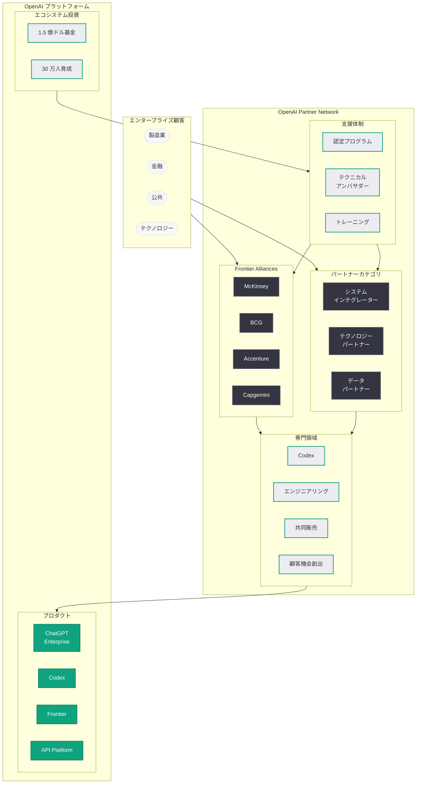

# OpenAI Partner Network: エンタープライズ AI エコシステムの本格始動

## メタデータ

| 項目 | 内容 |
|------|------|
| 発表日 | 2026-06-23 |
| ソース | OpenAI News (Product) |
| カテゴリ | プロダクト / エコシステム |
| 公式リンク | [Introducing the OpenAI Partner Network](https://openai.com/index/introducing-openai-partner-network/) |

> **注記:** 本記事のページは Cloudflare によるアクセス保護が有効であり、記事本文の直接取得ができなかった。本レポートは、サイトマップ情報 (lastmod: 2026-06-23)、公式 URL、初回発表時 (2026-06-14) の情報、および関連するパートナーシップ発表に基づいて構成されている。正確な詳細については[公式ページ](https://openai.com/index/introducing-openai-partner-network/)を参照されたい。

## 概要

OpenAI は「OpenAI Partner Network」を正式に発表し、エンタープライズ顧客の AI 導入を包括的に支援するパートナーエコシステムを構築した。本プログラムは 1 億 5,000 万ドル (約 225 億円) の投資と 2026 年末までに 30 万人の認定コンサルタント育成を目標に掲げ、McKinsey、BCG、Accenture、Capgemini といったグローバル大手コンサルティングファームやシステムインテグレーターとの複数年パートナーシップを締結している。

2026 年 6 月 23 日のサイトマップ更新は、GPT-5.5 関連の発表やセキュリティアップデートと同日に行われており、Partner Network プログラムの拡大・最新化が反映されたものと考えられる。Amazon Bedrock との連携 (2026 年 2 月)、Samsung Electronics の全社展開 (2026 年 6 月) といった個別パートナーシップの急速な拡大を背景に、エコシステム全体を統括するプログラムとしての重要性が一層高まっている。

## 主な内容

### Partner Network の全体構造

OpenAI Partner Network は、4 つのパートナーカテゴリと 4 つの専門領域で構成される多層的なエコシステムである。

#### パートナーカテゴリ

| カテゴリ | 概要 | 代表例 |
|---------|------|--------|
| グローバルシステムインテグレーター | 大規模な技術実装と統合 | Accenture、Capgemini |
| マネジメントコンサルティング | AI 戦略と組織変革 | McKinsey、BCG |
| テクノロジーパートナー | プラットフォーム連携と技術開発 | クラウドプロバイダー、ISV |
| データパートナー | データ統合とインテリジェンス提供 | データプラットフォーム企業 |

#### 専門領域 (Specializations)

| 専門領域 | 内容 |
|---------|------|
| Codex | ソフトウェアエンジニアリングエージェントの導入支援 |
| エンジニアリング | AI エージェントの設計・実装・既存システム統合 |
| 共同販売 (Co-sell) | OpenAI との協業による顧客獲得・案件推進 |
| 顧客機会創出 | エンタープライズ案件の発掘・育成 |

### Frontier Alliances: 最上位パートナーティア

Frontier Alliances は Partner Network の最上位に位置し、世界有数のコンサルティングファームが OpenAI 認定の専門プラクティスグループを構築する枠組みである。

- **McKinsey:** AI 戦略コンサルティングと組織変革支援。Frontier プラットフォームを活用した企業変革プログラムを展開
- **BCG (Boston Consulting Group):** デジタルトランスフォーメーションにおける AI エージェント導入支援。業界別ユースケース開発に注力
- **Accenture:** 大規模な技術実装とシステム統合。グローバルデリバリー体制を活かした展開支援
- **Capgemini:** 欧州を中心としたエンタープライズ AI 導入推進。データパートナーシップとの連携

### 投資と数値目標

| 項目 | 内容 |
|------|------|
| 投資総額 | 1 億 5,000 万ドル (約 225 億円) |
| 認定コンサルタント目標 | 2026 年末までに 30 万人 |
| パートナーシップ期間 | 複数年契約 |
| 早期パイロット成果 | ワークフロー待ち時間 80% 削減 |

### エコシステム拡大の背景: 直近のパートナーシップ動向

OpenAI Partner Network の重要性は、2026 年に入って加速する個別パートナーシップの文脈で理解する必要がある。

| 時期 | パートナーシップ | 意義 |
|------|----------------|------|
| 2026 年 2 月 | Amazon Bedrock 連携 | マルチクラウド展開の実現 |
| 2026 年 3 月 | The Trade Desk 広告連携 | 産業特化の応用拡大 |
| 2026 年 4 月 | Microsoft パートナーシップ修正 | 独立性の確保とエコシステム自律化 |
| 2026 年 5 月 | Dell Codex エンタープライズ展開 | ハードウェアパートナーの参入 |
| 2026 年 5 月 | マルタ政府 ChatGPT Plus 導入 | 公共セクターへの拡大 |
| 2026 年 6 月 | Samsung Electronics 全社展開 | グローバル製造業での大規模採用 |
| 2026 年 6 月 | John Deere 連携 | 農業セクターでの AI 活用 |

これらの個別パートナーシップを体系的に支援し、さらなる拡大を推進する基盤として Partner Network が機能している。

### 認定プログラムと支援体制

パートナー向けに以下の包括的リソースが提供される。

- **認定プログラム:** OpenAI 公式の技術認定制度。Codex、API、エージェント構築などの分野別認定
- **テクニカルアンバサダー:** 専任の技術支援担当者による実装サポート
- **共同販売チャネル:** OpenAI との共同営業活動を通じた顧客獲得
- **トレーニングリソース:** コンサルタント育成のための教育コンテンツとハンズオン環境
- **OpenAI Academy 連携:** パートナー向け専門トレーニングとの統合

## 技術的な詳細

### エンタープライズ AI 導入の標準フロー

Partner Network を通じた典型的なエンタープライズ導入プロセスは以下の通りである。

1. **アセスメント:** ビジネスプロセス分析と AI エージェント導入領域の特定
2. **設計:** Frontier プラットフォーム上でのエージェントアーキテクチャ設計
3. **実装:** Codex やカスタムエージェントの構築、既存システムとの統合
4. **デプロイ:** 本番環境への段階的展開とモニタリング
5. **最適化:** パフォーマンスデータに基づく継続的改善

### API 統合とプラットフォーム連携

パートナーが顧客向けソリューションを構築する際の技術基盤は以下の通りである。

```python
from openai import OpenAI

client = OpenAI()

# Partner Network 認定ソリューションにおけるエージェント構築例
response = client.chat.completions.create(
    model="gpt-4o",
    messages=[
        {
            "role": "system",
            "content": (
                "You are an enterprise workflow automation agent deployed "
                "through the OpenAI Partner Network. Analyze business processes "
                "and recommend AI-driven optimizations with measurable KPIs."
            )
        },
        {
            "role": "user",
            "content": (
                "Analyze the following enterprise workflow and recommend "
                "automation opportunities:\n\n"
                "1. Manual invoice processing (500/day)\n"
                "2. Customer inquiry routing (2000 tickets/day)\n"
                "3. Compliance document review (50 documents/week)\n\n"
                "Provide: automation feasibility, expected time savings, "
                "implementation priority, and integration requirements."
            )
        }
    ],
    max_tokens=4096,
    response_format={"type": "json_object"}
)

print(response.choices[0].message.content)
```

### Codex エンタープライズ統合

Partner Network の Codex 専門領域では、以下のような企業向けカスタマイズが提供される。

- **プライベートリポジトリ統合:** 企業のコードベースに対応した Codex エージェントの設定
- **セキュリティポリシーの適用:** 企業固有のコーディング規約・セキュリティ基準の遵守
- **CI/CD パイプライン連携:** 既存の開発パイプラインとのシームレスな統合
- **監査とガバナンス:** AI 生成コードのトレーサビリティと承認ワークフロー

## アーキテクチャ



### Partner Network のエコシステム全体像

```mermaid
flowchart LR
    subgraph Individual["個別パートナーシップ"]
        Amazon["Amazon<br/>Bedrock"]
        Samsung["Samsung"]
        Dell["Dell"]
        JohnDeere["John Deere"]
        Malta["マルタ政府"]
    end

    subgraph Network["OpenAI Partner Network"]
        direction TB
        FA["Frontier<br/>Alliances"]
        SI["システム<br/>インテグレーター"]
        TP["テクノロジー<br/>パートナー"]
        DP["データ<br/>パートナー"]
    end

    subgraph Outcomes["成果"]
        Speed["80% 高速化"]
        Scale["グローバル<br/>展開"]
        Cert["30 万人<br/>認定"]
    end

    Individual --> Network
    Network --> Outcomes

    classDef openai fill:#10A37F,stroke:#0D8A6A,stroke-width:2px,color:white
    classDef dark fill:#343541,stroke:#444654,stroke-width:2px,color:white
    classDef light fill:#F7F7F8,stroke:#ECECF1,stroke-width:2px,color:#343541

    class FA,Speed,Scale,Cert openai
    class SI,TP,DP dark
    class Amazon,Samsung,Dell,JohnDeere,Malta light
```



## 開発者への影響

OpenAI Partner Network は、開発者およびエンタープライズ顧客に対して以下の影響をもたらす。

- **認定資格による新たなキャリアパス:** 30 万人の認定コンサルタント育成目標は、OpenAI プラットフォームに精通した開発者への需要が急増することを意味する。OpenAI 公式認定の取得が市場価値の向上に直結する

- **Codex 専門スキルの価値向上:** Codex を専門領域とするパートナーの出現により、Codex の Hooks、Automations、サブエージェント機能を活用した企業向けソリューション開発スキルが高い市場価値を持つ

- **エンタープライズ案件へのアクセス:** 共同販売プログラムを通じて、独立系開発者や中小 SI 企業がエンタープライズ案件にアクセスできる経路が確立される

- **API 設計・統合スキルの需要増:** パートナーを通じた導入加速により、Frontier プラットフォームの API やエージェントオーケストレーション機能への需要が急増する

- **マルチクラウド対応の重要性:** Amazon Bedrock との連携に代表されるように、OpenAI モデルが複数のクラウドプラットフォームで利用可能になることで、マルチクラウド環境でのアーキテクチャ設計能力が重要になる

- **競争環境への備え:** 大手コンサルティングファームの参入により AI 導入コンサルティング市場の構造が変化する。独自の業界知識や技術的差別化が中小プレーヤーにとって必須となる

## 関連リンク

- [Introducing the OpenAI Partner Network (公式)](https://openai.com/index/introducing-openai-partner-network/)
- [関連レポート: Samsung Electronics ChatGPT/Codex 全社展開 (6/22)](./2026-06-22-samsung-electronics-chatgpt-codex-deployment.md)
- [関連レポート: OpenAI Partner Network 初回発表 (6/14)](./2026-06-14-introducing-openai-partner-network.md)
- [関連レポート: John Deere パートナーシップ (6/9)](./2026-06-09-john-deere-openai-partnership.md)
- [関連レポート: Dell Codex エンタープライズ展開 (5/18)](./2026-05-18-dell-codex-enterprise-partnership.md)
- [関連レポート: エンタープライズ AI の次なるフェーズ (4/8)](./2026-04-08-next-phase-of-enterprise-ai.md)
- [OpenAI News](https://openai.com/news)
- [OpenAI for Business](https://openai.com/business)
- [OpenAI Platform](https://platform.openai.com/)

## まとめ

OpenAI Partner Network は、OpenAI がテクノロジープロバイダーから「エンタープライズ AI プラットフォーム企業」へ進化する上での中核戦略である。1 億 5,000 万ドルの投資、30 万人の認定コンサルタント育成目標、McKinsey・BCG・Accenture・Capgemini との Frontier Alliances パートナーシップは、エコシステムの規模と本気度を示している。

2026 年 6 月 23 日時点での更新は、GPT-5.5 やセキュリティ関連の発表と同日であることから、新モデルや新機能に対応したパートナープログラムの拡充が行われた可能性が高い。Samsung、Dell、John Deere、Amazon といった多様な産業の大手企業との個別パートナーシップが急速に拡大する中、Partner Network はこれらを体系的に支え、さらなる成長を促進する基盤として機能している。

早期パイロットでの 80% のワークフロー高速化という成果は、エンタープライズ AI 導入の実用性を裏付けるものである。開発者にとっては、認定資格の取得と専門領域の確立が、急拡大するエコシステム内でのポジショニングにおいて重要な戦略的判断となる。

> **免責事項:** 本レポートは Cloudflare によるアクセス保護のため記事本文を直接取得できなかったため、サイトマップ情報、初回発表時の情報、および関連パートナーシップ発表に基づいて構成されたものである。2026 年 6 月 23 日の更新に含まれる具体的な新規パートナー追加や数値の更新については、公式ページを直接参照されたい。
