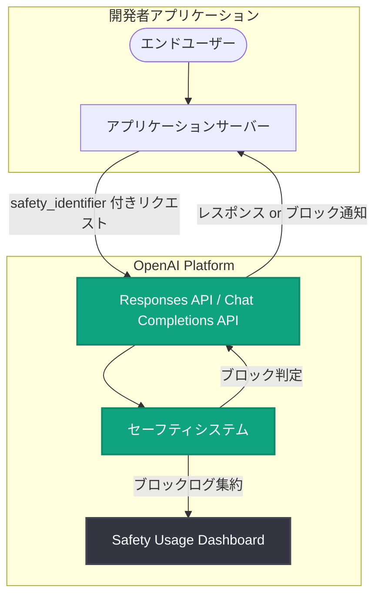

# Safety Usage Dashboard — API セーフティモニタリングの新機能

## メタデータ

| 項目 | 内容 |
|------|------|
| 発表日 | 2026-06-23 |
| ソース | OpenAI API Changelog |
| カテゴリ | API 更新 / セキュリティ |
| 公式リンク | [OpenAI API Changelog](https://developers.openai.com/api/docs/changelog) |

## 概要

OpenAI は 2026 年 6 月 23 日、OpenAI Platform に新たに「Safety Usage Dashboard」をリリースした。このダッシュボードは、API リクエストに含まれる `safety_identifier` 値に基づいて、セーフティシステムによりブロックされた Responses リクエストを可視化する機能である。

開発者はこのダッシュボードを活用することで、どのエンドユーザーがコンテンツモデレーションシステムによってブロックされているかを集約的に把握できるようになる。2026 年 6 月 4 日にリリースされたインラインモデレーションスコア機能と組み合わせることで、リクエスト単位のモデレーション判定とプラットフォーム全体のセーフティ傾向の両方を監視する包括的なセーフティインフラストラクチャが実現される。

## 主な内容

### ダッシュボードの表示内容

Safety Usage Dashboard は以下の情報を提供する。

- **ブロックされたリクエストの集計**: セーフティシステムにより拒否された API レスポンスの総数と推移
- **エンドユーザー別の分析**: `safety_identifier` ごとのブロック頻度と傾向
- **時系列データ**: ブロック率の経時的な変化を可視化
- **カテゴリ別内訳**: どの種類のセーフティポリシー違反が多いかの分析

### safety_identifier の仕組み

`safety_identifier` は、開発者が API リクエストのメタデータとして送信する値であり、エンドユーザーを一意に識別するために使用される。OpenAI のセーフティシステムはこの識別子を利用して、ユーザー単位でのコンテンツモデレーション状況を追跡する。

**重要なポイント:**

- 開発者が自社アプリケーションのユーザー ID を `safety_identifier` として設定する
- OpenAI 側でこの値に基づいてブロック状況を集約し、ダッシュボードに表示する
- 個人を特定する情報 (PII) ではなく、開発者側のシステムで管理される識別子を使用することが推奨される

### モデレーション API との統合

本ダッシュボードは、OpenAI のセーフティインフラストラクチャ全体の一部として位置づけられる。

| コンポーネント | リリース日 | 機能 |
|---------------|-----------|------|
| Moderation API | 既存 | テキスト・画像の有害性判定 (無料) |
| インラインモデレーションスコア | 2026-06-04 | 生成 API レスポンス内でのリアルタイムモデレーション |
| Safety Usage Dashboard | 2026-06-23 | ブロックされたリクエストの集約的な可視化 |

### 開発者向けユースケース

1. **不正利用の早期検出**: 特定のユーザーが繰り返しセーフティポリシーに違反している場合、ダッシュボードで即座に把握できる
2. **コンプライアンス対応**: プラットフォーム全体のモデレーション状況をレポートとして提示可能
3. **プロダクト改善**: ブロック率の高いユースケースを特定し、UI/UX やガイダンスの改善に活用
4. **アラート設定**: ブロック率の急増を検知し、潜在的な不正利用パターンを早期に発見

## 技術的な詳細

### コードサンプル

`safety_identifier` を API リクエストに含める方法は以下の通りである。

```python
from openai import OpenAI

client = OpenAI()

response = client.responses.create(
    model="gpt-5.5",
    input="Hello!",
    metadata={
        "safety_identifier": "user_12345"
    }
)

print(response.output_text)
```

### Chat Completions API での使用例

```python
from openai import OpenAI

client = OpenAI()

response = client.chat.completions.create(
    model="gpt-5.5",
    messages=[
        {"role": "user", "content": "Hello!"}
    ],
    metadata={
        "safety_identifier": "user_12345"
    }
)

print(response.choices[0].message.content)
```

### アーキテクチャ



## 開発者への影響

- **コンプライアンスの強化**: 規制当局や社内ポリシーへの準拠を証明するためのモニタリングデータを容易に取得できる
- **不正利用対策の効率化**: ブロックが頻発するユーザーを特定し、自社側でのアカウント停止やレート制限などの対策を迅速に実施可能
- **運用コストの削減**: セーフティ関連のインシデント調査にかかる時間を短縮し、ダッシュボードから直接傾向を把握可能
- **実装の簡便さ**: 既存の API リクエストに `metadata.safety_identifier` を追加するだけで利用を開始でき、大規模なコード変更は不要
- **プロアクティブな対応**: リアクティブな (問題発生後の) 対応から、プロアクティブな (予防的) セーフティ管理への移行を支援

## 関連リンク

- [OpenAI API Changelog](https://developers.openai.com/api/docs/changelog)
- [OpenAI Platform Dashboard](https://platform.openai.com)
- [Moderation API ドキュメント](https://developers.openai.com/api/docs/guides/moderation)
- [Responses API リファレンス](https://platform.openai.com/docs/api-reference/responses)

## まとめ

Safety Usage Dashboard は、OpenAI のセーフティインフラストラクチャにおける可視化レイヤーとして重要な追加である。主なポイントは以下の通り。

- **ブロックの可視化**: `safety_identifier` に基づくブロックされたリクエストの集約ビューを提供
- **エンドユーザー追跡**: どのユーザーがセーフティポリシーに抵触しているかをプラットフォームレベルで把握可能
- **モデレーションスコアとの補完関係**: 6 月 4 日リリースのインラインモデレーションスコア (リクエスト単位) と本ダッシュボード (集約レベル) の組み合わせにより、包括的なセーフティモニタリングが実現
- **簡単な導入**: `metadata.safety_identifier` の追加のみで利用開始可能
