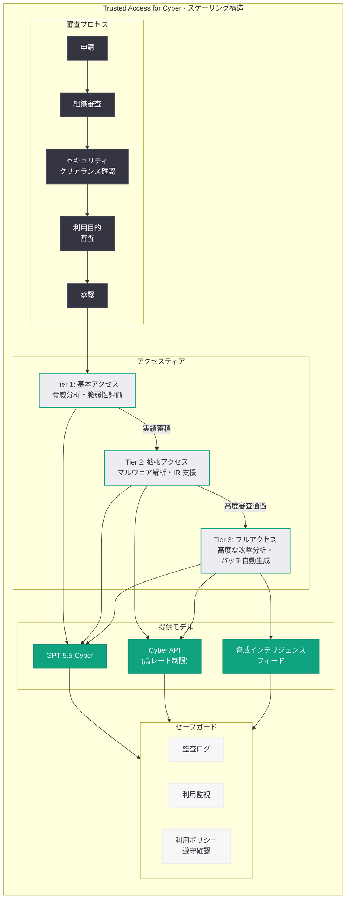
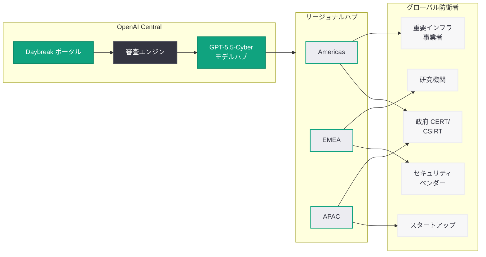

# Scaling Trusted Access for Cyber Defense — サイバー防衛向け Trusted Access プログラムのスケーリング

## メタデータ

| 項目 | 内容 |
|------|------|
| 発表日 | 2026-06-23 |
| ソース | OpenAI Safety |
| カテゴリ | セキュリティ / サイバー防衛 |
| 公式リンク | [Scaling Trusted Access for Cyber Defense](https://openai.com/index/scaling-trusted-access-for-cyber-defense/) |

> **注記:** 本記事のページは Cloudflare によるアクセス保護が有効であり、記事本文の直接取得ができなかった。本レポートは、記事タイトル、同日発表された関連記事群 ("Daybreak: Securing the World"、"Accelerating Cyber Defense Ecosystem")、2026 年 4 月 14 日の同タイトル記事、および Daybreak イニシアチブに関する過去の公開情報に基づいて構成されている。正確な詳細については公式ページを参照されたい。

## 概要

OpenAI は 2026 年 6 月 23 日、サイバーセキュリティ防衛者向けの「Trusted Access for Cyber」プログラムの大規模なスケーリングに関する発表を行った。本記事は、同日公開された "Daybreak: Securing the World" および "Accelerating Cyber Defense Ecosystem" と一体となった発表群の一角を成しており、2026 年 5 月 11 日に始動した Daybreak サイバーセキュリティイニシアチブのグローバル展開を支える中核プログラムの拡張を示すものである。

2026 年 4 月 14 日に発表された初回の "Scaling Trusted Access for Cyber Defense" (Trusted Access プログラムの基盤拡大) から約 2 ヶ月を経て、今回の発表ではプログラムの対象国・対象組織の大幅な拡大、審査プロセスの国際標準化、およびより多くのサイバー防衛者が GPT-5.5-Cyber モデルにアクセスできるようにするためのスケーリング施策が発表されたと考えられる。脆弱性のあるソフトウェアのパッチ適用を民主化するという OpenAI の方針とも密接に関連する取り組みである。

## 主な内容

### Trusted Access for Cyber プログラムの進化

Trusted Access for Cyber は、審査済み (vetted) の防衛者に対してサイバーセキュリティ特化型 AI モデルへの優先アクセスを提供するプログラムである。4 月の初回発表から 6 月のスケーリング発表に至るまでの進化は以下の通りである。

| フェーズ | 時期 | 主な施策 |
|----------|------|----------|
| 基盤構築 | 2026 年 4 月 14 日 | プログラム拡大、GPT-5.4-Cyber 導入、審査プロセス体系化 |
| 次世代モデル統合 | 2026 年 5 月 7 日 | GPT-5.5-Cyber への移行、EU アクセス開始 |
| Daybreak 統合 | 2026 年 5 月 11 日 | Daybreak ブランド下への統合、$10M 助成金 |
| **グローバルスケーリング** | **2026 年 6 月 23 日** | **対象国・組織の大幅拡大、国際審査標準の確立** |

### スケーリングの主要方針

「Scaling」というタイトルが示す通り、今回の発表はプログラムをより多くの組織・国に展開するための施策に焦点を当てていると推察される。

#### 対象組織の拡大

- **政府系サイバー防衛機関:** 各国の CERT/CSIRT、国家サイバーセキュリティセンター
- **重要インフラ事業者:** エネルギー、通信、金融、医療セクターの大規模組織
- **セキュリティベンダー:** マネージドセキュリティサービスプロバイダ (MSSP)、脆弱性管理ベンダー
- **学術・研究機関:** サイバーセキュリティ研究を行う大学・研究所
- **サイバーセキュリティスタートアップ:** Daybreak 助成金受給者を含む新興企業

#### 地理的展開の拡大

- **EU 圏:** 5 月の EU アクセス提供開始を踏まえた全加盟国への展開
- **アジア太平洋地域:** 日本、韓国、オーストラリア、シンガポール等の先進パートナー国
- **Five Eyes 諸国:** 米英加豪新の情報共有ネットワークとの連携
- **NATO 加盟国:** 集団的サイバー防衛能力の強化に向けた対象拡大

### 脆弱性パッチ適用の民主化

OpenAI の公式 X アカウントでの投稿で言及されていた「脆弱性のあるソフトウェアのパッチ適用の民主化 (democratizing patching of vulnerable software)」は、Trusted Access プログラムのスケーリングの重要な目的の一つと位置づけられる。

- **AI 支援の自動パッチ生成:** GPT-5.5-Cyber を活用し、既知の脆弱性に対するパッチを自動生成
- **小規模組織への能力提供:** セキュリティ人材が不足する中小組織でも、AI を活用した脆弱性対応が可能に
- **オープンソースソフトウェアの保護:** 広く使用されるが保守リソースの少ない OSS プロジェクトへのパッチ支援

### 審査プロセスの国際標準化

グローバルスケーリングに伴い、審査 (vetting) プロセスの国際対応が不可欠となる。

| 審査要素 | 国内組織向け | 国際組織向け |
|----------|-------------|-------------|
| 組織認証 | 国内認定基準 | 当該国政府推薦または国際認証 |
| セキュリティクリアランス | 国内基準 | 相互認証協定による国際基準 |
| 利用目的確認 | 防衛目的の宣誓 | 防衛目的 + 国際法遵守の確認 |
| データ管理能力 | 国内法準拠 | 複数法域のデータ管理要件充足 |
| 継続的モニタリング | 国内監査 | 国際基準に基づく定期評価 |
| アクセスティア | 実績に応じた段階的拡大 | 信頼レベルに応じた段階的拡大 |

### 産業パートナーシップとの連携

BNY、Zscaler をはじめとする既存の Daybreak 産業パートナーに加え、グローバルスケーリングに伴い新たなパートナーシップが拡大されていると考えられる。Trusted Access プログラムは、これらのパートナーが自社のサイバー防衛オペレーションに GPT-5.5-Cyber を統合するための主要な入口となっている。

## 技術的な詳細

### アクセスティアの構造

Trusted Access for Cyber プログラムのスケーリングにおいて、組織の信頼レベルと実績に応じた段階的なアクセスモデルが適用されていると推察される。



### グローバルスケーリングのインフラストラクチャ



### API アクセスの想定例

Trusted Access プログラム参加者は、以下のように GPT-5.5-Cyber にアクセスし、脆弱性パッチの自動生成やインシデント対応を行うことができる。

```python
from openai import OpenAI

client = OpenAI()

# Trusted Access プログラム参加者による脆弱性パッチ自動生成の例
response = client.chat.completions.create(
    model="gpt-5.5-cyber",
    messages=[
        {
            "role": "system",
            "content": (
                "You are a cybersecurity patch generation specialist operating "
                "under the Trusted Access for Cyber program. Analyze "
                "vulnerabilities and generate secure, minimal patches that "
                "address the root cause without introducing regressions. "
                "Follow responsible disclosure principles."
            )
        },
        {
            "role": "user",
            "content": (
                "CVE-2026-XXXXX: Buffer overflow in libexample v2.3.1\n\n"
                "Affected function: parse_input() in src/parser.c\n"
                "Root cause: Unchecked length parameter in memcpy call\n"
                "Impact: Remote code execution via crafted input\n\n"
                "Generate a minimal patch that:\n"
                "1. Validates input length before copy\n"
                "2. Adds appropriate bounds checking\n"
                "3. Includes regression test case\n"
                "4. Maintains backward compatibility"
            )
        }
    ],
    max_tokens=4096
)

print(response.choices[0].message.content)
```

### セキュリティセーフガード

スケーリングに伴い、以下のセーフガードが維持・強化されている。

- **利用ポリシーの厳格化:** 防衛目的に限定した利用規約、攻撃的活用の検出と遮断
- **監査証跡の完全記録:** 全 API リクエスト・レスポンスのログ記録、不正利用の事後追跡
- **アクセス制御:** IP 制限、多要素認証、組織単位の API キー管理
- **自動異常検知:** 通常パターンから逸脱した利用の即座検知とアラート
- **定期的な再審査:** 参加組織の継続的な信頼性確認と、必要に応じたアクセス停止

## 開発者への影響

### サイバーセキュリティ開発者への直接的な機会

- **プログラム参加の門戸拡大:** グローバルスケーリングにより、これまでアクセスが限定されていた国や地域のセキュリティ開発者が GPT-5.5-Cyber を活用したソリューション開発に参加できるようになる
- **脆弱性対応の効率化:** AI 支援のパッチ生成により、セキュリティエンジニアは脆弱性の分析から修正適用までのサイクルを大幅に短縮可能
- **脅威インテリジェンスの民主化:** 高度な脅威分析能力が、大企業だけでなく中小規模の組織にも提供されることで、セキュリティスタートアップやコンサルティング企業の競争力が向上

### 日本のセキュリティコミュニティへの示唆

- **JPCERT/CC や NISC との連携可能性:** APAC リージョンのスケーリングにより、日本の主要サイバーセキュリティ機関がプログラムに参加する機会が拡大
- **国内セキュリティ企業の活用:** Trusted Access を通じた GPT-5.5-Cyber の活用により、日本発のセキュリティ製品の高度化が期待される
- **日本語での脅威対応:** 多言語対応の強化により、日本語でのインシデント分析・レポーティングの品質が向上

### 既存の Daybreak 参加者への影響

- **ネットワーク効果の拡大:** 参加組織の増加に伴い、共有される脅威インテリジェンスの量と質が向上
- **グローバル脅威の可視性向上:** 世界各地の防衛者からの情報により、国際的な攻撃キャンペーンの早期検出が可能に
- **コラボレーション機会:** 国際的なセキュリティコミュニティとの連携による共同研究・開発の促進

## 関連リンク

- [Scaling Trusted Access for Cyber Defense (公式)](https://openai.com/index/scaling-trusted-access-for-cyber-defense/)
- [Daybreak: Securing the World (同日発表)](https://openai.com/index/daybreak-securing-the-world/)
- [Daybreak ポータル](https://openai.com/daybreak/)
- [Daybreak: Securing the World (関連レポート 6/23)](./2026-06-23-daybreak-securing-the-world.md)
- [GPT-5.5 と GPT-5.5-Cyber による Trusted Access 拡大 (関連レポート 5/7)](./2026-05-07-gpt-5-5-trusted-access-cyber.md)
- [Daybreak: Frontier AI for Cyber Defenders (関連レポート 5/11)](./2026-05-11-openai-daybreak-cyber-defenders.md)
- [サイバー防衛エコシステムの加速 (関連レポート 4/16)](./2026-04-16-accelerating-cyber-defense-ecosystem.md)
- [Trusted Access プログラムの拡大 (関連レポート 4/14)](./2026-04-14-scaling-trusted-access-cyber-defense.md)
- [インテリジェンス時代のサイバーセキュリティ (関連レポート 4/29)](./2026-04-29-cybersecurity-intelligence-age.md)
- [OpenAI Safety](https://openai.com/safety)

## まとめ

OpenAI が 2026 年 6 月 23 日に発表した "Scaling Trusted Access for Cyber Defense" は、2026 年 4 月に開始された Trusted Access for Cyber プログラムのグローバルなスケーリングを宣言するものである。同日発表された "Daybreak: Securing the World" および "Accelerating Cyber Defense Ecosystem" と一体となり、Daybreak サイバーセキュリティイニシアチブの国際展開を加速する三本柱の一つを構成している。

4 月の基盤構築フェーズ、5 月の Daybreak ブランド統合と EU 展開を経て、6 月のグローバルスケーリングでは対象国・対象組織の大幅拡大、審査プロセスの国際標準化、アクセスティアの整備が進められたと考えられる。「脆弱性のあるソフトウェアのパッチ適用の民主化」という方針のもと、セキュリティ人材が不足する組織や地域にも AI を活用した高度なサイバー防衛能力を提供するスケーリングの取り組みは、サイバーセキュリティの国際的な格差解消に向けた重要な一歩である。

セキュリティ開発者および防衛組織は、Daybreak ポータル (openai.com/daybreak/) を通じてプログラムへの参加申請を検討されたい。

> **免責事項:** 本レポートは Cloudflare によるアクセス保護のため記事本文を直接取得できなかったため、記事タイトル、同日発表の関連記事群、過去の関連レポート群、および公開情報に基づいて構成されたものである。実際の発表内容には、新規参加国のリスト、具体的なスケーリング指標、新たなパートナーシップの詳細などが含まれる可能性がある。正確な詳細については公式ページを直接参照されたい。
