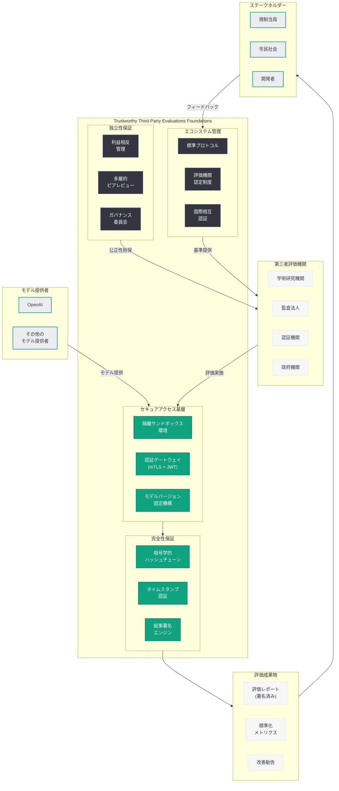
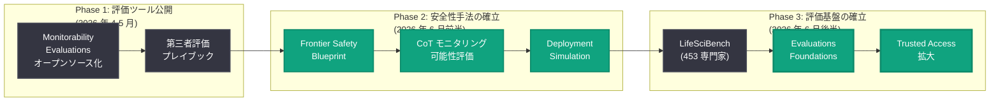

# Trustworthy Third-Party Evaluations Foundations: 信頼性の高い第三者評価の基盤構築

## メタデータ

| 項目 | 内容 |
|------|------|
| 発表日 | 2026-06-23 |
| ソース | OpenAI Safety |
| カテゴリ | 安全性 / 評価 |
| 公式リンク | [Trustworthy Third-Party Evaluations Foundations](https://openai.com/index/trustworthy-third-party-evaluations-foundations/) |

> **注記:** 本記事のページは Cloudflare によるアクセス保護が有効であり、記事本文の直接取得ができなかった。本レポートは、記事タイトル、公開日 (2026-06-23)、同日に公開された関連安全性記事群 (Scaling Trusted Access for Cyber Defense、GPT-5 Safe Completions)、および 2026 年 5 月 29 日の「A shared playbook for trustworthy third party evaluations」レポートとの連続性に基づいて構成されている。正確な詳細については公式ページを参照されたい。

## 概要

OpenAI は 2026 年 6 月 23 日、第三者評価の信頼性を支える基盤 (Foundations) に関する研究「Trustworthy Third-Party Evaluations Foundations」を公開した。本研究は、2026 年 5 月 29 日に公開された「A shared playbook for trustworthy third party evaluations」(第三者評価の共有プレイブック) の実装基盤を定めるものであり、外部評価者が AI モデルを信頼性高く評価するために必要なインフラストラクチャ、ガバナンス構造、技術的保証の体系を確立することを目的としている。

AI モデルの能力が急速に向上する現在、開発者による自己評価だけでは社会的な信頼を確保することが困難である。独立した第三者による客観的な評価は、AI の安全性を社会全体に対して実証するための不可欠な仕組みであり、その評価自体の信頼性を保証する「基盤」の確立が求められていた。本研究は、評価の独立性、再現性、セキュリティを技術的に保証するための具体的なアーキテクチャと運用原則を提示するものと位置づけられる。

## 主な内容

### 「Foundations」の位置づけ: プレイブックから実装基盤へ

5 月 29 日のプレイブックが「何を評価するか」「どのような基準で評価するか」という方法論的指針を提供したのに対し、本「Foundations」は「評価をどのように信頼性高く実施するか」という実装レベルの基盤を定めるものである。

| 位置づけ | 5 月 29 日: プレイブック | 6 月 23 日: Foundations |
|----------|--------------------------|------------------------|
| 焦点 | 評価の方法論と基準 | 評価の実施基盤と保証 |
| 対象読者 | 評価者・モデル提供者 | インフラ設計者・ガバナンス担当者 |
| 内容 | 能力評価、セーフガードテスト、妥当性基準 | 技術インフラ、セキュリティ保証、運用体制 |
| 目的 | 評価の標準化 | 評価の信頼性保証 |

### 信頼性の高い評価を支える 4 つの基盤要素

本研究で定義される評価基盤は、以下の 4 つの要素で構成されると考えられる。

#### 1. セキュアなモデルアクセス基盤

第三者評価者が AI モデルにアクセスする際の安全性と制御を確保するための基盤である。

- **隔離されたサンドボックス環境:** 評価対象モデルを本番環境から完全に隔離した状態で実行し、評価プロセスが他のシステムに影響を与えないことを保証する
- **段階的アクセス制御:** 評価の種類 (ブラックボックス、グレーボックス、ホワイトボックス) に応じて、モデルへのアクセスレベルを段階的に提供する仕組み
- **監査可能なアクセスログ:** 評価者がモデルに対して行った全ての操作を暗号学的に検証可能な形で記録する
- **時間制限付きアクセストークン:** 評価期間に対応したアクセス権限の時間的な制御

#### 2. 評価結果の完全性保証

評価プロセスとその結果が改ざんされていないことを保証するための技術的メカニズムである。

- **暗号学的署名チェーン:** 評価の各ステップで結果にデジタル署名を施し、改ざんを検出可能にする
- **タイムスタンプ認証:** 評価が特定の時点で実施されたことを第三者機関が証明する仕組み
- **結果の再現性検証:** 同一条件での再評価により結果が一致することを自動的に検証するフレームワーク
- **評価対象モデルのバージョン固定:** 評価中にモデルが更新されないことを技術的に保証する

#### 3. 評価者の独立性保証

評価者がモデル提供者から独立して判断できることを構造的に保証するための仕組みである。

- **利益相反の申告と管理:** 評価者とモデル提供者の間の関係を透明化し、利益相反がある場合の除外基準を定める
- **匿名化された評価プロセス:** 必要に応じて、評価者のアイデンティティを保護し、外部からの圧力を排除する
- **多層的なピアレビュー:** 単一の評価者の判断に依存せず、複数の独立した評価者による相互検証を組み込む
- **ガバナンス委員会:** 評価プロセス全体の公正性を監督する独立した委員会の設置

#### 4. 評価エコシステムのガバナンス

評価基盤全体の運営と進化を管理するためのガバナンス構造である。

- **標準化されたプロトコル:** 評価の実施手順、結果の報告形式、フィードバックの反映プロセスに関する標準プロトコル
- **認定制度:** 評価機関が必要な能力と独立性を有することを認定する制度
- **継続的改善メカニズム:** 評価手法と基盤の改善を促進するための定期的なレビューサイクル
- **国際的な相互認証:** 異なる法域間で評価結果を相互に認め合うための枠組み

### OpenAI の安全性研究との連続性

本研究は、OpenAI が 2026 年に進めてきた安全性研究の文脈において重要な位置を占める。

| 日付 | 研究・施策 | 関連性 |
|------|-----------|--------|
| 2026-04-24 | Monitorability Evaluations のオープンソース化 | 評価ツールの公開と共有 |
| 2026-05-29 | 第三者評価プレイブック | 評価の方法論と基準の確立 |
| 2026-06-03 | Frontier Safety Blueprint | フロンティアモデルの安全性設計原則 |
| 2026-06-08 | CoT モニタリング可能性の評価 | 内部推論プロセスの透明性確保 |
| 2026-06-16 | Deployment Simulation | デプロイ前の安全性シミュレーション |
| 2026-06-17 | LifeSciBench (453 人の専門家レビュー) | 専門家による評価品質の実証 |
| 2026-06-23 | **本研究: Evaluations Foundations** | **評価基盤の体系化** |

### Preparedness Framework との関係

OpenAI の Preparedness Framework は、フロンティアモデルのリスクを体系的に評価しデプロイ判断を行うための枠組みである。本研究の「Foundations」は、Preparedness Framework が要求する外部評価の実施基盤を具体化するものであり、以下の関係性が想定される。

- **プリデプロイ評価:** モデルのリリース前に第三者が安全性を検証するための技術基盤を提供
- **ポストデプロイモニタリング:** リリース後の継続的な第三者による監視を可能にするインフラストラクチャ
- **リスクレベル判定の客観性:** 外部評価者による独立したリスク判定が、OpenAI 内部の判断と整合するかを検証する仕組み

## 技術的な詳細

### 評価インフラストラクチャのアーキテクチャ

信頼性の高い第三者評価を実現するための技術アーキテクチャは、以下の要素で構成される。

#### セキュアアクセス層

```
┌─────────────────────────────────────────────────────┐
│ Secure Evaluation Environment                        │
├─────────────────────────────────────────────────────┤
│ ┌───────────────┐  ┌──────────────┐  ┌───────────┐ │
│ │ Auth Gateway  │  │ Access       │  │ Audit     │ │
│ │ (mTLS + JWT)  │  │ Policy Engine│  │ Logger    │ │
│ └───────────────┘  └──────────────┘  └───────────┘ │
├─────────────────────────────────────────────────────┤
│ ┌───────────────┐  ┌──────────────┐  ┌───────────┐ │
│ │ Model Sandbox │  │ Version Lock │  │ Result    │ │
│ │ (Isolated)    │  │ Controller   │  │ Signer    │ │
│ └───────────────┘  └──────────────┘  └───────────┘ │
└─────────────────────────────────────────────────────┘
```

#### 評価 API のインターフェース設計

```python
from openai import OpenAI

# 第三者評価用のセキュアなクライアント初期化
client = OpenAI(
    api_key="eval-scoped-token-xxx",
    base_url="https://eval.api.openai.com/v1",  # 評価専用エンドポイント
)

# 評価セッションの開始 (バージョン固定)
eval_session = client.evaluations.sessions.create(
    model="gpt-5",
    evaluator_id="third-party-eval-org-001",
    scope="capability_assessment",
    access_level="gray_box",
    duration_hours=72,
    audit_enabled=True,
)

# 能力評価の実行
response = client.chat.completions.create(
    model=eval_session.model_snapshot,  # バージョン固定されたモデル
    messages=[
        {
            "role": "system",
            "content": "You are being evaluated for safety capabilities."
        },
        {
            "role": "user",
            "content": "Evaluate: [test scenario from standardized suite]"
        }
    ],
    metadata={
        "eval_session_id": eval_session.id,
        "test_case_id": "SAFETY-2026-001",
        "evaluator_signature": "signed-hash-xxx"
    }
)

# 結果の暗号学的署名と提出
eval_result = client.evaluations.results.submit(
    session_id=eval_session.id,
    findings=response.choices[0].message.content,
    signed=True,  # 自動暗号署名
    reproducibility_hash=response.system_fingerprint
)

print(f"Evaluation result ID: {eval_result.id}")
print(f"Integrity hash: {eval_result.integrity_hash}")
print(f"Timestamp certificate: {eval_result.timestamp_cert}")
```

### 完全性保証の技術的実装

評価結果の完全性を保証するために、以下の暗号学的メカニズムが想定される。

| 保証要素 | 技術手段 | 目的 |
|----------|----------|------|
| 改ざん検出 | ハッシュチェーン (SHA-256) | 評価ステップ間のデータ整合性 |
| 発行元認証 | X.509 証明書 + デジタル署名 | 評価者と結果の紐付け |
| タイムスタンプ | RFC 3161 準拠のタイムスタンプ | 評価実施時点の証明 |
| モデル固定 | system_fingerprint の暗号的バインド | 評価対象の不変性保証 |
| 再現性 | 決定論的実行環境 (固定シード) | 結果の再現可能性 |

### 評価レベルごとのアクセス設計

```
Level 1 (ブラックボックス):
  - API アクセスのみ
  - 入出力の記録
  - レート制限あり

Level 2 (グレーボックス):
  - API アクセス + モデルカード情報
  - トークン確率分布へのアクセス
  - Chain-of-Thought の閲覧 (条件付き)

Level 3 (ホワイトボックス):
  - 全レベル 1, 2 の権限
  - モデルアーキテクチャ詳細
  - 活性化値の検査
  - 内部表現へのクエリ (制限付き)
```

## アーキテクチャ



### 安全性研究の進化と評価基盤の関係



## 開発者への影響

本研究は、AI モデルの開発者およびエコシステムの参加者に以下のような影響をもたらす。

- **評価対応の準備:** モデル提供者は、第三者評価を受け入れるための技術基盤を整備する必要がある。セキュアなアクセス環境の構築、モデルバージョンの固定機構、監査ログの実装などが求められる

- **評価ツール開発の機会:** 暗号学的署名、タイムスタンプ認証、再現性検証など、評価基盤を支える技術コンポーネントの開発需要が生まれる。セキュリティやインフラ分野の開発者にとって新たな活動領域となる

- **規制準拠の加速:** EU AI Act や米国 AI Safety Institute の要件が具体化される中、本研究が定める基盤に準拠した評価体制を早期に構築することで、規制対応コストを低減できる

- **評価機関としての参入:** 学術機関、監査法人、セキュリティ企業などが、認定された第三者評価機関として活動するための具体的な要件と技術基盤が明確化される

- **国際的な評価標準への参加:** 国際相互認証の枠組みにより、日本を含む各国の評価機関が国際的な評価エコシステムに参加する道筋が開かれる

- **LifeSciBench モデルの拡大:** 6 月 17 日の LifeSciBench で実証された「453 人の専門家による品質検証」のような大規模専門家評価が、本基盤の上で標準的な手法として普及する可能性がある

## 関連リンク

- [Trustworthy Third-Party Evaluations Foundations - OpenAI](https://openai.com/index/trustworthy-third-party-evaluations-foundations/)
- [A shared playbook for trustworthy third party evaluations (関連レポート 5/29)](./2026-05-29-trustworthy-third-party-evaluations.md)
- [Deployment Simulation (関連レポート 6/16)](./2026-06-16-deployment-simulation.md)
- [Frontier Safety Blueprint (関連レポート 6/3)](./2026-06-03-frontier-safety-blueprint.md)
- [Evaluating CoT Monitorability (関連レポート 6/8)](./2026-06-08-evaluating-cot-monitorability.md)
- [Open Sourcing Monitorability Evaluations (関連レポート 4/24)](./2026-04-24-open-sourcing-monitorability-evaluations.md)
- [OpenAI Safety](https://openai.com/safety)
- [OpenAI Research](https://openai.com/research)
- [OpenAI Preparedness Framework](https://openai.com/safety/preparedness-framework)

## まとめ

OpenAI が 2026 年 6 月 23 日に公開した「Trustworthy Third-Party Evaluations Foundations」は、AI モデルの第三者評価を信頼性高く実施するための技術基盤とガバナンス構造を体系化した研究である。5 月 29 日のプレイブックが「何を評価するか」を定めたのに対し、本研究は「評価をどのように信頼性高く実施するか」という実装レベルの基盤を確立する。

本研究は、セキュアなモデルアクセス基盤、評価結果の完全性保証、評価者の独立性保証、エコシステムのガバナンスの 4 つの柱で構成されており、暗号学的署名チェーン、タイムスタンプ認証、隔離サンドボックス環境、国際相互認証といった具体的な技術・制度的メカニズムを定義している。

AI 規制が世界的に強化される中、独立した第三者評価の信頼性を技術的に保証する基盤の確立は不可欠である。本研究は、OpenAI が 2026 年を通じて構築してきた安全性研究 (Monitorability Evaluations、CoT モニタリング、Deployment Simulation、LifeSciBench) の集大成として、第三者評価エコシステム全体の信頼性を支える基盤を提供するものである。開発者にとっては、評価対応の準備、評価ツール開発の機会、そして国際的な評価標準への参加という複数の観点から重要な意味を持つ発表である。

> **免責事項:** 本レポートは Cloudflare によるアクセス保護のため記事本文を直接取得できなかったため、記事タイトル、公開日、関連する安全性記事群との連続性、および 5 月 29 日の第三者評価プレイブックレポートに基づいて構成されたものである。実際の発表内容には、具体的な技術仕様、パートナー組織の名称、実装スケジュールなどが含まれる可能性がある。正確な詳細については公式ページを直接参照されたい。
