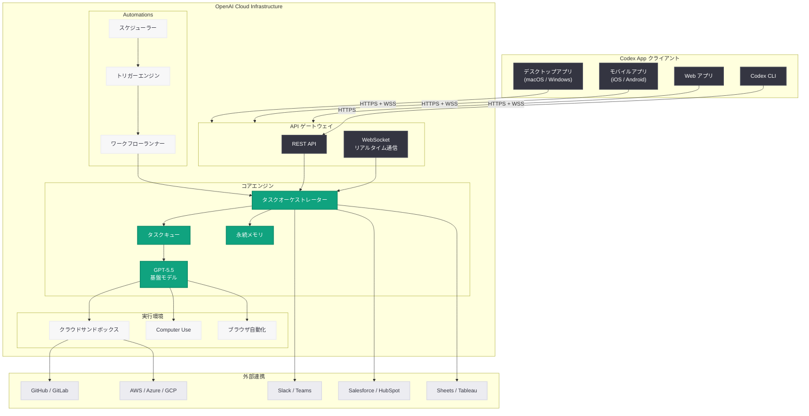

# Codex App の発表: ChatGPT から独立したスタンドアロン AI ワークプラットフォームの誕生

## メタデータ

| 項目 | 内容 |
|------|------|
| 発表日 | 2026-06-24 |
| ソース | OpenAI News |
| カテゴリ | 新機能 / プロダクト |
| 公式リンク | [Introducing the Codex App](https://openai.com/index/introducing-the-codex-app/) |

> **注記:** 本記事のページは Cloudflare によるアクセス保護が有効であり、記事本文の直接取得ができなかった。本レポートは、サイトマップ情報および過去の関連レポート群に基づいて構成されている。正確な詳細については公式ページを参照されたい。

## 概要

OpenAI は 2026 年 6 月 24 日、「Introducing the Codex App」と題して、Codex をスタンドアロンの専用アプリケーションとして正式にリリースしたことを発表した。これまで ChatGPT の一機能として提供されていた Codex が、独立した専用アプリとして再構成されたことを意味する。デスクトップ (macOS / Windows)、モバイル (iOS / Android)、Web の各プラットフォームで利用可能であり、クラウドベースのサンドボックス環境でのコード実行を基盤とする。

本発表は、2026 年 5 月 16 日に Greg Brockman 氏が示した「ChatGPT と Codex の統合プラットフォーム化」ビジョンの具現化であると同時に、Codex がコーディングツールからユニバーサル AI ワークプラットフォームへと進化した軌跡の到達点を示すものである。Codex は既に 400 万人以上の週間アクティブユーザーを抱え、エンジニアリングのみならず財務、セールス、ビジネスオペレーション、データサイエンスなど全ての知識労働に対応する汎用プラットフォームへと拡大しており、専用アプリ化はその成熟を象徴する。

## 主な内容

### Codex App とは何か

Codex App は、OpenAI が提供する AI エージェントプラットフォーム「Codex」の専用クライアントアプリケーションである。従来、Codex は ChatGPT の Web インターフェースおよびモバイルアプリ内の一機能として提供されていたが、今回のリリースにより、専用のユーザーインターフェースと最適化されたワークフローを持つ独立アプリケーションとなった。

**主な位置づけ:**

- ChatGPT が「会話型 AI アシスタント」であるのに対し、Codex App は「自律型タスク実行プラットフォーム」
- 長時間のバックグラウンドタスク、並行タスク管理、専門的なワークフロー自動化に最適化
- コーディングに限らず、全てのナレッジワークに対応するユニバーサルなワークスペース

### 主要機能

Codex App は、これまで ChatGPT 内で展開されてきた Codex の全機能を統合し、さらに専用アプリならではの新機能を追加している。

**タスク管理ダッシュボード:**
- 複数の Codex タスクを同時に実行・監視するための統合ダッシュボード
- タスクの進行状況、実行ログ、リソース使用量のリアルタイム表示
- タスク間の依存関係管理と優先度設定

**ワークスペース:**
- プロジェクトごとに独立したワークスペースを作成
- ワークスペース内でファイル、設定、メモリ、Automations を一元管理
- チームでのワークスペース共有とコラボレーション

**Automations エンジン:**
- 条件ベースのトリガーによるワークフロー自動化
- スケジュール実行、Webhook トリガー、イベント駆動型の自動化
- YAML ベースのワークフロー定義とビジュアルエディタ

**永続メモリとコンテキスト:**
- プロジェクト横断的なコンテキスト保持
- 組織固有の知識、スタイルガイド、用語辞書の学習
- セッション間でのインテリジェントなコンテキスト引き継ぎ

**Computer Use 統合:**
- デスクトップアプリケーションの直接操作
- ブラウザ自動化によるリサーチと情報収集
- GUI ベースのワークフロー自動化

### プラットフォーム対応

Codex App は以下の全プラットフォームで利用可能である。

| プラットフォーム | 形態 | 主要な特徴 |
|---------------|------|-----------|
| macOS | ネイティブアプリ | システム統合、Spotlight 連携、メニューバー常駐 |
| Windows | ネイティブアプリ | Windows サンドボックス連携、タスクバー常駐 |
| iOS | モバイルアプリ | プッシュ通知、リアルタイム監視、タップ承認 |
| Android | モバイルアプリ | 同上 |
| Web | ブラウザアプリ | プラットフォーム非依存、即時アクセス |

### ChatGPT との違い

Codex App と ChatGPT は異なるユースケースに最適化されている。

| 観点 | ChatGPT | Codex App |
|------|---------|-----------|
| 主要ユースケース | 対話型 Q&A、ブレインストーミング、短文生成 | 自律タスク実行、ワークフロー自動化、長時間処理 |
| 実行モデル | 同期的な会話 | 非同期バックグラウンドタスク |
| タスクの粒度 | 1 回の応答で完結 | 数分から数時間にわたる複合タスク |
| 環境 | 会話ウィンドウ | サンドボックス + リポジトリ接続 |
| コラボレーション | 会話の共有 | ワークスペースベースのチーム協業 |
| 自動化 | なし | Automations による定期実行 |
| メモリ | 会話内コンテキスト | プロジェクト横断的な永続メモリ |

ただし、ChatGPT から Codex タスクを起動する統合パスは引き続き維持されており、ユーザーは用途に応じて両方のインターフェースを使い分けることができる。

### 既存ツールとの統合

Codex App は、2026 年 4 月以降に確立されたプラグインエコシステムを活用し、主要なビジネスツールとのシームレスな連携を提供する。

**開発ツール:**
- GitHub、GitLab、Bitbucket: リポジトリ接続、PR 作成、コードレビュー
- VS Code、JetBrains IDE: エディタ拡張経由での連携
- CI/CD: GitHub Actions、Jenkins、CircleCI との統合

**ビジネスツール:**
- CRM: Salesforce、HubSpot
- プロジェクト管理: Jira、Asana、Linear、Notion
- コミュニケーション: Slack、Microsoft Teams
- データ: Google Sheets、Excel、Tableau、Looker、Databricks

**クラウドプラットフォーム:**
- AWS (Amazon Bedrock 連携)、Azure、GCP
- SSH 経由のリモート環境接続

## 技術的な詳細

### Codex App のアーキテクチャ

Codex App は、クライアント-サーバーアーキテクチャを採用している。ネイティブクライアントアプリがフロントエンドとして動作し、OpenAI のクラウドインフラストラクチャ上でタスクの実行とオーケストレーションが行われる。

**クライアント層:**
- Electron ベースのデスクトップアプリ (macOS / Windows)
- React Native ベースのモバイルアプリ (iOS / Android)
- React ベースの Web アプリ
- WebSocket による双方向リアルタイム通信

**サーバー層:**
- タスクキューとオーケストレーションエンジン
- クラウドサンドボックス (コード実行環境)
- GPT-5.5 基盤モデルによる推論
- 永続メモリストア
- プラグインゲートウェイ (外部ツール連携)

**セキュリティ層:**
- エンタープライズ SSO / SCIM
- サンドボックス分離によるセキュアな実行環境
- データのモデルトレーニング非使用保証
- 監査証跡と管理者コンソール

### API 連携の例

```python
from openai import OpenAI

client = OpenAI()

# Codex App のタスクを API 経由で作成
task = client.codex.tasks.create(
    workspace="my-project",
    prompt="""
    リポジトリ内の全テストファイルを分析し、
    カバレッジが 60% 未満のモジュールを特定して、
    不足しているユニットテストを生成してください。
    """,
    tools=[
        {"type": "sandbox", "environment": "python-3.12"},
        {"type": "github", "repo": "org/my-repo"},
    ],
    mode="background",  # 非同期バックグラウンド実行
    notify=["slack:#dev-alerts"],  # 完了時に Slack 通知
)

# タスクのステータス確認
status = client.codex.tasks.retrieve(task.id)
print(f"Status: {status.state}")  # running, completed, needs_approval

# 結果の取得
if status.state == "completed":
    result = client.codex.tasks.result(task.id)
    print(result.summary)
    for file_change in result.changes:
        print(f"  {file_change.path}: +{file_change.additions} -{file_change.deletions}")
```

### ワークフロー自動化の定義例

```yaml
# Codex App Automation: 日次コード品質レポート
name: daily-code-quality
workspace: engineering-platform
trigger:
  schedule: "every day at 08:00"
steps:
  - name: analyze-repos
    tool: github
    action: list_recent_commits
    params:
      org: my-organization
      since: last_24_hours
  - name: run-quality-checks
    agent: codex
    prompt: |
      以下の最新コミットに対してコード品質分析を実行してください。
      チェック項目:
      - コーディング規約違反
      - セキュリティリスク
      - パフォーマンス改善の余地
      - テストカバレッジの変化
    input: "{{steps.analyze-repos.output}}"
  - name: generate-report
    agent: codex
    prompt: |
      分析結果をチームリーダー向けの日次レポートに整形してください。
    input: "{{steps.run-quality-checks.output}}"
  - name: notify
    tool: slack
    action: post_message
    params:
      channel: "#engineering-quality"
      content: "{{steps.generate-report.output}}"
```

## アーキテクチャ



## 開発者への影響

### スタンドアロンアプリ化のメリット

- **専用 UI による効率化:** タスク管理ダッシュボード、並行タスク監視、ワークスペース管理など、ChatGPT の汎用インターフェースでは実現しにくかった専門的な UX が利用可能になる
- **バックグラウンド実行の本格化:** デスクトップアプリとして常駐することで、ブラウザタブを閉じても Codex タスクの状態を把握し、通知を受け取れる
- **システム統合の深化:** macOS の Spotlight や Windows のタスクバーとの統合により、OS レベルでの素早いアクセスが可能になる

### API とエコシステム

- **Codex Tasks API:** バックグラウンドタスクの作成、監視、結果取得を行う専用 API が提供されることで、サードパーティアプリケーションが Codex のタスク実行能力を組み込める
- **プラグイン開発:** Codex App のプラグインシステムを通じて、独自のツール連携やワークフローテンプレートを開発・配布できる新しいエコシステムが形成される
- **ワークスペーステンプレート:** 業種・職種別のワークスペースプリセットをマーケットプレイスで共有可能

### エンタープライズ開発者

- **ガバナンスの強化:** 専用アプリによる一元管理は、IT 部門にとってポリシー適用と監査を容易にする
- **デプロイメントの簡素化:** MDM (モバイルデバイス管理) を通じた企業内展開が容易になる
- **セキュリティの向上:** ブラウザベースの ChatGPT とは異なり、専用アプリではよりきめ細かなアクセス制御と暗号化が実現できる

### 既存 Codex ユーザーへの移行

- ChatGPT 内の Codex 機能は引き続き利用可能であり、既存のワークフローが即座に使えなくなることはない
- Codex App への移行パスが用意され、既存のタスク履歴、メモリ、Automations の設定が引き継がれる
- Codex CLI ユーザーは、CLI から Codex App のワークスペースに直接接続可能

## 関連リンク

- [Introducing the Codex App (公式発表)](https://openai.com/index/introducing-the-codex-app/)
- [Codex for Every Role, Tool, and Workflow](https://openai.com/index/codex-for-every-role-tool-workflow/) - 全職種対応 (2026-06-03)
- [Codex for Knowledge Work](https://openai.com/index/codex-for-knowledge-work) - ナレッジワーク対応 (2026-06-02)
- [Greg Brockman が ChatGPT - Codex 統合を計画](https://openai.com/index/work-with-codex-from-anywhere/) - 統合ビジョン (2026-05-16)
- [Codex Mobile Anywhere](https://openai.com/index/work-with-codex-from-anywhere) - モバイル対応 (2026-05-14)
- [Codex Windows Sandbox](https://openai.com/index/codex-windows-sandbox) - Windows サンドボックス (2026-05-13)
- [Get Codex for your enterprise, free](https://openai.com/index/get-codex-for-your-enterprise-free/) - エンタープライズ無料提供 (2026-05-13)
- [Codex for (almost) everything](https://openai.com/index/codex-for-almost-everything) - スーパーアプリ化 (2026-04-16)
- [Codex Labs](https://openai.com/index/codex-labs) - 実験機能 (2026-04-21)
- [OpenAI News](https://openai.com/news)

## まとめ

「Introducing the Codex App」は、OpenAI が 2026 年を通じて推進してきた Codex プラットフォーム戦略の集大成である。主要なポイントは以下の通りである。

1. **スタンドアロンアプリとしての独立:** Codex が ChatGPT の一機能から独立した専用アプリケーションへと昇格したことは、その製品としての成熟度と市場における重要性を示している。400 万人以上の WAU を持つプラットフォームが専用のクライアント体験を獲得した

2. **マルチプラットフォーム展開:** macOS、Windows、iOS、Android、Web の全プラットフォームでの提供は、「どこからでも Codex を使う」というビジョンの完全な実現である

3. **ChatGPT との差別化と共存:** 対話型 AI (ChatGPT) と自律型タスク実行プラットフォーム (Codex App) という明確な棲み分けにより、ユーザーは用途に応じて最適なインターフェースを選択できる

4. **エンタープライズ戦略の完成:** 専用アプリ化は、IT ガバナンス、MDM 展開、セキュリティポリシー適用の観点からエンタープライズ導入を促進する重要な要素である

5. **エージェント型の未来の具現化:** Greg Brockman 氏が 5 月に示したビジョンが具体的なプロダクトとして結実し、AI エージェントが独立したワークスペースとして機能する新しいパラダイムが確立された

本発表は、AI アプリケーションが汎用チャットインターフェースから専門的なプラットフォームへと分化する業界トレンドを象徴するものであり、OpenAI がコンシューマーとエンタープライズの両市場において製品ラインナップを戦略的に拡充していることを明確に示している。
