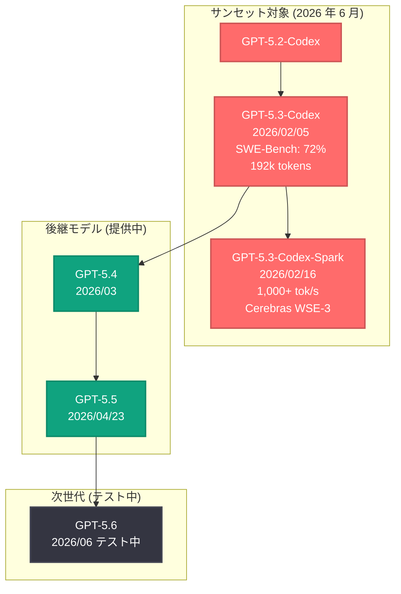
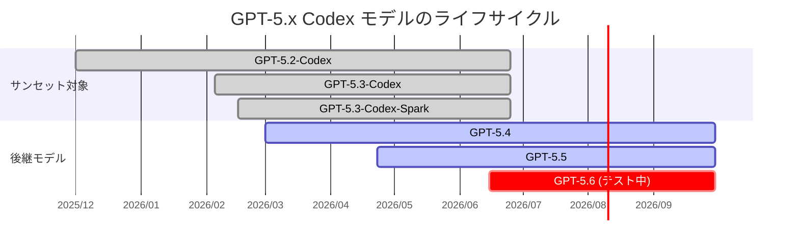

# GPT-5.2 および GPT-5.3-Codex モデルのサンセット (提供終了)

## メタデータ

| 項目 | 内容 |
|------|------|
| 発表日 | 2026-06-25 |
| ソース | OpenAI News |
| カテゴリ | Product / モデル更新 |
| 公式リンク | [Introducing GPT-5.3 Codex](https://openai.com/index/introducing-gpt-5-3-codex/)、[Introducing GPT-5.3 Codex Spark](https://openai.com/index/introducing-gpt-5-3-codex-spark/) |

> **注記:** 本記事のページは Cloudflare によるアクセス保護が有効であり、記事本文の直接取得ができなかった。本レポートは、サイトマップ情報、検索エンジンの検索結果スニペット、および関連する公開情報に基づいて構成されている。正確な詳細については公式ページを参照されたい。

## 概要

OpenAI は 2026 年 6 月 25 日、GPT-5.2-Codex および GPT-5.3-Codex シリーズのモデルのサンセット (提供終了) を発表した。対象となるモデルは GPT-5.3-Codex (2026 年 2 月 5 日リリース) および GPT-5.3-Codex-Spark (2026 年 2 月 16 日リリース) であり、後継モデルとして GPT-5.4 (2026 年 3 月)、GPT-5.5 (2026 年 4 月 23 日)、および現在テスト中の GPT-5.6 が提供されている。

GPT-5.3-Codex は「自分自身の作成に貢献した初のモデル」として知られ、Codex と GPT-5 のトレーニングスタックを初めて統合したモデルであった。わずか約 4 か月間の提供期間を経てサンセットとなったことは、OpenAI のモデル進化の速度を如実に示している。

## 主な内容

### GPT-5.3-Codex の歴史と特徴

GPT-5.3-Codex は 2026 年 2 月 5 日にリリースされた、コーディング性能とプロフェッショナルな知識能力を兼ね備えたフロンティアモデルである。

**主な特徴:**

- **GPT-5.2-Codex のフロンティアコーディング性能**と**より強力な推論能力および専門知識**を統合
- 前世代モデルと比較して **25% 高速化**を実現
- **SWE-Bench Pro スコア: 72%** -- 高度なソフトウェアエンジニアリングタスクにおける卓越した性能
- **コンテキストウィンドウ: 192k トークン** -- 大規模コードベースの処理に対応
- Codex アプリ、CLI、IDE 拡張機能、Web インターフェース、macOS デスクトップアプリで利用可能
- 「自身のトレーニングランのデバッグに貢献した初のモデル」-- 自己改善能力の萌芽を示す
- Codex と GPT-5 のトレーニングスタックを初めて統合

Fortune 誌は本モデルについて「前例のないサイバーセキュリティリスクを提起する」と報じる一方、「競合システムに対する着実な進歩」と評価した。

### GPT-5.3-Codex-Spark の歴史と特徴

GPT-5.3-Codex-Spark は 2026 年 2 月 16 日にリサーチプレビューとしてリリースされた、超高速推論に特化したバリアントである。

**主な特徴:**

- **Cerebras のウェハースケールチップ (WSE-3) 上で動作**
- **1,000+ トークン/秒** -- 標準の GPT-5.3 Codex と比較して約 **15 倍高速**
- **コンテキストウィンドウ: 128k トークン**
- **SWE-Bench Pro スコア: 56%** -- 速度を優先したトレードオフ
- **アクセス: ChatGPT Pro ($200/月)** のみ
- 早期テストにおいて「認証フロー、暗号化、入力バリデーション」に関する信頼性の問題が報告された

### サンセットの詳細

2026 年 6 月のサンセットにより、以下のモデルが提供終了となる。

| モデル | リリース日 | 提供期間 | サンセット |
|--------|-----------|---------|-----------|
| GPT-5.2-Codex | 2025 年後半 (推定) | 約 6 か月 | 2026 年 6 月 |
| GPT-5.3-Codex | 2026 年 2 月 5 日 | 約 4.5 か月 | 2026 年 6 月 |
| GPT-5.3-Codex-Spark | 2026 年 2 月 16 日 | 約 4 か月 | 2026 年 6 月 |

### 後継モデルへの移行パス

OpenAI は急速なモデルイテレーションにより、以下の後継モデルを既にリリースしている。

| 後継モデル | リリース日 | ステータス |
|-----------|-----------|-----------|
| GPT-5.4 | 2026 年 3 月 | 一般提供中 |
| GPT-5.5 | 2026 年 4 月 23 日 | 一般提供中 |
| GPT-5.6 | 2026 年 6 月中旬 (テスト中) | テスト段階 |

## 技術的な詳細

### サンセット対象モデルと後継モデルの比較

| 項目 | GPT-5.3-Codex | GPT-5.3-Codex-Spark | GPT-5.5 (後継) |
|------|--------------|---------------------|---------------|
| コンテキストウィンドウ | 192k トークン | 128k トークン | 非公開 (192k 以上と推定) |
| SWE-Bench Pro | 72% | 56% | 72% 超 (推定) |
| 推論速度 | 標準 | 約 15 倍 (1,000+ tok/s) | 改善 |
| ハードウェア | 標準 GPU | Cerebras WSE-3 | 標準 GPU |
| アクセス | 全ユーザー | ChatGPT Pro のみ | 全ユーザー |
| 推論能力 | 強化 | 速度優先 | さらに強化 |

### モデル系譜図



### モデル進化のタイムライン



## 開発者への影響

### 移行の必要性

GPT-5.3-Codex および GPT-5.3-Codex-Spark を使用している開発者は、2026 年 6 月のサンセット期限までに後継モデルへの移行が必要である。

### 推奨される移行先

- **一般的なコーディングタスク:** GPT-5.5 への移行を推奨。GPT-5.3-Codex の性能を上回る推論能力と専門知識を備えている
- **高速推論が必要な場合:** GPT-5.5 の標準提供を利用するか、GPT-5.6 のテスト版への早期アクセスを検討する
- **Cerebras ベースの超高速推論:** GPT-5.3-Codex-Spark の直接的な後継は発表されていない。高速推論のニーズがある場合は、OpenAI の今後の発表を注視する必要がある

### 移行時の注意点

1. **API モデル名の変更:** API リクエストのモデルパラメータを新しいモデル ID に更新する必要がある
2. **コンテキストウィンドウの確認:** 後継モデルのコンテキストウィンドウサイズが異なる場合があるため、トークン数の上限を確認する
3. **出力品質の検証:** モデル移行後はプロンプトの最適化と出力品質の回帰テストを実施することを推奨
4. **Spark ユーザーへの影響:** Cerebras ベースの超高速推論 (1,000+ トークン/秒) の直接代替がないため、レイテンシ要件の見直しが必要な場合がある

### コード例: モデル移行

```python
from openai import OpenAI

client = OpenAI()

# 変更前 (サンセット対象)
# response = client.chat.completions.create(
#     model="gpt-5.3-codex",
#     messages=[{"role": "user", "content": "Refactor this code..."}]
# )

# 変更後 (後継モデルへ移行)
response = client.chat.completions.create(
    model="gpt-5.5",
    messages=[{"role": "user", "content": "Refactor this code..."}]
)
print(response.choices[0].message.content)
```

## 関連リンク

- [Introducing GPT-5.3 Codex (公式)](https://openai.com/index/introducing-gpt-5-3-codex/)
- [Introducing GPT-5.3 Codex Spark (公式)](https://openai.com/index/introducing-gpt-5-3-codex-spark/)
- [OpenAI Platform - Models](https://platform.openai.com/docs/models)
- [OpenAI API Changelog](https://platform.openai.com/docs/changelog)
- [OpenAI News](https://openai.com/news)

## まとめ

GPT-5.2 および GPT-5.3-Codex シリーズのサンセットは、OpenAI のモデル進化の急速なペースを象徴する出来事である。以下の点が特に注目される。

1. **短いモデルライフサイクル:** GPT-5.3-Codex はリリースからわずか約 4.5 か月でサンセットとなった。これは AI モデルの陳腐化速度が加速していることを示している
2. **画期的な技術的成果の過渡的性質:** 「自身の作成に貢献した初のモデル」という歴史的マイルストーンを達成したモデルでさえ、後継モデルの登場により提供終了となる
3. **Cerebras 統合の実験的性格:** GPT-5.3-Codex-Spark は Cerebras WSE-3 上で 15 倍の高速化を実現したが、信頼性の問題や限定的な SWE-Bench スコアにより、実験的な性格が強かった
4. **継続的な移行の必要性:** 開発者は常に最新モデルへの移行を意識し、プロンプトの最適化と回帰テストの体制を整える必要がある
5. **後継モデルの充実:** GPT-5.4、GPT-5.5 が既に提供中であり、GPT-5.6 もテスト段階にあるため、移行先の選択肢は豊富に用意されている
