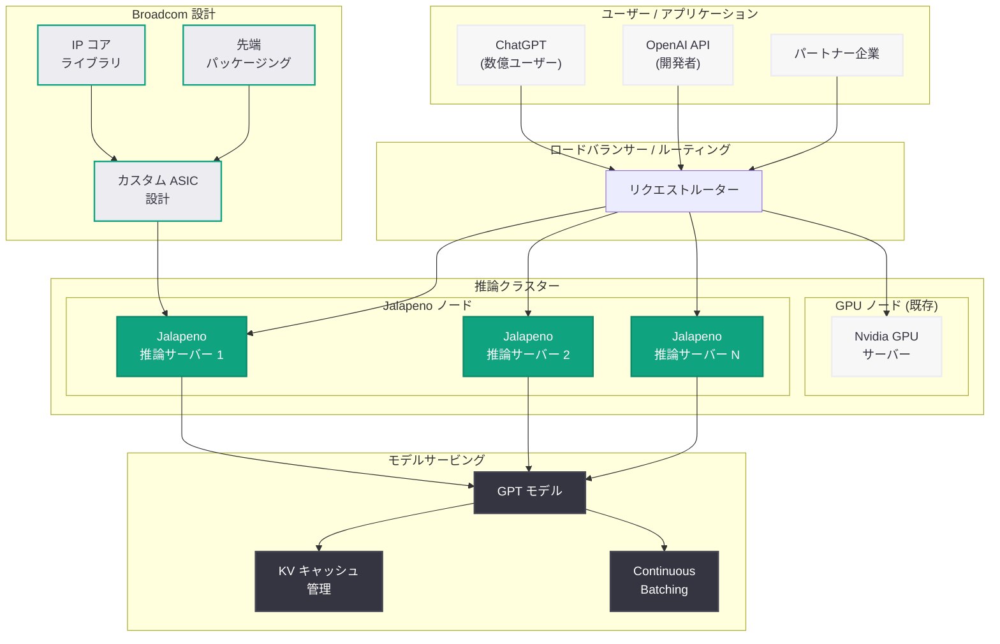

# OpenAI と Broadcom が「Jalapeno」を発表 -- OpenAI 初のカスタム AI 推論チップ

## メタデータ

| 項目 | 内容 |
|------|------|
| 発表日 | 2026-06-25 |
| ソース | OpenAI News |
| カテゴリ | ハードウェア / インフラストラクチャ |
| 公式リンク | [OpenAI and Broadcom Jalapeno Chip](https://openai.com/index/openai-broadcom-jalapeno-inference-chip/) |

> **注記:** 本記事のページは Cloudflare によるアクセス保護が有効であり、記事本文の直接取得ができなかった。本レポートは、サイトマップ情報、検索エンジンの検索結果スニペット、および関連する公開情報に基づいて構成されている。正確な詳細については公式ページを参照されたい。

## 概要

OpenAI と Broadcom (NASDAQ: AVGO) は 2026 年 6 月 25 日、OpenAI 初のカスタム設計 AI 推論チップ「Jalapeno」(ハラペーニョ) を共同発表した。Jalapeno は大規模言語モデル (LLM) の推論ワークロードに特化して設計されたチップであり、GPT シリーズのモデルを数億人のユーザーに効率的に提供することを目的としている。サンフランシスコおよびパロアルト (カリフォルニア州) から発表された本プロジェクトは、約 9 か月の開発サイクルを経て実現したものであり、2026 年末までの本番環境への展開が予定されている。

本発表は、OpenAI がこれまで AI モデルのトレーニングに使用するカスタムチップ「Titan」の開発を進めてきた中で、推論 (インファレンス) に特化した専用シリコンを初めて発表したという点で極めて重要な意味を持つ。トレーニングと推論の双方において独自チップを持つことで、OpenAI は AI インフラの垂直統合を大幅に前進させ、サードパーティ GPU サプライヤー (特に Nvidia) への依存度を戦略的に低減する。

## 主な内容

### Jalapeno チップの概要

Jalapeno は、OpenAI が初めてカスタム設計した AI 推論チップである。以下の特徴を持つ。

- **推論特化設計:** トレーニングではなく、推論 (インファレンス) ワークロードに最適化。学習済みモデルを高速かつ効率的にユーザーへ提供することに焦点を当てている
- **LLM 最適化:** GPT シリーズをはじめとする大規模言語モデルの推論に特化したアーキテクチャ設計。トランスフォーマーモデルの推論パターン (オートリグレッシブなトークン生成、KV キャッシュ管理、アテンション計算) に最適化されている
- **大規模展開対応:** 数億人のユーザーに AI サービスを提供するための大規模ワークロードに対応するスケーラビリティを備える
- **コスト効率:** 汎用 GPU と比較して、推論に特化することで電力効率と演算コストの大幅な改善を目指す

### OpenAI と Broadcom のパートナーシップ

Broadcom は、カスタム ASIC の設計と製造において世界有数の実績を持つ半導体企業である。本パートナーシップの背景には以下の要因がある。

- **Broadcom の ASIC 設計実力:** Broadcom は Google の TPU (Tensor Processing Unit) の設計支援で実績があり、カスタム AI チップの設計・製造において豊富な経験を有する。Apple、Microsoft なども Broadcom のカスタムチップ設計サービスを活用している
- **開発スピード:** CNBC の報道によれば、カスタムチップ契約の発表から約 8 か月でチップ発表に至っており、Fortune India は約 9 か月の開発サイクルと報じている。これは業界標準と比較して極めて迅速な開発である
- **製造パートナー:** チップの実際の製造 (ファブリケーション) は、TSMC などの大手ファウンドリに委託されていると推測される (Broadcom はファブレス企業であるため)

### トレーニングチップ「Titan」との関係

OpenAI は以前から、トレーニング用のカスタムチップ「Titan」の開発を進めてきた。Jalapeno の発表により、OpenAI のカスタムシリコン戦略は以下のような二本柱構造となる。

| チップ | 用途 | パートナー | ステータス |
|--------|------|-----------|-----------|
| Titan | AI トレーニング | 未公表 (Samsung HBM4 供給) | 開発中 |
| Jalapeno | AI 推論 | Broadcom | 2026 年末展開予定 |

トレーニングと推論は AI ワークロードの中で異なる計算特性を持ち、それぞれに最適化されたシリコンを設計するアプローチは、Google (TPU v5e: 推論特化、TPU v5p: トレーニング特化) や Amazon (Inferentia: 推論、Trainium: トレーニング) と同様の戦略である。

### ビジネス戦略とコスト構造

OpenAI にとって推論コストは最大の運営費用の一つである。ChatGPT の数億人のユーザーに加え、API を通じて何百万もの開発者がモデルにアクセスしており、推論ワークロードの規模は日々拡大している。

- **Nvidia 依存リスクの低減:** 現在 OpenAI は推論ワークロードの大部分を Nvidia の GPU (H100、B200、GB200 など) に依存している。Nvidia GPU は需要過多により高価格が続いており、供給制約も発生している
- **長期的コスト削減:** カスタム ASIC は初期開発コストが大きいが、大量展開時の単位コストが汎用 GPU より大幅に低い。推論に不要な機能 (汎用グラフィックス処理、FP64 演算など) を排除することで、ダイサイズと消費電力を最適化できる
- **供給チェーンの多様化:** Nvidia 以外の調達チャネルを確保することで、チップ供給に関する交渉力を強化し、将来のスケーリングにおける供給リスクを軽減する

### 競合環境

OpenAI の Jalapeno は、主要テクノロジー企業によるカスタム AI チップ開発の潮流の中に位置づけられる。

| 企業 | 推論チップ | 特徴 |
|------|-----------|------|
| Google | TPU v5e / Axion | Cloud TPU として広く提供。推論特化バージョンも展開 |
| Amazon | Inferentia2 | AWS 上で低コスト推論を実現。SageMaker との統合が強み |
| Microsoft | Maia 100 | Azure データセンター向けカスタム AI アクセラレータ |
| Meta | MTIA v2 | 社内推論ワークロード向けの ASIC |
| OpenAI | Jalapeno | LLM 推論に特化。Broadcom と共同設計 |

OpenAI がこの市場に参入したことで、AI 推論チップの競争は新たな段階に入る。特に、OpenAI は自社モデルのアーキテクチャを完全に把握しているため、チップ設計においてモデルとハードウェアの協調最適化 (co-design) を極限まで追求できる点が競争優位となり得る。

## 技術的な詳細

### 推論チップに求められるアーキテクチャ要件

LLM の推論ワークロードは、トレーニングとは大きく異なる計算パターンを持つ。Jalapeno が最適化していると推測されるアーキテクチャ要件は以下の通りである。

#### メモリ帯域幅の重要性

LLM 推論はメモリ帯域幅ボトルネック (memory-bandwidth bound) のワークロードである。特にオートリグレッシブなトークン生成フェーズでは、大量のモデルパラメータを読み出す必要がある一方、各トークンの演算量は比較的小さい。このため、演算性能 (FLOPS) よりもメモリ帯域幅 (GB/s) が推論スループットを決定する。

#### KV キャッシュ管理

トランスフォーマーモデルの推論では、過去のトークンに対するキー (K) とバリュー (V) のテンソルをキャッシュする必要がある。長いコンテキストウィンドウ (例: 128K トークン) を持つモデルでは、KV キャッシュが大量のメモリを消費するため、効率的なメモリ管理機構が不可欠である。

#### バッチ処理の最適化

推論サービングでは、複数のユーザーリクエストを同時にバッチ処理 (continuous batching) することでスループットを最大化する。Jalapeno は、動的なバッチサイズの変動に効率的に対応するスケジューリング機構を備えていると考えられる。

#### 低精度演算

推論では、トレーニング時ほどの数値精度は不要であるケースが多い。INT8、FP8、INT4 などの低精度演算をハードウェアレベルで高効率にサポートすることで、スループットと電力効率を大幅に向上できる。

### 推論パイプラインにおける Jalapeno の位置づけ

### トレーニング vs 推論: ワークロード特性の比較

| 特性 | トレーニング (Titan) | 推論 (Jalapeno) |
|------|---------------------|-----------------|
| 演算精度 | FP32 / BF16 / FP16 | FP8 / INT8 / INT4 |
| メモリ要件 | 勾配・オプティマイザ状態で大量消費 | KV キャッシュ中心 |
| ボトルネック | 演算量 (compute-bound) | メモリ帯域幅 (memory-bound) |
| バッチサイズ | 大規模固定バッチ | 動的バッチ (continuous batching) |
| レイテンシ要件 | 緩い (時間〜日単位) | 厳しい (ミリ秒〜秒単位) |
| 通信要件 | ノード間通信が重要 (データ並列・モデル並列) | ノード内通信が中心 |
| 電力効率 | 総スループット重視 | ワット当たりトークン数重視 |

## 開発者への影響

Jalapeno の本番展開が実現した場合、OpenAI API を利用する開発者に対して以下の影響が期待される。

### コスト削減の可能性

- **API 利用料金の引き下げ:** 推論コストの低下は、最終的に API の利用料金に反映される可能性がある。OpenAI はこれまでもモデルのコスト効率改善に伴い段階的に料金を引き下げてきた実績がある
- **高性能モデルへのアクセス拡大:** コスト効率の向上により、より高性能なモデルをより低い価格帯で提供できるようになる可能性がある

### レイテンシ改善の可能性

- **応答速度の向上:** 推論に特化したハードウェアにより、トークン生成速度 (tokens per second) の改善が期待される。リアルタイム性が求められるアプリケーション (チャットボット、コード補完、リアルタイム翻訳) のユーザー体験が向上する
- **Time to First Token (TTFT) の短縮:** リクエストを受けてから最初のトークンが生成されるまでの待機時間が短縮される可能性がある

### スケーラビリティの向上

- **API の安定性向上:** 推論インフラのキャパシティが拡大することで、ピーク時の API レートリミットやキューイング待ち時間が改善される可能性がある
- **新機能の提供加速:** 推論コストの低下により、これまでコスト的に困難であった機能 (より長いコンテキストウィンドウ、マルチモーダル処理の拡張など) の提供が容易になる

### 留意点

- **即座の変化ではない:** Jalapeno の本番展開は 2026 年末が目標であり、十分な規模に達するにはさらに時間を要する。開発者が恩恵を実感するのは 2027 年以降になる可能性がある
- **API インターフェースへの変更なし:** ハードウェアの変更はバックエンド側の改善であり、API のインターフェースや使用方法に変更が生じることはない。開発者のコード変更は不要である

## 関連リンク

- [OpenAI and Broadcom Jalapeno Chip (公式)](https://openai.com/index/openai-broadcom-jalapeno-inference-chip/)
- [関連レポート: Samsung、OpenAI 初の AI チップ「Titan」向けに HBM4 を供給へ](2026-03-21-samsung-hbm4-openai-titan-chip.md)
- [関連レポート: OpenAI と Cerebras の 200 億ドルチップ契約](2026-04-17-openai-cerebras-20b-chip-deal.md)
- [Broadcom Inc. (NASDAQ: AVGO)](https://www.broadcom.com/)
- [OpenAI News](https://openai.com/news)
- [OpenAI Platform](https://platform.openai.com/)

## まとめ

OpenAI と Broadcom による Jalapeno の発表は、OpenAI のインフラ戦略における重要なマイルストーンである。以下の点が特に注目される。

1. **推論特化の初のカスタムチップ:** Jalapeno は OpenAI が初めて発表した推論専用の ASIC であり、トレーニングチップ Titan と合わせてカスタムシリコン戦略の二本柱が確立された
2. **迅速な開発サイクル:** 契約発表から約 8-9 か月でチップ発表に至った開発速度は、OpenAI と Broadcom の実行力を示している
3. **Nvidia 依存からの脱却:** 推論チップの内製化により、世界最大の AI サービスプロバイダーとして供給チェーンの多様化とコスト構造の最適化を進める
4. **2026 年末の展開目標:** 年内の本番環境展開が予定されており、実現すれば比較的短期間で開発者への恩恵が期待される
5. **AI チップ競争の新段階:** OpenAI の参入により、Google、Amazon、Microsoft、Meta に続く主要プレーヤーが AI カスタムチップ市場に加わり、業界全体の競争が一層激化する
