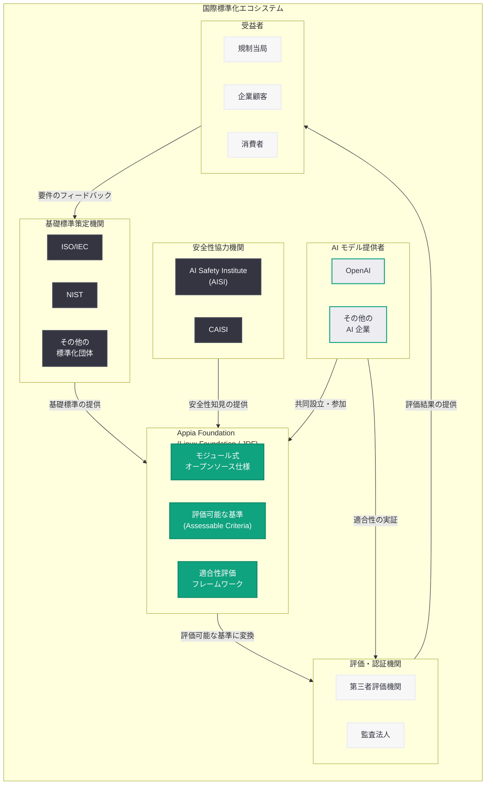

# Helping Build Shared Standards for Advanced AI: 高度な AI の国際共有標準の構築

## メタデータ

| 項目 | 内容 |
|------|------|
| 発表日 | 2026-06-26 |
| ソース | OpenAI Global Affairs |
| カテゴリ | ポリシー / 標準 / ガバナンス |
| 公式リンク | [Helping Build Shared Standards for Advanced AI](https://openai.com/index/helping-build-shared-standards-for-advanced-ai/) |

> **注記:** 本記事のページは Cloudflare によるアクセス保護が有効であり、記事本文の直接取得ができなかった。本レポートは、検索エンジンの結果、Linux Foundation のプレスリリース (2026 年 6 月 17 日)、OpenAI の Esther Tetruashvily 氏の投稿、および関連する公開情報に基づいて構成されている。正確な詳細については公式ページを参照されたい。

## 概要

OpenAI は 2026 年 6 月 26 日、高度な AI システムに対する国際共有標準の構築に向けた取り組みについて、「Helping Build Shared Standards for Advanced AI」を公開した。本記事では、OpenAI が共同設立した **Appia Foundation** を中心に、評価フレームワーク・方法論、安全性プラクティス、そしてグローバルな協力体制という 3 つの柱を通じて、AI の国際標準化を推進する方針が示されている。

Appia Foundation は Linux Foundation 傘下の Joint Development Foundation (JDF) にホストされ、ISO/IEC などの国際標準化団体が策定する基礎標準を置き換えるのではなく、それらを「評価可能な基準」に変換する接続レイヤーとして機能する。AI サプライチェーン全体にわたって消費者の義務と期待への適合を実証するための、実用的かつ信頼性の高い評価手段を構築することを目的としている。

## 主な内容

### Appia Foundation の設立と役割

OpenAI が共同設立した Appia Foundation は、AI の信頼に関する「接続レイヤー (connecting layer)」を提供する国際的な協働体制である。

| 項目 | 内容 |
|------|------|
| 設立形態 | Linux Foundation 傘下の Joint Development Foundation (JDF) |
| 目的 | グローバルな基礎標準を評価可能な基準に変換 |
| 成果物 | モジュール式オープンソース仕様、標準化された適合性評価フレームワーク |
| 発表日 | Linux Foundation プレスリリース: 2026 年 6 月 17 日 |

Appia Foundation の核心的な価値は、以下の 3 点に集約される。

1. **実用的な評価手段の構築:** AI システムがサプライチェーン全体にわたって消費者の義務と期待を満たすことを評価するための実用的な仕組みを提供する
2. **基礎標準との橋渡し:** ISO/IEC などの国際標準化団体が策定する基礎標準を「置き換える」のではなく、それらに基づいた評価可能な基準 (assessable criteria) を開発する
3. **適合性の実証:** サプライチェーンの各関係者が義務への適合を実証できるメカニズムを提供する

### 3 つの柱: 評価、安全性、国際協力

本記事で示される OpenAI の標準化への取り組みは、以下の 3 つの柱で構成されている。

#### 1. 評価フレームワークと方法論

AI システムの能力、安全性、リスクを体系的に評価するためのフレームワークと方法論の確立。Appia Foundation を通じて、国際的に相互運用可能な評価基準を開発する。

#### 2. 安全性プラクティス

AI Safety Institute (AISI) や CAISI との協力を通じて、AI の安全性を確保するための共有プラクティスを構築する。これには、モデルの事前評価、デプロイ後のモニタリング、リスク軽減策の標準化が含まれる。

#### 3. グローバルな協力体制

国際的な枠組みの下で、異なる法域間での標準の相互認証と協力体制を確立する。単一の国や組織では実現できない AI ガバナンスの課題に対し、共同で取り組む基盤を提供する。

### 仕様 (Specifications) の開発プロセス

Appia Foundation のメンバーは「仕様 (Specifications)」を開発する。これらの仕様は以下の特徴を持つ。

- **評価可能な基準:** 各関係者が義務への適合を実証できる具体的な基準
- **基礎標準への準拠:** ISO/IEC などが策定する基礎標準に基づき、それらを補完
- **モジュール式設計:** 個別の要件に応じて組み合わせ可能なモジュール構造
- **オープンソース:** 透明性と広範な採用を促進するためオープンソースとして公開

### AISI・CAISI との協力

OpenAI は AI Safety Institute (AISI) および CAISI (Center for AI Safety Institutes) との協力を通じて、AI の安全性向上に取り組んでいる。これらの機関との協働は、以下の観点で標準化の取り組みを補完する。

- 安全性評価手法の共同開発と検証
- ベストプラクティスの共有と標準化
- フロンティアモデルのリスク評価に関する知見の蓄積

### OpenAI の安全性・標準化研究との連続性

本発表は、OpenAI が 2026 年に推進してきた安全性と評価に関する一連の取り組みの文脈に位置づけられる。

| 日付 | 研究・施策 | 関連性 |
|------|-----------|--------|
| 2026-05-29 | 第三者評価プレイブック | 評価の方法論と基準の確立 |
| 2026-06-03 | Frontier Safety Blueprint | フロンティアモデルの安全性設計原則 |
| 2026-06-17 | Linux Foundation プレスリリース | Appia Foundation の正式発表 |
| 2026-06-23 | Trustworthy Third-Party Evaluations Foundations | 評価基盤の体系化 |
| 2026-06-26 | **本記事: Shared Standards for Advanced AI** | **標準化戦略の全体像を提示** |

## アーキテクチャ

### 標準化レイヤーの構造

```mermaid
flowchart LR
    subgraph Layer1["Layer 1: 基礎標準"]
        L1A["ISO/IEC 42001<br/>(AI マネジメント)"]
        L1B["ISO/IEC 23894<br/>(リスク管理)"]
        L1C["NIST AI RMF"]
    end

    subgraph Layer2["Layer 2: Appia Foundation<br/>(接続レイヤー)"]
        L2A["評価可能な基準への変換"]
        L2B["モジュール式仕様の開発"]
        L2C["適合性評価フレームワーク"]
    end

    subgraph Layer3["Layer 3: 実践的適用"]
        L3A["第三者評価の実施"]
        L3B["適合性の実証"]
        L3C["規制要件への対応"]
    end

    Layer1 -->|"基礎的な原則と要件"| Layer2
    Layer2 -->|"具体的で評価可能な基準"| Layer3

    classDef openai fill:#10A37F,stroke:#0D8A6A,stroke-width:2px,color:white
    classDef dark fill:#343541,stroke:#444654,stroke-width:2px,color:white
    classDef light fill:#F7F7F8,stroke:#ECECF1,stroke-width:2px,color:#343541

    class L2A,L2B,L2C openai
    class L1A,L1B,L1C dark
    class L3A,L3B,L3C light
```

## 開発者への影響

本発表は、AI 開発者およびエコシステムの参加者に以下のような影響をもたらす。

- **コンプライアンスコストの低減:** Appia Foundation が提供する標準化された適合性評価フレームワークにより、複数の規制要件に対するコンプライアンス対応の重複を削減できる可能性がある。異なる法域間での相互認証により、各地域ごとに別々の評価プロセスを経る負担が軽減される

- **ガバナンスにおける競争優位:** 積極的に標準化プロセスに参加し、早期に適合性を確保することで、規制環境が整備された際にスムーズに対応できる。後追いの対応に比べ、戦略的な優位性を確保できる

- **評価可能な基準への準拠準備:** 開発者は自社の AI システムが Appia Foundation の仕様に適合していることを実証するための準備が必要になる。モデルの安全性評価、リスク管理プロセス、文書化などの体制整備が求められる

- **オープンソース仕様への貢献機会:** モジュール式のオープンソース仕様として開発されるため、開発者コミュニティが標準策定プロセスに直接参加し、実務的な観点からフィードバックを提供できる機会が生まれる

- **国際市場へのアクセス:** 標準化された評価フレームワークに準拠することで、異なる法域の規制要件を効率的に満たし、国際市場への展開が容易になる

- **サプライチェーン全体での信頼構築:** AI サービスを提供する企業は、自社の AI システムが国際的に認められた基準に適合していることを顧客やパートナーに対して客観的に示すことができるようになる

## 関連リンク

- [Helping Build Shared Standards for Advanced AI - OpenAI](https://openai.com/index/helping-build-shared-standards-for-advanced-ai/)
- [Trustworthy Third-Party Evaluations Foundations (関連レポート 6/23)](./2026-06-23-trustworthy-third-party-evaluations.md)
- [Linux Foundation - Joint Development Foundation](https://www.jointdevelopment.org/)
- [ISO/IEC JTC 1/SC 42 - Artificial Intelligence](https://www.iso.org/committee/6794475.html)
- [OpenAI Global Affairs](https://openai.com/global-affairs)
- [OpenAI Safety](https://openai.com/safety)

## まとめ

OpenAI が 2026 年 6 月 26 日に公開した「Helping Build Shared Standards for Advanced AI」は、高度な AI システムに対する国際共有標準の構築戦略を示した記事である。中心となるのは、OpenAI が共同設立した **Appia Foundation** であり、Linux Foundation 傘下の Joint Development Foundation にホストされている。

Appia Foundation は、ISO/IEC などの国際標準化団体が策定する基礎標準を「評価可能な基準」に変換する接続レイヤーとして機能し、モジュール式オープンソース仕様と標準化された適合性評価フレームワークを開発する。これにより、AI サプライチェーン全体にわたって各関係者が義務への適合を実証できる実用的な仕組みが提供される。

OpenAI の標準化戦略は、評価フレームワーク・方法論、安全性プラクティス、グローバルな協力体制の 3 つの柱で構成されており、AISI や CAISI との協力を通じて AI の安全性向上にも取り組んでいる。コンプライアンスコストの低減や国際市場へのアクセス改善といった実務的なメリットが期待されるとともに、積極的な標準化への参加はガバナンスにおける競争優位をもたらす可能性がある。

本発表は、2026 年に OpenAI が進めてきた第三者評価プレイブック、Trustworthy Third-Party Evaluations Foundations、Frontier Safety Blueprint などの安全性・評価研究の延長線上にあり、それらの個別の取り組みを国際的な標準化の枠組みの中に位置づける戦略的な意義を持つものである。

> **免責事項:** 本レポートは Cloudflare によるアクセス保護のため記事本文を直接取得できなかったため、検索エンジンの結果、Linux Foundation のプレスリリース、OpenAI の Esther Tetruashvily 氏の投稿、および関連する公開情報に基づいて構成されたものである。実際の発表内容には、追加のパートナー組織の名称、具体的な実装スケジュール、詳細な技術仕様などが含まれる可能性がある。正確な詳細については公式ページを直接参照されたい。
