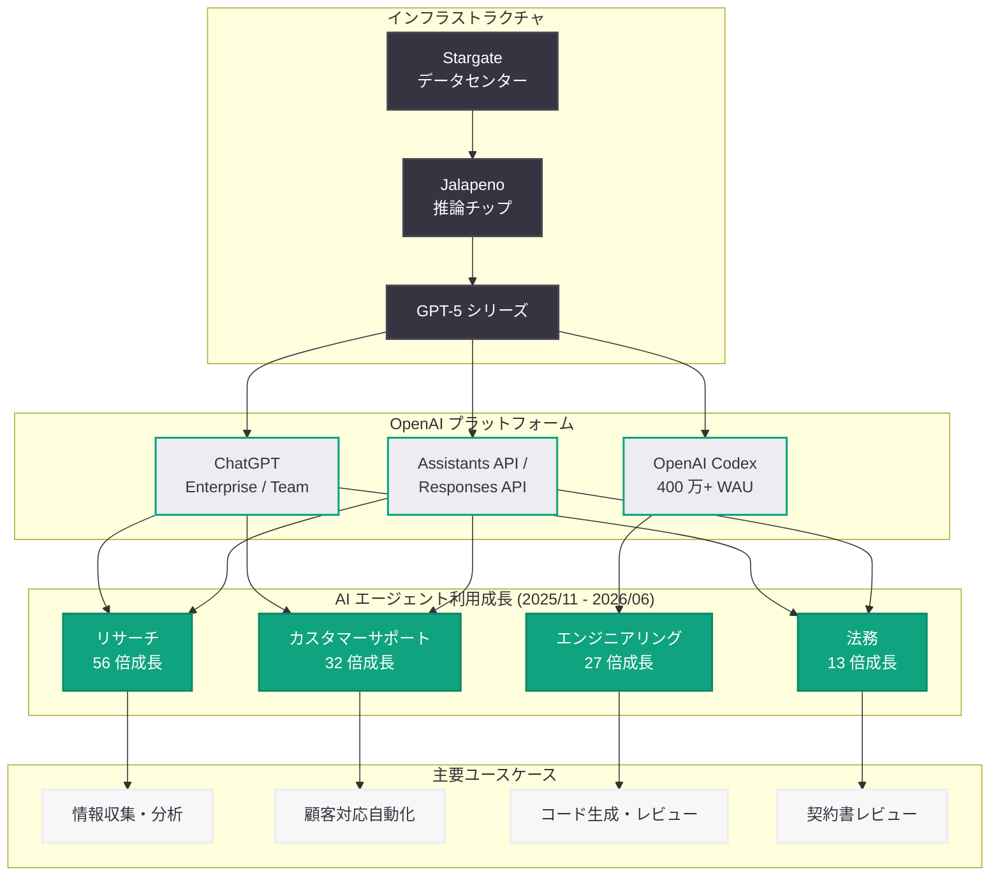

# エージェントが仕事を変革する -- OpenAI が業務領域別 AI エージェント活用の爆発的成長を報告

## メタデータ

| 項目 | 内容 |
|------|------|
| 発表日 | 2026-06-26 |
| ソース | OpenAI News |
| カテゴリ | Company / AI Adoption |
| 公式リンク | [How agents are transforming work](https://openai.com/index/how-agents-are-transforming-work/) |

> **注記:** 本記事のページは Cloudflare によるアクセス保護が有効であり、記事本文の直接取得ができなかった。本レポートは、サイトマップ情報、検索エンジンの検索結果スニペット、および関連する公開情報に基づいて構成されている。正確な詳細については公式ページを参照されたい。

## 概要

OpenAI は 2026 年 6 月 26 日、企業における AI エージェントの活用状況に関するブログ記事「How agents are transforming work」を公開した。本記事は、2025 年 11 月から 2026 年 6 月にかけての約 7 か月間で、ビジネスの各領域における AI エージェント利用が劇的に増加した実態をデータで示している。

特に注目すべきは、リサーチ分野で中央値が 56 倍、カスタマーサポートで 32 倍、エンジニアリングで 27 倍、法務で 13 倍という爆発的な成長が記録された点である。本発表は、同日発表された Broadcom との Jalapeno チップパートナーシップや Samsung との展開に関するニュースと並行して公開されており、OpenAI が AI エージェントの大規模普及を支えるインフラ整備と、その実際の利用拡大の両面で成果を示す形となっている。

## 主な内容

### 業務領域別 AI エージェント利用の成長率

2025 年 11 月から 2026 年 6 月までの期間で、以下の業務領域において AI エージェントの利用が急激に拡大した (いずれも中央値ベース)。

| 業務領域 | 成長倍率 | 特徴 |
|----------|----------|------|
| リサーチ | 56 倍 | 最大の成長。情報収集・分析・要約タスクでの活用 |
| カスタマーサポート | 32 倍 | 顧客対応の自動化・効率化 |
| エンジニアリング | 27 倍 | コード生成・レビュー・デバッグ支援 |
| 法務 | 13 倍 | 契約書レビュー・リーガルリサーチの効率化 |

リサーチ分野が最大の伸びを見せたことは、AI エージェントが単純な作業の自動化に留まらず、知識集約型の業務においても本格的に活用され始めたことを示唆している。

### OpenAI Codex の利用状況

本記事の関連情報として、OpenAI Codex (コーディングエージェント) の利用実績も報告されている。

- **週間アクティブユーザー:** 400 万人以上
- **Business / Enterprise プランでの利用:** 2026 年 1 月以降 6 倍に成長
- **エンジニアリング領域 27 倍成長の主要ドライバー:** Codex が開発者のワークフローに深く組み込まれていることを示す

### エージェント活用の拡大要因

2025 年 11 月から 2026 年 6 月にかけてエージェント利用が爆発的に成長した背景として、以下の要因が考えられる。

1. **モデル性能の向上:** GPT-5 シリーズの登場により、複雑なマルチステップタスクを自律的に処理する能力が飛躍的に向上
2. **Assistants API / Responses API の成熟:** エージェント構築のための API インフラが整備され、企業が独自のエージェントを容易に開発・展開できるようになった
3. **ChatGPT Enterprise / Team の普及:** 企業向けプランの拡大により、組織全体での AI 導入が加速
4. **Codex の一般提供:** コーディングエージェントの利用がエンジニアリング組織に浸透

### 関連する同日の発表

本記事は、OpenAI のエコシステム全体の進展を示す一連の発表の中に位置づけられる。

- **Broadcom Jalapeno チップ:** AI 推論の効率化により、大規模なエージェント展開をコスト効率よく支える基盤
- **Samsung デプロイメント:** 大規模企業での AI エージェント実装事例

## アーキテクチャ

### エージェント活用の業務領域別成長

## 開発者への影響

### エージェント開発の需要拡大

- **エージェント構築スキルの需要増加:** 全業務領域でエージェント活用が急成長していることから、AI エージェントを設計・構築できる開発者への需要が急速に拡大している
- **Assistants API / Responses API の重要性:** OpenAI の API を活用したカスタムエージェント開発が、企業の AI 戦略の中核となりつつある
- **ドメイン特化エージェントの機会:** リサーチ (56 倍)、カスタマーサポート (32 倍) など各領域に特化したエージェントの開発需要が拡大

### コーディングワークフローへの影響

- **Codex 400 万 WAU の意味:** 開発者コミュニティにおいて AI コーディングエージェントが標準ツールとなりつつあることを示す
- **Business / Enterprise での 6 倍成長:** 個人利用だけでなく、企業のソフトウェア開発パイプラインへの組み込みが進行
- **CI/CD との統合:** コードレビュー、テスト生成、ドキュメント作成などの開発プロセス全体にエージェントが浸透

### プラットフォーム選択への示唆

- **OpenAI エコシステムの優位性:** 大規模な利用実績データに基づくフィードバックループにより、モデルとプラットフォームの改善が加速
- **スケーラビリティの実証:** 数百万ユーザー規模での安定したエージェント運用が実証されたことで、エンタープライズ導入の信頼性が向上
- **インフラ投資の裏付け:** Jalapeno チップなど推論インフラへの投資は、エージェント利用の更なる拡大とコスト低下を見据えたもの

## 関連リンク

- [How agents are transforming work (公式)](https://openai.com/index/how-agents-are-transforming-work/)
- [関連レポート: OpenAI と Broadcom が Jalapeno 推論チップを発表](2026-06-25-openai-broadcom-jalapeno-inference-chip.md)
- [関連レポート: Samsung HBM4 と OpenAI Titan チップ](2026-03-21-samsung-hbm4-openai-titan-chip.md)
- [OpenAI Codex](https://openai.com/codex)
- [OpenAI for Business](https://openai.com/business)
- [OpenAI API リファレンス](https://platform.openai.com/docs/api-reference)

## まとめ

OpenAI が公開した「How agents are transforming work」は、AI エージェントが企業の業務を根本的に変革しつつある現状を具体的な数値で示した重要な報告である。以下の点が特に注目に値する。

1. **リサーチ領域の 56 倍成長が最大:** AI エージェントが情報収集・分析という知識集約型業務で最も急速に浸透していることは、単純な自動化を超えた AI の活用ステージに入ったことを示唆する
2. **全業務領域で二桁以上の成長:** リサーチ (56 倍)、カスタマーサポート (32 倍)、エンジニアリング (27 倍)、法務 (13 倍) と、特定の領域に限らず広範な業務で AI エージェントの導入が進んでいる
3. **Codex 400 万 WAU:** コーディングエージェントが開発者の日常ツールとして定着し、エンジニアリング領域の 27 倍成長を牽引している
4. **インフラ戦略との整合:** 同日発表の Jalapeno チップは、この急激な利用拡大を持続的に支えるための推論インフラ投資として位置づけられる
5. **エンタープライズ AI の転換点:** 2025 年末から 2026 年前半にかけての期間が、企業における AI エージェント活用の本格的な立ち上がり期であったことを示すデータとなっている
