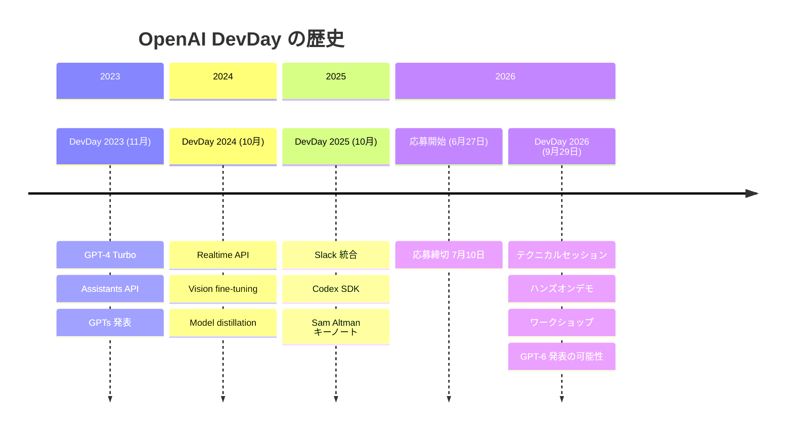

# OpenAI DevDay 2026 - 参加応募受付開始

## メタデータ

| 項目 | 内容 |
|------|------|
| 発表日 | 2026-06-27 |
| ソース | OpenAI News |
| カテゴリ | イベント / 開発者コミュニティ |
| 公式リンク | https://openai.com/devday/ |

## 概要

OpenAI は 2026 年 9 月 29 日にサンフランシスコの Fort Mason で開催される DevDay 2026 の参加応募受付を開始した。DevDay は OpenAI が主催する開発者向けカンファレンスであり、技術セッション、ハンズオンデモ、ワークショップ、そして OpenAI の開発者ツールチームとの直接交流の機会を提供する。応募締切は 7 月 10 日と見られ、開発者は今すぐ公式サイトから申し込みが可能である。

## 主な内容

### イベント概要

| 項目 | 詳細 |
|------|------|
| 開催日 | 2026 年 9 月 29 日 |
| 会場 | Fort Mason, San Francisco |
| 形式 | 対面イベント |
| 応募締切 | 2026 年 7 月 10 日 (推定) |

DevDay 2026 は、OpenAI が開発者コミュニティに向けて最新の技術やツールを紹介する年次イベントである。2026 年 4 月 29 日に X/Twitter およびブログで初めて告知され、6 月 27 日にページが更新されて正式に応募受付が開始された。

### プログラム内容

公式ページによると、以下のプログラムが予定されている。

- **テクニカルセッション:** OpenAI の最新技術に関する詳細な講演
- **ハンズオンデモ:** 新機能を実際に試す体験型セッション
- **ワークショップ:** 開発者が実践的なスキルを習得する場
- **OpenAI チームとの直接交流:** 開発者ツールを構築しているチームへの質問や意見交換の機会

公式サイトでは「technical sessions, test what's new, swap notes, and bring their best questions and ideas to the teams creating OpenAI's tools」と表現されており、双方向のコミュニケーションが重視されている。

### 応募方法

1. 公式サイト (https://openai.com/devday/) にアクセス
2. 応募フォームに必要事項を記入
3. 7 月 10 日までに申し込みを完了

また、OpenAI はプロモーションとして「GPT-5.5 と Image Gen を使って何かを作ろう」というコンテストを実施しており、毎週 2-3 名の優秀作品の制作者に DevDay 2026 の無料チケットが贈呈される。

### 過去の DevDay との比較

| 年度 | 開催日 | 主な発表内容 |
|------|--------|-------------|
| 2023 | 2023 年 11 月 6 日 | GPT-4 Turbo、Assistants API、GPTs |
| 2024 | 2024 年 10 月 1 日 | Realtime API、Vision fine-tuning、Model distillation |
| 2025 | 2025 年 10 月 6 日 | Slack 統合、Codex SDK |
| 2026 | 2026 年 9 月 29 日 | (未発表 - GPT-6 の可能性) |

2025 年の DevDay では Sam Altman によるキーノートが行われ、Slack との統合や Codex SDK が発表された。2026 年については具体的な発表内容は未公開だが、コミュニティでは GPT-6 (コードネーム "Goblin") の発表があるのではないかとの憶測が広がっている。

## DevDay の歴史と展望

## 開発者への影響

- **最新技術への早期アクセス:** DevDay 参加者は、一般公開前に新機能を試す機会を得られる可能性がある
- **OpenAI チームとの直接対話:** 開発者ツールの設計に関するフィードバックを直接伝えられる貴重な場
- **コミュニティネットワーキング:** 世界中の開発者と知見を共有し、協力関係を構築する機会
- **コンテスト参加:** GPT-5.5 と Image Gen を使った作品制作で無料チケットを獲得できるチャンス
- **GPT-6 への期待:** 次世代モデルが発表される可能性があり、早期に情報を入手できる

## 関連リンク

- [OpenAI DevDay 公式ページ](https://openai.com/devday/)
- [OpenAI News](https://openai.com/news)
- [OpenAI 開発者プラットフォーム](https://platform.openai.com/)

## まとめ

OpenAI DevDay 2026 は 9 月 29 日にサンフランシスコの Fort Mason で開催される。6 月 27 日から参加応募が開始され、締切は 7 月 10 日と推定される。テクニカルセッション、ハンズオンデモ、ワークショップ、OpenAI チームとの直接交流が予定されており、開発者にとって最新の AI ツールを学び、フィードバックを提供する絶好の機会となる。GPT-5.5 と Image Gen を使った作品コンテストで無料チケットを獲得するチャンスもあり、開発者は早めの応募と作品制作を検討すべきである。
