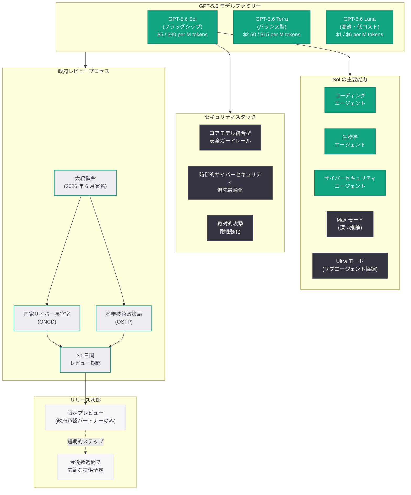

# GPT-5.6 モデルファミリーのプレビュー発表: Sol / Terra / Luna の 3 モデル構成とホワイトハウスによるリリース制限

## メタデータ

| 項目 | 内容 |
|------|------|
| 発表日 | 2026-06-27 |
| ソース | OpenAI News |
| カテゴリ | 新モデル / Product |
| 公式リンク | [Previewing GPT-5.6 Sol](https://openai.com/index/previewing-gpt-5-6-sol/) |

> **注記:** 本記事のページは Cloudflare によるアクセス保護が有効であり、記事本文の直接取得ができなかった。本レポートは、TechCrunch の報道およびサイトマップデータに基づいて構成されている。正確な詳細については公式ページを参照されたい。

## 概要

OpenAI は 2026 年 6 月 27 日、次世代モデルファミリー「GPT-5.6」を発表した。GPT-5.6 は Sol (フラッグシップ)、Terra (バランス型)、Luna (高速・低コスト) の 3 モデルで構成される。しかし、本リリースは通常の一般公開とは異なり、ホワイトハウスからのサイバーセキュリティ上の安全性懸念を理由とした要請により、限定的なプレビューにとどまっている。

これは 2026 年 6 月にトランプ政権が署名した、リリース 30 日前に政府レビューへのモデル提出を求める大統領令の初の適用事例であり、AI 産業における連邦政府の規制介入の新たな局面を示す出来事である。GPT-5.6 Sol はコーディング、生物学、サイバーセキュリティにおける高度なエージェント能力を備え、Anthropic の Claude Mythos 5 をコーディングワークフローでわずかに上回りつつ、出力トークン数は 3 分の 1 に抑えるという効率性を実現している。

## 主な内容

### GPT-5.6 モデルファミリーの構成

GPT-5.6 は用途と予算に応じて選択できる 3 つのモデルで構成されている。

| モデル | 位置づけ | Input (per million tokens) | Output (per million tokens) |
|--------|----------|----------------------------|-----------------------------|
| Sol | フラッグシップ (最高性能) | $5 | $30 |
| Terra | バランス型 (性能とコストの均衡) | $2.50 | $15 |
| Luna | 高速・低コスト | $1 | $6 |

- **Sol:** 最高性能のフラッグシップモデル。コーディング、生物学、サイバーセキュリティにおける高度なエージェント能力を持つ
- **Terra:** 性能とコストのバランスが取れたモデル。多くのプロダクション用途に適する
- **Luna:** 高速応答と低コストを重視した軽量モデル。大量リクエスト処理やレイテンシ重視のアプリケーション向け

### 新しい推論モード

GPT-5.6 Sol には新たな推論モードが導入されている。

- **"Max" reasoning effort モード:** 従来よりも深い推論を行い、複雑な問題に対してより正確な回答を生成する
- **"Ultra" モード:** 協調するサブエージェントを使用して複雑なタスクを処理する新モード。タスクを分解し、複数のサブエージェントが並行して作業することで高度な問題を解決する。ただし、トークン使用量が劇的に増加する点に注意が必要である

### 競合モデルとの比較

GPT-5.6 Sol は以下の点で競合モデルに対する優位性を示している。

- Anthropic の Claude Mythos 5 をコーディングワークフローにおいてわずかに上回る性能
- Mythos と同等の性能を発揮しながら、出力トークン数は 3 分の 1 で済む効率性
- 繰り返しプロンプトに対する改善されたプロンプトキャッシング機能

### セキュリティアーキテクチャ

GPT-5.6 Sol は OpenAI の「これまでで最も堅牢なセキュリティスタック」を搭載している。

- **コアモデルへの安全ガードレール統合:** 安全性を外部フィルタではなくコアモデルの動作に直接組み込む設計。これにより、Anthropic の Fable 5 がハイリスククエリを古いモデルにルーティングすることで偽陽性を引き起こしていた問題を回避している
- **防御的サイバーセキュリティの優先:** 攻撃的なエクスプロイトよりも防御的なサイバーセキュリティを優先するよう最適化
- **敵対的攻撃への耐性強化:** 敵対的攻撃に対して大幅に強化された耐性を持つ

### ホワイトハウスによるリリース制限

今回のリリースには米国連邦政府が直接関与している。

- **背景:** トランプ政権は当初 AI に対して不干渉の姿勢を取っていたが、2026 年 6 月に方針を転換。リリース 30 日前に政府レビューへのモデルの自主的提出を求める大統領令に署名した
- **関与機関:** 国家サイバー長官室 (Office of National Cyber Director) および科学技術政策局 (Office of Science and Technology Policy) がプロセスに関与
- **制限内容:** ホワイトハウスがサイバーセキュリティ上の安全性懸念を理由に、OpenAI にリリースの制限を要請
- **プレビュー対象:** 「政府に参加が共有されたパートナー」に限定されたプレビュー提供

### OpenAI の反応

OpenAI はホワイトハウスの要請に応じたものの、不満を表明している。

- 「この種の政府アクセスプロセスが長期的なデフォルトになるべきではないと考える」("We don't believe this kind of government access process should become the long-term default") と声明
- プレビューを「今後数週間でのより広範な提供に向けた短期的なステップ」("short-term step") と位置づけ
- 規制への協力姿勢を示しつつも、長期的な政府管理には異議を唱える立場を表明

### 政策的影響と批判

- **Dean Ball (元ホワイトハウス AI アドバイザー)** は、この仕組みが不明確な安全基準に基づく「事実上の非自発的ライセンス制度」を作り出すと批判
- Ball は、このアプローチが中国に利する可能性があると警告。米国企業のリリースが遅延する間に、中国の AI 開発が制約なく進むリスクを指摘している
- 大統領令は「自主的提出」としているが、実質的には強制力を持つ規制として機能しつつある

## 技術的な詳細

### API 利用例

```python
from openai import OpenAI

client = OpenAI()

# GPT-5.6 Sol の基本呼び出し
response = client.chat.completions.create(
    model="gpt-5.6-sol",
    messages=[
        {"role": "system", "content": "You are a cybersecurity analyst."},
        {"role": "user", "content": "Analyze the following network traffic for potential threats."}
    ],
    max_tokens=4096
)

print(response.choices[0].message.content)
```

### Ultra モードの利用例 (サブエージェント協調)

```python
from openai import OpenAI

client = OpenAI()

# Ultra モード: 協調サブエージェントによる複雑タスク処理
# 注: トークン使用量が劇的に増加する
response = client.chat.completions.create(
    model="gpt-5.6-sol",
    reasoning_effort="ultra",
    messages=[
        {
            "role": "user",
            "content": (
                "Conduct a comprehensive security audit of this codebase. "
                "Identify vulnerabilities, suggest fixes, and generate test cases "
                "for each identified issue."
            )
        }
    ],
    max_tokens=16384
)

print(response.choices[0].message.content)
```

> **注:** 上記のコード例は報道内容に基づく想定であり、実際の API パラメータの詳細はプレビュー参加者向けドキュメントを参照されたい。

### 料金体系の比較

| モデル | Input (per million tokens) | Output (per million tokens) | 用途 |
|--------|----------------------------|-----------------------------|------|
| GPT-5.6 Sol | $5 | $30 | フラッグシップ / 高度なエージェントタスク |
| GPT-5.6 Terra | $2.50 | $15 | プロダクション / バランス型 |
| GPT-5.6 Luna | $1 | $6 | 高速処理 / 大量リクエスト |

## アーキテクチャ

### GPT-5.6 モデルファミリー構成と政府レビュープロセス



## 開発者への影響

### モデル選択の新たな選択肢

- **3 層構成によるコスト最適化:** Sol / Terra / Luna の 3 モデル構成により、タスクの複雑さと予算に応じた柔軟なモデル選択が可能になる
- **Ultra モードのトークン管理:** Ultra モードは強力だが、協調サブエージェントによりトークン使用量が劇的に増加する。コスト管理とタスク設計の戦略的な判断が必要
- **プロンプトキャッシングの改善:** 繰り返しプロンプトに対するキャッシング機能の改善により、反復的なワークフローでのコスト削減が期待される

### 安全性アーキテクチャの設計変化

- **コア統合型ガードレール:** 安全性がモデル動作に直接組み込まれている設計は、開発者にとって外部フィルタの管理負担を軽減する可能性がある
- **防御的サイバーセキュリティの優先:** セキュリティ関連のアプリケーションを開発する際、攻撃的用途への転用がモデルレベルで制限されている点を考慮する必要がある
- **偽陽性リスクの低減:** コア統合型の設計により、Anthropic の Fable 5 で報告されていたような正当なクエリへの誤検知が軽減されると期待される

### リリース制限の影響

- **即時のアクセス制限:** 政府承認パートナーに限定されたプレビューのため、一般の開発者は数週間アクセスできない
- **今後の規制リスク:** この政府レビュープロセスが先例となり、今後の AI モデルリリースにおいても同様の遅延が発生する可能性がある
- **国際競争への懸念:** Dean Ball が指摘するように、米国 AI 企業のリリース遅延が国際競争力に影響する可能性がある

### 移行に向けた準備

- GPT-5.5 シリーズからの移行において、新しい推論モード (Max / Ultra) の活用方法の検討
- 3 モデル構成を活かしたルーティング戦略の設計 (複雑度に応じた Sol / Terra / Luna の使い分け)
- Ultra モード利用時のトークンバジェット設計と費用対効果の評価

## 関連リンク

- [Previewing GPT-5.6 Sol (公式)](https://openai.com/index/previewing-gpt-5-6-sol/)
- [OpenAI API ドキュメント](https://platform.openai.com/docs)
- [OpenAI モデル一覧](https://platform.openai.com/docs/models)
- [OpenAI Pricing](https://openai.com/pricing)
- [OpenAI Safety](https://openai.com/safety)

## まとめ

GPT-5.6 モデルファミリーの発表は、AI モデルの技術的進化と政府規制の新たな交差点を象徴する出来事である。技術面では、Sol / Terra / Luna の 3 層構成によるきめ細かなモデル選択、Ultra モードによるサブエージェント協調、コアモデル統合型の安全ガードレールなど、重要な革新が含まれている。特に Sol が Anthropic の Claude Mythos 5 を上回りながら出力トークン数を 3 分の 1 に抑える効率性は注目に値する。

一方、政策面では、2026 年 6 月の大統領令に基づく初の政府レビュー適用事例として、AI 産業と連邦政府の関係に新たな緊張をもたらしている。OpenAI は協力しつつも「この種の政府アクセスプロセスが長期的なデフォルトになるべきではない」と明確に異議を唱えており、AI 規制の在り方をめぐる議論は今後さらに活発化すると予想される。開発者にとっては、数週間後に予定される一般提供に向けて、3 モデル構成を活かしたアーキテクチャ設計と、新しい推論モードの活用戦略を検討する好機である。
