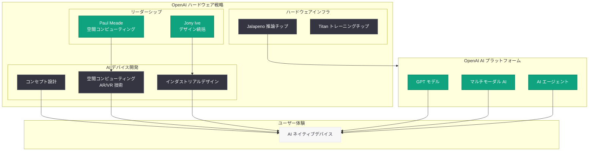

# Apple Vision Pro 担当副社長 Paul Meade が OpenAI ハードウェアチームに移籍

## メタデータ

| 項目 | 内容 |
|------|------|
| 発表日 | 2026-06-27 |
| ソース | OpenAI News / Bloomberg / TechCrunch |
| カテゴリ | 人事 / ハードウェア |
| 公式リンク | (未公開 -- OpenAI 公式発表なし) |
| TechCrunch | [techcrunch.com/2026/06/27/apple-vision-pro-exec-is-reportedly-leaving-for-openai/](https://techcrunch.com/2026/06/27/apple-vision-pro-exec-is-reportedly-leaving-for-openai/) |

> **注記:** 本レポートは Bloomberg の Mark Gurman 氏による報道および TechCrunch の記事に基づいて作成されている。Apple および OpenAI の双方にコメントを求めたが、いずれも回答を得られていない。正確な詳細については公式発表を参照されたい。

## 概要

Apple の副社長 (Vice President) として Vision Pro ヘッドセットの開発を統括してきた Paul Meade が、OpenAI のハードウェアチームに移籍することが 2026 年 6 月 27 日に報じられた。Bloomberg の Mark Gurman 氏が最初に報じ、TechCrunch が追報を出した。

この移籍は、OpenAI がハードウェア領域への本格的なコミットメントを強化していることを示す象徴的な人事である。OpenAI は既に元 Apple 最高デザイン責任者の Jony Ive 氏と AI デバイスの共同開発を進めており、Meade 氏の加入により空間コンピューティングおよび AR/VR 分野の深い専門知識が OpenAI のハードウェア戦略に加わることになる。

## 主な内容

### Paul Meade の経歴と Vision Pro での役割

Paul Meade は Apple の副社長として、同社の空間コンピューティングデバイス「Vision Pro」の開発を統括してきた。Vision Pro は Apple が 2024 年に発売した混合現実 (MR) ヘッドセットであり、Apple のハードウェアエンジニアリングの粋を集めたデバイスである。

Meade の担当領域は Vision Pro にとどまらず、以下の製品にも関わっていたと報じられている。

- **Vision Pro ヘッドセット:** Apple の空間コンピューティングプラットフォーム
- **AI スマートグラス:** Apple が翌年の発売を計画している AI 搭載スマートグラスの開発監督
- **ウェアラブルデバイス戦略:** Meta の Ray-Ban Meta スマートグラスに対抗する手頃な価格のスマートグラス製品ライン

### Apple からの離脱の背景

Meade の離脱には、Apple 社内の組織変更が大きく影響している。

| 要因 | 詳細 |
|------|------|
| CEO 交代 | John Ternus の Apple CEO 昇格が予定されている |
| 組織再編 | Ternus がハードウェアエンジニアリングチームを再編成 |
| VP の処遇 | 一部の VP が「降格された」と感じる配置転換が行われた |
| Vision Pro の商業的苦戦 | Vision Pro は商業的に成功しなかったと評価されている |

Vision Pro は技術的には極めて先進的なデバイスであったが、高価格帯 (3,499 ドル) が一般消費者の購買意欲を抑制し、商業的には期待に届かなかった。Apple はより手頃な価格のスマートグラスで Meta のウェアラブルデバイスに対抗することを目指していたが、Ternus の組織再編を機に Meade は退社を決断した。

### OpenAI のハードウェア戦略と Jony Ive の AI デバイス

OpenAI は既にハードウェア分野での取り組みを進めている。

**Jony Ive との協業:**

- 元 Apple 最高デザイン責任者 (CDO) の Jony Ive 氏が OpenAI と AI デバイスを共同開発中
- Sam Altman は同デバイスを「iPhone よりも穏やかで静かなもの (more peaceful and calm than an iPhone)」と表現
- 2025 年秋の報道では、デバイスのデザインとコンセプトの最終決定に苦慮しているとされていた

**Meade 加入の意義:**

Meade の加入により、OpenAI のハードウェアチームには以下の専門性が追加される。

- 空間コンピューティングの設計・開発経験
- AR/VR/MR デバイスのハードウェアエンジニアリング
- ウェアラブルデバイスの量産化に関する知見
- Apple 品質基準でのプロダクト開発能力

### 業界トレンド: Apple から AI 企業への人材流出

今回の移籍は、Apple から AI 企業への人材流出という大きなトレンドの一部でもある。AI 企業が急速に成長する中、Apple のようなハードウェア大手から専門人材を獲得するケースが増加している。OpenAI にとって、Jony Ive に続く Apple 出身の重要人材の獲得は、ハードウェア開発体制の強化に直結する。

## アーキテクチャ

## 開発者への影響

- **ハードウェア戦略の加速:** Meade の加入は OpenAI の AI デバイス開発が本格的なフェーズに入ったことを示唆する。空間コンピューティングの専門家が加わることで、デバイスの方向性が具体化し、将来的に開発者向けプラットフォームやSDK が提供される可能性がある
- **空間コンピューティングと AI の融合:** Vision Pro で培われた空間認識技術と OpenAI のマルチモーダル AI を組み合わせることで、従来のスマートフォンとは根本的に異なるインタラクションモデルが生まれる可能性がある。開発者はこの新たなプラットフォーム向けのアプリケーション構築に備える必要がある
- **OpenAI エコシステムの拡張 (ソフトウェア + ハードウェア + AI モデル):** OpenAI は推論チップ (Jalapeno)、トレーニングチップ (Titan)、AI モデル (GPT シリーズ)、そして今回のハードウェアデバイスまで、AI スタックの垂直統合を推し進めている。開発者にとっては、モデル API の利用にとどまらず、専用ハードウェア上でのネイティブ体験を構築する機会が生まれる
- **将来のハードウェアフォームファクター:** Sam Altman の「iPhone よりも穏やかで静か」という表現と Meade の空間コンピューティング経験を踏まえると、スマートグラスや軽量ヘッドセットなど、AI と環境認識を融合した新しいフォームファクターが想定される。開発者は音声、視覚、空間認識を統合したマルチモーダルアプリケーションの設計を検討すべきである

## 関連リンク

- [TechCrunch: Apple Vision Pro exec is reportedly leaving for OpenAI](https://techcrunch.com/2026/06/27/apple-vision-pro-exec-is-reportedly-leaving-for-openai/)
- [OpenAI News](https://openai.com/news)
- [OpenAI Broadcom Jalapeno 推論チップ](https://openai.com/index/openai-broadcom-jalapeno-inference-chip/)
- [OpenAI Careers](https://openai.com/careers)

## まとめ

Apple Vision Pro 担当副社長 Paul Meade の OpenAI ハードウェアチームへの移籍は、OpenAI がハードウェア領域に極めて真剣に取り組んでいることを示す明確なシグナルである。Meade は Apple において空間コンピューティングと AR/VR の最前線に立ち、同社の最も先進的なコンシューマーハードウェアプロジェクトを率いてきた。この経験と専門知識が、Jony Ive との AI デバイス共同開発に加わることで、OpenAI のハードウェア戦略は大幅に加速すると考えられる。推論チップ Jalapeno、トレーニングチップ Titan、そして AI ネイティブデバイスという三本柱により、OpenAI はソフトウェアのみの AI 企業から、AI スタック全体を垂直統合するテクノロジー企業へと変貌を遂げつつある。
