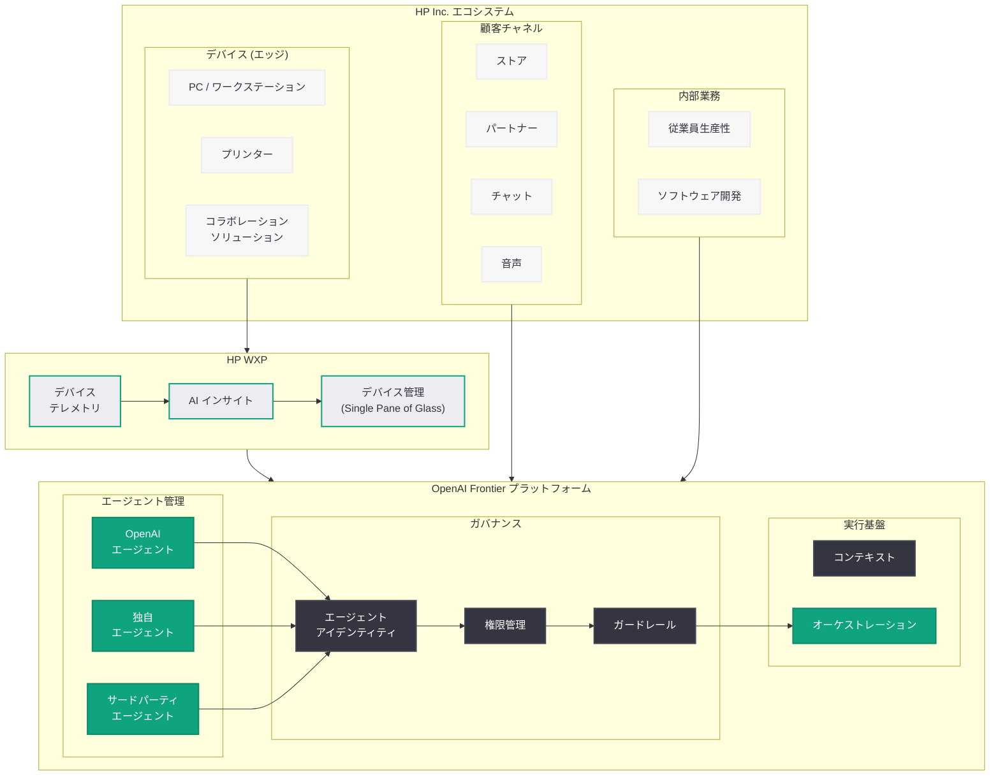

# HP Inc. が OpenAI と Frontier Strategic Partnership を締結 -- エンタープライズ AI をプラットフォームレベルで全社統合

## メタデータ

| 項目 | 内容 |
|------|------|
| 発表日 | 2026-06-28 |
| ソース | OpenAI News |
| カテゴリ | パートナーシップ / Enterprise |
| 公式リンク | [openai.com/index/hp-frontier-partnership](https://openai.com/index/hp-frontier-partnership/) |

## 概要

HP Inc. (NYSE: HPQ) は 2026 年 6 月 28 日、OpenAI との戦略的パートナーシップを発表し、OpenAI の Frontier プラットフォームをグローバルオペレーション全体に統合することを明らかにした。HP は Frontier プラットフォームをエンタープライズ変革に採用した最初のグローバル企業群の一つであり、顧客向けソリューション、テレメトリ分析、従業員生産性、ソフトウェア開発の 4 領域にわたって AI を運用基盤として組み込む。

本パートナーシップは、エンタープライズ AI が API レベルの個別統合から、プラットフォームレベルの運用変革へと成熟したことを象徴する事例である。HP はこれまで OpenAI API、ChatGPT、Codex を個別に活用してきたが、Frontier プラットフォームへの「卒業」により、AI エージェントの統合管理、ガバナンス、実行能力を全社横断で一元化する段階に進んだ。

## 主な内容

### パートナーシップの経緯と位置付け

HP と OpenAI の協力関係は段階的に進化してきた。

| 時期 | 内容 |
|------|------|
| 2026 年 2 月 | 探索期間開始。エージェント機能、プラットフォームコンポーネント、セキュリティ、エンタープライズ統合のパイロット評価 |
| 2026 年 6 月 28 日 | Frontier Strategic Partnership の正式発表 |

HP は Intuit、Oracle、Uber と並ぶ Frontier プラットフォームの早期採用企業であり、プロジェクトの方向性を形作るガイダンスにも貢献してきた。この位置付けは、HP が単なる顧客ではなく、プラットフォーム設計段階から関与する戦略的パートナーであることを示している。

### 4 つの統合領域

パートナーシップは以下の 4 領域をカバーする。

#### 1. 顧客・パートナー向けソリューション

HP はストア、パートナーチャネル、チャット、音声チャネルを横断する一貫した AI 体験の構築を計画している。これにより、顧客接点における断片化を解消し、チャネルに依存しない統一的なエクスペリエンスを提供する。

#### 2. カスタマーテレメトリインサイト (HP WXP)

HP の Workforce Experience Platform (WXP) を通じて、デバイステレメトリデータから AI ベースのインサイトを抽出する。WXP は 2026 年の Gartner Magic Quadrant for Digital Employee Experience Management Tools で Leader に選出されており、PC、ワークステーション、プリンター、コラボレーションソリューションを単一プラットフォームで管理する。

#### 3. 従業員生産性

社内業務における AI 活用を全社的に展開し、ナレッジワーカーの生産性向上を実現する。Frontier プラットフォームにより、各 AI エージェントに固有のアイデンティティ、権限、ガードレールが付与され、ガバナンスを維持しながらスケーラブルな展開が可能となる。

#### 4. ソフトウェア開発

HP の開発組織において、AI エージェントを活用したソフトウェア開発の効率化を推進する。以前の Codex 個別利用から Frontier プラットフォーム上での統合管理へと移行する。

### HP のポジショニング: "仕事が行われる表面"

HP は自社を「仕事が行われる表面 (the surface where work gets done)」と位置付け、AI をエッジに持ち込む戦略を展開している。24 時間 365 日のエージェント型 AI ワークロードに対応するデバイスイノベーションを進めており、ハードウェアと AI プラットフォームの融合によるエンドツーエンドの価値提供を目指す。

### エグゼクティブコメント

- **Prakash Arunkundrum (HP Inc. Chief Strategy and Transformation Officer):** "With OpenAI there is an opportunity to fundamentally rethink how AI can deliver better outcomes." -- AI がより良い成果を提供するために根本的に再考する機会がある
- **Denise Dresser (OpenAI Chief Revenue Officer):** "HP is showing what enterprise transformation looks like when AI becomes an operating layer" -- AI がオペレーティングレイヤーになったとき、エンタープライズ変革がどのようなものかを HP が示している

## 技術的な詳細

### OpenAI Frontier プラットフォームの概要

Frontier プラットフォームは、エンタープライズ向けの AI エージェント統合管理基盤である。

| 機能 | 説明 |
|------|------|
| マルチエージェント管理 | OpenAI 製、独自開発、サードパーティのエージェントを一元管理 |
| エージェントアイデンティティ | 各 AI エージェントに固有の ID、権限、ガードレールを付与 |
| ガバナンス | コンテキスト、ガバナンスルール、実行能力を統合的に提供 |
| エンタープライズ統合 | 既存の企業システムとのシームレスな接続 |

### HP における API から Frontier への進化

HP の OpenAI 活用は以下のように段階的に進化した。

| フェーズ | 利用形態 | 特徴 |
|---------|---------|------|
| Phase 1 | OpenAI API 個別利用 | 特定機能へのポイント統合 |
| Phase 2 | ChatGPT / Codex 導入 | 製品単位での活用 |
| Phase 3 | Frontier プラットフォーム | 全社横断の統合管理基盤 |

### Frontier プラットフォーム上での HP の技術実装

Frontier プラットフォームにより、HP は以下の技術的能力を獲得する。

- **統合エージェントオーケストレーション:** 顧客対応エージェント、内部業務エージェント、開発支援エージェントを単一プラットフォームで管理
- **デバイステレメトリの AI 処理:** WXP から収集されるデバイスデータを AI エージェントがリアルタイムに分析
- **チャネル横断の一貫性:** ストア、パートナー、チャット、音声の各チャネルで同一のコンテキストとポリシーを適用
- **セキュリティとコンプライアンス:** エンタープライズグレードのセキュリティ基盤上でのエージェント実行

## アーキテクチャ

## 開発者への影響

- **Frontier プラットフォームによるエージェント管理の標準化:** 個別の API 呼び出しやツール統合ではなく、プラットフォームレベルでのエージェント管理が企業 AI 導入の新たな標準パターンとなりつつある。開発者は個別の API 統合スキルに加え、マルチエージェントオーケストレーションとガバナンス設計のスキルが求められる

- **エンタープライズ AI デプロイメントパターンの変化:** HP の事例は、API → 製品 (ChatGPT/Codex) → プラットフォーム (Frontier) という企業 AI 導入の成熟モデルを示している。開発者は顧客企業の AI 成熟度に応じたアーキテクチャ設計能力を習得する必要がある

- **WXP に見る AI パワードデバイス管理の未来:** WXP がデバイステレメトリと AI インサイトを統合する「Single Pane of Glass」として機能することは、IT 管理ツール開発においても AI エージェント統合が標準となることを示唆する。デバイス管理 API と AI プラットフォームの連携が新たな開発領域として浮上する

- **エージェントアイデンティティとガバナンスの設計:** 各 AI エージェントに固有のアイデンティティ、権限、ガードレールを付与するアーキテクチャパターンは、エンタープライズにおける AI ガバナンスの基本設計として定着する。開発者は従来のユーザー認証・認可に加え、エージェント認証・認可の設計能力が必要となる

- **API 個別利用からプラットフォーム全面採用への移行支援:** HP のように段階的に OpenAI 活用を拡大する企業に対し、マイグレーション支援やアーキテクチャコンサルティングの需要が増加する。既存の API 統合を Frontier プラットフォーム上に移行するための知見が市場価値を持つ

## 関連リンク

- [HP Frontier Partnership (公式)](https://openai.com/index/hp-frontier-partnership/)
- [関連レポート: OpenAI Partner Network の紹介](./2026-06-23-introducing-openai-partner-network.md)
- [関連レポート: Samsung Electronics ChatGPT/Codex 全社展開](./2026-06-22-samsung-electronics-chatgpt-codex-deployment.md)
- [関連レポート: エンタープライズ AI の次なるフェーズ](./2026-04-08-next-phase-of-enterprise-ai.md)
- [OpenAI News](https://openai.com/news)
- [OpenAI for Business](https://openai.com/business)
- [HP WXP (Workforce Experience Platform)](https://www.hp.com/us-en/services/workforce-experience-platform.html)

## まとめ

HP Inc. と OpenAI の Frontier Strategic Partnership は、エンタープライズ AI が API レベルの個別統合から、プラットフォームレベルの運用変革へと本格的に成熟したことを示す重要なマイルストーンである。HP が Intuit、Oracle、Uber と並ぶ早期採用企業として 2026 年 2 月から評価を進め、顧客向けソリューション、テレメトリ分析、従業員生産性、ソフトウェア開発の 4 領域で全面導入を決定したことは、Frontier プラットフォームのエンタープライズ適合性を実証するものである。

特に注目すべきは、AI が「ツール」から「オペレーティングレイヤー」へと位置付けを変えている点である。各 AI エージェントに固有のアイデンティティ、権限、ガードレールを付与し、OpenAI 製・独自開発・サードパーティのエージェントを統合管理するアーキテクチャは、エンタープライズ AI ガバナンスの新たな標準を提示している。HP が自社を「仕事が行われる表面」と位置付け、デバイスレイヤーと AI プラットフォームの融合を推進する戦略は、ハードウェア企業が AI 時代にどのように価値を再定義するかのモデルケースとなるであろう。
