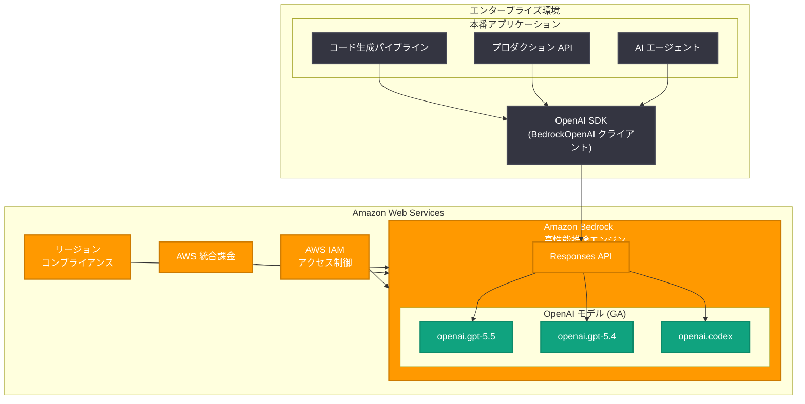

# OpenAI Codex が Amazon Bedrock で正式に一般提供開始

## メタデータ

| 項目 | 内容 |
|------|------|
| 発表日 | 2026-06-29 |
| ソース | OpenAI News |
| カテゴリ | API 更新 / クラウドパートナーシップ |
| 公式リンク | [openai.com/index/codex-now-generally-available/](https://openai.com/index/codex-now-generally-available/) |

## 概要

2026 年 6 月 29 日、OpenAI は GPT-5.5、GPT-5.4、および Codex が Amazon Web Services (AWS) の Amazon Bedrock 上で正式に一般提供 (GA: General Availability) となったことを発表した。これにより、数百万の AWS 顧客が既存のプラットフォーム上で OpenAI モデルを本番環境に展開できるようになった。

本発表は、2026 年 6 月 1 日に公開された初期リリース (限定的なモデル提供) からの重要なアップグレードであり、全ての Codex モデルとフロンティアモデルが Bedrock の高性能推論エンジン上で完全に利用可能となった。企業は既存の AWS 環境、セキュリティ制御、調達ワークフローをそのまま活用しながら、OpenAI の最先端モデルを本番アプリケーションやエージェントに統合できる。

## 主な内容

### 初期リリースからの進展

| 項目 | 2026-06-01 初期リリース | 2026-06-29 GA |
|------|----------------------|---------------|
| 提供形態 | 限定リリース | 完全一般提供 (GA) |
| モデル | GPT-5.5、一部モデル | GPT-5.5、GPT-5.4、Codex 全モデル |
| 対象ユーザー | 早期アクセス顧客 | 全 AWS 顧客 |
| 用途 | 評価・検証 | 本番アプリケーション・エージェント |

### 利用可能なモデル

Amazon Bedrock 上で GA となったモデルは以下の通りである。

| モデル ID | 説明 |
|-----------|------|
| `openai.gpt-5.5` | OpenAI 最新フラッグシップモデル |
| `openai.gpt-5.4` | 高性能推論モデル |
| `openai.codex` | コード生成・ソフトウェアエンジニアリング特化モデル |

### 主要な利点

- **既存プラットフォームでの即座利用:** 数百万の AWS 顧客が既に使用しているプラットフォーム上で OpenAI モデルを利用可能
- **本番環境への即時展開:** Bedrock の高性能推論エンジン上で本番アプリケーションとエージェントを今すぐデプロイ可能
- **エンタープライズガバナンス:** AWS 環境の制御機能、IAM ポリシー、調達ワークフローをそのまま活用可能

## 技術的な詳細

### API エンドポイント

GA に伴い、複数リージョンでのエンドポイントが利用可能となった。

```
https://bedrock-mantle.{region}.api.aws/openai/v1/responses
```

### 必要なパッケージ

#### Python

```bash
pip install openai aws-bedrock-token-generator
```

#### JavaScript / TypeScript

```bash
npm install openai @aws/bedrock-token-generator
```

### コードサンプル: Python での Codex 利用

```python
from openai import BedrockOpenAI

# BedrockOpenAI クライアントの初期化
client = BedrockOpenAI(aws_region="us-east-2")

# Codex モデルを使用したコード生成
response = client.responses.create(
    model="openai.codex",
    input="Python で REST API のレート制限ミドルウェアを実装してください。",
)

print(response.output_text)
```

### コードサンプル: Python でのトークンプロバイダー方式

```python
from aws_bedrock_token_generator import provide_token
from openai import BedrockOpenAI

# AWS 認証情報チェーンを利用した動的トークン取得
client = BedrockOpenAI(
    aws_region="us-east-2",
    bedrock_token_provider=provide_token,
)

# GPT-5.5 を使用した本番アプリケーション
response = client.responses.create(
    model="openai.gpt-5.5",
    input="顧客サポートチケットを分類し、優先度を判定してください。",
)

print(response.output_text)
```

### コードサンプル: JavaScript / TypeScript でのエージェント構築

```javascript
import { BedrockOpenAI } from "openai";

const client = new BedrockOpenAI({ awsRegion: "us-east-2" });

// Codex を使用したエージェントの構築
const response = await client.responses.create({
    model: "openai.codex",
    input: "Implement a GitHub PR review agent that checks for security vulnerabilities.",
    tools: [
        {
            type: "function",
            function: {
                name: "analyze_code",
                description: "Analyze code for security vulnerabilities",
                parameters: {
                    type: "object",
                    properties: {
                        code: { type: "string" },
                        language: { type: "string" }
                    }
                }
            }
        }
    ]
});

console.log(response.output_text);
```

### コードサンプル: GPT-5.4 を使用した構造化出力

```python
from openai import BedrockOpenAI
from pydantic import BaseModel

client = BedrockOpenAI(aws_region="us-east-2")


class TaskClassification(BaseModel):
    category: str
    priority: str
    estimated_hours: float
    assignee_team: str


response = client.responses.create(
    model="openai.gpt-5.4",
    input="新規顧客のオンボーディングフロー改善: レスポンス時間を50%短縮する",
    text={
        "format": {
            "type": "json_schema",
            "name": "task_classification",
            "schema": TaskClassification.model_json_schema(),
        }
    },
)

print(response.output_text)
```

## アーキテクチャ



## 開発者への影響

### 本番環境への即時展開が可能に

GA リリースにより、開発者は Bedrock 上の OpenAI モデルを本番環境に安心して展開できるようになった。初期リリース時の「評価・検証」フェーズから「本番稼働」フェーズへの移行が完了した。

- **SLA の適用:** GA リリースに伴い、Amazon Bedrock の標準 SLA が OpenAI モデルにも適用される
- **スケーラビリティ:** Bedrock の高性能推論エンジンにより、大規模ワークロードへの対応が保証される
- **エージェント構築:** Codex モデルの GA により、コード生成やソフトウェアエンジニアリングに特化したエージェントを本番展開可能

### 既存 AWS ワークフローとの統合

- **調達プロセス:** AWS Marketplace 経由での契約が可能となり、既存の企業調達フローを利用できる
- **コスト管理:** AWS Cost Explorer や Budgets を使用した OpenAI モデル利用料の管理が可能
- **監査・ログ:** AWS CloudTrail によるモデル呼び出しの監査ログ記録

### 移行パス

初期リリースで評価を行っていた開発者は、コードの変更なしにそのまま本番利用に移行できる。`BedrockOpenAI` クライアントのインターフェースに変更はない。

```python
# 初期リリース時と同じコードがそのまま本番利用可能
from openai import BedrockOpenAI

client = BedrockOpenAI(aws_region="us-east-2")

# 本番アプリケーションでの利用
response = client.responses.create(
    model="openai.codex",
    input="Refactor this module to improve test coverage.",
)
```

## 関連リンク

- [OpenAI Codex GA 発表 (公式ブログ)](https://openai.com/index/codex-now-generally-available/)
- [OpenAI フロンティアモデルと Codex の初期リリース (2026-06-01)](https://openai.com/index/openai-frontier-models-and-codex-are-now-available-on-aws/)
- [Amazon Bedrock 統合ガイド (開発者ドキュメント)](https://developers.openai.com/api/docs/guides/amazon-bedrock)
- [Amazon Bedrock 公式ドキュメント](https://docs.aws.amazon.com/bedrock/)
- [OpenAI API Changelog](https://platform.openai.com/docs/changelog)

### 関連レポート

- [OpenAI フロンティアモデルと Codex が Amazon Bedrock で利用可能に](2026-06-01-openai-models-amazon-bedrock.md) -- 初期リリース
- [OpenAI が Amazon Bedrock 向けステートフルランタイム環境を発表](2026-05-19-openai-stateful-runtime-agents-bedrock.md) -- Bedrock 上でのエージェント実行環境

## まとめ

OpenAI Codex と全フロンティアモデル (GPT-5.5、GPT-5.4) の Amazon Bedrock 上での一般提供開始は、2026 年 6 月 1 日の初期リリースから約 1 か月を経ての重要なマイルストーンである。

本 GA リリースの意義は以下の 3 点に集約される。

1. **全モデルの本番利用:** GPT-5.5、GPT-5.4、Codex の全てが本番環境で利用可能となり、エージェントやアプリケーションの即時デプロイが可能
2. **エンタープライズ対応の完成:** AWS の IAM、統合課金、コンプライアンス機能との完全統合により、企業の既存ガバナンスフレームワーク内での利用が実現
3. **開発者体験の維持:** `BedrockOpenAI` クライアントによる一貫した API インターフェースにより、OpenAI 直接 API からの移行が容易

数百万の AWS 顧客が OpenAI の最先端 AI モデルに既存プラットフォーム上でアクセスできるようになったことは、AI のエンタープライズ普及を加速させる重要な進展である。
