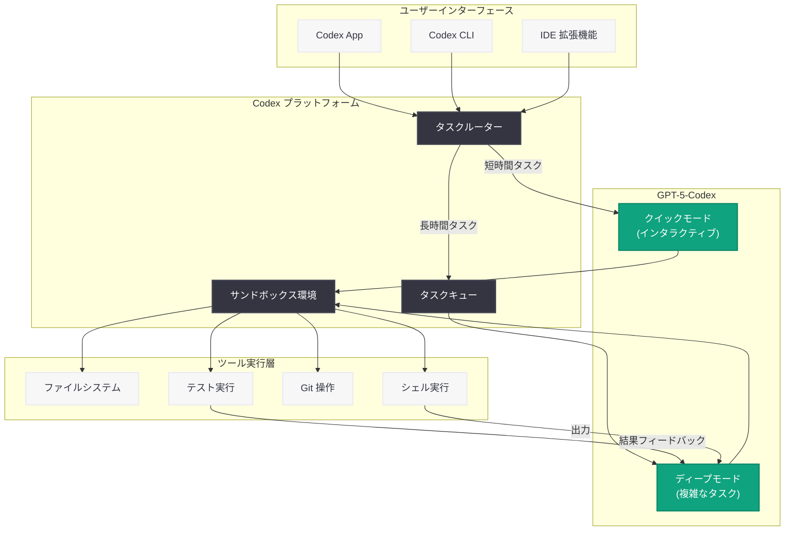
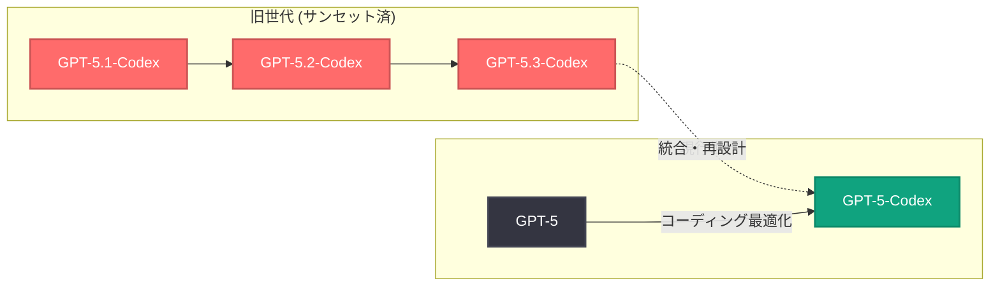

# GPT-5-Codex: Codex プラットフォーム向けに最適化された GPT-5 ベースのコーディングモデル

## メタデータ

| 項目 | 内容 |
|------|------|
| 発表日 | 2026-06-29 |
| ソース | OpenAI News |
| カテゴリ | 新モデル / Product |
| 公式リンク | [Introducing Upgrades to Codex](https://openai.com/index/introducing-upgrades-to-codex/) |

> **注記:** 本記事のページは Cloudflare によるアクセス保護が有効であり、記事本文の直接取得ができなかった。本レポートは、公開されている情報および関連する過去のレポート群に基づいて構成されている。正確な詳細については公式ページを参照されたい。

## 概要

OpenAI は 2026 年 6 月 29 日、Codex プラットフォームの大幅なアップグレードとして「GPT-5-Codex」を発表した。GPT-5-Codex は、GPT-5 をベースにエージェント型コーディングタスクに特化した最適化を施したモデルであり、実世界のソフトウェアエンジニアリング業務に重点を置いて訓練されている。

本モデルの最大の特徴は、クイックでインタラクティブな短時間タスクと、長時間にわたる複雑なコーディングタスクの両方に等しく高い能力を発揮する点である。これにより、Codex プラットフォーム上でのエージェント型開発ワークフローが大幅に強化される。従来の GPT-5.1-Codex、GPT-5.2-Codex、GPT-5.3-Codex といった派生モデルの系譜を引き継ぎつつ、GPT-5 本体を直接コーディング用に最適化するアプローチを採用した点で、モデル戦略の転換を示している。

## 主な内容

### GPT-5-Codex とは

GPT-5-Codex は、OpenAI のフラッグシップモデルである GPT-5 を Codex エージェント型コーディングプラットフォーム向けにファインチューニングしたモデルである。完全に別個のモデルを構築するのではなく、GPT-5 の強力な汎用能力を維持しつつ、コーディング特化の最適化を追加するアプローチを採用している。

**主な特徴:**

- **GPT-5 ベース:** フラッグシップモデルの推論能力と知識をそのまま継承
- **エージェント型コーディングに特化:** Codex プラットフォームのワークフローに最適化
- **実世界のソフトウェアエンジニアリングに重点:** ベンチマークスコアの最適化ではなく、実際の開発業務での有効性を重視
- **デュアルモード対応:** 短時間のインタラクティブなタスクと長時間の複雑なタスクの両方に対応
- **Codex プラットフォーム専用:** Codex App、CLI、IDE 拡張機能で利用可能

### 従来モデルとの違い

GPT-5-Codex は、従来の Codex シリーズ (GPT-5.1-Codex、GPT-5.2-Codex、GPT-5.3-Codex) とは異なるアプローチを取っている。

| 観点 | 従来の Codex モデル | GPT-5-Codex |
|------|-------------------|-------------|
| ベース | GPT-5 の特定バージョン (5.1, 5.2, 5.3) | GPT-5 本体 |
| 最適化方針 | ベンチマーク性能重視 | 実世界の SE 業務重視 |
| タスク対応 | 主に長時間タスク | 短時間・長時間の両方 |
| 命名規則 | バージョン番号付き | GPT-5-Codex (統一名称) |
| 位置づけ | 派生モデル | GPT-5 直接最適化版 |

### 実世界のソフトウェアエンジニアリングへの注力

GPT-5-Codex の訓練は、実際のソフトウェアエンジニアリング業務に焦点を当てている。これは以下のようなタスクを含む。

- **コードレビューとリファクタリング:** 既存コードの品質改善提案
- **バグ修正:** 報告された問題の原因特定と修正
- **新機能実装:** 要件に基づいた機能の設計と実装
- **テスト作成:** ユニットテスト、統合テストの自動生成
- **ドキュメント作成:** コードコメント、API ドキュメントの生成
- **デプロイメント支援:** CI/CD パイプラインの構成と最適化

## 技術的な詳細

### API 経由での利用

GPT-5-Codex は Codex プラットフォームを通じて利用されるが、API からも直接アクセスが可能である。

### コードサンプル

#### 基本的な利用例

```python
from openai import OpenAI

client = OpenAI()

# GPT-5-Codex を使用したコード生成
response = client.chat.completions.create(
    model="gpt-5-codex",
    messages=[
        {
            "role": "system",
            "content": "You are an expert software engineer. Write clean, well-tested code."
        },
        {
            "role": "user",
            "content": "Implement a rate limiter using the token bucket algorithm in Python with async support."
        }
    ],
    temperature=0.2,
    max_tokens=4096
)

print(response.choices[0].message.content)
```

#### エージェント型タスクでの利用 (Codex SDK)

```python
from openai import OpenAI

client = OpenAI()

# エージェント型コーディングタスクの実行
# Codex プラットフォームのタスク API を使用
response = client.chat.completions.create(
    model="gpt-5-codex",
    messages=[
        {
            "role": "system",
            "content": (
                "You are a Codex coding agent. Analyze the repository structure, "
                "identify the issue, implement a fix, and write tests. "
                "Use tool calls to interact with the codebase."
            )
        },
        {
            "role": "user",
            "content": (
                "Fix the race condition in the connection pool manager. "
                "The issue is that concurrent requests can exceed the max pool size "
                "when connections are being established simultaneously."
            )
        }
    ],
    tools=[
        {
            "type": "function",
            "function": {
                "name": "read_file",
                "description": "Read a file from the repository",
                "parameters": {
                    "type": "object",
                    "properties": {
                        "path": {"type": "string", "description": "File path"}
                    },
                    "required": ["path"]
                }
            }
        },
        {
            "type": "function",
            "function": {
                "name": "write_file",
                "description": "Write content to a file",
                "parameters": {
                    "type": "object",
                    "properties": {
                        "path": {"type": "string", "description": "File path"},
                        "content": {"type": "string", "description": "File content"}
                    },
                    "required": ["path", "content"]
                }
            }
        },
        {
            "type": "function",
            "function": {
                "name": "run_command",
                "description": "Execute a shell command",
                "parameters": {
                    "type": "object",
                    "properties": {
                        "command": {"type": "string", "description": "Command to run"}
                    },
                    "required": ["command"]
                }
            }
        }
    ],
    tool_choice="auto"
)

# エージェントのレスポンスを処理
for choice in response.choices:
    message = choice.message
    if message.tool_calls:
        for tool_call in message.tool_calls:
            print(f"Tool: {tool_call.function.name}")
            print(f"Args: {tool_call.function.arguments}")
    else:
        print(message.content)
```

#### 短時間インタラクティブタスクの例

```python
from openai import OpenAI

client = OpenAI()

# クイック補完: インタラクティブなコード生成
response = client.chat.completions.create(
    model="gpt-5-codex",
    messages=[
        {
            "role": "user",
            "content": "Add error handling and retry logic to this function:\n\n"
            "async def fetch_data(url: str) -> dict:\n"
            "    async with aiohttp.ClientSession() as session:\n"
            "        async with session.get(url) as resp:\n"
            "            return await resp.json()"
        }
    ],
    temperature=0.1,
    max_tokens=2048
)

print(response.choices[0].message.content)
```

### モデルの比較

| 項目 | GPT-5 | GPT-5-Codex | GPT-5.3-Codex (サンセット済) |
|------|-------|-------------|---------------------------|
| 用途 | 汎用 | エージェント型コーディング | コーディング |
| 最適化対象 | 全般的な推論 | 実世界の SE タスク | SWE-Bench スコア |
| インタラクティブ性 | 標準 | 高い (デュアルモード) | 標準 |
| Codex 統合 | 間接的 | ネイティブ | ネイティブ |
| ステータス | 提供中 | 提供中 (新規) | サンセット |

## アーキテクチャ

### Codex エージェント型コーディングフロー



### モデル進化の系譜



## 開発者への影響

### 1. モデル選択の簡素化

従来はバージョン番号付きの複数の Codex モデル (GPT-5.1-Codex、GPT-5.2-Codex、GPT-5.3-Codex) から選択する必要があったが、GPT-5-Codex への統一により、モデル選択が簡素化される。開発者は単一のモデル ID (`gpt-5-codex`) を指定するだけでよい。

### 2. デュアルモード対応によるワークフロー改善

短時間のインタラクティブなタスク (コード補完、簡単な質問) と長時間の複雑なタスク (大規模リファクタリング、新機能実装) の両方を同一モデルで処理できるため、タスクの種類に応じてモデルを切り替える必要がなくなる。

### 3. 実世界志向の信頼性向上

ベンチマークスコアの最適化ではなく実世界のソフトウェアエンジニアリング業務に焦点を当てた訓練により、実際の開発シナリオでの信頼性と有用性が向上する。これは日常的な開発タスクにおける「使い勝手」の改善を意味する。

### 4. 既存ワークフローからの移行

GPT-5.3-Codex が既にサンセットされている (2026 年 6 月 25 日発表) ため、既存ユーザーは GPT-5-Codex への移行が必要である。API モデル ID を `gpt-5-codex` に更新することで移行が完了する。

### 5. Codex プラットフォームとの深い統合

GPT-5-Codex は Codex プラットフォーム (App、CLI、IDE 拡張機能) とネイティブに統合されており、エージェント型ワークフローにおけるツール呼び出し、コンテキスト管理、タスク分割などの機能が最適化されている。

## 関連リンク

- [Introducing Upgrades to Codex (公式)](https://openai.com/index/introducing-upgrades-to-codex/)
- [Introducing the Codex App](https://openai.com/index/introducing-the-codex-app/)
- [GPT-5.3-Codex サンセット情報](https://openai.com/index/introducing-gpt-5-3-codex/)
- [OpenAI Platform - Models](https://platform.openai.com/docs/models)
- [OpenAI API リファレンス](https://platform.openai.com/docs/api-reference)
- [OpenAI News](https://openai.com/news)

## まとめ

GPT-5-Codex の発表は、OpenAI の Codex モデル戦略における重要な転換点を示している。

1. **アーキテクチャの統合:** 従来のバージョン番号付き派生モデル (GPT-5.x-Codex) から、GPT-5 本体を直接最適化するアプローチへの移行。これによりモデルの保守性と一貫性が向上する

2. **実用性の重視:** ベンチマークスコアの追求から実世界のソフトウェアエンジニアリング業務への最適化へとフォーカスが移行。開発者の日常業務における実用性が優先される

3. **デュアルモード対応:** 「クイックでインタラクティブ」なタスクと「長時間で複雑」なタスクの両方に等しく対応できることで、単一モデルであらゆるコーディングシナリオをカバーする

4. **Codex プラットフォームの成熟:** 専用アプリのリリース (6 月 24 日) に続くモデルアップグレードは、Codex プラットフォーム全体のエコシステムが急速に成熟していることを示している

5. **旧モデルからのスムーズな移行:** GPT-5.3-Codex のサンセット (6 月 25 日) からわずか 4 日後のリリースにより、ユーザーは最新のモデルへシームレスに移行できる

OpenAI は Codex を単なるコーディング支援ツールから、エンタープライズグレードの自律型ソフトウェアエンジニアリングプラットフォームへと進化させ続けている。GPT-5-Codex はその中核を担うモデルとして、今後の Codex エコシステムの発展を支える重要な基盤となる。
