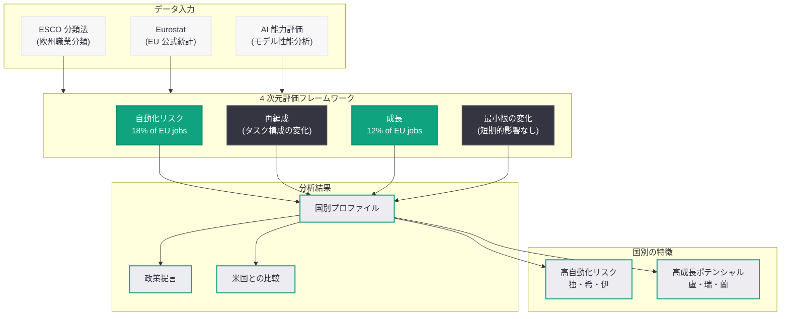

# EU における AI 雇用転換のマッピング -- OpenAI が欧州労働市場向け 4 次元フレームワークを発表

## メタデータ

| 項目 | 内容 |
|------|------|
| 発表日 | 2026-06-29 |
| ソース | OpenAI Global Affairs |
| カテゴリ | 経済リサーチ / 政策 |
| 公式リンク | [Mapping AI Jobs Transition in the EU](https://openai.com/index/mapping-ai-jobs-transition-eu/) |

## 概要

OpenAI Economic Research は 2026 年 6 月 24 日、「The AI Jobs Transition Framework for the EU」を発表した。本レポートは、2026 年 4 月に米国向けに開発されたフレームワーク (32 ページのレポート) を欧州労働市場に拡張したものであり、POLITICO 主催の「AI and the Future of Work」イベントと並行して公開された。

従来の AI「エクスポージャー」指標だけでは近い将来の雇用への影響を予測するには不十分であるという課題認識のもと、自動化リスク、再編成、成長、最小限の変化という 4 つの次元で職業への影響を分析する新しいアプローチを提案している。ESCO 分類と Eurostat データを活用し、EU 全体の職業構造を体系的にマッピングした点が特徴である。

## 主な内容

### フレームワークの方法論

本フレームワークは、従来の単一指標による AI 影響評価の限界を克服するために設計されている。OpenAI のチーフエコノミストは「cookie-cutter AI policy won't work (画一的な AI 政策は機能しない)」と述べ、欧州と米国では異なるアプローチが必要であることを強調した。

方法論の主な特徴は以下の通り。

- **ESCO 分類法 (European Skills, Competences, Qualifications and Occupations):** EU の標準的な職業分類を使用し、欧州労働市場に適合した分析を実現
- **Eurostat データ:** EU 加盟国の公式統計データに基づく実証的分析
- **4 次元評価:** 単純な「自動化される/されない」の二分法ではなく、複数の影響パターンを識別
- **米国フレームワークからの拡張:** 2026 年 4 月 30 日に公開された米国版レポートの方法論を欧州の労働構造に適用

### 主要な分析結果

EU 全体の職業に対する分析結果として、以下の数値が報告されている。

| 影響カテゴリ | EU 全体の割合 | 説明 |
|-------------|--------------|------|
| 自動化リスク | 18% | AI により大幅な自動化が見込まれる職業 |
| 成長 | 12% | AI により新たな需要・拡大が見込まれる職業 |
| 再編成 | - | タスク構成が変化するが雇用は維持される職業 |
| 最小限の変化 | - | 短期的には AI の影響が限定的な職業 |

重要な発見として、標準的な AI「エクスポージャー」指標だけでは近い将来の雇用混乱を予測するには不十分であることが示された。同じ「高エクスポージャー」の職業であっても、自動化される方向に進む場合と、AI を活用して成長する方向に進む場合があるため、より細かい分析が必要である。

### 国別の特徴

EU 加盟国間で AI の影響パターンに顕著な差異があることが明らかになった。

**自動化リスクが高い国:**

- ドイツ: 製造業を中心とした定型的業務の比率が高い
- ギリシャ: 従来型サービス業の割合が大きい
- イタリア: 中小企業中心の産業構造による影響

**AI 成長職業の割合が大きい国:**

- ルクセンブルク: 金融・テクノロジーサービスの集積
- スウェーデン: イノベーション志向の産業構造
- オランダ: デジタル経済の浸透度が高い

また、EU は米国と比較して特定の職業カテゴリの割合が「significantly smaller (著しく小さい)」ことが指摘されており、これは欧州の産業構造の特徴を反映している。

### 政策提言

本フレームワークは「OpenAI for Europe」イニシアチブの一環として、地域ごとに異なる政策アプローチの必要性を主張している。

主な政策示唆は以下の通り。

1. **画一的アプローチの否定:** 米国と欧州で同じ AI 雇用政策を適用することは不適切であり、各国・地域の労働市場構造に基づいた対応が必要
2. **多次元的影響評価:** 「AI に置き換えられる職業のリスト」といった単純な分析ではなく、自動化・再編成・成長・最小変化の 4 次元で政策を設計すべき
3. **成長機会への投資:** 自動化リスクの軽減だけでなく、AI がもたらす新たな雇用成長を促進する政策も同等に重要
4. **国別の差異への対応:** EU 全体で統一的な政策を適用するのではなく、各国の産業構造に応じたきめ細かな対応が求められる

## アーキテクチャ

### AI 雇用転換の 4 次元評価フレームワーク

## 開発者への影響

本レポートは技術的な API 更新ではなく政策研究であるが、開発者にとっても重要な示唆を含む。

### 市場機会の把握

- **自動化ツールの需要:** EU 職業の 18% が高い自動化リスクにあることは、これらの業務を支援・代替する AI ソリューションへの大きな市場需要を意味する
- **成長領域への投資:** 12% の成長職業は、AI を活用した新しいツールやサービスが求められる領域を示している
- **国別の市場特性:** ドイツ (自動化リスク) とオランダ (成長) では求められるソリューションが異なる

### プロダクト設計への示唆

- **再編成支援ツール:** 完全な自動化ではなく、人間の業務タスク構成を再設計する「コパイロット」型ツールの需要が大きい
- **スキル移行支援:** 自動化リスクの高い職業から成長職業への移行を支援する教育・トレーニングプラットフォームの機会
- **EU 規制対応:** EU AI Act との整合性を考慮した AI ソリューション開発の重要性が高まる

### OpenAI for Europe との関連

- **地域適応型 AI サービス:** OpenAI for Countries / OpenAI for Europe イニシアチブは、地域ごとにカスタマイズされた AI サービス展開を目指しており、欧州市場向けのソリューション開発に参入する開発者にとって重要な文脈となる
- **データ主権への対応:** EU の労働市場データ (ESCO、Eurostat) を活用した分析は、欧州のデータガバナンス要件に対応した開発の方向性を示唆する

## 関連リンク

- [Mapping AI Jobs Transition in the EU (公式)](https://openai.com/index/mapping-ai-jobs-transition-eu/)
- [OpenAI for Europe](https://openai.com/europe/)
- [OpenAI Economic Research](https://openai.com/research)
- [ESCO 分類 (European Commission)](https://esco.ec.europa.eu/)
- [Eurostat](https://ec.europa.eu/eurostat)
- [POLITICO AI and the Future of Work](https://www.politico.eu/)

## まとめ

OpenAI Economic Research が発表した「The AI Jobs Transition Framework for the EU」は、欧州労働市場における AI の影響を従来よりも精緻に分析するフレームワークを提供した重要なレポートである。以下の点が特に注目に値する。

1. **4 次元評価の導入:** 従来の単一指標 (エクスポージャー) では不十分であるとし、自動化リスク・再編成・成長・最小変化の 4 次元で職業への影響を分類する新しいアプローチを提案
2. **EU 全体の定量分析:** ESCO 分類と Eurostat データを活用し、EU 職業の 18% に自動化リスク、12% に AI による成長ポテンシャルがあることを示した
3. **国別差異の可視化:** ドイツ・ギリシャ・イタリア (高自動化リスク) とルクセンブルク・スウェーデン・オランダ (高成長) という対照的なパターンが明らかになった
4. **画一的政策の否定:** OpenAI のチーフエコノミストは欧米で同じ政策は機能しないと明言し、地域特性に基づいた政策設計の必要性を強調
5. **OpenAI for Europe の一環:** 本レポートは OpenAI for Countries イニシアチブの欧州版として、AI ガバナンスへの積極的な関与を示すものである
