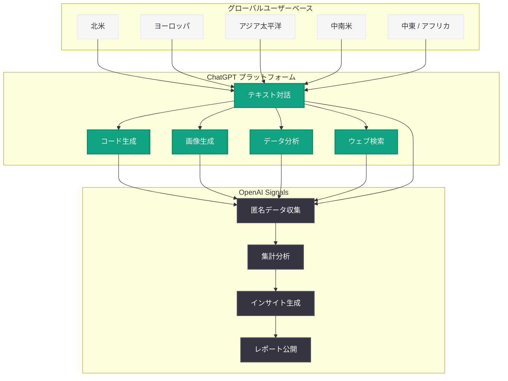

# ChatGPT の普及拡大に関する OpenAI Signals データ分析

## メタデータ

| 項目 | 内容 |
|------|------|
| 発表日 | 2026-06-30 |
| ソース | OpenAI News (Global Affairs) |
| カテゴリ | データ分析 / 普及動向 |
| 公式リンク | https://openai.com/index/how-chatgpt-adoption-has-expanded |

## 概要

OpenAI は 2026 年 6 月 30 日、「OpenAI Signals」データに基づく ChatGPT の普及拡大レポートを公開した。本レポートでは、ChatGPT の利用がグローバルに成長していること、ユーザーが利用頻度を増加させながらより多くの機能を探索していること、そして地域・言語を超えた成長が加速していることが示されている。

OpenAI Signals は、ChatGPT の利用動向を分析するためのデータプログラムであり、グローバルな AI 普及の実態を可視化するものである。今回のデータは、ChatGPT が単なる技術的な実験段階を超え、世界中のユーザーの日常的なツールとして定着しつつあることを裏付けている。

## 主な内容

### OpenAI Signals とは

OpenAI Signals は、OpenAI が提供する ChatGPT の利用動向データプログラムである。匿名化された集計データに基づき、以下のような観点から AI 普及の実態を分析する。

- **利用量の推移**: ユーザーあたりのセッション数や対話回数の変化
- **機能利用の多様性**: テキスト生成、コード作成、画像生成、データ分析など各機能の利用状況
- **地域別成長率**: 国・地域ごとの普及速度と利用パターンの差異
- **言語多様性**: 対応言語ごとの利用状況と成長トレンド

### グローバルな利用拡大

今回のデータが示す主要なトレンドは以下の通りである。

| 指標 | トレンド |
|------|----------|
| ユーザーあたりの利用頻度 | 増加傾向 |
| 機能探索の幅 | 拡大 (マルチモーダル利用の増加) |
| 地域的カバレッジ | 新興市場での成長加速 |
| 言語多様性 | 非英語利用の比率増加 |

### 利用パターンの深化

ユーザーの行動パターンにおいて、以下のような変化が確認されている。

- **利用頻度の増加**: 初期の「試しに使う」段階から、日常的なワークフローに組み込む段階へ移行するユーザーが増加
- **機能の横断的利用**: テキスト対話だけでなく、画像生成、コード作成、ファイル分析、ウェブ検索など複数の機能を組み合わせて利用するパターンが拡大
- **セッションの長期化**: 単発の質問ではなく、複雑なタスクに対して継続的に対話するユーザーが増加

### 地域・言語別の成長

ChatGPT の普及は英語圏を超えて加速しており、特に以下の点が注目される。

- **多言語対応の進展**: 英語以外の言語でのインタラクションが着実に増加
- **新興市場の成長**: アジア、中南米、アフリカなどの新興市場における利用者数の拡大
- **地域固有のユースケース**: 各地域の文化・ビジネス慣行に合わせた独自の利用パターンの出現
- **ローカライゼーションの効果**: 各言語でのモデル品質向上に伴う利用満足度の改善

## アーキテクチャ

## 開発者への影響

OpenAI Signals データが示す ChatGPT の普及拡大は、API を利用する開発者やエンタープライズユーザーにとって以下の意味を持つ。

- **多言語対応の重要性**: グローバルな利用拡大に伴い、アプリケーション開発においても多言語対応が競争力の鍵となる
- **マルチモーダル API の活用機会**: ユーザーが複数の機能を横断的に利用する傾向は、API 開発者にとってもマルチモーダル機能の統合が効果的であることを示唆
- **新興市場へのリーチ**: ChatGPT の地域的拡大は、API ベースのサービスにとっても新興市場におけるユーザー獲得機会を意味する
- **ユーザー期待値の上昇**: 利用頻度の増加と機能探索の深化は、ユーザーが AI に対してより高い品質と多様性を期待するようになっていることを示す
- **エンタープライズ導入の追い風**: グローバルな普及データは、企業が AI 導入を正当化する際のエビデンスとして活用可能

## 関連リンク

- [How ChatGPT adoption has expanded (公式)](https://openai.com/index/how-chatgpt-adoption-has-expanded)
- [OpenAI Global Affairs](https://openai.com/global-affairs)
- [OpenAI News](https://openai.com/news)
- [ChatGPT](https://chatgpt.com)

## まとめ

OpenAI Signals データによる今回のレポートは、ChatGPT が技術デモから世界的な生産性ツールへと進化する過程を定量的に示すものである。ユーザーが利用頻度を高め、より多くの機能を探索し、英語圏を超えたグローバルな成長が加速しているという 3 つのトレンドは、AI がもはや一部のテクノロジー愛好者のためのツールではなく、あらゆる地域・言語のユーザーにとっての日常的なインフラになりつつあることを示唆している。

開発者やエンタープライズにとっては、この普及拡大がもたらす多言語対応の必要性、マルチモーダル統合の機会、そして新興市場へのアクセス拡大を踏まえた戦略策定が重要となる。
