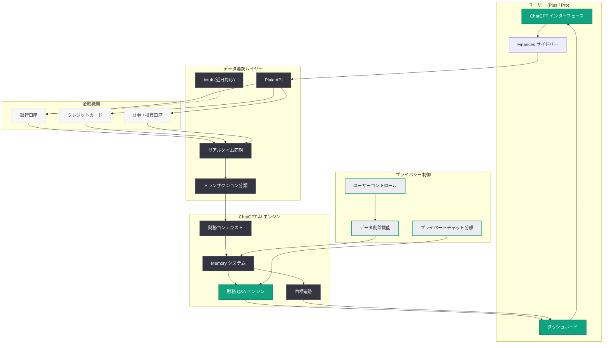

# ChatGPT パーソナルファイナンス機能が Plus ユーザーに拡大

## メタデータ

| 項目 | 内容 |
|------|------|
| 発表日 | 2026-06-30 |
| ソース | OpenAI News |
| カテゴリ | 新機能 / Product 拡張 |
| 公式リンク | https://openai.com/index/personal-finance-chatgpt |

## 概要

OpenAI は 2026 年 6 月 30 日、これまで ChatGPT Pro ($100/月) ユーザー限定で提供していたパーソナルファイナンス機能を、ChatGPT Plus ($20/月) ユーザーにも拡大したことを発表した。これにより、大幅に広い利用者層が金融口座連携や AI による財務分析を利用可能になる。

本機能は 2026 年 5 月 15 日に Pro ユーザー向けプレビューとして初めて公開され、「実際の利用から学び、体験を改善し、慎重に拡大する」という方針のもと限定提供されていた。今回の Plus ティアへの拡大は、機能の安定性と安全性が広範な展開に耐えうるレベルに達したという OpenAI の判断を示している。

## 主な内容

### 提供範囲の拡大

| 項目 | 変更前 (5 月 15 日) | 変更後 (6 月 30 日) |
|------|---------------------|---------------------|
| 対象プラン | ChatGPT Pro ($100/月) | ChatGPT Plus ($20/月) 以上 |
| 対象地域 | 米国のみ | 米国のみ (変更なし) |
| 提供形態 | プレビュー | 一般提供 |
| ユーザー規模 | 限定的 | 大幅に拡大 |

Plus ティアは Pro に比べて圧倒的に多くのユーザーが加入しているため、今回の拡大はパーソナルファイナンス機能のアドレス可能市場を劇的に拡大するものである。

### 口座接続と Plaid 連携

ユーザーは Plaid を通じて金融口座を安全に接続できる。

- **接続方法**: サイドバーから「Finances」を開く、または「@Finances, connect my accounts」と入力
- **対応プロバイダ**: Plaid (現在利用可能)、Intuit (近日対応予定)
- **接続可能な口座**: 銀行口座、クレジットカード、投資口座など

### ダッシュボード機能

接続後、以下の情報をリアルタイムで確認できるダッシュボードが提供される。

- **支出データ**: 最新の支出状況とカテゴリ別分析
- **サブスクリプション追跡**: 定期支払いの一覧と管理
- **今後の支払い**: 予定されている引き落としや請求のリマインダー
- **ポートフォリオパフォーマンス**: 投資口座の運用実績と評価額

### AI パワード財務 Q&A

ChatGPT の核心的な強みを活かし、ユーザーの金融コンテキストに基づいた質問応答が可能になる。

- **コンテキスト対応**: 「先月の外食費はいくら?」「今月の貯蓄目標は達成できそう?」などの質問に、実際のデータに基づいて回答
- **目標設定**: ユーザーが財務目標を設定すると、ChatGPT がそれを記憶し、継続的にアドバイスを提供
- **パーソナライズ**: 一般的な金融知識ではなく、ユーザー固有の状況に合わせた回答を生成

## アーキテクチャ

## プライバシーとデータ制御

OpenAI はパーソナルファイナンス機能においてプライバシーを最優先に設計しており、ユーザーが常にデータのコントロール権を保持する仕組みを提供している。

**データ管理:**

- **随時削除可能**: 金融データはいつでもユーザーの操作により完全に削除可能
- **Memory からの除外**: パーソナルファイナンスデータを ChatGPT の Memory から削除するための専用コントロールを提供
- **プライベートチャットの分離**: プライベートチャットではパーソナルファイナンスデータは参照されない

**設計原則:**

- ユーザーが「自分のデータを常にコントロールできる」状態を維持
- 最小限のデータ取得と明示的な同意に基づく設計
- 金融データの利用範囲を明確に限定

## 競合環境と市場ポジショニング

### 競合他社との比較

OpenAI のパーソナルファイナンス機能は、既存のフィンテック企業が提供してきた金融データ集約サービスに「AI ネイティブ」なアプローチで参入するものである。

- **従来型サービス** (Mint、Personal Capital 等): データの可視化が中心で、分析はルールベース
- **ChatGPT アプローチ**: 自然言語での対話を通じた財務分析と、コンテキストを理解した動的なアドバイス提供

### Plus ティア拡大の戦略的意義

今回の Plus 拡大により、ChatGPT は以下の点で競合に対する優位性を確立しつつある。

- **スケール**: Plus ユーザーという大規模な既存顧客基盤への即時展開
- **統合体験**: 別アプリのインストール不要で、既存の ChatGPT 環境内で完結
- **AI 品質**: GPT モデルの推論能力を活かした高度な財務分析

ただし、9to5Mac の報道によれば、OpenAI は金融統合において「一部の競合に追いつきつつある」段階であり、この分野では後発参入者という位置付けである。

## ユーザーへの影響

### Plus ユーザーにとっての意味

- **$20/月で金融 AI アシスタントが利用可能**: 従来 $100/月の Pro プランが必要だった機能が 5 分の 1 の価格で利用可能に
- **追加費用なし**: 既存の Plus サブスクリプションに含まれる
- **即時利用可能**: 米国の Plus ユーザーは今日から利用開始可能

### 利用開始方法

1. ChatGPT のサイドバーから「Finances」を選択
2. 「@Finances, connect my accounts」と入力して開始
3. Plaid を通じて金融口座を接続
4. ダッシュボードで支出状況や投資パフォーマンスを確認
5. 自然言語で財務に関する質問を行う

## 関連リンク

- [Personal Finance in ChatGPT (公式)](https://openai.com/index/personal-finance-chatgpt)
- [9to5Mac 報道記事](https://9to5mac.com/2026/06/30/openai-just-released-new-personal-finance-features-for-chatgpt-customers/)
- [ChatGPT 料金プラン](https://openai.com/chatgpt/pricing)

## 関連レポート

- [2026-05-15: ChatGPT パーソナルファイナンス機能 (Pro 向け初回ローンチ)](./2026-05-15-personal-finance-chatgpt.md)
- [2026-03-20: ChatGPT Commerce 戦略ピボット](./2026-03-20-chatgpt-commerce-strategy-pivot.md)
- [2026-04-01: Gradient Labs AI Banking](./2026-04-01-gradient-labs-ai-banking.md)

## まとめ

ChatGPT パーソナルファイナンス機能の Plus ティアへの拡大は、OpenAI が Pro 限定プレビューで得たフィードバックと運用実績を経て、より広い利用者層への提供に踏み切った重要な進展である。

Plaid 連携によるセキュアな口座接続、リアルタイムの支出追跡、AI による財務 Q&A、目標設定機能を月額 $20 で利用可能にすることで、ChatGPT は単なるチャットボットから本格的な財務アシスタントへとポジショニングを強化している。プライバシーファーストの設計思想により、ユーザーがデータの完全なコントロール権を維持できる点も、金融データという機密性の高い情報を扱う上で重要な差別化要素である。

今後は Intuit 対応の追加、米国外への地域拡大、そしてさらなる機能強化が期待される。
